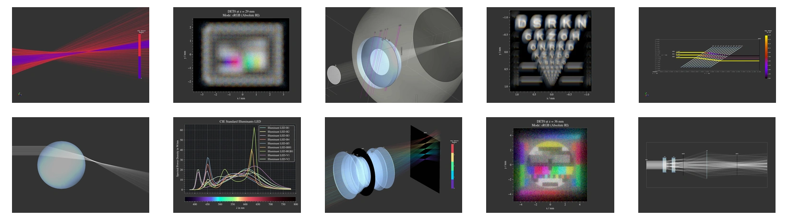

# optrace

</img>

## Overview

optrace (OPtics rayTRACEr) is a scripting based optics simulation package, developed at the 
[Institute for Applied Optics and Electronics](https://www.th-koeln.de/informations-medien-und-elektrotechnik/institut-fuer-angewandte-optik-und-elektronik-aoe_14804.php) 
at the TH Köln - University of Applied Science in Cologne, Germany.
It features sequential raytracing, image rendering capabilities and a graphical user interface.
This tool is designed with a focus on image simulation with accurate color handling, 
differentiating it from other raytracers that may prioritize engineering workflows.

optrace is suitable for educational purposes, enabling the creation of interactive applications 
with custom user interfaces through Python scripting and comprehensive documentation. 
Its interactive 3D scene viewer allows for hands-on exploration of optical principles.

Furthermore, optrace's automation features and extensibility, including support for custom surfaces and materials, 
make it a viable tool for research applications. 

 **Features**
  * Free and open source software
  * Programming/scripting approach to simulation
  * Sequential raytracing for geometrical optics
  * Rendering of colored detector images
  * Paraxial analysis (matrix optics, cardinal points/planes and PSF convolution)
  * Includes preset and user-definable surface shapes, ray sources, and media
  * An additional GUI with an interactive 3D scene viewer
  * Automation capabilities
  * High performance of 0.11 s / surface / million rays 
    ([details](https://drocheam.github.io/optrace/development/testing.html#benchmark-testing))
  * Comprehensive documentation

 **Limitations**
  * Coding-free simulations are not supported
  * Wave optics effects such as diffraction and interference are not included
  * No non-sequential raytracing for simulating ghost images and reflections
  * Mirror or fresnel lens optics are not supported
  * No modelling of scattering effects or polarization-dependent media
  * No functionality for lens optimization, aberration analysis, and tolerancing
 
 **Purpose/Use Cases**
  * Educational purposes, demonstrating aberrations or simple optical setups
  * Introductory tool to paraxial, geometrical optics or image formation
  * Simulation of simpler systems: Prism, eye model, telescope, ...
  * Estimation of effects where professional software (ZEMAX, OSLO, Quadoa, ...) is overkill for

## Documentation

The [Documentation](https://drocheam.github.io/optrace) includes examples, usage information, technical details, 
and an API reference.

## Examples

The documentation features an [Example Gallery](https://drocheam.github.io/optrace/examples.html) that covers a large
range of applications.

## Installation

**Installing the latest official release**

1. Make sure python and pip are installed
2. Download the optrace-xxxx.tar.gz archive from the [latest release](https://github.com/drocheam/optrace/releases/latest)
3. Open a terminal and run `pip install <archive>`, where `<archive>` is the path to the downloaded file

**Installing the latest git version**

1. Make sure python and pip are installed
2. Open a terminal and run `pip install "optrace @ git+https://github.com/drocheam/optrace.git"` 

More information are provided in the [Documentation](https://drocheam.github.io/optrace/installation.html).

## License

This project is published under the [MIT License](https://github.com/drocheam/optrace/blob/main/LICENSE).

## Similar software

- Geometrical Optics
   * [RayOptics](https://ray-optics.readthedocs.io/en/latest/) by Michael Hayford. Tracing and optical design analysis tool. 
   * [rayopt](https://github.com/quartiq/rayopt) by QUARTIQ. Tracing and optical design analysis tool. 
   * [RayTracing](https://github.com/DCC-Lab/RayTracing) by DCC-Lab. Paraxial raytracer with beampath visualization.
   * [Optiland](https://optiland.readthedocs.io/en/latest/index.html) by Harrison Kramer. Optical design and analysis framework.

- Wave Optics
   * [diffractsim](https://github.com/rafael-fuente/diffractsim) by Rafael de la Fuente. Wave optics simulation of arbitrary apertures and phase holograms.
   * [poppy](https://github.com/spacetelescope/poppy) by Space Telescope Science Institute. Fraunhofer and Fresnel propagation for optics.
   * [prysm](https://prysm.readthedocs.io/en/stable/index.html) by Brandon Dube. Interferometer and diffraction calculations.

- Geometrical + Wave Optics
   * [opticspy](http://opticspy.org/) by Xing Fan. Tracing, wave optics, aberration and Zernike polynomial analysis.
   * [raypier](https://raypier-optics.readthedocs.io/en/latest/introduction.html#the-components-of-a-raypier-model) by Bryan Cole. Raytracing and beamlet propagation with 3D viewer.

