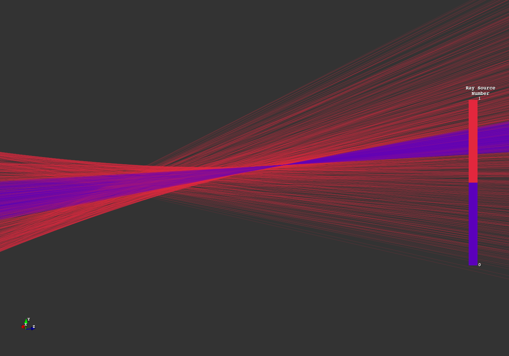
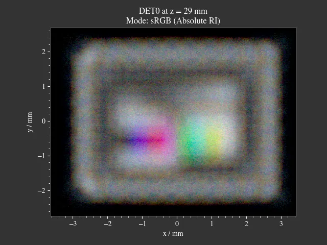
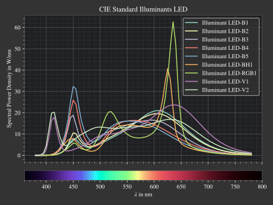

# Optrace
## Geometrical OPtics rayTRACEr and image simulation

<!-- TODO add version tag, such as https://img.shields.io/github/v/tag/drocheam/optrace?label=version see https://shields.io/badges/git-hub-tag -->

<!-- TODO link tag to documentation -->

<!-- TODO add coverage info (via third party site?), lines of code, comment/docstring quality etc. -->

</img>
</img>
</img>
</img>
</img>
   
</img>
</img>
</img>
</img>
</img>

<!-- TODO images are clickable, redirect to example page -->

## Overview

optrace is a scripting based optics simulation package, developed at the Institute for Applied Optics and Electronics 
at the TH Köln - University of Applied Science in Cologne, Germany.
It features sequential raytracing and image rendering capabilities, complemented by a graphical user interface.
This tool is designed with a focus on image simulation with accurate color handling, 
differentiating it from other raytracers that may prioritize engineering workflows.

optrace is suitable for educational purposes, enabling the creation of interactive applications 
with custom user interfaces through Python scripting and comprehensive documentation. 
Its interactive 3D scene viewer allows for hands-on exploration of optical principles.

Furthermore, optrace's automation features and extensibility, including support for custom surfaces and materials, 
make it a viable tool for research applications. 

 **Features**
  * Free and open source software
  * Programming/scripting approach to simulation
  * Sequential raytracing for geometrical optics
  * Rendering of colored detector images
  * Paraxial analysis (matrix optics, cardinal points/planes and PSF convolution)
  * Includes preset and user-definable surface shapes, ray sources, and media
  * An additional GUI with an interactive 3D scene viewer
  * Automation capabilities
  * High performance of 0.11 s / surface / million rays
  * Comprehensive documentation

<!--  ^--- TODO add benchmarking details when documentation is online-->

 **Limitations**
  * Coding-free simulations are not supported
  * Wave optics effects such as diffraction and interference are not included
  * No non-sequential raytracing for simulating ghost images and reflections
  * Mirror or fresnel lens optics are not supported
  * No modelling of scattering effects or polarization-dependent media
  * No functionality for lens optimization, aberration analysis, and tolerancing
 
 **Purpose/Use Cases**
  * Educational purposes, demonstrating aberrations or simple optical setups
  * Introductory tool to paraxial, geometrical optics or image formation
  * Simulation of simpler systems: Prism, eye model, telescope, ...
  * Estimation of effects where professional software (ZEMAX, OSLO, Quadoa, ...) is overkill for

## Examples

Coming soon.

## Documentation

Coming soon.

## Installation

Make sure Python 3.10, 3.11, 3.12 or 3.13 are installed on your system

**Installing the latest official release**

1. Download the optrace .tar.gz archive from https://github.com/drocheam/optrace/releases/latest
2. Open a terminal
3. Run `pip install <path to archive>`, where `<path to archive>` is the path to the archive downloaded in the first step

**Installing the current git version**

1. Open a terminal
2. Clone the whole project repository using git: `git clone https://github.com/drocheam/optrace/`
3. Change the directory into the cloned folder: `cd optrace`
4. Install using `pip install .`

<!-- ## Contributing-->

## License

This project is published under an MIT License.

## Similar software

- Geometrical Optics
   * [RayOptics](https://ray-optics.readthedocs.io/en/latest/) by Michael Hayford. Tracing and optical design analysis tool. 
   * [rayopt](https://github.com/quartiq/rayopt) by QUARTIQ. Tracing and optical design analysis tool. 
   * [RayTracing](https://github.com/DCC-Lab/RayTracing) by DCC-Lab. Paraxial raytracer with beampath visualization.
   * [Optiland](https://optiland.readthedocs.io/en/latest/index.html) by Harrison Kramer. Optical design and analysis framework.

- Wave Optics
   * [diffractsim](https://github.com/rafael-fuente/diffractsim) by Rafael de la Fuente. Waveoptics simulation of arbitrary apertures and phase holograms.
   * [poppy](https://github.com/spacetelescope/poppy) by Space Telescope Science Institute. Fraunhofer and Fresnel propagation for optics.
   * [prysm](https://prysm.readthedocs.io/en/stable/index.html) by Brandon Dube. Interferometer and diffraction calculations.

- Geometrical + Wave Optics
   * [opticspy](http://opticspy.org/) by Xing Fan. Tracing, wave optics, aberration and Zernike polynomial analysis.
   * [raypier](https://raypier-optics.readthedocs.io/en/latest/introduction.html#the-components-of-a-raypier-model) by Bryan Cole. Raytracing and beamlet propagation with 3D viewer.

