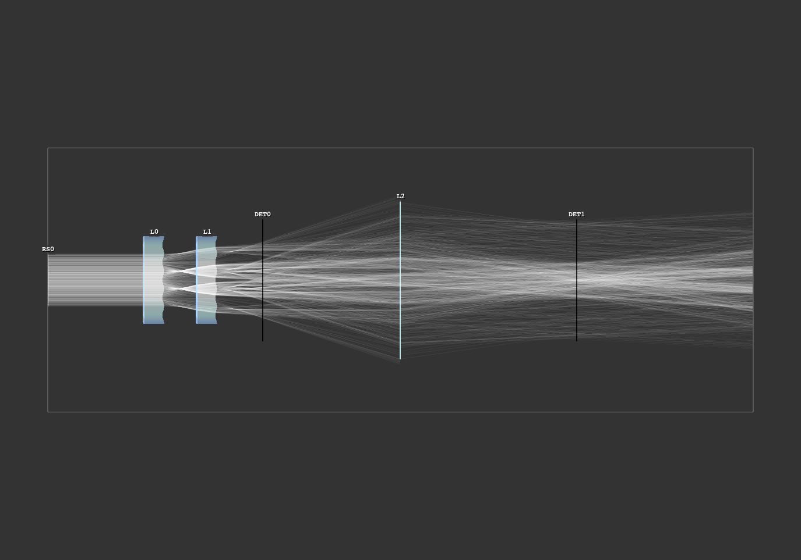

# Optrace
## Geometrical OPtics rayTRACEr and image simulation

<!-- TODO add version tag, such as https://img.shields.io/github/v/tag/drocheam/optrace?label=version see https://shields.io/badges/git-hub-tag -->

<!-- TODO link tag to documentation -->

<!-- TODO add coverage info (via third party site?), lines of code, comment/docstring quality etc. -->

</img>
</img>
</img>
</img>
</img>
   
</img>
</img>
</img>
</img>
</img>

<!-- TODO images are clickable, redirect to example page -->

## Overview

 **Features**
  * a sequential raytracer for geometrical optics
  * a tool with presets and user defined surface shapes, ray sources and media
  * a library with an additional GUI with ray and geometry visualization
  * a renderer for colored detector images inside an optical setup
  * a program including paraxial analysis (matrix optics, position of cardinal points/planes and psf convolution)
  * a programming/scripting approach to simulation
  * free, open source software

 **Non-Features**
  * a GUI focussed tool
  * an optics design program with lens optimization, aberration analysis and tolerancing
  * simulation incorporating wave optics, e.g. diffraction, interference
  * a non-sequential raytracer, simulating ghost images, reflections
  * a tool supporting mirror or fresnel lens optics

 **Purpose/Use Cases**
  * educational purposes, demonstrating aberrations or simple optical setups
  * introductionary tool to paraxial, geometrical optics or image formation
  * simulation of simpler systems, like a prism, the eye model or a telescope
  * estimation of effects where professional software (ZEMAX, OSLO, Quadoa, ...) would be overkill for

## Examples

An example gallery is found at <>.

## Documentation

See <>

## Installation

Make sure Python 3.10, 3.11, 3.12 or 3.13 are installed on your system

**Installing the latest official release**

#. Find the newest release at the `Releases page <https://github.com/drocheam/optrace/releases>`__ and download the .tar.gz archive from the Assets section
#. Open a terminal
#. Run :bash:`pip install <path to archive>`, where :bash:`<path to archive>` is the path to the archive downloaded in the first step

**Installing the current git version**

#. Open a terminal
#. Clone the whole project repository using git: :bash:`git clone https://github.com/drocheam/optrace/`
#. Change the directory into the cloned folder: :bash:`cd optrace`
#. Install using :bash:`pip install .`

## Contributing

## License

This project is published under an MIT License.

## Similar software

- Geometrical Optics
   * [RayOptics](https://ray-optics.readthedocs.io/en/latest/) by Michael Hayford. Tracing and optical design analysis tool. 
   * [rayopt](https://github.com/quartiq/rayopt) by QUARTIQ. Tracing and optical design analysis tool. 
   * [RayTracing](https://github.com/DCC-Lab/RayTracing) by DCC-Lab. Paraxial raytracer with beampath visualization.

- Wave Optics
   * [diffractsim](https://github.com/rafael-fuente/diffractsim) by Rafael de la Fuente. Waveoptics simulation of arbitrary apertures and phase holograms.
   * [poppy](https://github.com/spacetelescope/poppy) by Space Telescope Science Institute. Fraunhofer and Fresnel propagation for optics.
   * [prysm](https://prysm.readthedocs.io/en/stable/index.html) by Brandon Dube. Interferometer and diffraction calculations.

- Geometrical + Wave Optics
   * [opticspy](http://opticspy.org/) by Xing Fan. Tracing, wave optics, aberration and Zernike polynomial analysis.
   * [raypier](https://raypier-optics.readthedocs.io/en/latest/introduction.html#the-components-of-a-raypier-model) by Bryan Cole. Raytracing and beamlet propagation with 3D viewer.
