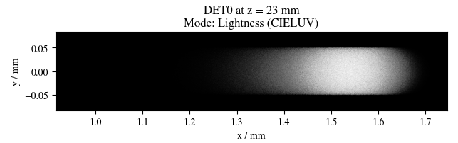
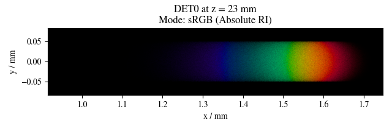
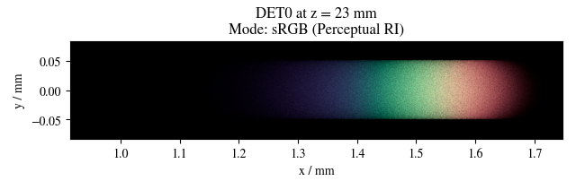

***********************
Color Conversion
***********************

Spectrum to XYZ
=================================================

.. figure:: images/cie_cmf.svg
   :width: 600
   :align: center

With a light power spectrum :math:`P(\lambda)` and the three  curves from the figure above we can calculate the tristimulus values :math:`X, Y, Z`.

.. math::
   X &=\int_{\lambda} P(\lambda) \cdot x(\lambda) ~d \lambda \\
   Y &=\int_{\lambda} P(\lambda) \cdot y(\lambda) ~d \lambda \\
   Z &=\int_{\lambda} P(\lambda) \cdot z(\lambda) ~d \lambda
   :label: XYZ_Calc

xyY
============

**XYZ to xyY**

The following formulas are valid for :math:`X,~Y,~Z > 0`, otherwise we set :math:`x=x_r,~y=y_r,~z=z_r,~Y=0`, where :math:`x_r,y_r` are the whitepoint coordinates. Typically the whitepoint D65 is used with :math:`x_r=0.31272,~y_r=0.32903`, see CIE Colorimetry, 3. Edition, 2004, table 11.3.

.. math::
   \begin{aligned}
   x &= \frac{X}{X + Y + Z} \\
   y &= \frac{Y}{X + Y + Z} \\
   z &= \frac{Z}{X + Y + Z} = 1 - x - y\\
   Y &= Y 
   \end{aligned}

**xyY to XYZ**

.. math::
   \begin{aligned}
   X &= x \cdot \frac{Y}{y} \\
   Y &= Y\\ 
   Z &= z \cdot \frac{Y}{y} \\
   \end{aligned}

.. _chroma_1931:
.. figure:: images/chroma_1931.svg
   :width: 700
   :align: center

   xy chromaticity diagram with sRGB Gamut

sRGB
==============

sRGB uses the D65 whitepoint with coordinates :math:`X=0.95047,~Y=1,~Z=1.08883`, see :cite:`WikiD65`.

**Conversion XYZ to sRGB**

Conversion from XYZ to sRGB is done as follows :cite:`BloomMatrices,sRGBWiki`:

.. math::
   	\left[\begin{array}{l}
		R_{\text {linear}} \\
		G_{\text {linear}} \\
		B_{\text {linear}}
	\end{array}\right]=\left[\begin{array}{ccc}
        +3.2404542 & -1.5371385 & -0.4985314 \\
        -0.9692660 & +1.8760108 & +0.0415560 \\
        +0.0556434 & -0.2040259 & +1.0572252
	\end{array}\right]\left[\begin{array}{c}
		X_\text{D65} \\
		Y_\text{D65} \\
		Z_\text{D65}
	\end{array}\right]
    :label: XYZ2RGB

.. math::
   C_{\text {sRGB}}= \begin{cases}12.92\cdot C_{\text {linear}}, & C_{\text {linear}} \leq 0.0031308 \\[1.5ex] 
   1.055\cdot C_{\text {linear}}^{1 / 2.4}-0.055, & C_{\text {linear}}>0.0031308\end{cases}
   :label: Gamma_Correction

**Conversion sRGB to XYZ**

Conversion from sRGB to XYZ is done as follows :cite:`BloomMatrices,sRGBWiki`:

.. math::
   	C_{\text {linear }}= \begin{cases}\displaystyle\frac{C_{\text {sRGB}}}{12.92}, & C_{\text {sRGB}} \leq 0.04045 \\[1.5ex]
	\displaystyle\left(\frac{C_{\text {sRGB}}+0.55}{1.055}\right)^{2.4}, & C_{\text {sRGB}}>0.04045\end{cases}
    :label: Gamma_Correction_Reverse

.. math::
	\left[\begin{array}{l}
   			X_{\text {D65}} \\
			Y_{\text {D65}} \\
			Z_{\text {D65}}
		\end{array}\right]=\left[\begin{array}{ccc}
            0.4124564 & 0.3575761 & 0.1804375\\
            0.2126729 & 0.7151522 & 0.0721750\\
            0.0193339 & 0.1191920 & 0.9503041
		\end{array}\right]\left[\begin{array}{c}
			R_{\text{linear}} \\
			G_{\text{linear}} \\
			B_{\text{linear}}
	\end{array}\right]
    :label: RGB2XYZ

**Rendering Intents**

As can be seen from figure <> the sRGB gamut does not include all colors in human vision. There are multiple ways to represents these outside colors.

Implemented Rendering Intents:
 1. **Ignore**: Leaves color values untouched and outsources the handling of these colors. Typically this means the color values will be clamped by other methods, which can lead to large deviations in hue, saturation and brightness.
 2. **Absolute Colorimetric**: Leaves colors inside the gamut untouched. Outside colors will be projected onto the gamut edge in direction towards the white point. This is equivalent to a saturation clipping.
 3. **Perceptual Colorimetric**: Determines the most saturated color outside the gamut. Rescales the saturation of all colors such that this color fits into into the gamut area. Equivalent to stauration rescaling.

Intersecting the gamut edge for mode *Absolute Colorimetric* is done in the CIE 1931 xy chromaticity diagram and towards the whitepoint of the standard illuminants D65.
Determining and rescaling the saturation in *Perceptual Colorimetric* mode is done in the CIE 1976 uv chromaticity diagram, since this is a representation where color differences directly correspond to spatial differences.

.. _ri_fig:
.. figure:: images/rendering_intents.jpg
   :width: 700
   :align: center

   Example of Absolute and Perceptual Colorimetric modes for a printer. :cite:`SnapRI`

The effect of different rendering intents is illustrated in the next figures. The rendered images were created using the double prism example from the example folder, where light is decomposed into its components. Since all spectral wavelengths create colors beyond the sRGB gamut, this leads to an extreme case.
In the first image the lightness component is pictured, the following images should be the colored version of this lightness image.
With the Absolute Colorimetric rendering intent one can see not only the colors having different saturation, but the lightness gradient is different compared to the first image. This can especially be seen around :math:`x = 1.3` mm to :math:`x= 1.4` mm. While the lightness values were in fact unchanged, this subjective difference comes from the Helmholtz-Kohlrausch effect :cite:`HelmKohlWiki`, which describes that color saturation can lead to higher perceived lightness. Since the saturation was clipped, and the maximum value depends on the spectral wavelength, saturation ratios are falsified, leading to this effect behaving differently for every color.
The third image shows the Perceptual Colorimetric rendering intent. One can clearly see a decreased saturation for all colors. However, the saturation ratios are kept and the lightness gradient matches the lightness image.

.. _color_dispersive1:

CIELUV
==============

.. _chroma_1976:
.. figure:: images/chroma_1976.svg
   :width: 700
   :align: center

   u'v' chromaticity diagram with sRGB Gamut

**XYZ to CIELUV**

Source for conversion: :cite:`BloomXYZLUV`

The following equations are valid for :math:`X, Y, Z > 0`, otherwise we set :math:`L = 0, ~u=0,~v=0`.

.. math::
   \begin{aligned}
   &L= \begin{cases}116 \sqrt[3]{y_r}-16 & \text { if } y_r>\epsilon \\
   \kappa y_r & \text { otherwise }\end{cases} \\
   &u=13 L\left(u^{\prime}-u_r^{\prime}\right) \\
   &v=13 L\left(v^{\prime}-v_r^{\prime}\right)
   \end{aligned}

With 

.. math::
   \begin{aligned}
   \epsilon &= 0.008856\\
   \kappa &= 903.3\\
   y_r &=\frac{Y}{Y_r} \\
   u^{\prime} &=\frac{4 X}{X+15 Y+3 Z} \\
   v^{\prime} &=\frac{9 Y}{X+15 Y+3 Z}
   \end{aligned}

:math:`Y_r` is taken from the white point coordinates :math:`(X_r,~Y_r,~Z_r)`, typically those of the standard illuminant D65. On the other hand :math:`u'_r` and :math:`v'_r` are the :math:`u', ~v'` values for these whitepoint coordinates.

**CIELUV to XYZ**

Source for conversion: :cite:`BloomLUVXYZ`. However, some formulas were rewritten in a different form.

The following equations are valid for :math:`L > 0`, for :math:`L = 0` all values are set as :math:`X=Y=Z=0`.

.. math::
   Y= \begin{cases}\left(\frac{L+16} {116}\right)^3 & \text { if } L>\kappa \epsilon \\ L / \kappa & \text { otherwise }\end{cases}

.. math::
   \begin{aligned}
   X &= \frac{9}{4} \cdot \frac{u + 13 L u'_r}{v + 13 L v'_r}\\
   Z &= 3 Y \cdot \left(\frac{13 L}{v + 13 L v'_r}  - \frac{5}{3}\right) - \frac{X}{3}\\
   \end{aligned}

**CIELUV to u'v'L**

The following equations are valid for :math:`L > 0`, for :math:`L = 0` we set :math:`u' = u'_r, ~v' = v'_r`.

.. math::
   \begin{aligned}
   L &= L\\
   u' &= u'_r + \frac{u}{13 L}\\
   v' &= v'_r + \frac{v}{13 L}\\
   \end{aligned}

**CIELUV Chroma**

Calculation of chroma :cite:`ColorfulnessWiki`:

.. math::
   C = \sqrt{u^2 + v^2}

**CIELUV Hue**

Calculation of hue :cite:`ColorfulnessWiki`:

.. math::
   H = \text{arctan2}(v, u)

**CIELUV Saturation**

Calculation of saturation :cite:`ColorfulnessWiki`:

The following equations are valid for :math:`L > 0`, for :math:`L = 0` we set :math:`S=0`.

.. math::
   S = \frac{C}{L}

sRGB to Spectrum 
=================================================

This process is commonly referred to as *Spectral Upsampling*.

.. topic:: Requirements

     1. create illuminants with same color coordinates as the sRGB primaries
     2. same luminance ratios as sRGB primaries
     3. simple, smooth spectral functions
     4. wide spectrum
     5. relatively few light in non-visible regions (infrared and ultraviolet)

Points 1 and 2 simplify the upsampling process, since the mixing ratio of the linear sRGB values can be used directly. In principle we could create a new color space and gamut, that includes the sRGB gamut. But with this we would need to add additional color space conversions.
Linear sRGB values need to be used, since they are proportional to the physical intensity of the sRGB primaries. In contrast normal sRGB values are gamma corrected to approximate non-linear human vision.

Points 3 and 4 are needed to approximate natural illuminants close to reality. Adding all sRGB primaries together for a white spectrum should lead to no missing regions in the spectral range. Such gaps would lower the color rendering index (CRI) of the illuminant, which is basically the measure to quantify faithfully rendering object colors when illuminated with this light. For instance, a light spectrum with a yellow gap fails to render purely yellow colors.

Point 5 ensures most of the traced light actually contributes to a rendered image. A color image in sRGB, which is a color space for human vision, should lead to an image with colors in human vision. Rays with colors far outside the visible spectrum would be a waste of rendering time.

.. list-table:: sRGB primary specification, see :cite:`sRGBWikiEN`
   :widths: 50 50 50 50 50
   :header-rows: 1
   :align: center

   * - Color value
     - Red
     - Green
     - Blue
     - D65   
   * - :math:`x` 
     - 0.6400
     - 0.3000 
     - 0.1500 
     - 0.3127
   * - :math:`y` 
     - 0.3300
     - 0.6000 
     - 0.0600 
     - 0.3290
   * - :math:`z` 
     - 0.0300 
     - 0.0100 
     - 0.7900 
     - 0.3583
   * - :math:`Y` 
     - 0.2127 
     - 0.7152 
     - 0.0722 
     - 1.0000
   * - sRGB 
     - [1, 0, 0] 
     - [0, 1, 0] 
     - [0, 0, 1] 
     - [1, 1, 1]

**Dimensioning**

The mathematical functions of choice is an gaussian function, which is defined as:

.. math::
   S(\lambda, \mu, \sigma)=\frac{1}{\sqrt{2 \pi \sigma^{2}}} \exp \left(-\frac{(\lambda-\mu)^{2}}{2 \sigma^{2}}\right)
   :label: Gauss_Opt

Utilizing optimization methods in python, the following functions were found, that have the same color stimulus as the primaries:

.. math::
    r_0(\lambda) =&~  75.1660756583 \cdot \Big[ S(\lambda, 639.854491, 30.0)\\
                & + 0.0500907584 \cdot S(\lambda, 418.905848, 80.6220465)\Big]\\
    g_0(\lambda) =&~  83.4999222966 \cdot  S(\lambda, 539.13108974, 33.31164968)\\
    b_0(\lambda) =&~  47.99521746361 \cdot \Big[ S(\lambda, 454.833119, 20.1460206)\\
                & + 0.184484176 \cdot S(\lambda, 459.658190, 71.0927568)\Big]\\
   :label: r0g0b0_curves

.. _rgb_curve1:
.. figure:: images/rgb_curves1.svg
   :width: 600
   :align: center

However, the luminance ratios are different. For this we need to rescale the functions to match the ratio. The green curve factor is kept as 1. The rescaling factors are:

.. math::
    r(\lambda) =&~ 0.951190393 \cdot r_0(\lambda)\\
    g(\lambda) =&~ 1.000000000 \cdot g_0(\lambda)\\
    b(\lambda) =&~ 1.163645855 \cdot b_0(\lambda)\\
    :label: rgb_curves

.. _rgb_curve2:
.. figure:: images/rgb_curves2.svg
   :width: 600
   :align: center

The resulting spectrum for sRGB white (coordinates :math:`[1.0, 1.0, 1.0]`) looks as follows:

.. _rgb_white:
.. figure:: images/rgb_white.svg
   :width: 600
   :align: center

.. note::
   At :math:`\lambda = 380\,` nm and :math:`\lambda = 780\,` nm the curves are cut off mathematically. This ensures that all ratios and constants can be kept equal, even if the wavelength simulation range should be extended beyond this default range.

In a later step the channel primary functions are interpreted as probability distribution functions (pdf). Such a pdf needs to have a normalized area such that the overall probability is 1.
This cancels out any prefactors in the channel curves and the ratios between the channels.
To counteract this, the channel mixing ratio is rescaled by the area of each channel curve (=being proportional to the probability ratio). In that way the channel luminance is moved from the curve values to the probability itself.

The area scaling factors are:

.. math::
    r_\text{P} = 0.885651229244\\
    g_\text{P} = 1.000000000000\\
    b_\text{P} = 0.775993481741\\
   :label: r_g_b_factors

As can be seen, the r and b channel have smaller rescaling factors than the green channel, since their area is smaller. This can already be seen in the figure above.

After choosing a channel according to the linear sRGB mixing ratios scaled with these factors, the corresponding channel primary curve is interpreted as probability density distribution where a wavelength is chosen from.

.. topic:: Example 

    Choose random wavelengths from sRGB value :math:`\text{RGB} = [1.0, 0.5, 0.2]`.

    1. Convert to linear sRGB: :math:`[1.000, 0.214, 0.033]`
    2. Rescale by area/probability factors :math:`r_\text{P}, g_\text{p}, b_\text{p}`: We get approximately :math:`[0.886, 0.214, 0.025]`
    3. Normalize, so sum equals 1: :math:`[0.788, 0.190, 0.022]`
    4. Choose one of the three channels with the values from 3. being the probability: The R channel gets randomly chosen.
    5. Use the R primary curve as probability distribution, choose a random wavelength accordingly: :math:`\lambda = 623.91\,` nm gets chosen.
    6. Repeating 4. and 5. by choosing randomly, a spectrum is created, that for many rays has the same color as the sRGB from point 1.

**Brightness Sampling**

While the procedure above creates correct colors, we also need to take into account the brightness of each pixel. For representing the pixel intensity in the image correctly, each pixel gets an assigned probability. This probability is proportional the pixel intensity.

This pixel intensity is calculated by converting sRGB to linear sRGB and multiplying each channel with its overall power, which is proportional to :math:`r_\text{P}, g_\text{P}, b_\text{P}`, and summing these components together. 

By doing so, each pixel gets an intensity weight that needs to be rescaled so the weight sum over the whole image is 1.

.. topic:: Example

   Choose random pixels from the image below

   .. math::
        
        \text{Image} = 
        \begin{bmatrix}
        \text{RGB1} & \text{RGB2}\\
        \text{RGB3} & \text{RGB4}
        \end{bmatrix}
        =
        \begin{bmatrix}
        [1.0, 0.0, 0.2] & [0.0, 0.0, 0.0]\\
        [0.1, 0.5, 1.0] & [1.0, 0.2, 1.0]
        \end{bmatrix}

   1. Convert to linear sRGB
   
    .. math::
        \begin{bmatrix}
        [1.000, 0.000, 0.033] & [0.000, 0.000, 0.000]\\
        [0.010, 0.214, 1.000] & [1.000, 0.033, 1.000]
        \end{bmatrix}

   2. Multiply by area factors :math:`r_\text{P}, g_\text{P}, b_\text{P}` and sum all channels for each pixel

    .. math::
        \begin{bmatrix}
        0.911 & 0.000\\
        0.999 & 1.694
        \end{bmatrix}

   3. Normalize weights
    
     .. math::
        \begin{bmatrix}
        0.253 & 0.000\\
        0.277 & 0.470
        \end{bmatrix}

   4. Chose randomly according to probability: The first 6 chosen pixels could be: :math:`\text{RGB1}, \text{RGB4}, \text{RGB4}, \text{RGB1}, \text{RGB3}, \text{RGB4}`

