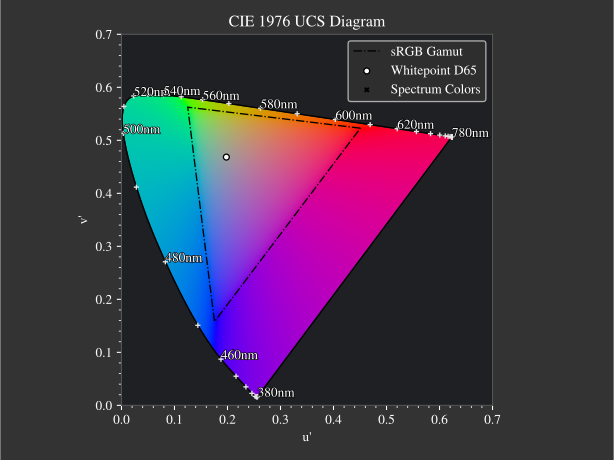

.. _color_management:

***********************
Color Management
***********************

.. role:: python(code)
  :language: python
  :class: highlight

.. _xyz_color_space:

XYZ Color Space
=================================================

Color perception, unlike spectral wavelengths, is not a directly measurable physical property. 
Instead, it arises from the physiological characteristics of the human visual system, making it inherently subjective. 

Human vision is mediated by five types of photoreceptors. Retinal ganglion cells regulate circadian rhythms, 
rod cells (neuron bacilliferum) enable night vision (scotopic vision). Cone cells (neuron coniferum) 
are responsible for color perception and daytime vision (photopic vision). Of these, the three types of cone cells 
are most relevant in color management. Each type exhibits a distinct spectral sensitivity curve, which describes 
how it responds to different wavelengths of light. When light strikes the retina, the incident spectrum is filtered 
through these sensitivities to produce receptor-specific stimuli.

These three cone sensitivities are commonly referred to as L (long), M (medium), and S (short). 
The resulting signals define the LMS color space.

However, in practice, the XYZ color space is typically used. It is derived through a linear transformation 
of the L, M, and S components. The XYZ values, also known as tristimulus values, are capable of representing 
the entire range of colors visible to the average human observer. 
It is important to note that spectral sensitivity can vary slightly from person to person and may be influenced 
by additional factors. The figure :numref:`cie_cmf` illustrates the standard color matching functions, which 
represent the average sensitivities measured from a group of observers for a 2° field of view. These measurements 
were conducted in 1928 and 1931 and form the basis of the CIE 1931 2° Standard Observer. These functions remain 
the most widely used reference for color conversion and management.

.. _cie_cmf:
.. figure:: ../images/cie_cmf.svg
   :width: 600
   :align: center
   :class: dark-light

   CIE 1931 2° color matching functions

Using a spectral power distribution :math:`P(\lambda)` and the three color matching functions shown in 
:numref:`cie_cmf`, the tristimulus values :math:`X`, :math:`Y`, and :math:`Z` can be computed as follows:

.. math::
   X &=\int_{\lambda} P(\lambda) \cdot x(\lambda) ~d \lambda \\
   Y &=\int_{\lambda} P(\lambda) \cdot y(\lambda) ~d \lambda \\
   Z &=\int_{\lambda} P(\lambda) \cdot z(\lambda) ~d \lambda
   :label: XYZ_Calc

Among these, the :math:`Y` component corresponds to the perceived brightness of the stimulus. 
To convert this value into the luminous flux :math:`\Phi_v`, commonly used in photometry, 
a simple scaling by the luminous efficacy constant is applied:

.. math::
   \Phi_v = 683 \frac{\text{lm}}{\text{W}} ~Y
   :label: luminous_flux

It is important to note that the formula in :math:numref:`luminous_flux` and the interpretation 
of :math:`Y` as a luminance are only valid under conditions of photopic (daylight) vision. 
For mesopic (twilight) or scotopic (night) vision, different luminous efficiency functions 
must be used to account for the varying sensitivity of the visual system.

xyY Color Space
================

Until now, each of the three tristimulus values contained a mixture of color and brightness information. 
The CIE xyY color space offers a more convenient representation by separating chromaticity (color information) 
into the two-dimensional *xy* components and luminance (brightness) into the *Y* component.
The reference point for neutral color, known as the white point, is defined by the chromaticity coordinates 
of the D65 standard illuminant. The spectral power distribution of D65 is designed to approximate average midday 
daylight in open air in Europe.

The resulting chromaticity diagram, including the D65 white point, is shown in :numref:`chroma_1931`. 
The spectral locus, representing monochromatic light at each visible wavelength, forms the outer boundary of the gamut, 
which encompasses all colors that can be represented within this system.

.. _chroma_1931:
.. figure:: ../images/chroma_1931.svg
   :width: 700
   :align: center
   :class: dark-light

   xy chromaticity diagram with sRGB Gamut

**XYZ to xyY**

The following transformations convert CIE XYZ tristimulus values to CIE xyY color space components.
These formulas are valid for :math:`X,~Y,~Z > 0`. If any of these values are not strictly positive,
the chromaticity coordinates are set to the white point coordinates (:math:`x=x_r,~y=y_r`) and :math:`Y` is set to 0. 
The white point coordinates are typically those of the D65 standard illuminant, 
where :math:`x_r=0.31272` and :math:`y_r=0.32903` (see CIE Colorimetry, 3rd Edition, 2004, Table 11.3).

.. math::
   \begin{aligned}
   x &= \frac{X}{X + Y + Z} \\
   y &= \frac{Y}{X + Y + Z} \\
   z &= \frac{Z}{X + Y + Z} = 1 - x - y\\
   Y &= Y 
   \end{aligned}
   :label: eq_xyz_xyy

Note that the :math:`z` component is often omitted as its value is implicitly determined by :math:`x` and :math:`y` 
through the relationship :math:`x+y+z=1`.

**xyY to XYZ**

The inverse transformation from CIE xyY to CIE XYZ is given by:

.. math::
   \begin{aligned}
   X &= x \cdot \frac{Y}{y} \\
   Y &= Y\\ 
   Z &= z \cdot \frac{Y}{y} \\
   \end{aligned}
   :label: eq_xyy_xyz

sRGB Color Space
=================

The standard RGB (sRGB) color space serves as the most common color space for digital media. 
Its color gamut is defined by a triangle, where any color within this triangle can be represented by a combination 
of its three primary colors: red, green, and blue, located at the triangle's vertices. 
Given that digital monitors also typically employ three distinct light emitters per pixel,
the utility of such a three-primary system becomes apparent.

sRGB utilizes the D65 white point, defined by the CIE XYZ coordinates 
:math:`X=0.95047,~Y=1,~Z=1.08883` (:footcite:`WikiD65`).
It's important to note that the sRGB gamut does not encompass the entire spectrum of visible colors,
particularly lacking highly saturated colors. 
The sRGB gamut's position within the broader color space is visualized in :numref:`chroma_1931`.

Color information in sRGB is typically stored with three values per pixel, 
each corresponding to one of the red, green, or blue channels. 
With a common bit depth of 8 bits per channel, the intensity range for each primary is limited to 256 discrete values. 
However, human perception of luminance is non-linear. 
Directly encoding linear intensity values within this limited range would result in a 
disproportionate allocation of bits, leading to fine intensity steps in some regions and coarse steps in others, 
potentially causing visual banding artifacts.

To mitigate this issue, sRGB values undergo a *gamma correction*. This non-linear transformation approximates the 
human eye's luminance sensitivity, effectively distributing the available digital values more uniformly 
according to perceived brightness and minimizing banding.

**Conversion XYZ to sRGB**

The linear sRGB values, before gamma correction, are obtained through a linear transformation of 
the CIE XYZ tristimulus values. The conversion from CIE XYZ to linear sRGB is defined by the following 
matrix multiplication :footcite:`BloomMatrices,sRGBWiki`:

.. math::
   	\left[\begin{array}{l}
		R_{\text {linear}} \\
		G_{\text {linear}} \\
		B_{\text {linear}}
	\end{array}\right]=\left[\begin{array}{ccc}
        +3.2404542 & -1.5371385 & -0.4985314 \\
        -0.9692660 & +1.8760108 & +0.0415560 \\
        +0.0556434 & -0.2040259 & +1.0572252
	\end{array}\right]\left[\begin{array}{c}
		X_\text{D65} \\
		Y_\text{D65} \\
		Z_\text{D65}
	\end{array}\right]
    :label: XYZ2RGB

Applying the gamma correction results in:

.. math::
   C_{\text {sRGB}}= \begin{cases}12.92\cdot C_{\text {linear}}, & C_{\text {linear}} \leq 0.0031308 \\[1.5ex] 
   1.055\cdot C_{\text {linear}}^{1 / 2.4}-0.055, & C_{\text {linear}}>0.0031308\end{cases}
   :label: Gamma_Correction

**Conversion sRGB to XYZ**

The inverse transformation from sRGB to XYZ is performed as follows :footcite:`BloomMatrices,sRGBWiki`:

.. math::
   	C_{\text {linear }}= 
    \begin{cases}\displaystyle\frac{C_{\text {sRGB}}}{12.92}, & C_{\text {sRGB}} \leq 0.04045 \\[1.5ex]
	\displaystyle\left(\frac{C_{\text {sRGB}}+0.55}{1.055}\right)^{2.4}, & C_{\text {sRGB}}>0.04045\end{cases}
    :label: Gamma_Correction_Reverse

.. math::
	\left[\begin{array}{l}
   			X_{\text {D65}} \\
			Y_{\text {D65}} \\
			Z_{\text {D65}}
		\end{array}\right]=\left[\begin{array}{ccc}
            0.4124564 & 0.3575761 & 0.1804375\\
            0.2126729 & 0.7151522 & 0.0721750\\
            0.0193339 & 0.1191920 & 0.9503041
		\end{array}\right]\left[\begin{array}{c}
			R_{\text{linear}} \\
			G_{\text{linear}} \\
			B_{\text{linear}}
	\end{array}\right]
    :label: RGB2XYZ

**Rendering Intents**

As illustrated in :numref:`chroma_1931`, the sRGB color gamut does not encompass the entirety of humanly visible colors. 
Various approaches exist to handle colors that fall outside this gamut.
The simplest is to simply clamp any negative sRGB values to zero, often resulting in inaccurate color and brightness
representation. This approach is still commonly found, possibly
due to its ease of implementation or a lack of awareness of better methods 

:footcite:`OttossonClipping` presents several more sophisticated *gamut clipping* techniques designed 
to minimize the visual artifacts.

.. figure:: ../images/rendering_intents.svg
   :align: center
   :width: 550
   :class: dark-light

   Absolute and perceptual colorimetric rendering intent in the CIE 1976 chromaticity diagram.

Implemented Rendering Intents:

1.  **Ignore**: This intent leaves out-of-gamut color values unmodified, 
    delegating their handling to subsequent processing stages. Typically, this results in these values being clamped 
    by other methods, which can introduce significant inaccuracies in hue, saturation, and brightness.

2.  **Absolute Colorimetric**: Colors that fall within the target gamut are left unchanged. Colors outside the gamut 
    are projected onto the gamut boundary along a straight line directed towards the white point.
    This method is equivalent to chroma clipping in the CIE 1931 xy chromaticity diagram.

3.  **Perceptual Colorimetric**: This intent identifies the most saturated color that lies outside the target gamut. 
    It then rescales the saturation of all colors in the image proportionally, such that this most saturated 
    out-of-gamut color is brought within the gamut boundary. This technique, equivalent to chroma rescaling, 
    is typically performed in the CIE 1976 uv chromaticity diagram, as this color space is designed such
    that Euclidean distances correlate well with perceived color differences.

The gamut boundary intersection for the *Absolute Colorimetric* mode is calculated within the CIE 1931 xy 
chromaticity diagram, with the projection direction determined by the white point of the D65 standard illuminant. 
The determination and rescaling of chroma in the *Perceptual Colorimetric* mode are performed in the CIE 1976 uv 
chromaticity diagram to better align numerical color differences with perceptual uniformity.

In its default configuration, the Perceptual Colorimetric rendering intent scales the chroma of all colors to
ensure they fall within the target gamut. Alternatively, a fixed rescaling factor (within the range 0 to 1) can be 
supplied via the :python:`chroma_scale` parameter. This allows for consistent scaling, which can be beneficial when 
comparing different images. In the adaptive scaling scenario, an additional :python:`L_th` parameter can be specified. 
This parameter represents a relative luminance threshold: colors with luminance below this threshold are excluded from 
the calculation of the scaling factor. This can be useful for disregarding dark but saturated image regions that might 
otherwise influence the overall chroma scaling. For more detailed information, refer to :ref:`usage_color`.

The effect of different rendering intents is illustrated in the next figures. 
The rendered images were created using the :ref:`example_prism`. 
Since all spectral wavelengths create colors beyond the sRGB gamut, this leads to an extreme case.
In the first image the lightness component is pictured, the following images should be the colored version of 
this lightness image. With the Absolute Colorimetric rendering intent, one can see not only the colors having different 
saturation, but the lightness gradient is different compared to the first image. This can especially be seen around 
:math:`x = 1.3` mm to :math:`x= 1.4` mm. While the lightness values were in fact unchanged, this subjective difference 
comes from the Helmholtz-Kohlrausch effect :footcite:`HelmKohlWiki`, which describes that color saturation can lead to
higher perceived lightness. Since the saturation was clipped, and the maximum value depends on the spectral wavelength, 
saturation ratios are falsified, leading to this effect behaving differently for every color.
The third image shows the Perceptual Colorimetric rendering intent. 
One can clearly see a decreased saturation for all colors. 
However, the saturation ratios are kept, and the lightness gradient matches the lightness image.

The effect of different rendering intents is illustrated in the following figures, 
generated using the :ref:`example_prism`.This scenario represents an extreme case, since all spectral 
wavelengths produce colors exceeding the sRGB gamut.

The first image depicts the lightness component. Subsequent images display the colored versions corresponding 
to this lightness image. Observing the result of the Absolute Colorimetric rendering intent, one can discern not 
only variations in color saturation but also a distinctly different lightness gradient compared to the initial image. 
This difference is particularly noticeable in the region between :math:`x = 1.3` mm and :math:`x= 1.4` mm. 
While the underlying lightness values remain unchanged, this subjective alteration arises from the 
Helmholtz-Kohlrausch effect :footcite:`HelmKohlWiki`, which describes how color saturation can enhance
perceived lightness. As the saturation was clipped and its maximum value is dependent on the spectral wavelength, 
the saturation ratios are distorted, causing this effect to manifest differently for each color.

The third image demonstrates the Perceptual Colorimetric rendering intent. 
A clear reduction in saturation across all colors is evident. 
However, the chroma ratios are preserved, and the lightness gradient aligns with the original lightness image.

.. _color_dispersive1:
   
.. list-table:: Difference in different sRGB rendering intents.
   :class: table-borderless

   * - .. figure:: ../images/color_dispersive1.svg
          :width: 400
          :align: center
          :class: dark-light

     - .. figure:: ../images/color_dispersive2.svg
          :width: 400
          :align: center
          :class: dark-light
          
     - .. figure:: ../images/color_dispersive3.svg
          :width: 400
          :align: center
          :class: dark-light

Plenty of negative examples for color representation can be found in literature  
(`Link1 <https://clarkvision.com/articles/color-cie-chromaticity-and-perception/color-rgb-xy-cie1931-diagram1g1000spjfjl1-1000-ciesrgb-axes-waveticks-c1-srgb-800.jpg>`__,
`Link2 <https://medium.com/hipster-color-science/a-beginners-guide-to-colorimetry-401f1830b65a>`__,
`Link3 <https://www.faes.de/NN_in_der_Farbmetrik/NN_Erklaerung_Farbraum/cie-normfarbtafel.jpg>`__,
`Link4 <https://d1hjkbq40fs2x4.cloudfront.net/2017-06-05/files/perceptual-vs-absolute-rendering-intents_1621-2.jpg>`__).

In most cases, negative sRGB values were simply clipped, leading to distortions not only in saturation but also 
in hue and brightness. For example, colors near 510 nm are rendered as deep green instead 
of a more nuanced greenish-cyan. In some instances, even representable colors within the gamut are inaccurate,
which can be observed as overly saturated colors throughout the diagram.

Conversely, positive examples can be found at:
`Link6 <https://commons.wikimedia.org/wiki/File:CIE1931xy_blank.svg>`__
`Link7 <https://www.wavemetrics.com/sites/www.wavemetrics.com/files/styles/content_body/public/2019-04/Chromaticity_1931.png>`__

It is important to note that these positive examples utilize a different luminance normalization, 
displaying the colors with increased brightness.

CIELUV Color Space
==================

A limitation of the XYZ color space lies in the interdependence of color and brightness. 
Furthermore, the perceived distances in brightness and color are not linear within this space. 
To address these issues, the improved CIE 1976 L, u, v color space (abbreviated as CIELUV) was developed.

In CIELUV, L represents the lightness component, while u corresponds to the red-green axis 
and v to the blue-yellow axis. The white point can be freely chosen, although the D65 standard 
illuminant is commonly used.

Analogous to the XYZ color space, a chromaticity diagram can be derived, with coordinates denoted as :math:`u',~v'`. 
This diagram is also known as the CIE 1976 UCS (uniform chromaticity scale) diagram and is illustrated in 
Figure :numref:`chroma_1976`. As its name implies, the UCS diagram exhibits uniform geometric distances throughout, 
where equal distances correspond to equal perceived color differences. This uniformity is not present in the 
CIE 1931 chromaticity diagram shown in Figure :numref:`chroma_1931`. Consequently, the UCS diagram is the
appropriate tool for visualizing the extent of the color ranges absent in the sRGB gamut.

.. _chroma_1976:

   u'v' chromaticity diagram with sRGB Gamut

Another widely adopted CIE model is the CIELAB color space, which employs the same lightness function as
CIELUV but utilizes different color components. For color mixing and additive color applications, CIELUV is 
generally preferred due to its associated chromaticity diagram (as previously mentioned) and a defined mathematical 
expression for color saturation :footcite:`ColorFord`.

**XYZ to CIELUV**

Conversion formulas are based on :footcite:`BloomXYZLUV`. 
These equations are valid for :math:`X, Y, Z > 0`. Otherwise, we define :math:`L = 0, ~u=0,~v=0`.

.. math::
   \begin{aligned}
   &L= \begin{cases}116 \sqrt[3]{y_r}-16 & \text { if } y_r>\epsilon \\
   \kappa y_r & \text { otherwise }\end{cases} \\
   &u=13 L\left(u^{\prime}-u_r^{\prime}\right) \\
   &v=13 L\left(v^{\prime}-v_r^{\prime}\right)
   \end{aligned}
   :label: eq_xyz_luv_eq

With the following parameters: 

.. math::
   \begin{aligned}
   \epsilon &= 0.008856\\
   \kappa &= 903.3\\
   y_r &=\frac{Y}{Y_r} \\
   u^{\prime} &=\frac{4 X}{X+15 Y+3 Z} \\
   v^{\prime} &=\frac{9 Y}{X+15 Y+3 Z}
   \end{aligned}
   :label: eq_xyz_luv_pars

Here, :math:`Y_r` is derived from the white point coordinates :math:`(X_r,~Y_r,~Z_r)`, 
typically those of the standard illuminant D65. 
Conversely, :math:`u'_r` and :math:`v'_r` represent the :math:`u', ~v'` values calculated for 
these white point coordinates.

**CIELUV to XYZ**

Conversion formulas are based on :footcite:`BloomLUVXYZ`. Note that some formulas have been reformulated for clarity.
These equations are valid for :math:`L > 0`. If :math:`L = 0`, then all values are set to :math:`X=Y=Z=0`.

.. math::
   Y= \begin{cases}\left(\frac{L+16} {116}\right)^3 & \text { if } L>\kappa \epsilon \\ 
   L / \kappa & \text { otherwise }\end{cases}
   :label: eq_luv_xyz_y

.. math::
   \begin{aligned}
   X &= \frac{9}{4} \cdot \frac{u + 13 L u'_r}{v + 13 L v'_r}\\
   Z &= 3 Y \cdot \left(\frac{13 L}{v + 13 L v'_r}  - \frac{5}{3}\right) - \frac{X}{3}\\
   \end{aligned}
   :label: eq_luv_xyz_xz

**CIELUV to u'v'L**

For :math:`L > 0`, the following equations apply. If :math:`L = 0`, we set :math:`u' = u'_r, ~v' = v'_r`.

.. math::
   \begin{aligned}
   L &= L\\
   u' &= u'_r + \frac{u}{13 L}\\
   v' &= v'_r + \frac{v}{13 L}\\
   \end{aligned}
   :label: eq_luv_u_v_l

**CIELUV Chroma**

Chroma calculation based on :footcite:`SchwiegerlingOptics`:

.. math::
   C = \sqrt{u^2 + v^2}
   :label: eq_luv_chroma

**CIELUV Hue**

Hue calculation based on :footcite:`SchwiegerlingOptics`:

.. math::
   H = \text{arctan2}(v, u)
   :label: eq_luv_hue

**CIELUV Saturation**

Saturation calculation based on :footcite:`ColorfulnessWiki`:
These equations are valid for :math:`L > 0`. If :math:`L = 0`, we set :math:`S=0`.

.. math::
   S = \frac{C}{L}
   :label: eq_luv_saturation

.. _random_srgb:

sRGB Spectral Upsampling
=================================================

While the conversion of a physical light spectrum to coordinates within a human vision color model is a frequent task,
the reverse process is less common. In our application, this inverse conversion is employed to load digital images 
into the raytracer and propagate spectral wavelengths throughout the tracing geometry. 
Such an implementation facilitates straightforward simulations of diverse light and lighting scenarios.

This conversion process is commonly known as *Spectral Upsampling*, *Spectral Rendering*, or *Spectral Synthesis*. 
An implementation utilizing real LED spectral curves can be found in :footcite:`10.2312:sr.20221150`, 
while methods for modeling sRGB reflectances are detailed in :footcite:`10.2312:sr.20191216` and :footcite:`Burns_2018`.

It is crucial to recognize that not all chromaticities within human vision, and even the sRGB gamut, 
can be accurately modeled by valid reflectance spectra, as the reflectance range is constrained to :math:`[0,~1]`.
However, this limitation does not apply when selecting illuminant curves.

While the conversion of a spectral distribution to a color is well-defined, going backwards the conversion is not unique 
and simply reversible. Multiple spectral distributions can create the same color stimulus, 
an effect known as *metamerism*. In fact, there are infinitely many distributions being perceived as the same color.
With so many possibilities to choose from, we can demand some requirements for our sRGB primaries:

While the conversion from a spectral distribution to a color is a well-defined process, 
the reverse conversion is neither unique nor simply reversible. Multiple distinct spectral distributions can evoke the 
same color perception, a phenomenon known as *metamerism*. In fact, an infinite number of spectral distributions can 
be perceived as identical colors. Given this vast number of possibilities, we can establish certain requirements 
for our sRGB primaries:

.. topic:: Requirements

     1. Same color coordinates as the sRGB primaries
     2. Same luminance ratios as sRGB primaries
     3. Simple, smooth spectral functions
     4. Wide spectrum
     5. Relatively little light in non-visible regions (infrared and ultraviolet)

Points 1 and 2 simplify the spectral upsampling process because the mixing ratios of the linear sRGB values can be
directly utilized. Although we could theoretically define a new color space and gamut that encompasses the sRGB gamut 
but is significantly broader, this approach would necessitate additional color space conversions. 
Furthermore, it would result in narrower spectra, which contradicts point 4. It is essential to use linear sRGB values,
as they are proportional to the physical intensity of the sRGB primaries. In contrast, standard sRGB values are 
gamma-corrected to approximate the non-linear response of human vision.

Points 3 and 4 are necessary to approximate natural illuminants with a high degree of realism. Superimposing all sRGB 
primaries to generate a white spectrum should ideally cover the entire visible spectral range without any significant
gaps. Such gaps would reduce the color rendering index (CRI) of the illuminant. The CRI is a metric used to quantify 
how faithfully an object's colors are rendered when illuminated by a particular light source. For example, a light 
spectrum with a deficiency in the yellow region would fail to render pure yellow colors accurately.

Point 5 ensures that the majority of the traced light contributes meaningfully to the final rendered image.
Given that sRGB is a color space designed for human vision, an input color image in sRGB should ideally produce a 
rendered image with colors perceived by humans. Tracing rays with colors far outside the visible spectrum would 
constitute an inefficient use of rendering time.

In theory, we could derive spectra for the sRGB primaries by combining a D65 white spectrum with the reflectance
curves described in the previously cited works. However, this approach has drawbacks: the resulting spectra would lack 
smoothness due to the non-smooth nature of the D65 spectrum, and a significant portion of the spectrum would fall 
within the range of human invisibility or near-invisibility. Furthermore, there are no straightforward mathematical 
descriptions for the resulting spectral curves.

.. list-table:: sRGB primary specification, see :footcite:`sRGBWikiEN`
   :widths: 50 50 50 50 50
   :header-rows: 1
   :align: center

   * - Color value
     - Red
     - Green
     - Blue
     - D65   
   * - :math:`x` 
     - 0.6400
     - 0.3000 
     - 0.1500 
     - 0.3127
   * - :math:`y` 
     - 0.3300
     - 0.6000 
     - 0.0600 
     - 0.3290
   * - :math:`z` 
     - 0.0300 
     - 0.0100 
     - 0.7900 
     - 0.3583
   * - :math:`Y` 
     - 0.2127 
     - 0.7152 
     - 0.0722 
     - 1.0000
   * - sRGB 
     - [1, 0, 0] 
     - [0, 1, 0] 
     - [0, 0, 1] 
     - [1, 1, 1]

**Dimensioning**

The mathematical function of choice is a Gaussian function, which is defined as:

.. math::
   S(\lambda, \mu, \sigma)=\frac{1}{\sqrt{2 \pi \sigma^{2}}} \exp \left(-\frac{(\lambda-\mu)^{2}}{2 \sigma^{2}}\right)
   :label: Gauss_Opt

A Gaussian function presents itself as a suitable choice due to its smooth, bell-shaped curve and its widespread 
application across various fields. Moreover, the principle of maximum entropy :footcite:`Wiki_maximum_entropy` 
advocates for this type of function when dealing with the two parameters of position and width, 
as it represents the probability distribution that maximizes uncertainty for a given set of constraints.

Employing optimization methods in Python, the following Gaussian functions were derived,
exhibiting the same color stimulus as the sRGB primaries:

.. math::
    r_0(\lambda) =&~  75.1660756583 \cdot \Big[ S(\lambda, 639.854491, 30.0)\\
                & + 0.0500907584 \cdot S(\lambda, 418.905848, 80.6220465)\Big]\\
    g_0(\lambda) =&~  83.4999222966 \cdot  S(\lambda, 539.13108974, 33.31164968)\\
    b_0(\lambda) =&~  47.99521746361 \cdot \Big[ S(\lambda, 454.833119, 20.1460206)\\
                & + 0.184484176 \cdot S(\lambda, 459.658190, 71.0927568)\Big]\\
   :label: r0g0b0_curves

.. The next three figures were created using /tests/misc/RGB_Fit.py

.. _rgb_curve1:
.. figure:: ../images/rgb_curves1.svg
   :width: 600
   :align: center
   :class: dark-light

The spectral distribution of the green primary is modeled using a single Gaussian function, 
whereas the red and blue primaries utilize a superposition of two Gaussian functions each. 
This choice is informed by Figure 3a in :footcite:`ClarkChromaticity`, which demonstrates that the chromaticity
coordinates of the red primary cannot be accurately reproduced with a single Gaussian curve.
While it is theoretically possible to represent the blue primary's chromaticity with a single Gaussian, 
this would only be feasible for narrow illuminants characterized by a small standard deviation. 
To allow for greater flexibility in selecting the spectrum width, 
two Gaussian functions are also employed for the blue primary.

It is important to note that the initial luminance ratios of these Gaussian approximations differ 
from those of the standard sRGB primaries. To address this discrepancy, we need to rescale the functions to 
match the correct luminance ratios. The scaling factor for the green curve is maintained at a value of 1, 
and the rescaling factors for the red and blue curves are determined as follows:

.. math::
    r(\lambda) =&~ 0.951190393 \cdot r_0(\lambda)\\
    g(\lambda) =&~ 1.000000000 \cdot g_0(\lambda)\\
    b(\lambda) =&~ 1.163645855 \cdot b_0(\lambda)\\
    :label: rgb_curves

.. _rgb_curve2:
.. figure:: ../images/rgb_curves2.svg
   :width: 600
   :align: center
   :class: dark-light

The resulting spectrum for sRGB white (with coordinates :math:`[1.0, 1.0, 1.0]`) is illustrated in :numref:`rgb_white`.

.. _rgb_white:
.. figure:: ../images/rgb_white.svg
   :width: 600
   :align: center
   :class: dark-light

   Simulated sRGB white spectrum.

.. topic:: Note
   
   The Gaussian curves additionally include a cutoff at :math:`\lambda = 380\,` nm and :math:`\lambda = 780\,` nm. 
   This ensures that all derived ratios and constants remain consistent, 
   even if the simulated wavelength range is extended beyond these default boundaries.

In a subsequent step, the spectral distributions of the color channel primaries are treated as 
probability density functions (pdfs). A key property of a pdf is that its integral over the entire domain 
(the area under the curve) must be normalized to unity, representing a total probability of 1. 
This normalization process effectively cancels any multiplicative factors in the channel curves, 
as well as the relative scaling between the channels. 
To compensate for this effect on luminance, the mixing ratio of each channel is rescaled by the area under 
its corresponding spectral curve. Since this area is proportional to the probability ratio, 
this rescaling effectively transfers the information about channel luminance from the absolute magnitudes of the curve
values to the relative probabilities of the channels.

The area scaling factors are:

.. math::
    r_\text{P} = 0.885651229244\\
    g_\text{P} = 1.000000000000\\
    b_\text{P} = 0.775993481741\\
   :label: r_g_b_factors

As the calculated rescaling factors indicate, the red and blue channels have smaller factors compared 
to the green channel. This is visually apparent in the preceding figure, 
where the areas under the red and blue primary curves are smaller than that under the green primary curve.

Following the selection of a color channel based on the linear sRGB mixing ratios 
(which have been scaled by the aforementioned factors), the corresponding channel primary spectral curve 
is then treated as a probability density function. 
A specific wavelength is subsequently sampled from this probability distribution.

.. topic:: Example 

    Choose random wavelengths from sRGB value :math:`\text{RGB} = [1.0, 0.5, 0.2]`.

    1. Convert to linear sRGB: :math:`[1.000, 0.214, 0.033]`
    2. Rescale by area/probability factors :math:`r_\text{P}, g_\text{p}, b_\text{p}`: 
       We get approximately :math:`[0.886, 0.214, 0.025]`
    3. Normalize, so integral equals 1: :math:`[0.788, 0.190, 0.022]`
    4. Choose one of the three channels with the values from 3. as the probability: 
       The R channel gets randomly chosen.
    5. Use the R primary curve as a probability distribution, choose a random wavelength accordingly: 
       :math:`\lambda = 623.91\,` nm gets chosen.
    6. Repeating 4. and 5. by choosing randomly, a spectrum is created, 
       that for many rays converges to the correct sRGB color.

**Brightness Sampling**

While the previously described procedure ensures accurate color representation, 
it is also crucial to account for the brightness of each pixel in the image. 
To correctly represent the pixel intensity, each pixel is assigned a probability proportional to its intensity.

This pixel intensity is calculated by first converting the sRGB color values to linear sRGB 
and then multiplying each linear channel value by its corresponding overall power,
which is proportional to :math:`r_\text{P}, g_\text{P}, b_\text{P}`. 
These scaled channel values are then summed together to obtain the pixel intensity.

Subsequently, each pixel is assigned an intensity weight based on this calculated intensity.
To ensure proper probabilistic sampling across the entire image, 
these intensity weights are then rescaled so that the sum over all pixels in the image equals 1.

.. topic:: Example

   Choose random pixels from the image below

   .. math::
        
        \text{Image} = 
        \begin{bmatrix}
        [1.0, 0.0, 0.2] & [0.0, 0.0, 0.0]\\
        [0.1, 0.5, 1.0] & [1.0, 0.2, 1.0]
        \end{bmatrix}

   1. Convert to linear sRGB
   
   .. math::

       \begin{bmatrix}
       [1.000, 0.000, 0.033] & [0.000, 0.000, 0.000]\\
       [0.010, 0.214, 1.000] & [1.000, 0.033, 1.000]
       \end{bmatrix}

   2. Multiply by area factors :math:`r_\text{P}, g_\text{P}, b_\text{P}` and sum all channels for each pixel

   .. math::

       \begin{bmatrix}
       0.911 & 0.000\\
       0.999 & 1.694
       \end{bmatrix}

   3. Normalize weights
    
   .. math::

      \begin{bmatrix}
      0.253 & 0.000\\
      0.277 & 0.470
      \end{bmatrix}

   4. Choose randomly according to the probabilities.

------------

**References**

.. footbibliography::

