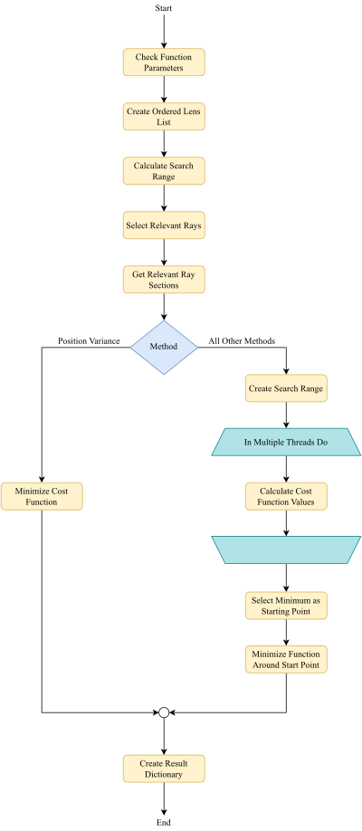

.. _autofocus:

*******************
Focus Methods
*******************

.. role:: python(code)
  :language: python
  :class: highlight

.. TODO describe the focus finding process in more detail and the algorithms used for optimization

Procedure
=============================

The focus_search procedure is illustrated in the following figure.

   
   Autofocus process flowchart.

RMS Spot Size
=============================

**Standard RMS**

The following derivation is similar to :footcite:`Boussemaere_2023_19`.
For ray sections starting at :math:`x_i, y_i, z_0` the positions at an additional :math:`t` axial distance are:

.. math::
   x_i^*&=x_i+\frac{s_{x, i}}{s_{z, i}} t \\
   y_i^*&=y_i+\frac{s_{y, i}}{s_{z, i}} t
   :label: eq_rms_spot_size_propagation

We can define the RMS spot size relative to the center coordinates :math:`x_c^*, y_c^*`.
This average position also propagates starting at :math:`x_c, y_c` and having a direction vector :math:`s_c`.
The cost function is:

.. math::
   R_v(d) &=\sqrt{\frac{1}{N} \sum_{i=1}^N\left(\left(x_i^*-x_c^*\right)^2+\left(y_i^*-y_c^*\right)^2\right)} \\
   &=\sqrt{\frac{1}{N} \sum_{i=1}^N\left(\left(\Delta x_i+d \Delta \theta_{x, i}\right)^2
   +\left(\Delta y_i+d \Delta \theta_{y, i}\right)^2\right)}
   :label: eq_rms_spot_size_cost_function

With the new relative coordinates :math:`\Delta x_i, \Delta y_i` 
and relative direction :math:`\Delta \theta_{x,i}, \Delta \theta_{y,i}`:

.. math::
   \Delta x_i & =x_i-x_c \\
   \Delta y_i & =y_i-y_c \\
   \Delta \theta_{x, i} & =\frac{s_{x, i}}{s_{z, i}}-\frac{s_{x, c}}{s_{z, c}} \\
   \Delta \theta_{y, i} & =\frac{s_{y, i}}{s_{z, i}}-\frac{s_{y, c}}{s_{z, c}}
   :label: eq_rms_spot_size_relative_coordinates

Variational calculus leads to :footcite:`Boussemaere_2023_19`:

.. math::
   t = -\frac{\sum_{i=1}^N \left(\Delta \theta_{x, i} \Delta x_i+\Delta \theta_{y, i} \Delta y_i \right)}
   {\sum_{i=1}^N \left(\Delta \theta_{x, i}^2+\Delta \theta_{y, i}^2 \right)}
   :label: eq_rms_spot_size_solution

So the focal position is located at :math:`z_0 + t`.

**Ray Weighted RMS**

We can also include additional weights :math:`w_i` for each ray, which for instance can be a ray power.

.. math::
   R_v(d) =\sqrt{\frac{1}{N} \sum_{i=1}^N\left(\left(w_i\left(x_i^*-x_c^*\right)\right)^2
   +\left(w_i\left(y_i^*-y_c^*\right)\right)^2\right)} \\
   :label: eq_weighted_rms_spot_size_cost_function

The weights are easily isolated from the rest of the expression, leading to a factor of :math:`w_i^2` for all terms.
This leads to a solution of:

.. math::
   t = -\frac{\sum_{i=1}^N w_i^2 \left(\Delta \theta_{x, i} \Delta x_i+\Delta \theta_{y, i} \Delta y_i \right)}
   {\sum_{i=1}^N w_i^2 \left(\Delta \theta_{x, i}^2 + \Delta \theta_{y, i}^2 \right)}
   :label: eq_weighted_rms_spot_size_solution

**Position Weighted RMS**

Using other strictly monotonically increasing functions depending on 
:math:`r^2 = \left(x_i^*-x_c^*\right)^2+\left(y_i^*-y_c^*\right)^2` has no additional benefit.
They all share the same position for the minimum, but could have numerical issues or could be harder to calculate.

Pixel Dimensions for Rendering Methods
==================================================

Methods Irradiance Variance, Image Sharpness and Image Center sharpness render multiple images :math:`P_z`
with pixel number :math:`N_\text{px} \cdot N_\text{px}`.
The side length pixel number :math:`N_\text{px}` is dependent on the number of rays used for focus finding. 
For few rays we want to keep the number low to minimize the effects of noise.
For a larger amount of rays we can increase the number step by step. 
This is needed to resolve small structures.
:math:`N` rays being distributed on a square area means we need to increase :math:`N_\text{px}` 
proportionally to :math:`\sqrt{N}` to achieve a somehow constant SNR. 
The formula implemented has the form :math:`N_\text{px} = \text{offset} + \text{factor} \cdot \sqrt{N}`.

The same number of pixels is used in both image dimensions.

.. TODO why? Could we change this?

------------

**References**

.. footbibliography::

