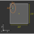
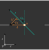
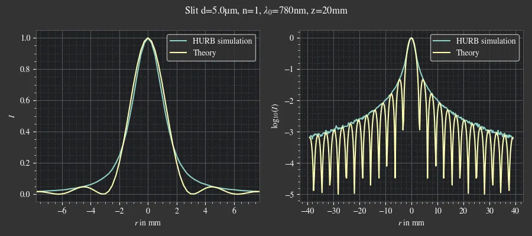

.. _hurb_details:

*************************************
Heisenberg Uncertainty Ray Bending
*************************************

Overview
====================

Heisenberg Uncertainty Ray Bending (HURB), also known as Heisenberg Uncertainty Monte Carlo (HUMC), 
is a statistical method designed to approximate edge diffraction within Monte Carlo raytracing. 
This approach perturbs the direction of rays near aperture edges. 
The magnitude of this directional deviation is determined by the ray's proximity to the edge 
and is governed by the position-momentum uncertainty principle.

The concept of applying this principle to raytracing was initially proposed by 
Heinisch and Chou :footcite:`Heinisch_1971`, with subsequent modifications introduced 
by Likeness :footcite:`Likeness_1977` and Coffey et al. :footcite:`Coffey_1998`. 
Numerous studies have demonstrated HURB's effectiveness in approximating both near-field and far-field 
diffraction phenomena :footcite:`Heinisch_1971, Freniere_2006, Serikov_2001`.

HURB has been implemented in commercial raytracers such as TracePro :footcite:`Freniere_1999`, 
as well as open-source projects like ISET3D :footcite:`Lian_2019`. 
While extensions exist that incorporate the light's phase to model interference effects 
:footcite:`Freniere_2006, Serikov_2001, Yuan_2016`, these are outside the scope of this work.

Directional Distribution
==================================

The principles of position and momentum can be analyzed by separating them into their respective 
:math:`x` and :math:`y` components. 
For the :math:`x`-direction, the uncertainty principle is expressed as :footcite:`Freniere_1999`:

.. math::
   \Delta x \Delta p_x \geq \frac{\hbar}{2}
   :label: eq_hurb_heisenberg_x

In this equation, :math:`\Delta x` represents the distance from the ray to the nearest aperture edge, 
:math:`\Delta p_x` is the momentum uncertainty in the :math:`x`-direction, 
and :math:`\hbar` denotes the reduced Planck constant.

The relative directional uncertainty can be characterized by a tangent relationship :footcite:`Freniere_1999`:

.. math::
   \tan \sigma_x = \frac{\Delta p_x}{p}
   :label: eq_hurb_tan_momentum

Here, :math:`p` is the total momentum, defined as:

.. math::
   p = \hbar k = \hbar \frac{2 \pi}{\lambda} = \frac{n(\lambda_0) h}{\lambda_0}
   :label: eq_hurb_momentum

Substituting Equation :math:numref:`eq_hurb_heisenberg_x` and Equation :math:numref:`eq_hurb_momentum` 
into Equation :math:numref:`eq_hurb_tan_momentum` yields the following expression 
for the tangent of the uncertainty in the :math:`x`-direction:

.. math::
   \tan \sigma_x = \frac{1}{2\Delta x k}
   :label: eq_hurb_tan_x

Similarly, for the :math:`y`-direction, the tangent of the uncertainty is given by:

.. math::
   \tan \sigma_y = \frac{1}{2\Delta y k}
   :label: eq_hurb_tan_y

A key assumption in this model is that the tangent of the perturbed angles, 
:math:`\tan \theta_x` and :math:`\tan \theta_y`, follow a bivariate normal distribution 
with standard deviations :math:`\tan \sigma_x` and :math:`\tan \sigma_y` 
respectively :footcite:`Coffey_1998, Serikov_2001`. The probability density function is therefore:

.. math::
   p\left(\tan \theta_x, \tan \theta_y\right)=\frac{1}{2 \pi \tan \sigma_x \tan \sigma_y}
   \exp\left(-\frac{\tan^2 \theta_x}{2 \tan^2 \sigma_x} -\frac{\tan^2 \theta_y}{2 \tan^2 \sigma_y}\right)

It is worth noting that some authors :footcite:`Heinisch_1971, Freniere_1999`
propose that the angles themselves, rather than their tangents, are normally distributed. 
For small angles, the small angle approximation renders both approaches equivalent. 
However, for larger angles, the tangent-based approach is considered more accurate for two primary reasons:

1.  Using the tangent intrinsically limits the new ray direction to the forward half-space.
2.  From a physical perspective, the uncertainty lies in :math:`\Delta p_x` and :math:`\Delta p_y`. 
    Since momentum :math:`p` is constant, the uncertainty in direction is proportional to the tangent of the angle 
    (as shown in Equation :math:numref:`eq_hurb_tan_momentum`), rather than the angle directly.

Aperture Edge Distances
===================================

**Overview**

The fundamental procedure, as outlined by Heinisch and Chou :footcite:`Heinisch_1971`, 
involves identifying the direction associated with the minimum distance to an aperture edge. 
This shortest distance defines the minor axis of a conceptual distance ellipse. 
Conversely, the major axis of this ellipse is determined
by fitting the largest possible area ellipse within the aperture boundaries.

These ellipse axes will be denoted as :math:`a` and :math:`b`,
and their corresponding uncertainties as :math:`\Delta a` and :math:`\Delta b`.

**Rectangle**

Consider a rectangular aperture with a width of :math:`2B` and a height of :math:`2A`, 
centered at coordinates :math:`(x_0, y_0, z_0)` and orthogonal to the z-axis. 
For a ray traversing the aperture at position :math:`(x, y, z_0)`, 
the distances to the respective edges are given by :footcite:`Freniere_1999`:

.. math::
   \Delta a &= \lvert y - y_0 \rvert - A\\
   \Delta b &= \lvert x - x_0 \rvert - B

   Example for the HURB ellipse inside a rectangle aperture. 
   The ray position is marked in cyan color, the ellipse in orange.

The direction vectors aligned with the edges are equivalent to the unit vectors in the x and y directions:

.. math::
   b = \left(\begin{array}{c}
   1 \\
   0 \\
   0
   \end{array}\right)

.. math::
   a = \left(\begin{array}{c}
   0 \\
   1 \\
   0
   \end{array}\right)

For a rotated rectangular aperture, the ray's position must first be transformed into the rotated rectangle's 
local coordinate system via a rotation operation. 
Conversely, the direction vectors :math:`a` and :math:`b` 
must be converted from the rotated system back into the absolute coordinate system.

**Circle**

For a circular aperture with radius :math:`R` centered at :math:`(x_0, y_0, z_0)`,
the relative polar coordinates of a ray position :math:`(x, y, z_0)` 
within the aperture's coordinate system are defined as:

.. math::
   r &= \sqrt{(x-x_0)^2 + (y-y_0)^2}\\
   \phi &= \text{atan2}(y-y_0, x-x_0)\\

.. figure:: ../images/hurb_circle.svg
   :align: center
   :width: 350
   :class: dark-light

   Example for the HURB ellipse inside a circular aperture.
   The ray position is marked in cyan color, the ellipse in orange.

The minor axis length of the ellipse, :math:`\Delta b`, is determined by the distance from the ray to the circular edge:

.. math::
   \Delta b = R - r

The major axis length, :math:`\Delta a`, is calculated by matching the curvature of the ellipse to that of the aperture. 
This relationship leads to the formula :math:`R = \Delta a^2 / \Delta b` 
(as derived `here <https://math.stackexchange.com/a/4511196>`__), from which :math:`\Delta a` is obtained:

.. math::
   \Delta a = \sqrt{\Delta b R}

The unit vectors defining the directions of these axes are:

.. math::
   b = \left(\begin{array}{c}
   \cos \phi \\
   \sin \phi \\
   0
   \end{array}\right)

.. math::
   a = \left(\begin{array}{c}
   \sin \phi \\
   -\cos \phi \\
   0
   \end{array}\right)

It is noteworthy that the implementation within ISET3D, 
as observed `here <https://github.com/scienstanford/pbrt-v4/blob/master/src/pbrt/cameras.cpp#L2105>`__, 
does not utilize the largest-ellipse approach for defining the major axis. 
Instead, it directly employs the distance to the circular edge as the size of the major ellipse axis. 
Compared to the presented method, this alternative approach results in smaller uncertainties of :math:`\tan \sigma_a`.

New Direction Vectors
==============================

Composing a new direction vector for light propagating perpendicular to the aperture plane is a straightforward process. 
However, this becomes significantly more challenging when considering arbitrary ray angles.

A tilted incident ray effectively "sees" a projected aperture, which introduces several complexities:

* The direction vectors :math:`a` and :math:`b` are no longer orthogonal to the ray's propagation vector :math:`s`.
* The calculated :math:`\Delta a` and :math:`\Delta b` 
  no longer represent the true shortest distances to the aperture edges.
* The actual shortest distance to the aperture edge does not necessarily lie within the aperture plane.
* The vectors representing the actual shortest distances are generally not orthogonal to each other.
* These actual shortest distances can occur at different starting points along the ray's path.

Our current implementation aims to address the first three of these issues. 
We define new orthogonal basis vectors, :math:`a'` and :math:`b'`, relative to the ray's direction vector :math:`s`:

.. math::
   a' &= \frac{b \times s}{\lvert b \times s\rvert}\\
   b' &= \frac{s \times a'}{\lvert s \times a'\rvert}

In this new basis, the vectors :math:`s`, :math:`b`, and :math:`b'` are coplanar, 
and :math:`b'` aligns with the direction of the shortest distance to the aperture edge. 
While :math:`s` and :math:`a'` also lie within a plane, this plane is orthogonal to the one containing :math:`s, b, b'`. 
It is important to note that the original vector :math:`a` generally does not lie within this second plane. 
This non-alignment is a consequence of the fact that the true shortest distances to the aperture edges are typically
not orthogonal to each other in 3D space when the ray is tilted.

   Example for a ray tilted around a passing through a slit. The ray is tilted around :math:`a`, so :math:`a' = a`.

The lengths of the actual shortest distances are adjusted by the cosine of the angles 
between the ray direction and the original axis vectors:

.. math::
   \Delta a' &= \Delta a \cos \psi_a\\
   \Delta b' &= \Delta b \cos \psi_b\\

Here, :math:`\psi_a` and :math:`\psi_b` represent the angles lying in the planes defined by :math:`s, a` 
and :math:`s, b` respectively. 
Assuming :math:`s`, :math:`a`, and :math:`b` are unit vectors,
the cosine terms can be expressed through a dot product,
utilizing the identity :math:`\cos \psi = \sqrt{1 - \sin^2 \psi}`:

.. math::
   \cos \psi_a &= \sqrt{1 - (s \cdot a)^2}\\
   \cos \psi_b &= \sqrt{1 - (s \cdot b)^2}\\

This leads to modified tangent expressions for the directional uncertainties:

.. math::
   \tan \sigma_{a'} &= \frac{1}{2 k \Delta a \cos \psi_a}\\
   \tan \sigma_{b'} &= \frac{1}{2 k \Delta b \cos \psi_b}\\

These modified tangents, :math:`\tan \sigma_{a'}` and :math:`\tan \sigma_{b'}`, 
are then used to determine the values :math:`\tan \theta_{b'}` and :math:`\tan \theta_{a'}`. 
With this approach, the distances :math:`\Delta a'` and :math:`\Delta b'`, as well as the vector :math:`b'`, 
are calculated correctly. 
However, the vector :math:`a'` is generally not entirely accurate due to the non-orthogonality 
of the true shortest distance vectors for tilted rays. 
An exception occurs when the ray is tilted exclusively along the :math:`a` or :math:`b` direction, 
in which case both vectors :math:`a'` and :math:`b'` are correctly determined.

The new perturbed direction vector is constructed by summing the initial ray direction with components scaled 
by :math:`\tan \theta_{b'}` and :math:`\tan \theta_{a'}` along the :math:`b'` and :math:`a'` unit vectors, respectively:

.. math::
   s'_\text{un} = s + b' \tan \theta_{b'} + a' \tan \theta_{a'}

This resultant vector, :math:`s'_\text{un}`, 
must then be normalized to obtain the final perturbed unity direction vector :math:`s'`:

.. math::
   s' = \frac{s'_\text{un}}{\lvert s'_\text{un} \rvert}

The implementation in ISET3D 
(as seen `here <https://github.com/scienstanford/pbrt-v4/blob/master/src/pbrt/cameras.cpp#L2131-L2166>`__) 
constructs the new vector directly from :math:`s`, :math:`a`, and :math:`b`. 
This method can introduce errors for significant ray tilts, 
as the components :math:`a` and :math:`b` are no longer orthogonal to each other in the projected plane.
While our implementation addresses some of the aforementioned issues, 
it does not fully resolve all complexities arising from tilted rays. 
Nevertheless, the residual issues typically manifest noticeably only for rays with large tilt angles, 
as the projection effects exhibit a cosine dependency that can be neglected for small angles.

.. _hurb_uncertainty_factor:

Selecting the Uncertainty Factor
==================================

To provide further parametrization, a scaling factor :math:`\gamma` has been introduced into the uncertainty equations 
:math:numref:`eq_hurb_tan_x` and :math:numref:`eq_hurb_tan_y`. 
The modified equations become:

.. math::
   \tan \sigma_{a'} &= \frac{\gamma}{2 k \Delta a \cos \psi_a}\\
   \tan \sigma_{b'} &= \frac{\gamma}{2 k \Delta b \cos \psi_b}\\
   :label: eq_hurb_tan_custom_uncertainty

Most authors typically employ a value of :math:`\gamma = 1`. 
However, Lin (2015) proposed a scaling factor of :math:`\gamma = \sqrt{2}` (:footcite:`lin2015computational`, page 17) 
to achieve a better fit for diffraction patterns observed at a circular aperture.
This value is also implemented in the PBRT fork used by ISET3D, 
as can be seen `here <https://github.com/scienstanford/pbrt-v4/blob/master/src/pbrt/cameras.cpp#L2114>`__. 
It's worth noting that while these sources might present the fraction 
as :math:`\tan \sigma = \frac{1}{\sqrt{2} \ldots}`, 
this is mathematically equivalent to our formulation of :math:`\tan \sigma = \frac{\gamma}{2\ldots}` 
with :math:`\gamma = \sqrt{2}` in equation :math:numref:`eq_hurb_tan_custom_uncertainty`.

In optrace :math:`\gamma` can be customized via a parameter, as detailed in Section :numref:`hurb_usage`, 
allowing for fine-tuning to specific simulation scenarios. 
By default, optrace uses :math:`\gamma = \sqrt{2}`. 
The results of this parametrization can be found in the subsequent section.

A value of :math:`\gamma = 2` has been observed to provide a superior fit for the main lobe in comparison 
to graphs generated with :math:`\gamma = 1`, which are commonly found in existing literature. 
With :math:`\gamma = 2`, the simulation asymptotically matches the side lobes for slit, pinhole, and pupil geometries. 
Conversely, for edge diffraction, the fit is less optimal, producing more pronounced glare to the left of the edge. 
In such cases, :math:`\gamma = 1` is likely to yield better results.

.. _hurb_comparison:

Comparison to Theoretical Curves
=========================================

The following curves were generated using the test scripts located under ``tests/hurb/``.
All simulations were conducted with an uncertainty factor of :math:`\gamma = \sqrt{2}`.

   Comparison of HURB and the theoretical curve for the far field diffraction of a slit.

.. figure:: ../images/hurb_simulation_pinhole.webp
   :align: center
   :width: 700
   :class: dark-light

   Comparison of HURB and the theoretical curve for the far field diffraction of a pinhole.

.. figure:: ../images/hurb_simulation_lens.webp
   :align: center
   :width: 700
   :class: dark-light

   Comparison of HURB and the theoretical curve for the focus profile of an ideal lens behind a pupil.

.. figure:: ../images/hurb_simulation_edge.webp
   :align: center
   :width: 700
   :class: dark-light

   Comparison of HURB and the theoretical curve for the profile of edge diffraction.

------------

**References**

.. footbibliography::

