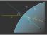

*********************************
Tracing Procedure
*********************************

.. role:: python(code)
  :language: python
  :class: highlight

Tracing Process
========================

The tracing process primarily involves three key steps: 
detecting surface hits, calculating refraction indices and directions, 
and managing rays that do not make contact with a surface. 
For ideal lenses, filters, and apertures, only one instance of surface hit detection is required, 
whereas a standard lens requires two.

Utilizing multiple threads for the majority of tracing tasks significantly enhances computational speed. 
Each thread is assigned a specific set of rays, ensuring that all processing, 
including ray creation and system-wide propagation, occurs exclusively within that thread.

Although not explicitly detailed here, 
the refraction calculation function also computes new ray polarization and weights.

.. figure:: ../images/TracePAP.svg
   :width: 400
   :align: center
   :class: dark-light
   
   Tracing process flowchart.

Refraction
====================

The law of refraction is typically expressed in terms of input and output angles. 
However, for the tracing process, a vector-based formulation is more convenient 
as it avoids the need to calculate any angles directly.

The following figure illustrates the refraction of a ray on a curved surface.

   
   Refraction on a curved interface.

The refractive indices of the media are denoted as :math:`n_1` and :math:`n_2`, 
while :math:`s` and :math:`s'` represent the input and output propagation vectors, respectively. 
It is essential to normalize these vectors, along with the normal vector :math:`n`, to ensure accurate calculations. 
Additionally, :math:`s` and :math:`n` must point in the same half-space direction, 
which is mathematically ensured by the condition :math:`s \cdot n \geq 0`.

An equation for this vector-based formulation of the refraction law can be found in :footcite:`OptikHaferkorn` 
and :footcite:`Greve_2006`:

.. math::
   s^{\prime}=\frac{n_1}{n_2} s-n\left\{\frac{n_1}{n_2}(n s)
              -\sqrt{1-\left(\frac{n_1}{n_2}\right)^{2}\left[1-(n s)^{2}\right]}\right\}
   :label: refraction

In the event of total internal reflection (TIR), the root argument becomes negative. 
In optrace, TIR rays are absorbed since reflections are not modeled within the system. 
When this occurs, the user receives a message to the standard output.

.. _tracing_pol:

Polarization
====================

The following calculations are similar to those described in :footcite:`Yun:11`.

The polarization vector :math:`E` can be decomposed into two components: :math:`E_\text{p}`, 
which lies in the plane formed by the surface normal and the incidence vector, 
and :math:`E_\text{s}`, which is perpendicular to this plane. 
When refraction occurs at an interface, the :math:`E_\text{s}` component remains unchanged for both the incident 
and refracted ray vectors, :math:`s` and :math:`s'`. 
However, the :math:`E_\text{p}` component is rotated around :math:`E_\text{s}` towards :math:`s'`, 
resulting in a new component :math:`E\text{p}'`.

It's important to note that, in our calculations, all vectors are unity vectors. 
The magnitudes of the polarization components are encoded in the scaling factors 
:math:`A_\text{tp}` and :math:`A_\text{ts}`.

.. figure:: ../images/refraction_interface_polarization.svg
   :width: 700
   :align: center
   :class: dark-light

   Ray polarization components before and after refraction.

**Case 1**:

For :math:`s \parallel s'` the new polarization vector is equal to the initial polarization.

**Case 2**

For :math:`s \nparallel s'` the new polarization vector differs.
In optics, the polarization vector and its components are orthogonal to the propagation direction. 
Moreover, the two polarization components are perpendicular to each other.
Given that all vectors mentioned are unity vectors, we can perform the following calculations:

.. math::
    \begin{align}
    E_\text{s} &= \frac{s' \times s}{|| s' \times s ||}\\
    E_\text{p} &= E_\text{s} \times s\\
    E_\text{p}' &= E_\text{s} \times s'\\
    \end{align}
    :label: pol_E

Since :math:`||E_\text{p}|| = ||E_\text{s}|| = ||E|| = 1`, the amplitude components are then:

.. math::
   \begin{align}
        A_\text{tp} &= E_\text{p} \cdot E\\
        A_\text{ts} &= E_\text{s} \cdot E\\
   \end{align}
   :label: pol_A

For the new polarization unity vector, which also composed of two components, we finally get:

.. math::
   E' = A_\text{ps} E_\text{s} + A_\text{tp} E_\text{p}'
   :label: pol_E2

Transmission
====================

The new ray powers are determined by calculating the transmission, 
which can be derived from the properties already established during the refraction calculations.
According to the Fresnel equations, the transmission of light depends on its polarization direction. 
The following equations illustrate this behavior, as detailed in :footcite:`FresnelWiki`.

.. math::
   t_{\mathrm{s}}=\frac{2\, n_{1} \cos \varepsilon}{n_{1} \cos \varepsilon+n_{2} \cos \varepsilon'}
   :label: ts_coeff

.. math::
   t_{\mathrm{p}}=\frac{2\, n_{1} \cos \varepsilon}{n_{2} \cos \varepsilon+n_{1} \cos \varepsilon'}
   :label: tp_coeff

.. math::
   T=\frac{n_{2} \cos \varepsilon'}{n_{1} \cos \varepsilon} \left( (A_\text{ts} t_\text{s})^2 
            + (A_\text{tp} t_\text{p})^2 \right)
   :label: T

The polarization components :math:`A_\text{ts}` and :math:`A_\text{tp}` are obtained 
from equations :math:numref:`pol_A`. 
The cosine terms involved are calculated using the direction and normal vectors as follows: 
:math:`\cos \varepsilon = n \cdot s` and :math:`\cos \varepsilon' = n \cdot s'`.

For light that hits the surface perpendicularly, this results in an expression that is independent of polarization, 
as noted in :footcite:`Kaschke2014`:

.. math::
   T_{\varepsilon=0} = \frac{4 n_1 n_2 }{(n_1 + n_2)^2}
   :label: T_special

Refraction at an Ideal Lens
===========================

A ray with an unnormalized direction vector :math:`s_0` intersects the lens at the point :math:`P = (x_0, y_0, 0)`
on a lens with a focal length :math:`f`. The corresponding point on the focal plane is :math:`P_f = (x_f, y_f, f)`.

According to optics, ideal parallel rays converge at the same position on the focal plane. 
Therefore, a ray with the same direction, but intersecting the lens at the optical axis, 
can be used to determine the position :math:`P_f`.
This is illustrated in :numref:`image_ideal_refraction`.

.. _image_ideal_refraction:

.. figure:: ../images/ideal_refraction.svg
   :width: 500
   :align: center
   :class: dark-light

   Geometry for refraction on an ideal lens.

**Cartesian Representation**

Calculating positions :math:`x_f` and :math:`y_f` is straightforward 
by evaluating the linear ray equations :math:`x(z)` and :math:`y(z)` at :math:`z=f`.

For :math:`x_f`, we have:

.. math::   
   x_f = \frac{s_{0x}}{s_{0z}} f
   :label: refraction_ideal_xf

Similarly, for :math:`y_f`:

.. math::
   y_f = \frac{s_{0y}}{s_{0z}} f
   :label: refraction_ideal_yf

It is important to note that :math:`s_{0z} = 0` is prohibited, 
as all rays are required to have a positive z-direction component.

With the point :math:`P_f` known, the outgoing propagation vector :math:`s_0'` can be calculated as follows:

.. math::
   s_0' = P_f - P = \begin{pmatrix} \frac{s_{0x}}{s_{0z}}f - x_0 \\ \frac{s_{0y}}{s_{0z}}f - y_0 \\ f \end{pmatrix}
   :label: refraction_ideal_s0

Normalizing this vector gives us:

.. math::
   s' = \frac{s_0'}{||s_0'||}
   :label: refraction_ideal_s0_normalized

**Angular Representation**

Consider the x-component of the propagation vector:

.. math::
   s_{0x}' = \frac{s_{0x}}{s_{0z}}f - x_0

Dividing it by :math:`f` yields:

.. math::
   \frac{s_{0x}'}{f} = \frac{s_{0x}}{s_{0z}} - \frac{x_0}{f}

From :numref:`image_ideal_refraction`, it follows that :math:`\tan \varepsilon_x' = \frac{s_{0x}'}{f}` 
and :math:`\tan \varepsilon_x = \frac{s_{0x}}{s_{0z}}`. Therefore, we have:

.. math::
   \tan \varepsilon_x' = \tan \varepsilon_x - \frac{x_0}{f}

Analogously, in the y-direction, we obtain:

.. math::
   \tan \varepsilon_y' = \tan \varepsilon_y - \frac{y_0}{f}

This angular representation is a formulation also found in :footcite:`BRULS2015659`.

Filtering
==================

When passing through a filter, a ray with power :math:`P_i` and wavelength :math:`\lambda_i` 
is attenuated according to the filter's transmission function :math:`T_\text{F}(\lambda)`:

.. math::
   P_{i+1} = 
   \begin{cases}
        P_{i}~ T_\text{F}(\lambda_i) & \text{for}~~ T_\text{F}(\lambda_i) > T_\text{th}\\
        0  & \text{else}\\
   \end{cases}
   :label: eq_filtering

Additionally, ray powers are set to zero if the transmission falls below a specific threshold :math:`T_\text{th}`. 
This approach avoids *ghost rays* that continue to be propagated during raytracing but carry very little power. 
As their contribution to image formation is negligible, absorbing them as soon as possible
helps speed up the tracing process.

As a side note, apertures are also implemented as filters, but with :math:`T_\text{F}(\lambda) = 0` for all wavelengths.

Geometry Checks
==========================

Geometry checks before tracing include:

* All tracing-relevant elements must be within the outline.
* There must be no object collisions.
* Elements must follow a defined, sequential order.
* Ray sources must be available.
* All ray sources must precede all other types of elements.

Collision checks are performed by first sorting the elements and then comparing positions on adjacent surfaces. 
This is implemented by randomly sampling many lateral surface positions 
and checking the correct order of the axial coordinates.
While this method doesn't guarantee the absence of collisions, 
the sequentiality is verified for each ray during raytracing, and warnings are emitted if issues are detected.

Intersection Calculation
============================

Surface Extension
--------------------

To simplify the handling of non-intersecting rays and ensure each ray has the same number of sections, 
the surface is extended so that all rays intersect a surface. 
Gaps on the surface are filled, and the surface edge is extended radially towards infinity. 

An intersection is calculated for the extended surface. 
The ray is marked as hitting or non-hitting based on a surface mask afterwards.

.. figure:: ../images/surface_extension.svg
   :width: 900
   :align: center
   :class: dark-light

   Surface Extension

Intersection of a Ray with a Plane
-----------------------------------

The intersection of all planar surface types (**CircularSurface**, **RectangularSurface**, **RingSurface**) 
as well as the **TiltedSurface** can be computed analytically.
The following definitions hold:

.. math::
   \text{surface normal vector:}~~~~   \vec{n} &= (n_x, n_y, n_z)\\
   \text{surface center vector:}~~~~ \vec{q} &= (x_0, y_0, z_0)\\
   \text{point on ray or surface:}~~~~ \vec{p} &= (x, y, z)\\
   \text{ray support vector:}~~~~ \vec{p_0} &= (x_{0p}, y_{0p}, z_{0p})\\

The surface point normal equation is:

.. math::
   (\vec{p} - \vec{q})\cdot \vec{n} = 0
   :label: plane_normal_eq_intersection

The ray equation in dependence of ray parameter :math:`t` is as follows:

.. math::
   \vec{p} = \vec{p_0} + \vec{s} \cdot t
   :label: line_equation_common

Inserting these equations into each other results in:

.. math::
    (\vec{p_0} + \vec{s}\cdot t_\text{h} - \vec{q}) \cdot \vec{n} = 0
   :label: plane_intersection_formula0

Rearranging provides the ray parameter for the hit position :math:`t_\text{h}` 
for the case where :math:`\vec{s} \cdot \vec{n} \neq 0`:

.. math::
   t_\text{h} = \frac{(\vec{q} - \vec{p_0})\cdot \vec{n}}{\vec{s} \cdot \vec{n}}
   :label: plane_intersection_formula

This result can be inserted into the ray equation to determine the intersection position.
If :math:`\vec{s} \cdot \vec{n} = 0`, the surface normal and ray direction vector are perpendicular. 
If the ray lies in the plane, there are infinite solutions.
If not, there is none.

Intersection of a Ray with a Conic Surface
--------------------------------------------

Intersections with a **ConicSurface** can also be calculated analytically.

.. math::
   \text{Ray support vector:}~~~~   \vec{p} &= (p_x, p_y, p_z)\\
   \text{Ray direction vector:}~~~~ \vec{s} &= (s_x, s_y, s_z)\\
   \text{Center of surface:}~~~~    \vec{q} &= (x_0, y_0, z_0)
   :label: IntersectionAsphere0

Equating the ray equation and the conic section leads to:

.. math::
   p_z + s_z t = z_0 + \frac{\rho r^2}{1 + \sqrt{1-(k+1)\rho^2 r^2}}
   :label: IntersectionAsphere1

The squared radius is:

.. math::
   r^2 = (p_x + s_x t - x_0)^2 + (p_y+s_y t - y_0)^2
   :label: IntersectionAsphere2

Some work in rearranging leads to the following equation, valid for :math:`\rho \neq 0` (conic section is not a plane):

.. math::
   A t^2 + 2 B t + C = 0
   :label: IntersectionAsphere3

With the new parameters:

.. math:: 
   A &= 1 + k s_z^2\\
   B &= o_x s_x + o_y s_y - \frac{s_z}{\rho} + (k+1) o_z s_z\\
   C &= o_x^2 + o_y^2 - 2\frac{o_z}{\rho} + (k+1) o_z^2\\
   \vec{o} &= \vec{p} - \vec{q} = (o_x, o_y, o_z)
   :label: IntersectionAsphere4

The solutions for :math:`t` are (:math:`\rho \neq 0`):

.. math::
   t = 
   \begin{cases}
       \frac{-B \pm \sqrt{B^2 -CA}}{A} & \text{for}~~ A \neq 0, ~~ B^2 - CA \geq 0 \\
       -\frac{C}{2B} & \text{for}~~ A = 0, ~~B \neq 0\\
       \{\mathbb{R}\} & \text{for}~~ A = 0, ~~B = 0, ~~C = 0\\
       \emptyset & \text{else}
   \end{cases}
   :label: IntersectionAsphere5

The first case produces two intersections, while in the second, the ray touches the surface tangentially. 
In the fourth case, there is no intersection. 
In cases one and two, it must be verified whether the intersection lies within the valid radial range of the surface, 
as the conic equation describes the surface for all possible :math:`r`. 
If there are still two valid intersections in the first case, the one with the lower axial position is used. 
The third case is only relevant for rays lying along a linear section of a surface, such as a plane or a cone surface. 
This is further explained below.

Equation :math:numref:`IntersectionAsphere5` yields the same results as described in :footcite:`Boussemaere_2021_8`, 
although in his derivation, the constants :math:`A, B, C` include an additional curvature scaling 
and the factor of 2 is incorporated inside :math:`B`.

In the case of :math:`\rho = 0` (plane) equation :math:numref:`IntersectionAsphere1` simplifies 
to :math:`p_z + s_z t = z_0`, resulting in:

.. math::
   t = 
   \begin{cases}
       - \frac{p_z - z_0}{s_z} & \text{for}~~ s_z \neq 0 \\
       \{\mathbb{R}\} & \text{for}~~ s_z = 0, p_z = z_0\\
       \emptyset & \text{for}~~ s_z = 0,~p_z\neq z_0\\
   \end{cases}
   :label: IntersectionAsphere6

The first case produces exactly one intersection and corresponds to the special case of equation 
:math:numref:`plane_intersection_formula` for :math:`\vec{n} = (0, 0, 1)`. 
In the second case, the ray lies within the plane, resulting in infinite intersection positions. 
In the third case, the ray is parallel but offset from the plane, producing no intersections. 
We enforce :math:`s_z > 0` in our simulator, making only the first case relevant.

For :math:`\rho \rightarrow \infty` and :math:`r \in \mathbb{R}`, the conic section becomes a cone for :math:`k < -1`, 
a line from :math:`z = z_0` to :math:`z \rightarrow \infty` for :math:`k = -1`, 
or a point at :math:`(x_0, y_0, z_0)` for :math:`k > -1`. 
In the first two cases, the conic sections consist of long linear segments. 
Depending on the cases of equation :math:numref:`IntersectionAsphere5`, a ray can intersect once, twice, 
not hit the surface, or lie within it. 
For a point (:math:`k > -1`), there can be no intersection or a single one. 
In the latter case, :math:`B^2 - CA = 0` holds, 
producing a single intersection in the first case of equation :math:numref:`IntersectionAsphere5`.

.. _numerical_hit_find:

Numerical Hit Search
-----------------------

In cases where the asphere equation or arbitrary analytical functions are involved, 
an analytical solution for ray intersection does not exist. 
Therefore, the solution must be approximated numerically and iteratively.

.. math::
   \text{Ray support vector:}~~~~   \vec{p_0} &= (p_x, p_y, p_z)\\
   \text{Ray direction vector:}~~~~ \vec{s} &= (s_x, s_y, s_z)\\
   \text{Point on Ray:}~~~~ \vec{p_t} &= (x_t, y_t, z_t)\\

The ray line equation, depending on the ray parameter :math:`t`, is defined as follows:

.. math::
   \vec{p_t}(t)=\vec{p}_{0}+t \cdot \vec{s}
   :label: pt

The cost function :math:`G` in relation to the surface function :math:`f` is expressed by:

.. math::
   G(t)=z_{t}-f\left(x_{t}, y_{t}\right)
   :label: G

The parameters :math:`x_t, y_t, z_t` are derived from equation :math:numref:`pt`. 
To determine the position of the intersection, the root of the scalar function :math:`G` must be identified. 
Suitable for this task are typical optimization algorithms. However, these algorithms often lack guaranteed convergence. 

To address this issue, the raytracer employs the Regula-Falsi method. 
This method is a straightforward iterative approach that guarantees superlinear convergence 
with only a slight modification. 
This procedure requires the knowledge of an interval containing a root.
As the minimum and maximum extent of the surface in the z-direction are predetermined in the raytracer, 
this requirement is inherently satisfied: 
A hit can only occur within this range. 
The method functions by iteratively reducing the interval containing the function's root. 
A detailed explanation can be found in :footcite:`RegulaFalsiWiki`.

In certain scenarios, the interval size may reduce negligibly across iterations, leading to slow convergence. 
To mitigate this, the process is extended to the Illinois algorithm, which is detailed in :footcite:`IllinoisAlgoWiki`.

The implementation in optrace varies by incorporating parallelization 
and iterating subsequent steps only with rays that have not yet converged to a solution.

Normal Calculation
====================

General
--------------------

Surface normals are required to calculate the refraction, polarization, and transmittance of a ray. 
The equation for an analytical, unnormalized normal vector is presented below, as detailed in :footcite:`NormalWiki`.

.. math::
   \vec{n} = 
   \begin{pmatrix}
        -\frac{\partial z}{\partial x}\\
        -\frac{\partial z}{\partial y}\\
        1\\
   \end{pmatrix}
   :label: normal_general

To use this vector for calculations, it must be normalized:

.. math::
   \vec{n}_0 = \frac{\vec{n}}{|| \vec{n} ||}
   :label: normal_numerical_norm

Planar Surfaces
--------------------

For the surface types **Rectangle**, **Circle**, and **Ring**, 
the normal vector :math:`n` is simply :math:`n = (0, 0, 1)`. 
For the surface type **TiltedSurface**, a user-specified value for :math:`n` is provided, 
which is normalized internally.

Asphere 
---------------------------

The radial derivative of an asphere equation is given by:

.. math::
   m_r = \frac{\partial z}{\partial r} = \frac{\rho r}{\sqrt{1 - (k+1)\rho^2 r^2}} 
        + \sum_{i=1}^{m}  2i \cdot  a_i \cdot r^{2i - 1} = \tan \alpha
   :label: asphere_deriv

This radial component must be rotated around the vector :math:`(0, 0, 1)` by the angle :math:`\phi`. 
According to the general normal vector calculation, 
the x- and y-components of the unnormalized vector are computed as follows:

.. math::
    \frac{\partial z}{\partial x} &= m_r \cos \phi\\
    \frac{\partial z}{\partial y} &= m_r \sin \phi\\
   :label: normal_general_asph

These components can be applied to the equation described above.

Conic Surface
--------------------

The derivative of the conic function represents a simplified case of the asphere scenario,
where polynomial terms are absent:

.. math::
   m_r = \frac{\rho r}{\sqrt{1 - (k+1)\rho^2 r^2}}
   :label: conic_derivative

Here, :math:`m_r` is equivalent to :math:`\tan \alpha`, the tangent of the angle between the surface normal 
and the vector :math:`(0, 0, 1)`. 
Using geometrical relations, one can derive :math:`\sin \alpha`,
which leads to the radial component :math:`n_r` of the normalized normal vector:

.. math::
   n_r = -\sin{\alpha} = -\frac{m_r}{\sqrt{m_r^2+1}} = -\frac{\rho r}{\sqrt{1- k\rho^2 r^2}}
   :label: conic_nr

The normalized vector :math:`n` for the **ConicSurface** is expressed as follows:

.. math::
   \vec{n} = 
   \begin{pmatrix}
      n_r \cos \phi\\
      n_r \sin \phi\\
      \sqrt{1- n_r^2}
   \end{pmatrix}
   :label: conic_n

For a **SphericalSurface**, this expression simplifies further to:

.. math::
   \vec{n} = 
   \begin{pmatrix}
        -\rho r \cos \phi \\
        -\rho {}r \sin \phi\\
        \sqrt{ 1 - \rho^2 r^2}\\
   \end{pmatrix}
   :label: sphere_n

FunctionSurface
--------------------

For the surface types **FunctionSurface1D** and **FunctionSurface2D**, 
the derivatives required for constructing the normal vector are typically calculated numerically. 
An exception to this arises when a derivative function is directly provided to the object.

The central first derivative has the form:

.. math::
   f'(x) = \frac{f(x+\varepsilon) - f(x-\varepsilon)}{2 \varepsilon}
   :label: central_first_deric

For partial surface derivatives, the expressions are approximately given by:

.. math::
    \frac{\partial z}{\partial x} &\approx \frac{z(x + \varepsilon, ~y) - z(x - \varepsilon, ~y)}{2\varepsilon}\\
    \frac{\partial z}{\partial y} &\approx \frac{z(x, ~y + \varepsilon) - z(x, ~y - \varepsilon)}{2\varepsilon}\\

For a **FunctionSurface1D**, both derivatives are the same due to symmetry, so only a single value needs to be computed. 
The step width :math:`\varepsilon` is selected as the maximum of the optimal step width :math:`\varepsilon_\text{o}`
and the minimal positional step width :math:`\varepsilon_\text{p}`:

.. math::
   \varepsilon = \max (\varepsilon_\text{o}, ~\varepsilon_\text{n})
   :label: eps_selection

The optimal step width, as derived from :footcite:`DiffIntMorken`, is given by:

.. math::
   \varepsilon_\text{o} = \sqrt[3]{3 \varepsilon_\text{f} \left| \frac{f(x)}{f^{(3)}(x)} \right|} 
   :label: optimal_step_width

Here, :math:`\varepsilon_\text{f}` represents the machine precision for the floating-point type being utilized. 
Under the assumption of predominantly spherical surfaces, the primary function component is :math:`x^2`. 
Higher polynomial orders are less significant, a reasonable assumption 
is :math:`\left| \frac{f(x)}{f^{(3)}(x)} \right| = 50`. 

Although this may vary for different functions, due to the influence of the cube root, 
a quotient 1000 times larger modifies :math:`\varepsilon_\text{o}` by only about a factor of :math:`10`. 
With a 64-bit floating-point number, where :math:`\varepsilon_\text{f} \approx 2.22 \times 10^{-16}`, 
the result is :math:`\varepsilon_\text{o} \approx 3.22 \times 10^{-5}`.
Since optrace units are measured in millimeters, this corresponds to :math:`32.2\,` nm.

In order to ensure that numerical differences in :math:`f` are not only representable, 
but also that :math:`x + \varepsilon` is distinct from :math:`x`, 
it is essential to satisfy the condition :math:`x + \varepsilon > x (1 + \varepsilon_\text{f})` 
for every coordinate :math:`x` on the surface.

Given :math:`r_\text{max}` as the maximum absolute distance on the surface, the minimal bound can be expressed as:

.. math::
   \varepsilon_\text{p} = r_\text{max} ~\varepsilon_\text{f}
   :label: machine_eps_scaling

It is advisable to center the surface at :math:`r = 0` prior to differentiation to minimize :math:`r_\text{max}`.

DataSurface
----------------------------

A `DataSurface` object utilizes the :class:`scipy.interpolate.InterpolatedUnivariateSpline` (FunctionSurface1D) 
or the :class:`scipy.interpolate.RectBivariateSpline` (FunctionSurface2D) to interpolate surface values.
To ensure smooth curvature transitions, an interpolation order of :python:`k=4` is applied in all lateral dimensions.

By invoking the spline objects with :meth:`scipy.interpolate.InterpolatedUnivariateSpline.__call__` 
or :meth:`scipy.interpolate.RectBivariateSpline.__call__`, it is possible to specify a derivative parameter,
enabling the output of surface derivatives.
These derivatives can then be used to compute surface normals, as described in the methods discussed earlier.

It is important to note that due to the nature of interpolation, 
the minimum and maximum surface values may exceed the specified data range. 
A warning informs the user about the occurence of large deviations.

------------

**References**

.. footbibliography::

