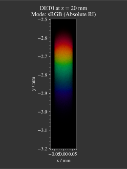
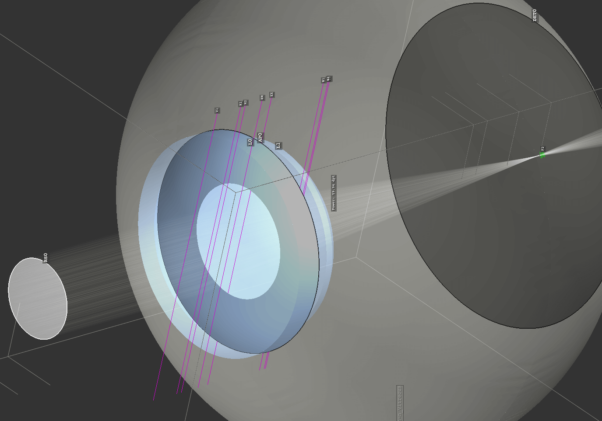
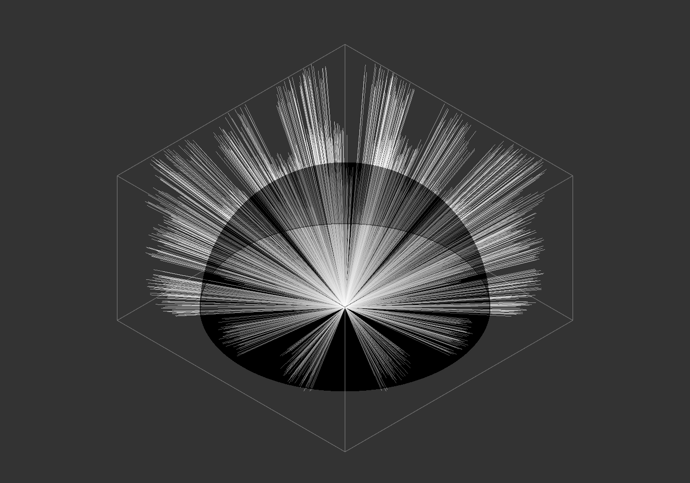

.. _examples:

################
Example Gallery
################

Achromat
----------------------

**File**: ``examples/achromat.py``

**Description**: This example demonstrates the effect of an achromatic doublet on the dispersion. Ray sources consist of different monochromatic spectral lines to show the different focal lengths. Inside the script the chromatic correction can be turned off to make it comparable to the normal case.

**Screenshots**:

.. figure:: ./images/example_achromat1.png
   :width: 600
   :align: center

.. figure:: ./images/example_achromat2.png
   :width: 600
   :align: center

Arizona Eye Model
----------------------

**File**: ``examples/arizona_eye_model.py``

**Description**: Demonstration of human eye vision for an adaption at a resolution chart at distance 66 cm. The arizona eye model is used with the matching adaptation. In the rendered image a slight blur and chromatic dispersion can be seen.

**Screenshots**:

.. figure:: images/arizona_eye_scene.png
   :align: center
   :width: 600

.. list-table::

   * - .. figure:: images/example_arizona_render1.svg
          :width: 400
          :align: center
   
     - .. figure:: images/example_arizona_render2.svg
          :width: 400
          :align: center

Astigmatism
----------------------

**File**: ``examples/astigmatism.py``

**Description**: With saggital and meridional ray beams we can show the different focal point positions because of rotational asymmetry for non-parallel light. 

**Screenshots**:

.. figure:: ./images/example_astigmatism1.png
   :width: 600
   :align: center

.. figure:: ./images/example_astigmatism2.png
   :width: 600
   :align: center

Brewster Polarizer
----------------------

**File**: ``examples/brewster_polarizer.py``

**Description**: A setup with three different light rays impinging on multiple planar surfaces with an incident angle equal to the brewster angle. Depending on the polarization direction we can see a huge difference in the light's transmission.

**Screenshots**:

.. figure:: images/example_brewster.png
   :align: center
   :width: 600

Cosine Surfaces
----------------------

**File**: ``examples/cosine_surfaces.py``

**Description**: An example with two lenses with orthogonal cosine modulations on each side. Creates squary, caleidoscope-like images inside the beam path.

**Screenshots**:

.. figure:: ./images/example_cosine_surfaces1.png
   :width: 600
   :align: center

.. list-table::

   * - .. figure:: ./images/example_cosine_surfaces2.svg
          :align: center
          :width: 400

     - .. figure:: ./images/example_cosine_surfaces3.svg     
          :align: center
          :width: 400

Custom Surfaces
----------------------

**File**: ``examples/custom_surfaces.py``

**Description**: An example with custom surfaces of DataSurface and FunctionSurface type, as wells as a filter with a custom transmission spectrum.

**Screenshots**:

.. figure:: images/example_custom_surfaces.png
   :align: center
   :width: 600

Double Gauss
----------------------

**File**: ``examples/double_gauss.py``

**Description**: Example of the double gauss, Nikkor Wakamiya, 100mm, f1.4, objective. Point sources at -50m are traced through the setup and a PSF can be rendered.                

**Screenshots**:

.. figure:: images/example_double_gauss.png
   :align: center
   :width: 600

.. list-table::

   * - .. figure:: ./images/example_double_gauss2.svg
          :align: center
          :width: 400

     - .. figure:: ./images/example_double_gauss3.svg
          :align: center
          :width: 400

Double Prism
----------------------

**File**: ``examples/double_prism.py``

**Description**: A double prism setup dividing the source light spectrum into its components.

**Screenshots**:

.. figure:: ./images/color_dispersive1.svg
   :width: 500
   :align: center
.. figure:: ./images/color_dispersive2.svg
   :width: 500
   :align: center

LeGrand Eye Model
----------------------

**File**: ``examples/legrand_eye_model.py``

**Description**: A geometry with the paraxial eye model, where the cardinal points and pupils are marked.

**Screenshots**:

.. figure:: images/example_legrand1.png
   :width: 600
   :align: center

Image Render
----------------------

**File**: ``examples/image_render.py``

**Description**: A simple imaging system consisting of one lens. Suitable example to showcase the effect of spherical aberration, distortion and vignetting.

**Screenshots**:

.. figure:: images/example_image_rgb.png
   :width: 600
   :align: center

.. list-table::

   * - .. figure:: ./images/rgb_render_srgb1.svg
          :align: center
          :width: 400

     - .. figure:: ./images/rgb_render_lightness.svg
          :align: center
          :width: 400
     
   * - .. figure:: ./images/rgb_render_hue.svg
          :align: center
          :width: 400
    
     - .. figure:: ./images/rgb_render_illuminance.svg
          :align: center
          :width: 400
     

Image Render Many Rays
-------------------------

**File**: ``examples/image_render_many_rays.py``

**Description**: Same as the ``image_render.py`` example, but instead of starting the GUI the geometry is traced with many rays and images are rendered in different distances.

**Screenshots**:

.. list-table::

   * - .. figure:: images/example_rgb_render1.svg
          :align: center
          :width: 400

     - .. figure:: images/example_rgb_render2.svg
          :align: center
          :width: 400

   * - .. figure:: images/example_rgb_render3.svg
          :align: center
          :width: 400

     - .. figure:: images/example_rgb_render4.svg
          :align: center
          :width: 400

Microscope
----------------------

**File**: ``examples/microscope.py``

**Description**: A more complex setup with a objective and eyepiece group as well as the human eye as imaging system. Both microscope groups are carried out as achromatic doublets with aspheric surfaces. The ray source consists of a cell image and two detectors (for a tubus image and a retina image).
 
**Screenshots**:

.. figure:: images/raytracer_geometry_example.png
   :width: 100%
   :align: center

.. list-table::

   * - .. figure:: images/example_microscope1.svg
          :width: 400
          :align: center

     - .. figure:: images/example_microscope2.svg
          :width: 400
          :align: center

PSF Imaging
----------------------

**File**: ``examples/psf_imaging.py``

**Description**: Demonstrates image forming by convolution for a resolution chart and a halo PSF.

**Screenshots**:

.. list-table::

   * - .. figure:: ./images/example_psf1.svg
          :align: center
          :width: 400

   
     - .. figure:: ./images/example_psf2.svg
          :align: center
          :width: 400

.. figure:: ./images/example_psf3.svg
   :align: center
   :width: 400

Refraction Index Presets
--------------------------

**File**: ``examples/refraction_index_presets.py``

**Description**: An example loading different refractive index plots.

**Screenshots**:

.. list-table::

   * - .. figure:: ./images/glass_presets_n.svg
          :width: 400
          :align: center

     - .. figure:: ./images/glass_presets_V.svg
          :width: 400
          :align: center

   * - .. figure:: ./images/plastics_presets_n.svg
          :width: 400
          :align: center

     - .. figure:: ./images/plastics_presets_V.svg
          :width: 400
          :align: center

   * - .. figure:: ./images/misc_presets_n.svg
          :width: 400
          :align: center

     - .. figure:: ./images/misc_presets_V.svg
          :width: 400
          :align: center

Spectrum Presets
----------------------

**File**: ``examples/spectrum_presets.py``

**Description**: An example loading multiple light spectrum plots, including the sRGB primaries and standard illuminants.

**Screenshots**:

.. list-table::

   * - .. figure:: ./images/Standard_illuminants.svg
          :width: 400
          :align: center
  
     - .. figure:: ./images/LED_illuminants.svg
          :width: 400
          :align: center
   
   * - .. figure:: ./images/Fluor_illuminants.svg
          :width: 400
          :align: center
  
     - .. figure:: ./images/srgb_spectrum.svg
          :width: 400
          :align: center

.. figure:: ./images/cie_cmf.svg
   :width: 400
   :align: center

  

Sphere Projections
----------------------

**File**: ``examples/sphere_projections.py``

**Description**: This script demonstrates the effect of different projections methods for a spherical surface detector. There are multiple same power cone sources that illuminate the spherical area and display a Tissot indicatrix in the detector view.

**Screenshots**:

.. list-table::

   * - .. figure:: ./images/indicatrix_equidistant.svg
          :align: center
          :width: 300

     - .. figure:: ./images/indicatrix_equal_area.svg
          :align: center
          :width: 300

   * - .. figure:: ./images/indicatrix_stereographic.svg
          :align: center
          :width: 300

     - .. figure:: ./images/indicatrix_orthographic.svg
          :align: center
          :width: 300

Spherical Aberration
----------------------

**File**: ``examples/spherical_aberration.py``

**Description**: The example used as quickstart script. Showcases the refractive error of a spherical sources by tracing a paraxial and a normal light beam for comparison.

**Screenshots**:

.. figure:: images/example_spherical_aberration1.png
   :align: center
   :width: 600

.. figure:: images/example_spherical_aberration2.png
   :align: center
   :width: 600

