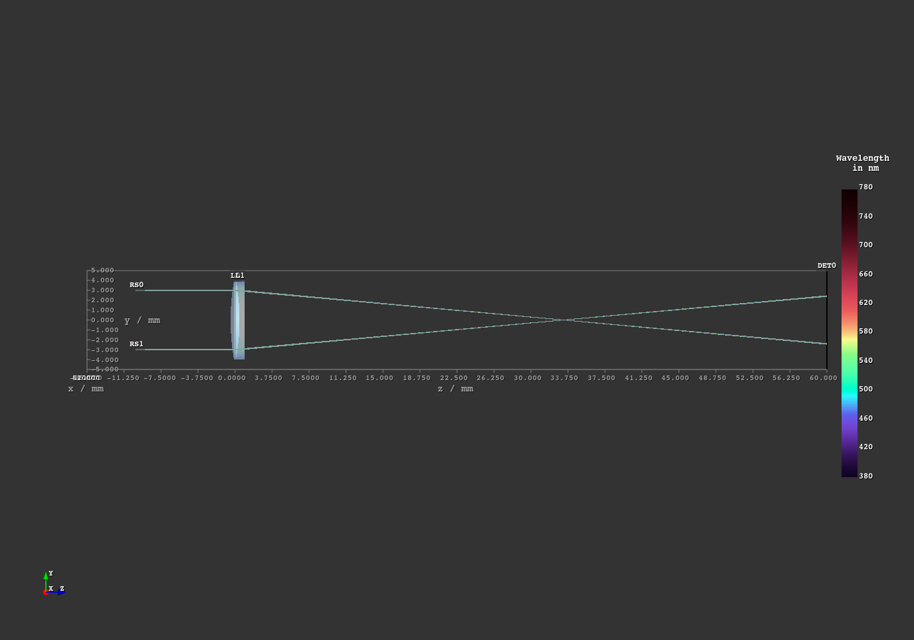

.. _examples:

################
Example Gallery
################

This gallery showcases all optrace examples.

You can download the full examples.zip archive `here <https://github.com/drocheam/optrace/releases/latest/download/examples.zip>`__.

.. _example_achromat:

Achromat
----------------------

**File**: `examples/achromat.py <https://github.com/drocheam/optrace/blob/main/examples/achromat.py>`_

**Description**: This example demonstrates the effect of an achromatic doublet on the dispersion. Ray sources consist of different monochromatic spectral lines to show the different focal lengths. The chromatic correction can be turned off inside the script to compare it to the uncorrected case.

**Screenshots**:

.. figure:: ./images/example_achromat2.png
   :width: 720
   :align: center
   :class: dark-light

.. _example_arizona_eye_model:

Arizona Eye Model
----------------------

**File**: `examples/arizona_eye_model.py <https://github.com/drocheam/optrace/blob/main/examples/arizona_eye_model.py>`_

**Description**: Demonstration of human eye vision with adaptation at a distance of 66 cm. The arizona eye model is employed to simulate a resolution chart. In the rendered image a slight blur and chromatic dispersion is found.

**Screenshots**:

.. figure:: images/example_arizona_eye_scene.png
   :align: center
   :width: 720
   :class: dark-light

.. list-table::
   :class: table-borderless

   * - .. figure:: images/example_arizona_render1.svg
          :width: 400
          :align: center
          :class: dark-light

   
     - .. figure:: images/example_arizona_render2.svg
          :width: 400
          :align: center
          :class: dark-light

.. _example_astigmatism:

Astigmatism
----------------------

**File**: `examples/astigmatism.py <https://github.com/drocheam/optrace/blob/main/examples/astigmatism.py>`_

**Description**: Astigmatism is demonstrated by using sagittal and meridional ray beams and non-parallel light. 

**Screenshots**:

.. figure:: ./images/example_astigmatism1.png
   :width: 720
   :align: center
   :class: dark-light

.. _example_brewster_polarizer:

Brewster Polarizer
----------------------

**File**: `examples/brewster_polarizer.py <https://github.com/drocheam/optrace/blob/main/examples/brewster_polarizer.py>`_

**Description**: A setup with three different light rays impinging on multiple planar surfaces with an incident angle equal to the brewster angle. Depending on the polarization direction we can see a huge difference in the light's transmission.

**Screenshots**:

.. figure:: images/example_brewster.png
   :align: center
   :width: 720
   :class: dark-light

.. _example_cosine_surfaces:

Cosine Surfaces
----------------------

**File**: `examples/cosine_surfaces.py <https://github.com/drocheam/optrace/blob/main/examples/cosine_surfaces.py>`_

**Description**: An example with two lenses with orthogonal cosine modulations on each side. Creates rectangular, kaleidoscope-like images inside the beam path.

**Screenshots**:

.. figure:: ./images/example_cosine_surfaces1.png
   :width: 720
   :align: center
   :class: dark-light

.. list-table::
   :class: table-borderless

   * - .. figure:: ./images/example_cosine_surfaces2.svg
          :align: center
          :width: 400
          :class: dark-light

     - .. figure:: ./images/example_cosine_surfaces3.svg     
          :align: center
          :width: 400
          :class: dark-light

.. _example_double_gauss:

Double Gauss
----------------------

**File**: `examples/double_gauss.py <https://github.com/drocheam/optrace/blob/main/examples/double_gauss.py>`_

**Description**: Example of the double gauss Nikkor Wakamiya, 100mm, f1.4 objective. The simulation traces point sources from a distance of -50m and renders their PSF.                

**Screenshots**:

.. figure:: images/example_double_gauss.png
   :align: center
   :width: 720

.. list-table::
   :class: table-borderless

   * - .. figure:: ./images/example_double_gauss2.svg
          :align: center
          :width: 400
          :class: dark-light

     - .. figure:: ./images/example_double_gauss3.svg
          :align: center
          :width: 400
          :class: dark-light

.. _example_gui_automation:

GUI Automation
----------------------

**File**: `examples/gui_automation.py <https://github.com/drocheam/optrace/blob/main/examples/gui_automation.py>`_

**Description**: An example on GUI automation. Position and size of a line source are varied, which illuminates a sphere lens.

**Screenshots**:

.. list-table::
   :class: table-borderless

   * - .. figure:: ./images/example_gui_automation_1.png
          :align: center
          :width: 400
          :class: dark-light

     - .. figure:: ./images/example_gui_automation_2.png
          :align: center
          :width: 400
          :class: dark-light
     
.. _example_legrand_eye_model:

LeGrand Eye Model
----------------------

**File**: `examples/legrand_eye_model.py <https://github.com/drocheam/optrace/blob/main/examples/legrand_eye_model.py>`_

**Description**: A geometry with the paraxial LeGrand eye model. Cardinal points, exit and entrance pupils are marked inside the scene.

**Screenshots**:

.. figure:: images/example_legrand1.png
   :width: 720
   :align: center
   :class: dark-light

.. figure:: images/example_legrand2.png
   :width: 720
   :align: center
   :class: dark-light

.. _example_image_render:

Image Render
----------------------

**File**: `examples/image_render.py <https://github.com/drocheam/optrace/blob/main/examples/image_render.py>`_

**Description**: A simple imaging system consisting of a single lens. Spherical aberration, distortion and vignetting are apparent.

**Screenshots**:

.. list-table::
   :class: table-borderless

   * - .. figure:: ./images/rgb_render_srgb1.svg
          :align: center
          :width: 400
          :class: dark-light

     - .. figure:: ./images/rgb_render_lightness.svg
          :align: center
          :width: 400
          :class: dark-light
     
   * - .. figure:: ./images/rgb_render_hue.svg
          :align: center
          :width: 400
          :class: dark-light
    
     - .. figure:: ./images/rgb_render_illuminance.svg
          :align: center
          :width: 400
          :class: dark-light
     
.. _example_image_render_many_rays:

Image Render Many Rays
-------------------------

**File**: `examples/image_render_many_rays.py <https://github.com/drocheam/optrace/blob/main/examples/image_render_many_rays.py>`_

**Description**: Comparable to the :ref:`example_image_render` example. Same lens setup, but it is traced with many more rays by using the iterative render functionality. This is done for multiple image distances and without needing to start a GUI.

**Screenshots**:

.. list-table::
   :class: table-borderless

   * - .. figure:: images/example_rgb_render1.svg
          :align: center
          :width: 400
          :class: dark-light

     - .. figure:: images/example_rgb_render2.svg
          :align: center
          :width: 400
          :class: dark-light

   * - .. figure:: images/example_rgb_render3.svg
          :align: center
          :width: 400
          :class: dark-light

     - .. figure:: images/example_rgb_render4.svg
          :align: center
          :width: 400
          :class: dark-light

.. _example_iol_pinhole_imaging:

IOL Pinhole Imaging
-------------------------

**File**: `examples/IOL_pinhole_imaging.py <https://github.com/drocheam/optrace/blob/main/examples/IOL_pinhole_imaging.py>`_

**Description**: Simulation of an intraocular lens (IOL) in the Arizona Eye Model. A pinhole is rendered for three different viewing distances. 
For more details see the publication *Damian Mendroch, Stefan Altmeyer, Uwe Oberheide; „Polychromatic Virtual Retinal Imaging of Two Extended-Depth-of-Focus Intraocular Lenses“. Trans. Vis. Sci. Tech. 2025*.

**Screenshots**:

.. list-table::
   :class: table-borderless

   * - .. figure:: images/example_IOL_0D.svg
          :align: center
          :width: 300
          :class: dark-light

     - .. figure:: images/example_IOL_075D.svg
          :align: center
          :width: 300
          :class: dark-light

     - .. figure:: images/example_IOL_150D.svg
          :align: center
          :width: 300
          :class: dark-light

.. _example_keratoconus:

Keratoconus
----------------------

**File**: `examples/keratoconus.py <https://github.com/drocheam/optrace/blob/main/examples/keratoconus.py>`_

**Description**: A simulation of vision through a patient's eye with progressing levels of keratoconus. Parameters are taken from the work of `Tan et al. (2008) <https://jov.arvojournals.org/article.aspx?articleid=2158188>`__.

**Screenshots**:

.. list-table::
   :class: table-borderless

   * - .. figure:: ./images/example_keratoconus_1.svg
          :align: center
          :width: 400
          :class: dark-light

     - .. figure:: ./images/example_keratoconus_2.svg
          :align: center
          :width: 400
          :class: dark-light
     
   * - .. figure:: ./images/example_keratoconus_3.svg
          :align: center
          :width: 400
          :class: dark-light
    
     - .. figure:: ./images/example_keratoconus_4.svg
          :align: center
          :width: 400
          :class: dark-light

.. _example_microscope:

Microscope
----------------------

**File**: `examples/microscope.py <https://github.com/drocheam/optrace/blob/main/examples/microscope.py>`_

**Description**: A more complex setup with a objective, tubus and eyepiece group as well as the human eye as imaging system. 
The infinity corrected microscope is loaded in multiple parts from ZEMAX (.zmx) files that are were built from patent data.

**Screenshots**:

.. figure:: images/example_microscope0.png
   :width: 100%
   :align: center
   :class: dark-light

.. list-table::
   :class: table-borderless

   * - .. figure:: images/example_microscope1.svg
          :width: 400
          :align: center
          :class: dark-light

     - .. figure:: images/example_microscope2.svg
          :width: 400
          :align: center
          :class: dark-light

.. _example_prism:

Prism
----------------------

**File**: `examples/prism.py <https://github.com/drocheam/optrace/blob/main/examples/prism.py>`_

**Description**: A prism that splits the light spectrum into its spectral components.

**Screenshots**:

.. list-table::
   :class: table-borderless

   * - .. figure:: ./images/color_dispersive1.svg
          :width: 400
          :align: center
          :class: dark-light

     - .. figure:: ./images/color_dispersive2.svg
          :width: 400
          :align: center
          :class: dark-light

     - .. figure:: ./images/color_dispersive3.svg
          :width: 400
          :align: center
          :class: dark-light

.. _example_psf_imaging:

PSF Imaging
----------------------

**File**: `examples/psf_imaging.py <https://github.com/drocheam/optrace/blob/main/examples/psf_imaging.py>`_

**Description**: Demonstrates image formation by convolution of a resolution chart and a halo PSF.

**Screenshots**:

.. list-table::
   :class: table-borderless

   * - .. figure:: ./images/example_psf1.svg
          :align: center
          :width: 400
          :class: dark-light

   
     - .. figure:: ./images/example_psf2.svg
          :align: center
          :width: 400
          :class: dark-light

.. figure:: ./images/example_psf3.svg
   :align: center
   :width: 400
   :class: dark-light

.. _example_refraction_index_presets:

Refraction Index Presets
--------------------------

**File**: `examples/refraction_index_presets.py <https://github.com/drocheam/optrace/blob/main/examples/refraction_index_presets.py>`_

**Description**: This example displays different plots for the refraction index presets.

**Screenshots**:

.. list-table::
   :class: table-borderless

   * - .. figure:: ./images/glass_presets_n.svg
          :width: 400
          :align: center
          :class: dark-light

     - .. figure:: ./images/glass_presets_V.svg
          :width: 400
          :align: center
          :class: dark-light

   * - .. figure:: ./images/plastics_presets_n.svg
          :width: 400
          :align: center
          :class: dark-light

     - .. figure:: ./images/plastics_presets_V.svg
          :width: 400
          :align: center
          :class: dark-light

   * - .. figure:: ./images/misc_presets_n.svg
          :width: 400
          :align: center
          :class: dark-light

     - .. figure:: ./images/misc_presets_V.svg
          :width: 400
          :align: center
          :class: dark-light

.. _example_spectrum_presets:

Spectrum Presets
----------------------

**File**: `examples/spectrum_presets.py <https://github.com/drocheam/optrace/blob/main/examples/spectrum_presets.py>`_

**Description**: An example loading multiple light spectrum plots, including the sRGB primaries and standard illuminants.

**Screenshots**:

.. list-table::
   :class: table-borderless

   * - .. figure:: ./images/Standard_illuminants.svg
          :width: 400
          :align: center
          :class: dark-light
  
     - .. figure:: ./images/LED_illuminants.svg
          :width: 400
          :align: center
          :class: dark-light
   
   * - .. figure:: ./images/Fluor_illuminants.svg
          :width: 400
          :align: center
          :class: dark-light
  
     - .. figure:: ./images/srgb_spectrum.svg
          :width: 400
          :align: center
          :class: dark-light

.. figure:: ./images/cie_cmf.svg
   :width: 400
   :align: center
   :class: dark-light

.. _example_sphere_projections:

Sphere Projections
----------------------

**File**: `examples/sphere_projections.py <https://github.com/drocheam/optrace/blob/main/examples/sphere_projections.py>`_

**Description**: This script demonstrates the effect of different projections methods for a spherical surface detector. Multiple point sources emit an angular cone spectrum and illuminate a spherical detector. The detector view then displays an equivalent of a Tissot's indicatrix.

**Screenshots**:

.. figure:: images/example_sphere_projections.png
   :align: center
   :width: 720
   :class: dark-light

.. list-table::
   :class: table-borderless

   * - .. figure:: ./images/indicatrix_equidistant.svg
          :align: center
          :width: 400
          :class: dark-light

     - .. figure:: ./images/indicatrix_equal_area.svg
          :align: center
          :width: 400
          :class: dark-light

   * - .. figure:: ./images/indicatrix_stereographic.svg
          :align: center
          :width: 400
          :class: dark-light

     - .. figure:: ./images/indicatrix_orthographic.svg
          :align: center
          :width: 400
          :class: dark-light

.. _example_spherical_aberration:

Spherical Aberration
----------------------

**File**: `examples/spherical_aberration.py <https://github.com/drocheam/optrace/blob/main/examples/spherical_aberration.py>`_

**Description**: The example demonstrates the refractive error of a spherical sources by tracing a paraxial and a normal light beam for comparison. This example is suited as a quickstart example, as it includes many explanations.

**Screenshots**:

.. figure:: images/example_spherical_aberration1.png
   :align: center
   :width: 720
   :class: dark-light

.. figure:: images/example_spherical_aberration2.png
   :align: center
   :width: 720
   :class: dark-light

