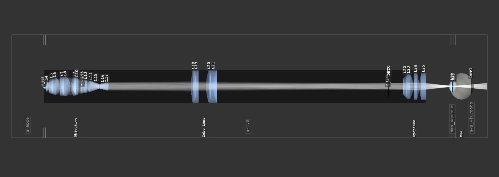

.. _examples:

################
Example Gallery
################

| This gallery showcases all optrace examples.
| You can download the full examples.zip archive `here <https://github.com/drocheam/optrace/releases/latest/download/examples.zip>`__.

.. _example_achromat:

Achromat
----------------------

**File**: `examples/achromat.py <https://github.com/drocheam/optrace/blob/main/examples/achromat.py>`_

This example demonstrates the effect of an `achromatic doublet <https://en.wikipedia.org/wiki/Achromatic_lens>`__ on the dispersion. 
Ray sources consist of different monochromatic spectral lines to show the different focal lengths.
The "Use achromatic doublet" option in the "Custom" GUI tab toggles the use of this doublet.
In the unchecked case a standard doublet with same optical power of 30 D is simulated, showing significant longitudinal chromatic aberration (LCA).

.. figure:: ./images/example_achromat1.png
   :width: 720
   :align: center
   :class: dark-light

   Overview of the scene

.. figure:: ./images/example_achromat2.png
   :width: 720
   :align: center
   :class: dark-light

   Uncorrected case with 1.06 D difference in optical power between blue and red.

.. figure:: ./images/example_achromat3.png
   :width: 720
   :align: center
   :class: dark-light

   The achromatic doublet reduces the LCA to just 0.03 D.

.. _example_arizona_eye_model:

Arizona Eye Model
----------------------

**File**: `examples/arizona_eye_model.py <https://github.com/drocheam/optrace/blob/main/examples/arizona_eye_model.py>`_

This example is a demonstration of human eye vision with adaptation at a distance of 66 cm. 
The `Arizona eye model <https://support.photonengr.com/article/154-arizona-eye-model>`__ is employed to simulate a resolution chart.
This eye model accurately matches on- and off-axis aberration levels from clinical data and accounts for wavelength and adaptation dependencies. 

In the "Custom" tab of the GUI there are options available to change the pupil diameter and adaptation of the eye.

.. figure:: images/example_arizona_eye_scene.png
   :align: center
   :width: 720
   :class: dark-light

   The Arizona eye model inside the raytracer.

.. list-table:: Original resolution chart (left) at 66cm distance imaged with the correctly adapted eye with 1.67 D and a pupil of 4mm diameter (right).
   :class: table-borderless

   * - .. figure:: images/example_arizona_render1.webp
          :width: 450
          :align: center
          :class: dark-light

   
     - .. figure:: images/example_arizona_render2.webp
          :width: 450
          :align: center
          :class: dark-light

.. list-table:: Eye adapted with 0.0 D and a 2 mm pupil (left) and a 6 mm pupil (right)
   :class: table-borderless

   * - .. figure:: images/example_arizona_render3.webp
          :width: 450
          :align: center
          :class: dark-light

   
     - .. figure:: images/example_arizona_render4.webp
          :width: 450
          :align: center
          :class: dark-light

.. _example_astigmatism:

Astigmatism
----------------------

**File**: `examples/astigmatism.py <https://github.com/drocheam/optrace/blob/main/examples/astigmatism.py>`_

This script showcases astigmatism by simulating sagittal and meridional off-axis rays.
You can control their angle by changing their setting in the "Custom" Tab in the GUI.
Sagittal (blue) and meridional (red) rays are highlighted in different colors, making their focal positions easier to visualize.

   On-axis case

.. figure:: ./images/example_astigmatism1.png
   :width: 720
   :align: center
   :class: dark-light
   
   Off-axis case

.. figure:: ./images/example_astigmatism2.png
   :width: 720
   :align: center
   :class: dark-light
   
   Off-axis case, zoomed in

.. _example_brewster_polarizer:

Brewster Polarizer
----------------------

**File**: `examples/brewster_polarizer.py <https://github.com/drocheam/optrace/blob/main/examples/brewster_polarizer.py>`_

A setup with three different light rays impinging on multiple planar surfaces with an incident angle equal to the `Brewster angle <https://en.wikipedia.org/wiki/Brewster%27s_angle>`__. 
Depending on the polarization direction we can see a huge difference in the light's transmission.

.. figure:: images/example_brewster.png
   :align: center
   :width: 720
   :class: dark-light

   Brewster angle demonstration.

.. _example_cosine_surfaces:

Cosine Surfaces
----------------------

**File**: `examples/cosine_surfaces.py <https://github.com/drocheam/optrace/blob/main/examples/cosine_surfaces.py>`_

An example with two lenses with orthogonal cosine modulations on each side. 
Creates rectangular, kaleidoscope-like images inside the beam path.

.. figure:: ./images/example_cosine_surfaces1.png
   :width: 720
   :align: center
   :class: dark-light
 
   Scene overview.

.. list-table::
   :class: table-borderless

   * - .. figure:: ./images/example_cosine_surfaces2.webp
          :align: center
          :width: 400
          :class: dark-light

          First detector image

     - .. figure:: ./images/example_cosine_surfaces3.webp    
          :align: center
          :width: 400
          :class: dark-light
          
          Second detector image

.. _example_double_gauss:

Double Gauss
----------------------

**File**: `examples/double_gauss.py <https://github.com/drocheam/optrace/blob/main/examples/double_gauss.py>`_

Example simulation of the double gauss Nikkor Wakamiya, 100mm, f1.4 objective. 
The simulation traces point sources from a distance of -50m and renders their PSF.
Each point source is shown in a different color.

.. table:: Elements of the objective, see `here <https://nbviewer.org/github/quartiq/rayopt-notebooks/blob/master/Nikkor-Wakamiya-50mmf1.4_Ex1.ipynb>`__
   :widths: 80 80 80 80 80 80 80 80 80
   :width: 800px

   +----+---+----------+---------+----------+-----------+-------+-------+------+
   |  # | T | Distance | Rad Curv| Diameter | Material  |   n   |  nd   |  Vd  |
   +====+===+==========+=========+==========+===========+=======+=======+======+
   |  0 | S |  20      |   inf   |  100     | basic/air | 1.000 | 1.000 | 89.30|
   +----+---+----------+---------+----------+-----------+-------+-------+------+
   |  1 | S |   5      |  78.36  |   76     |     -     | 1.797 | 1.797 | 45.50|
   +----+---+----------+---------+----------+-----------+-------+-------+------+
   |  2 | S | 9.8837   |  469.5  |   76     | basic/air | 1.000 | 1.000 | 89.30|
   +----+---+----------+---------+----------+-----------+-------+-------+------+
   |  3 | S | 0.1938   |   50.3  |   64     |     -     | 1.773 | 1.773 | 49.40|
   +----+---+----------+---------+----------+-----------+-------+-------+------+
   |  4 | S | 9.1085   |  74.38  |   62     | basic/air | 1.000 | 1.000 | 89.30|
   +----+---+----------+---------+----------+-----------+-------+-------+------+
   |  5 | S | 2.9457   |  138.1  |   60     |     -     | 1.673 | 1.673 | 32.20|
   +----+---+----------+---------+----------+-----------+-------+-------+------+
   |  6 | S | 2.3256   |  34.33  |   51     | basic/air | 1.000 | 1.000 | 89.30|
   +----+---+----------+---------+----------+-----------+-------+-------+------+
   |  7 | S |  16.07   |   inf   |  49.6    | basic/air | 1.000 | 1.000 | 89.30|
   +----+---+----------+---------+----------+-----------+-------+-------+------+
   |  8 | S |   13     | -34.41  |  48.8    |     -     | 1.740 | 1.740 | 28.30|
   +----+---+----------+---------+----------+-----------+-------+-------+------+
   |  9 | S |  1.938   | -2907   |   57     |     -     | 1.773 | 1.773 | 49.40|
   +----+---+----------+---------+----------+-----------+-------+-------+------+
   | 10 | S | 12.403   | -59.05  |   60     | basic/air | 1.000 | 1.000 | 89.30|
   +----+---+----------+---------+----------+-----------+-------+-------+------+
   | 11 | S | 0.3876   | -150.9  |  66.8    |     -     | 1.788 | 1.788 | 47.50|
   +----+---+----------+---------+----------+-----------+-------+-------+------+
   | 12 | S |  8.333   | -57.89  |  67.8    | basic/air | 1.000 | 1.000 | 89.30|
   +----+---+----------+---------+----------+-----------+-------+-------+------+
   | 13 | S | 0.1938   |  284.6  |   66     |     -     | 1.788 | 1.788 | 47.50|
   +----+---+----------+---------+----------+-----------+-------+-------+------+
   | 14 | S | 5.0388   | -253.2  |   66     | basic/air | 1.000 | 1.000 | 89.30|
   +----+---+----------+---------+----------+-----------+-------+-------+------+
   | 15 | S | 73.839   |   inf   |  86.53   | basic/air | 1.000 | 1.000 | 89.30|
   +----+---+----------+---------+----------+-----------+-------+-------+------+

.. figure:: images/example_double_gauss.png
   :align: center
   :width: 720

   Side view of the objective.

.. list-table::
   :class: table-borderless

   * - .. figure:: ./images/example_double_gauss2.webp
          :align: center
          :width: 400
          :class: dark-light

          PSF of point source with 10° to the optical axis.

     - .. figure:: ./images/example_double_gauss3.webp
          :align: center
          :width: 400
          :class: dark-light
          
          PSF of point source with 20° to the optical axis.

.. _example_gui_automation:

GUI Automation
----------------------

**File**: `examples/gui_automation.py <https://github.com/drocheam/optrace/blob/main/examples/gui_automation.py>`_

An example of GUI automation. 
Position and size of a line source that illuminates a sphere lens are varied at runtime.
There is a clearly visible spherical aberration of the lens.
The automation function can be rerun by pressing the button in the "Custom" GUI tab.

.. list-table::
   :class: table-borderless

   * - .. figure:: ./images/example_gui_automation_1.png
          :align: center
          :width: 400
          :class: dark-light

          Spherical aberration of a shift ray beam.

     - .. figure:: ./images/example_gui_automation_2.png
          :align: center
          :width: 400
          :class: dark-light
         
          Combined spherical aberration.
     
.. _example_legrand_eye_model:

LeGrand Eye Model
----------------------

**File**: `examples/legrand_eye_model.py <https://github.com/drocheam/optrace/blob/main/examples/legrand_eye_model.py>`_

A geometry with the paraxial LeGrand eye model. 
Cardinal points, exit and entrance pupils are calculated and marked inside the scene.

.. figure:: images/example_legrand1.png
   :width: 720
   :align: center
   :class: dark-light
  
   Eye model side view.

.. figure:: images/example_legrand2.png
   :width: 720
   :align: center
   :class: dark-light

   Tilted view with visible pupil.

.. _example_image_render:

Image Render
----------------------

**File**: `examples/image_render.py <https://github.com/drocheam/optrace/blob/main/examples/image_render.py>`_

A simple imaging system consisting of a single lens. 
Spherical aberration and distortion are apparent.
By using the aperture stop the aberrations can be limited, approximating the paraxial case for a very small diameter.
The size of the stop and the test image are parameterizable through the "Custom" GUI tab. 

.. figure:: images/example_image_render_1.png
   :width: 720
   :align: center
   :class: dark-light

   Scene overview for a aperture radius o 3.0 mm.

   Source Image

.. list-table::
   :class: table-borderless

   * - .. figure:: ./images/example_image_render_3.webp
          :align: center
          :width: 400
          :class: dark-light

          Detector image with a 1.5 mm stop radius.

     - .. figure:: ./images/example_image_render_4.webp
          :align: center
          :width: 400
          :class: dark-light
          
          Detector image with a 3.0 mm stop radius.

.. list-table::
   :class: table-borderless

   * - .. figure:: ./images/example_image_render_5.webp
          :align: center
          :width: 400
          :class: dark-light

          Grid source image.

     - .. figure:: ./images/example_image_render_6.webp
          :align: center
          :width: 400
          :class: dark-light
          
          Detector image with a 1.5 mm stop radius.
     
     
.. _example_image_render_many_rays:

Image Render Many Rays
-------------------------

**File**: `examples/image_render_many_rays.py <https://github.com/drocheam/optrace/blob/main/examples/image_render_many_rays.py>`_

Comparable to the :ref:`example_image_render` example. 
Same lens setup, but it is traced with many more rays by using the iterative render functionality.
This is done for multiple image distances and without needing to start a GUI.

.. list-table::
   :class: table-borderless

   * - .. figure:: images/example_rgb_render1.webp
          :align: center
          :width: 400
          :class: dark-light

          Detector image at 27 mm.

     - .. figure:: images/example_rgb_render2.webp
          :align: center
          :width: 400
          :class: dark-light
          
          Detector image at 30 mm.

   * - .. figure:: images/example_rgb_render3.webp
          :align: center
          :width: 400
          :class: dark-light
          
          Detector image at 33 mm.

     - .. figure:: images/example_rgb_render4.webp
          :align: center
          :width: 400
          :class: dark-light
          
          Detector image at 36 mm.

.. _example_iol_pinhole_imaging:

IOL Pinhole Imaging
-------------------------

**File**: `examples/IOL_pinhole_imaging.py <https://github.com/drocheam/optrace/blob/main/examples/IOL_pinhole_imaging.py>`_

Simulation of an intraocular lens (IOL) in the Arizona Eye Model. A pinhole is rendered for three different viewing distances. 
For more details see the publication *Damian Mendroch, Stefan Altmeyer, Uwe Oberheide; „Polychromatic Virtual Retinal Imaging of Two Extended-Depth-of-Focus Intraocular Lenses“. Trans. Vis. Sci. Tech. 2025*.

.. list-table::
   :class: table-borderless

   * - .. figure:: images/example_IOL_0D.svg
          :align: center
          :width: 300
          :class: dark-light

          0.01 D focus.

     - .. figure:: images/example_IOL_075D.svg
          :align: center
          :width: 300
          :class: dark-light

          0.75 D focus.

     - .. figure:: images/example_IOL_150D.svg
          :align: center
          :width: 300
          :class: dark-light

          1.50 D focus.

.. _example_keratoconus:

Keratoconus
----------------------

**File**: `examples/keratoconus.py <https://github.com/drocheam/optrace/blob/main/examples/keratoconus.py>`_

A simulation of vision through a patient's eye with progressing levels of `keratoconus <https://en.wikipedia.org/wiki/Keratoconus>`__. 
Parameters are taken from the work of `Tan et al. (2008) <https://doi.org/10.1167/8.2.13>`__.

.. list-table::
   :class: table-borderless

   * - .. figure:: ./images/example_keratoconus_1.webp
          :align: center
          :width: 400
          :class: dark-light

          Healthy eye.

     - .. figure:: ./images/example_keratoconus_2.webp
          :align: center
          :width: 400
          :class: dark-light
     
          Mild keratoconus.

   * - .. figure:: ./images/example_keratoconus_3.webp
          :align: center
          :width: 400
          :class: dark-light
          
          Advanced keratoconus.
    
     - .. figure:: ./images/example_keratoconus_4.webp
          :align: center
          :width: 400
          :class: dark-light

          Severe keratoconus.

.. _example_microscope:

Microscope
----------------------

**File**: `examples/microscope.py <https://github.com/drocheam/optrace/blob/main/examples/microscope.py>`_

A more complex microscope setup with a objective, tubus and eyepiece group as well as the human eye as imaging system. 
The infinity corrected microscope is loaded in multiple parts from ZEMAX (.zmx) files that are were built from patent data.

   Overview of the imaging system.

.. list-table::
   :class: table-borderless

   * - .. figure:: images/example_microscope1.webp
          :width: 400
          :align: center
          :class: dark-light

          Intermediate image.

     - .. figure:: images/example_microscope2.webp
          :width: 400
          :align: center
          :class: dark-light

          Human visible image.

.. _example_prism:

Prism
----------------------

**File**: `examples/prism.py <https://github.com/drocheam/optrace/blob/main/examples/prism.py>`_

A prism example where light is split into its spectral components.
Light spectrum and materials are parameterizable through the "Custom" GUI tab.

.. figure:: images/example_prism.png
   :align: center
   :width: 720
   :class: dark-light
 
   Light propagation side view.

.. list-table::
   :class: table-borderless

   * - .. figure:: ./images/example_prism_5.webp
          :width: 450
          :align: center
          :class: dark-light

          D65 daylight spectrum.

     - .. figure:: ./images/example_prism_6.webp
          :width: 450
          :align: center
          :class: dark-light
          
          F11 flourescent light spectrum.

.. list-table::
   :class: table-borderless

   * - .. figure:: ./images/example_prism_2.webp
          :width: 300
          :align: center
          :class: dark-light

          Detector image for a D65 light spectrum and LAK8 (Abbe number 53.83).

     - .. figure:: ./images/example_prism_3.webp
          :width: 300
          :align: center
          :class: dark-light
          
          Detector image for a F11 light spectrum and LAK8 (Abbe number 53.83).

     - .. figure:: ./images/example_prism_4.webp
          :width: 300
          :align: center
          :class: dark-light
          
          Detector image for a F11 light spectrum and LAK8 (Abbe number 28.53).

.. _example_psf_imaging:

PSF Imaging
----------------------

**File**: `examples/psf_imaging.py <https://github.com/drocheam/optrace/blob/main/examples/psf_imaging.py>`_

Demonstrates image formation by convolution of a resolution chart and a halo PSF.

.. list-table::
   :class: table-borderless

   * - .. figure:: ./images/example_psf1.svg
          :align: center
          :width: 400
          :class: dark-light

          Resolution chart.

   
     - .. figure:: ./images/example_psf2.svg
          :align: center
          :width: 400
          :class: dark-light
   
          PSF, plotted in linear intensity.

.. figure:: ./images/example_psf3.svg
   :align: center
   :width: 400
   :class: dark-light

   Resulting image. Displayed linear to human perception.

.. _example_refraction_index_presets:

Refraction Index Presets
--------------------------

**File**: `examples/refraction_index_presets.py <https://github.com/drocheam/optrace/blob/main/examples/refraction_index_presets.py>`_

This example displays different plots for the refraction index presets.

.. list-table::
   :class: table-borderless

   * - .. figure:: ./images/glass_presets_n.svg
          :width: 400
          :align: center
          :class: dark-light

          Refractive index curve for glasses.

     - .. figure:: ./images/glass_presets_V.svg
          :width: 400
          :align: center
          :class: dark-light

          Abbe number diagram for glasses.

   * - .. figure:: ./images/plastics_presets_n.svg
          :width: 400
          :align: center
          :class: dark-light

          Refractive index curve for plastics.

     - .. figure:: ./images/plastics_presets_V.svg
          :width: 400
          :align: center
          :class: dark-light

          Abbe number diagram for plastics.

   * - .. figure:: ./images/misc_presets_n.svg
          :width: 400
          :align: center
          :class: dark-light

          Refractive index curve for miscellaneous materials.

     - .. figure:: ./images/misc_presets_V.svg
          :width: 400
          :align: center
          :class: dark-light

          Abbe number diagram for miscellaneous materials.

.. _example_spectrum_presets:

Spectrum Presets
----------------------

**File**: `examples/spectrum_presets.py <https://github.com/drocheam/optrace/blob/main/examples/spectrum_presets.py>`_

An example loading multiple light spectrum plots, including the sRGB primaries and standard illuminants.

.. list-table::
   :class: table-borderless

   * - .. figure:: ./images/Standard_illuminants.svg
          :width: 400
          :align: center
          :class: dark-light

          CIE standard illuminants.

     - .. figure:: ./images/LED_illuminants.svg
          :width: 400
          :align: center
          :class: dark-light
        
          CIE LED standard illuminants.

   * - .. figure:: ./images/Fluor_illuminants.svg
          :width: 400
          :align: center
          :class: dark-light

          Selected CIE flourescent lamp illuminants.
  
     - .. figure:: ./images/srgb_spectrum.svg
          :width: 400
          :align: center
          :class: dark-light

          Exemplary spectral curves for the sRGB color space primaries.

.. figure:: ./images/cie_cmf.svg
   :width: 400
   :align: center
   :class: dark-light

   Color matching functions for the CIE 1931 XYZ 2° standard observer.

.. _example_sphere_projections:

Sphere Projections
----------------------

**File**: `examples/sphere_projections.py <https://github.com/drocheam/optrace/blob/main/examples/sphere_projections.py>`_

This script demonstrates the effect of different projections methods for a spherical surface detector. 
Multiple point sources emit an angular cone spectrum from the spherical center of a spherical detector. 
The detector view then displays an equivalent of a `Tissot's indicatrix <https://en.wikipedia.org/wiki/Tissot%27s_indicatrix>`__.

.. figure:: images/example_sphere_projections.png
   :align: center
   :width: 720
   :class: dark-light

   Scene overview.

.. list-table::
   :class: table-borderless

   * - .. figure:: ./images/indicatrix_equidistant.svg
          :align: center
          :width: 400
          :class: dark-light

          Equidistant map projection.

     - .. figure:: ./images/indicatrix_equal_area.svg
          :align: center
          :width: 400
          :class: dark-light

          Equal-Area map projection.

   * - .. figure:: ./images/indicatrix_stereographic.svg
          :align: center
          :width: 400
          :class: dark-light

          Stereographic map projection.

     - .. figure:: ./images/indicatrix_orthographic.svg
          :align: center
          :width: 400
          :class: dark-light

          Orthographic map projection.

.. _example_spherical_aberration:

Spherical Aberration
----------------------

**File**: `examples/spherical_aberration.py <https://github.com/drocheam/optrace/blob/main/examples/spherical_aberration.py>`_

The example demonstrates the refractive error of a spherical sources by tracing a paraxial and a non-paraxial light beam for comparison.
This is the :ref:`quickstart` example with many explanations in the code's comments.

.. figure:: images/example_spherical_aberration1.png
   :align: center
   :width: 720
   :class: dark-light

   Side view of the setup.

.. figure:: images/example_spherical_aberration2.png
   :align: center
   :width: 720
   :class: dark-light

   Zoomed-in focal region.

