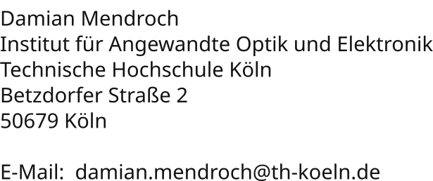

:orphan:

.. meta::
   :robots: noindex

.. _impressum:

Impressum / Imprint
============================================

Impressum nach § 5 TMG / § 55 RStV:

.. Use image so address and mail can't be crawled easily

|
|
|
|
|
|

Disclaimer (German)
============================================

Datenschutzerklärung (DSGVO)
______________________________________________

Diese Webseite wird über `Github Pages <https://help.github.com/articles/what-is-github-pages/>`__ gehostet.
Beim Aufruf der Seite werden durch den Hoster GitHub Inc. IP-Adressen zu Sicherheitszwecken erhoben und verarbeitet. 
Details zur Datenerhebung durch GitHub finden Sie hier: 
`GitHub Pages Data Collection <https://docs.github.com/en/pages/getting-started-with-github-pages/what-is-github-pages#data-collection>`__

Als Betreiber dieser Webseite erheben wir selbst keine personenbezogenen Daten.
Es werden keine Cookies verwendet und keine externen Inhalte eingebunden, 
die Daten an Dritte übertragen würden (abgesehen von der notwendigen Verbindung zum Hoster).

Urheberrecht und Lizenz
______________________________________________

Die durch die Seitenbetreiber erstellten Inhalte und Werke auf diesen Seiten (Texte, Bilder, generierte Struktur) 
unterliegen dem deutschen Urheberrecht.

Diese Inhalte sowie der zugrundeliegende Quellcode und die Assets zur Generierung der Webseite im zugehörigen 
`GitHub Repository <https://github.com/drocheam/optrace/tree/main/docs/source>`__ 
werden unter den Bedingungen der MIT-Lizenz zur Verfügung gestellt.
Der vollständige Text der MIT-Lizenz ist hier abrufbar: `Link <https://github.com/drocheam/optrace/blob/main/LICENSE>`__

Haftungsausschluss
______________________________________________

Die Inhalte dieser Webseite wurden mit Sorgfalt erstellt. 
Für die Richtigkeit, Vollständigkeit und Aktualität der Inhalte wird jedoch keine Gewähr übernommen.

Diese Webseite enthält Links zu externen Webseiten Dritter. Auf deren Inhalte hat der Betreiber keinen Einfluss. 
Für die Inhalte der verlinkten Seiten wird daher keine Gewähr übernommen.
Für die Inhalte der verlinkten Seiten ist stets der jeweilige Anbieter oder Betreiber verantwortlich. 
Die verlinkten Seiten wurden zum Zeitpunkt der Verlinkung auf mögliche Rechtsverstöße überprüft. 
Eine fortlaufende inhaltliche Kontrolle der verlinkten Seiten ist ohne konkrete Anhaltspunkte 
einer Rechtsverletzung nicht zumutbar. 
Bei Bekanntwerden von Rechtsverletzungen werden entsprechende Links umgehend entfernt.

|

Disclaimer (English)
============================================

Data Protection Declaration (DSGVO/GDPR)
______________________________________________

This website is hosted via `Github Pages <https://help.github.com/articles/what-is-github-pages/>`__.
When accessing the page, the host GitHub Inc. collects and processes IP addresses for security purposes.
Details on data collection by GitHub can be found here:
`GitHub Pages Data Collection <https://docs.github.com/en/pages/getting-started-with-github-pages/what-is-github-pages#data-collection>`__

As the operator of this website, we do not collect any personal data ourselves.
No cookies are used and no external content is integrated
that would transfer data to third parties (apart from the necessary connection to the host).

Copyright and License
______________________________________________

The content and works created by the site operators on these pages (texts, images, generated structure)
are subject to German copyright law.

This content as well as the underlying source code and assets for generating the website in the associated
`GitHub Repository <https://github.com/drocheam/optrace/tree/main/docs/source>`__
are provided under the terms of the MIT License.
The full text of the MIT License is available here: `Link <https://github.com/drocheam/optrace/blob/main/LICENSE>`__

Disclaimer of Liability
______________________________________________

The content of this website has been created with care.
However, no guarantee is assumed for the correctness, completeness, and topicality of the content.

This website contains links to external websites of third parties. The operator has no influence on their content.
Therefore, no guarantee is assumed for the content of the linked pages.
The respective provider or operator is always responsible for the content of the linked pages.
The linked pages were checked for possible legal violations at the time of linking.
Continuous monitoring of the content of the linked pages is not reasonable without concrete indications
of a legal violation.
Upon becoming aware of legal violations, such links will be removed immediately.

