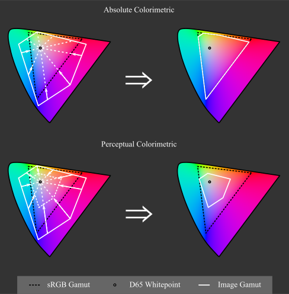
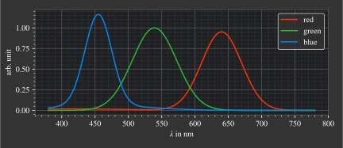

.. _color_management:

***********************
Color Management
***********************

.. _xyz_color_space:

XYZ Color Space
=================================================

Apart from spectral wavelengths, color perception does not exist as a physically measurable property, but results from the physiological characteristics of the receiver. 
Colors are therefore subjective. 
Human vision has five types of photoreceptors. Retinal ganglion cells control the day and night rhythm and rods cells (neuron bacilliferum) are responsible for night vision (scotopic vision). 
Cone cells (neuron coniferum) provide color information and are responsible for day vision (photopic vision).
The last three are mainly relevant in color management: 
When plotted against wavelength, they have different spectral sensitivities. An incident spectrum is evaluated and summed up with this sensitivity and generates a receptor stimulus.
The three different sensitivities of the cones are described as L, M, S (long, medium, short) and together the stimuli produce the LMS color space.

Typically, however, the XYZ color space is used, which can be obtained from a linear combination of the L, M, S components.
The XYZ values are also called tristimulus and describe all humanly perceivable colors.
However, it must be noted that there are slight variations in spectral sensitivities from person to person. 
In addition, these are dependent on other factors. The figure :numref:`cie_cmf` shows the so-called color matching functions, which represent the average sensitivities from multiple subjects for an object of 2° size, conducted in 1928 and 1931. 
These are also called the CIE 1931 2° observer curves and are the most commonly used throughout color conversion and management.

.. _cie_cmf:
.. figure:: ../images/cie_cmf.svg
   :width: 600
   :align: center
   :class: dark-light

   CIE 1931 2° color matching functions

With a light power spectrum :math:`P(\lambda)` and the three  curves from the figure above we can calculate the tristimulus values :math:`X, Y, Z`.

.. math::
   X &=\int_{\lambda} P(\lambda) \cdot x(\lambda) ~d \lambda \\
   Y &=\int_{\lambda} P(\lambda) \cdot y(\lambda) ~d \lambda \\
   Z &=\int_{\lambda} P(\lambda) \cdot z(\lambda) ~d \lambda
   :label: XYZ_Calc

The Y component is responsible for the brightness stimulus. Converting to the so-called luminous flux :math:`\Phi_v`, which is mainly used in photometry, is simply done by rescaling by the luminous efficacy constant:

.. math::
   \Phi_v = 683 \frac{\text{lm}}{\text{W}} ~Y
   :label: luminous_flux

Note that :math:numref:`luminous_flux` and using Y as luminance is only valid for photopic vision, for mesoscopic and scotopic vision another luminous efficiency function needs to be applied.

xyY Color Space
================

Until now, all three tristimuli hold some color component. A more suited representation is the xyY representation, as it isolates the color information into a two dimensional xy component, called chromaticity, and the luminance information is stored in the Y channel.
The point of no color, also called whitepoint, is set to the color of the D65 standard illuminant. The D65 spectrum tries to model the average midda light in open air in Europe.

The resulting chromaticity geometry as well as the whitepoint are pictured in :numref:`chroma_1931`. Spectral monochromatic wavelengths lie at the edge of the *gamut*, which describes the area of all representable colors.

.. _chroma_1931:
.. figure:: ../images/chroma_1931.svg
   :width: 700
   :align: center
   :class: dark-light

   xy chromaticity diagram with sRGB Gamut

**XYZ to xyY**

The following formulas are valid for :math:`X,~Y,~Z > 0`, otherwise we set :math:`x=x_r,~y=y_r,~z=z_r,~Y=0`, where :math:`x_r,y_r` are the whitepoint coordinates. Typically the whitepoint D65 is used with :math:`x_r=0.31272,~y_r=0.32903`, see CIE Colorimetry, 3. Edition, 2004, table 11.3.

.. math::
   \begin{aligned}
   x &= \frac{X}{X + Y + Z} \\
   y &= \frac{Y}{X + Y + Z} \\
   z &= \frac{Z}{X + Y + Z} = 1 - x - y\\
   Y &= Y 
   \end{aligned}
   :label: eq_xyz_xyy

The parameter z is given here only for the sake of completeness, since its specification is redundant if x and y are given, because :math:`x+y+z=1`.

**xyY to XYZ**

The reverse conversion is specified as follows:

.. math::
   \begin{aligned}
   X &= x \cdot \frac{Y}{y} \\
   Y &= Y\\ 
   Z &= z \cdot \frac{Y}{y} \\
   \end{aligned}
   :label: eq_xyy_xyz

sRGB Color Space
=================

The standard RGB (sRGB) color space is the most commonly used color space for digital media. It has an triangular gamut, whereas all colors inside of it can be composed of a combination of three primaries (red, green, blue) at the corner points of this triangle.
With the knowledge, that monitors also typical incorporate three different illuminants per pixel, one can see why such a system would prove useful.
sRGB also uses the D65 whitepoint with coordinates :math:`X=0.95047,~Y=1,~Z=1.08883`, see :footcite:`WikiD65`.
The gamut does not include all visible colors, it misses especially highly satured ones. The gamut can be seen in :numref:`chroma_1931`.

Color coordinates are saved with three values per pixel, one per each channel.
With a typical bit depth of 8 bit the value count per channel is limited to 256 values. Since human luminance sensitivity is non-linear, saving the values in a linear range would lead to a higher bit density in one region and a lower intensity in another one.
With this limited range of values this would lead to visual banding.
To counteract this, the sRGB values undergo a *gamma correction* that models the luminance of the eye, matching the non-linear behavior and distributing the values uniformly according to the observer.

**Conversion XYZ to sRGB**

The linear, not gamma corrected, sRGB values are an linear combination of the tristimulus values.
Conversion from XYZ to sRGB is done as follows :footcite:`BloomMatrices,sRGBWiki`:

.. math::
   	\left[\begin{array}{l}
		R_{\text {linear}} \\
		G_{\text {linear}} \\
		B_{\text {linear}}
	\end{array}\right]=\left[\begin{array}{ccc}
        +3.2404542 & -1.5371385 & -0.4985314 \\
        -0.9692660 & +1.8760108 & +0.0415560 \\
        +0.0556434 & -0.2040259 & +1.0572252
	\end{array}\right]\left[\begin{array}{c}
		X_\text{D65} \\
		Y_\text{D65} \\
		Z_\text{D65}
	\end{array}\right]
    :label: XYZ2RGB

Apply gamma correction gives us:

.. math::
   C_{\text {sRGB}}= \begin{cases}12.92\cdot C_{\text {linear}}, & C_{\text {linear}} \leq 0.0031308 \\[1.5ex] 
   1.055\cdot C_{\text {linear}}^{1 / 2.4}-0.055, & C_{\text {linear}}>0.0031308\end{cases}
   :label: Gamma_Correction

**Conversion sRGB to XYZ**

Conversion from sRGB to XYZ is done as follows :footcite:`BloomMatrices,sRGBWiki`:

.. math::
   	C_{\text {linear }}= \begin{cases}\displaystyle\frac{C_{\text {sRGB}}}{12.92}, & C_{\text {sRGB}} \leq 0.04045 \\[1.5ex]
	\displaystyle\left(\frac{C_{\text {sRGB}}+0.55}{1.055}\right)^{2.4}, & C_{\text {sRGB}}>0.04045\end{cases}
    :label: Gamma_Correction_Reverse

.. math::
	\left[\begin{array}{l}
   			X_{\text {D65}} \\
			Y_{\text {D65}} \\
			Z_{\text {D65}}
		\end{array}\right]=\left[\begin{array}{ccc}
            0.4124564 & 0.3575761 & 0.1804375\\
            0.2126729 & 0.7151522 & 0.0721750\\
            0.0193339 & 0.1191920 & 0.9503041
		\end{array}\right]\left[\begin{array}{c}
			R_{\text{linear}} \\
			G_{\text{linear}} \\
			B_{\text{linear}}
	\end{array}\right]
    :label: RGB2XYZ

**Rendering Intents**

As can be seen from :numref:`chroma_1931` the sRGB gamut does not include all colors in human vision. There are multiple ways to represents these outside colors, while most commonly, may it be due to simplicity or lacking awareness, negative sRGB values are simply clamped. 
This leads to incorrect color and brightness.
Multiple methods for *gamut clipping* are presented in :footcite:`OttossonClipping`.

   Absolute and perceptual colorimetric rendering intent in the CIE 1976 chromaticity diagram.

Implemented Rendering Intents:
 1. **Ignore**: Leaves color values untouched and outsources the handling of these colors. Typically this means the color values will be clamped by other methods, which can lead to large deviations in hue, saturation and brightness.
 2. **Absolute Colorimetric**: Leaves colors inside the gamut untouched. Outside colors will be projected onto the gamut edge in direction towards the white point. This is equivalent to a saturation clipping.
 3. **Perceptual Colorimetric**: Determines the most saturated color outside the gamut. Rescales the saturation of all colors such that this color fits into into the gamut area. Equivalent to stauration rescaling.

Intersecting the gamut edge for mode *Absolute Colorimetric* is done in the CIE 1931 xy chromaticity diagram and towards the whitepoint of the standard illuminants D65.
Determining and rescaling the saturation in *Perceptual Colorimetric* mode is done in the CIE 1976 uv chromaticity diagram, since this is a representation where color differences directly correspond to spatial differences.

In the default configuration Perceptual Colorimetric scales the saturation such that all colors are inside the gamut.
A fixed rescaling factor (range 0-1) can be provided as ``chroma_scale`` parameter that can enforce the same factor when for instance comparing different images.
In the former adaptive case an additional ``L_th`` can be applied, which is a relative threshold and ignores values below this threshold for the calculation of the scaling factor.
This proves useful when dark but saturated regions are inside the image but which can be neglected.
See :ref:`usage_color` for more details.

The effect of different rendering intents is illustrated in the next figures. The rendered images were created using the double prism example from the example folder, where light is decomposed into its components. Since all spectral wavelengths create colors beyond the sRGB gamut, this leads to an extreme case.
In the first image the lightness component is pictured, the following images should be the colored version of this lightness image.
With the Absolute Colorimetric rendering intent one can see not only the colors having different saturation, but the lightness gradient is different compared to the first image. This can especially be seen around :math:`x = 1.3` mm to :math:`x= 1.4` mm. While the lightness values were in fact unchanged, this subjective difference comes from the Helmholtz-Kohlrausch effect :footcite:`HelmKohlWiki`, which describes that color saturation can lead to higher perceived lightness. Since the saturation was clipped, and the maximum value depends on the spectral wavelength, saturation ratios are falsified, leading to this effect behaving differently for every color.
The third image shows the Perceptual Colorimetric rendering intent. One can clearly see a decreased saturation for all colors. However, the saturation ratios are kept and the lightness gradient matches the lightness image.

.. _color_dispersive1:
   
.. list-table:: Difference in different sRGB rendering intents.
   :class: table-borderless

   * - .. figure:: ../images/color_dispersive1.svg
          :width: 400
          :align: center
          :class: dark-light

     - .. figure:: ../images/color_dispersive2.svg
          :width: 400
          :align: center
          :class: dark-light
          
     - .. figure:: ../images/color_dispersive3.svg
          :width: 400
          :align: center
          :class: dark-light

When searching for chromaticity diagrams, a lot of negative examples can be found 
(`Link1 <https://clarkvision.com/articles/color-cie-chromaticity-and-perception/color-rgb-xy-cie1931-diagram1g1000spjfjl1-1000-ciesrgb-axes-waveticks-c1-srgb-800.jpg>`__,
`Link2 <https://medium.com/hipster-color-science/a-beginners-guide-to-colorimetry-401f1830b65a>`__,
`Link3 <https://galaxyav.com/wp-content/uploads/2022/11/Chromaticity-curve-of-LED-screen.jpg>`__,
`Link4 <https://media.cheggcdn.com/study/e63/e632ad42-8674-4518-a7de-b031f2316b8a/image.png>`__,
`Link5 <https://d1hjkbq40fs2x4.cloudfront.net/2017-06-05/files/perceptual-vs-absolute-rendering-intents_1621-2.jpg>`__).

In most cases negative sRGB values were simply clipped, distorting not only saturation, but also hue and brightness. For instance, colors near 510 nm get shown in deep green compared to a slightly nuanced greenish-cyan. In some cases even the representable colors inside the gamut are incorrect, which can be for instance seen as high saturated colors everywhere inside the diagram. 
On the other hand, positive examples are found here:
`Link6 <https://commons.wikimedia.org/wiki/File:CIE1931xy_blank.svg>`__,
`Link7 <https://www.wavemetrics.com/sites/www.wavemetrics.com/files/styles/content_body/public/2019-04/Chromaticity_1931.png>`__
Note that the positive examples have a different luminance norm, showing the colors with a higher brightness.

CIELUV Color Space
==================

One problem with the XYZ color space is that color and brightness are not independent of each other. 
Another problem is that brightness and color distances are not linear to color perception.
Therefore, the CIE 1976 L, u, v color space (short CIELUV) was introduced as an improved color system that emerges as a transformation from the XYZ color space and solves these problems.
L is the lightness component. u corresponds to a red-green axis, v to a blue-yellow axis.
The white point is freely selectable, but typically the D65 white point is chosen.

Similar to the XYZ color space, a chromaticity diagram can be created, the coordinates here are :math:`u',~v'`.
This is also called the CIE 1976 UCS (uniform chromaticity scale) diagram and can be seen in Figure :numref:`chroma_1976`. 
As the term UCS suggests, geometric distances everywhere inside the diagramm correspond to the same absolute color differences. 
The latter is not the case in the CIE 1931 chromaticity diagram in figure :numref:`chroma_1931`, so the other diagram is also the only suitable one to see how large the color ranges are that are missing in the sRGB gamut.

.. _chroma_1976:
.. figure:: ../images/chroma_1976.svg
   :width: 700
   :align: center
   :class: dark-light

   u'v' chromaticity diagram with sRGB Gamut

An also widespread CIE model is the CIELAB color space with the same lightness function but different color components. For color mixing and additive colour applications CIELUV should be preferred, as it has an associated chromaticity diagram (as mentioned above) and a defined expression for color saturation. :footcite:`ColorFord`

**XYZ to CIELUV**

Source for conversion: :footcite:`BloomXYZLUV`

The following equations are valid for :math:`X, Y, Z > 0`, otherwise we set :math:`L = 0, ~u=0,~v=0`.

.. math::
   \begin{aligned}
   &L= \begin{cases}116 \sqrt[3]{y_r}-16 & \text { if } y_r>\epsilon \\
   \kappa y_r & \text { otherwise }\end{cases} \\
   &u=13 L\left(u^{\prime}-u_r^{\prime}\right) \\
   &v=13 L\left(v^{\prime}-v_r^{\prime}\right)
   \end{aligned}
   :label: eq_xyz_luv_eq

With 

.. math::
   \begin{aligned}
   \epsilon &= 0.008856\\
   \kappa &= 903.3\\
   y_r &=\frac{Y}{Y_r} \\
   u^{\prime} &=\frac{4 X}{X+15 Y+3 Z} \\
   v^{\prime} &=\frac{9 Y}{X+15 Y+3 Z}
   \end{aligned}
   :label: eq_xyz_luv_pars

:math:`Y_r` is taken from the white point coordinates :math:`(X_r,~Y_r,~Z_r)`, typically those of the standard illuminant D65. On the other hand :math:`u'_r` and :math:`v'_r` are the :math:`u', ~v'` values for these whitepoint coordinates.

**CIELUV to XYZ**

Source for conversion: :footcite:`BloomLUVXYZ`. However, some formulas were rewritten in a different form.

The following equations are valid for :math:`L > 0`, for :math:`L = 0` all values are set as :math:`X=Y=Z=0`.

.. math::
   Y= \begin{cases}\left(\frac{L+16} {116}\right)^3 & \text { if } L>\kappa \epsilon \\ L / \kappa & \text { otherwise }\end{cases}
   :label: eq_luv_xyz_y

.. math::
   \begin{aligned}
   X &= \frac{9}{4} \cdot \frac{u + 13 L u'_r}{v + 13 L v'_r}\\
   Z &= 3 Y \cdot \left(\frac{13 L}{v + 13 L v'_r}  - \frac{5}{3}\right) - \frac{X}{3}\\
   \end{aligned}
   :label: eq_luv_xyz_xz

**CIELUV to u'v'L**

The following equations are valid for :math:`L > 0`, for :math:`L = 0` we set :math:`u' = u'_r, ~v' = v'_r`.

.. math::
   \begin{aligned}
   L &= L\\
   u' &= u'_r + \frac{u}{13 L}\\
   v' &= v'_r + \frac{v}{13 L}\\
   \end{aligned}
   :label: eq_luv_u_v_l

**CIELUV Chroma**

Calculation of chroma :footcite:`SchwiegerlingOptics`:

.. math::
   C = \sqrt{u^2 + v^2}
   :label: eq_luv_chroma

**CIELUV Hue**

Calculation of hue :footcite:`SchwiegerlingOptics`:

.. math::
   H = \text{arctan2}(v, u)
   :label: eq_luv_hue

**CIELUV Saturation**

Calculation of saturation :footcite:`ColorfulnessWiki`:

The following equations are valid for :math:`L > 0`, for :math:`L = 0` we set :math:`S=0`.

.. math::
   S = \frac{C}{L}
   :label: eq_luv_saturation

.. _random_srgb:

sRGB Spectral Upsampling
=================================================

While doing the conversion of a physical light spectrum to coordinates in a human vision color model is a common task, going the opposite direction is rather unusual.
In our application the conversion is used to load digital images into the raytracer and propagate spectral wavelengths throughout the tracing geometry.
Such an implementation would enable us a simple simulation of different light and lightning scenes.

The conversion process is commonly referred to as *Spectral Upsampling*, *Spectral Rendering* or *Spectral Synthesis*.  An implementation with real LED spectral curves is found in :footcite:`10.2312:sr.20221150`, while modelling sRGB reflectances is found in :footcite:`10.2312:sr.20191216`.
It is important to note that not all chromaticities inside the human vision and even the sRGB gamut can be modelled by valid reflectance spectra, since the reflectance range is bound to :math:`[0,~1]`. However, when choosing illuminant curves there is no such limitation.

.. TODO auch eingehen auf http://scottburns.us/fast-rgb-to-spectrum-conversion-for-reflectances/
.. TODO nennen, dass wir mit den Reflektionsspektra auch Illuminanten erzeugen könnten über D65 Licht
.. TODO macht es einen Sinn, sich so auf die Farbwiedergabe zu fixieren wie die? Was machen die da überhaupt?
.. TODO benennen, warum wir eigene Spektren entwickeln (mehr Licht im sichtbaren Bereich, einfache mathematische Form, keine Zacken und Kanten wie bei D65)

While the conversion of a spectral distribution to a color is well-defined, going backwards the conversion is not unique and simply reversible. Multiple spectral distributions can create the same color stimulus, an effect known as *metamerism*.
In fact, there infinitely many distributions being perceived as the same color.
With so many possibilities to choose from, we can demand some requirements for our sRGB primaries:

.. topic:: Requirements

     1. create illuminants with same color coordinates as the sRGB primaries
     2. same luminance ratios as sRGB primaries
     3. simple, smooth spectral functions
     4. wide spectrum
     5. relatively few light in non-visible regions (infrared and ultraviolet)

Points 1 and 2 simplify the upsampling process, since the mixing ratio of the linear sRGB values can be used directly. In principle we could create a new color space and gamut, that includes the sRGB gamut. But with this we would need to add additional color space conversions.
Linear sRGB values need to be used, since they are proportional to the physical intensity of the sRGB primaries. In contrast normal sRGB values are gamma corrected to approximate non-linear human vision.

Points 3 and 4 are needed to approximate natural illuminants close to reality. Adding all sRGB primaries together for a white spectrum should lead to no missing regions in the spectral range. Such gaps would lower the color rendering index (CRI) of the illuminant, which is basically the measure to quantify faithfully rendering object colors when illuminated with this light. For instance, a light spectrum with a yellow gap fails to render purely yellow colors.

Point 5 ensures most of the traced light actually contributes to a rendered image. A color image in sRGB, which is a color space for human vision, should lead to an image with colors in human vision. Rays with colors far outside the visible spectrum would be a waste of rendering time.

.. list-table:: sRGB primary specification, see :footcite:`sRGBWikiEN`
   :widths: 50 50 50 50 50
   :header-rows: 1
   :align: center

   * - Color value
     - Red
     - Green
     - Blue
     - D65   
   * - :math:`x` 
     - 0.6400
     - 0.3000 
     - 0.1500 
     - 0.3127
   * - :math:`y` 
     - 0.3300
     - 0.6000 
     - 0.0600 
     - 0.3290
   * - :math:`z` 
     - 0.0300 
     - 0.0100 
     - 0.7900 
     - 0.3583
   * - :math:`Y` 
     - 0.2127 
     - 0.7152 
     - 0.0722 
     - 1.0000
   * - sRGB 
     - [1, 0, 0] 
     - [0, 1, 0] 
     - [0, 0, 1] 
     - [1, 1, 1]

**Dimensioning**

The mathematical functions of choice is an gaussian function, which is defined as:

.. math::
   S(\lambda, \mu, \sigma)=\frac{1}{\sqrt{2 \pi \sigma^{2}}} \exp \left(-\frac{(\lambda-\mu)^{2}}{2 \sigma^{2}}\right)
   :label: Gauss_Opt

Utilizing optimization methods in python, the following functions were found, that have the same color stimulus as the primaries:

.. math::
    r_0(\lambda) =&~  75.1660756583 \cdot \Big[ S(\lambda, 639.854491, 30.0)\\
                & + 0.0500907584 \cdot S(\lambda, 418.905848, 80.6220465)\Big]\\
    g_0(\lambda) =&~  83.4999222966 \cdot  S(\lambda, 539.13108974, 33.31164968)\\
    b_0(\lambda) =&~  47.99521746361 \cdot \Big[ S(\lambda, 454.833119, 20.1460206)\\
                & + 0.184484176 \cdot S(\lambda, 459.658190, 71.0927568)\Big]\\
   :label: r0g0b0_curves

.. The next three figures were created using /tests/misc/RGB_Fit.py

.. _rgb_curve1:
.. figure:: ../images/rgb_curves1.svg
   :width: 600
   :align: center
   :class: dark-light

The green primary is implemented with only one gaussian, while the other use two gaussian functions. From :footcite:`ClarkChromaticity`, figure 3a, is known, that it is not possible to reach the chromaticity coordinates of the red channel with only one such curve. While it is possible for the blue curve, only narrow illuminants with a small standard deviation are viable. For higher flexibility in spectrum width selection two functions are also applied here.

However, all luminance ratios are different to the sRGB primaries. For this we need to rescale the functions to match the ratio. The green curve factor is kept as 1. The rescaling factors are:

.. math::
    r(\lambda) =&~ 0.951190393 \cdot r_0(\lambda)\\
    g(\lambda) =&~ 1.000000000 \cdot g_0(\lambda)\\
    b(\lambda) =&~ 1.163645855 \cdot b_0(\lambda)\\
    :label: rgb_curves

.. _rgb_curve2:

The resulting spectrum for sRGB white (coordinates :math:`[1.0, 1.0, 1.0]`) looks as follows:

.. _rgb_white:
.. figure:: ../images/rgb_white.svg
   :width: 600
   :align: center
   :class: dark-light

.. topic:: Note
   
    At :math:`\lambda = 380\,` nm and :math:`\lambda = 780\,` nm the curves are cut off mathematically. This ensures that all ratios and constants can be kept equal, even if the wavelength simulation range should be extended beyond this default range.

In a later step the channel primary functions are interpreted as probability distribution functions (pdf). Such a pdf needs to have a normalized area such that the overall probability is 1.
This cancels out any prefactors in the channel curves and the ratios between the channels.
To counteract this, the channel mixing ratio is rescaled by the area of each channel curve (=being proportional to the probability ratio). In that way the channel luminance is moved from the curve values to the probability itself.

The area scaling factors are:

.. math::
    r_\text{P} = 0.885651229244\\
    g_\text{P} = 1.000000000000\\
    b_\text{P} = 0.775993481741\\
   :label: r_g_b_factors

As can be seen, the r and b channel have smaller rescaling factors than the green channel, since their area is smaller. This can already be seen in the figure above.

After choosing a channel according to the linear sRGB mixing ratios scaled with these factors, the corresponding channel primary curve is interpreted as probability density distribution where a wavelength is chosen from.

.. topic:: Example 

    Choose random wavelengths from sRGB value :math:`\text{RGB} = [1.0, 0.5, 0.2]`.

    1. Convert to linear sRGB: :math:`[1.000, 0.214, 0.033]`
    2. Rescale by area/probability factors :math:`r_\text{P}, g_\text{p}, b_\text{p}`: We get approximately :math:`[0.886, 0.214, 0.025]`
    3. Normalize, so sum equals 1: :math:`[0.788, 0.190, 0.022]`
    4. Choose one of the three channels with the values from 3. being the probability: The R channel gets randomly chosen.
    5. Use the R primary curve as probability distribution, choose a random wavelength accordingly: :math:`\lambda = 623.91\,` nm gets chosen.
    6. Repeating 4. and 5. by choosing randomly, a spectrum is created, that for many rays has the same color as the sRGB from point 1.

**Brightness Sampling**

While the procedure above creates correct colors, we also need to take into account the brightness of each pixel. For representing the pixel intensity in the image correctly, each pixel gets an assigned probability. This probability is proportional the pixel intensity.

This pixel intensity is calculated by converting sRGB to linear sRGB and multiplying each channel with its overall power, which is proportional to :math:`r_\text{P}, g_\text{P}, b_\text{P}`, and summing these components together. 

By doing so, each pixel gets an intensity weight that needs to be rescaled so the weight sum over the whole image is 1.

.. topic:: Example

   Choose random pixels from the image below

   .. math::
        
        \text{Image} = 
        \begin{bmatrix}
        \text{RGB1} & \text{RGB2}\\
        \text{RGB3} & \text{RGB4}
        \end{bmatrix}
        =
        \begin{bmatrix}
        [1.0, 0.0, 0.2] & [0.0, 0.0, 0.0]\\
        [0.1, 0.5, 1.0] & [1.0, 0.2, 1.0]
        \end{bmatrix}

   1. Convert to linear sRGB
   
    .. math::
        \begin{bmatrix}
        [1.000, 0.000, 0.033] & [0.000, 0.000, 0.000]\\
        [0.010, 0.214, 1.000] & [1.000, 0.033, 1.000]
        \end{bmatrix}

   2. Multiply by area factors :math:`r_\text{P}, g_\text{P}, b_\text{P}` and sum all channels for each pixel

    .. math::
        \begin{bmatrix}
        0.911 & 0.000\\
        0.999 & 1.694
        \end{bmatrix}

   3. Normalize weights
    
     .. math::
        \begin{bmatrix}
        0.253 & 0.000\\
        0.277 & 0.470
        \end{bmatrix}

   4. Chose randomly according to probability: The first six chosen pixels could be: :math:`\text{RGB1}, \text{RGB4}, \text{RGB4}, \text{RGB1}, \text{RGB3}, \text{RGB4}`

------------

**References**

.. footbibliography::

