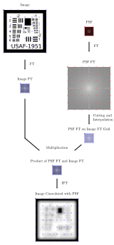

***********************
PSF Convolution
***********************

Procedure
=================================================

The point spread function (PSF) of a optical setup can be seen as impulse response of the same.
A convolution with this PSF is equivalent to applying the transfer function of the system to an input.
Note that this procedure can only simulate some optical effects, as it assumes the PSF is spatially constant.
This ignores aberrations like coma, off-axis astigmatism, field curvature, vignetting, distortion and others.

Image convolution is done by applying the convolution theorem of the Fourier transformation:

.. math::
   g \ast h=\mathcal{F}^{-1}\{G \cdot H\}
   :label: eq_conv_theorem
    
Where :math:`g` and :math:`h` are the original functions. A convolution in the original domain is therefore a multiplication in the Fourier domain.

In the case of two dimensional images the convolution also becomes a two dimensional one.
optrace

Initially, the pixel sizes, counts and ratios and overall sizes of the PSF and image differ.
The processing steps consist of the following ones:

* convert PSF and image to linear sRGB values
* pad the image by black borders of half the size of the PSF
* pad the PSF by black borders, so the fourier transformation has more low frequency components
* interpolate the PSF if the image has a smaller pixel size
* fourier transform both PSF and image
* interpolate the image frequencies on the PSF
* multiply interpolated PSF FT and image FT
* transform back to original domain

All these steps are applied on the per-channel basis of the sRGB images. Due to limitations discussed in :numref:`color_handling` only one of the PSF or image can have color information, otherwise the physical description becomes incorrect.

An overview of the most important steps is shown in figure :numref:`psf_convolution`.

.. _psf_convolution:

   Exemplary convolution of two images.
   

To speed things up, only one half plane of the Fourier images is calculated, as for real signals the output is Hermitian-symmetric (the negative frequencies are the complex conjugate of the positive ones, therefore redundant). This can be done with the :obj:`numpy.fft.rfft2` function.

.. _color_handling:

Color Handling
=================================================

.. note::

   Wavelength dependent point spread functions and images are convoluted on a per-wavelength basis.
   Converting the spectral images into color value images (like sRGB) and then convolving only works when one of the initial images is wavelength independent, as the mapping from spectrum to color is ambigious

**Proof**

The convoluted image :math:`\text{im}_2` is calculated by a two dimensional spatial convolution between the image :math:`\text{im}` and the point spread function :math:`\text{psf}`.
When done correctly, all three not only depend on the position :math:`x, y` inside the image but also the wavelength :math:`\lambda` as the image and PSF can have different spectral distributions depending on the location.

.. math::
   \text{im}_2(x, y, \lambda) &= \text{im}(x, y, \lambda) \ast\ast\; \text{psf}(x, y, \lambda)\\
   &= \iint \text{im}(\tau_x, \tau_y, \lambda) \cdot \text{psf}(x-\tau_x, y-\tau_y, \lambda)  \;\text{d} \tau_x \,\text{d}\tau_y\\
   :label: eq_conv_double_conv

Converting a spatial and spectral image into a color channel is done by multiplying it with a color matching function :math:`r(\lambda)` and integrating over all wavelengths.

.. math::
   \text{im}_r(x, y) = \int \text{im}(x, y, \lambda) \cdot r(\lambda) \, \text{d}\lambda
   :label: eq_conv_channel

The following proposition is applied in a later derivation:

.. math::
   \int f(x) \,\text{d}x \cdot \int g(x) \,\text{d}x = \iint f(x) \cdot g(y) \;\text{d}x\,\text{d}y
   :label: eq_conv_int_sep

In the next step we want to proof that convolving the image channels is the same as calculating the image with equation :math:numref:`eq_conv_double_conv` and then converting it to a color channel.

.. math::
   \text{im}_{2,r} = \int   \text{im}_2(x, y, \lambda) \cdot r(\lambda) \;\text{d}\lambda \stackrel{!}{=} \text{im}_{r}(x, y) \ast\ast\; \text{psf}_r(x, y) 
   :label: eq_conv_desired

This is done by expanding all integrals:

.. math::
   \text{im}_{2,r}(x, y) 
   &= \text{im}_{r}(x, y) \ast\ast\; \text{psf}_r(x, y)\\
   &= \iint \text{im}_r(\tau_x, \tau_y) \cdot \text{psf}_r(x-\tau_x, y-\tau_y)  \;\text{d} \tau_x \,\text{d}\tau_y\\
   &= \iint \left( \int \text{im}(\tau_x, \tau_y, \lambda) \cdot r(\lambda) \, \text{d}\lambda \cdot \int \text{psf}(x-\tau_x, y-\tau_y, \lambda) \cdot r(\lambda) \,\text{d}\lambda \right) \;\text{d} \tau_x \,\text{d}\tau_y\\
   &= \iint \left( \int \text{im}(\tau_x, \tau_y, \lambda_1) \cdot r(\lambda_1) \, \text{d}\lambda_1 \cdot \int \text{psf}(x-\tau_x, y-\tau_y, \lambda_2) \cdot r(\lambda_2) \,\text{d}\lambda_2 \right) \;\text{d} \tau_x \,\text{d}\tau_y\\
   &= \iiiint \text{im}(\tau_x, \tau_y, \lambda_1) \cdot \text{psf}(x-\tau_x, y-\tau_y, \lambda_2) \cdot r(\lambda_1) \cdot r(\lambda_2) \;\text{d}\lambda_1 \, \text{d}\lambda_2  \,\text{d} \tau_x \,\text{d}\tau_y\\
   &= \iint \left(  \iint \text{im}(\tau_x, \tau_y, \lambda_1) \cdot \text{psf}(x-\tau_x, y-\tau_y, \lambda_2) \,\text{d} \tau_x \,\text{d}\tau_y \right) \cdot r(\lambda_1) \cdot r(\lambda_2) \;\text{d}\lambda_1 \, \text{d}\lambda_2  \\
   &= \iint \Bigl[  \text{im}(x, y, \lambda_1) \ast\ast\; \text{psf}(x, y, \lambda_2)\Bigr] \cdot r(\lambda_1) \cdot r(\lambda_2) \;\text{d}\lambda_1 \, \text{d}\lambda_2\\
   :label: eq_conv_proof

Unfortunately, the above form can't be led to that of :math:numref:`eq_conv_desired`, which would proof the desired case.

This looks differently with the PSF being wavelength-independent:

.. math::
   \text{im}_{2,r}(x, y) 
   &= \iint \Bigl[  \text{im}(x, y, \lambda_1) \ast\ast\; \text{psf}(x, y)\Bigr] \cdot r(\lambda_1) \cdot r(\lambda_2) \;\text{d}\lambda_1 \, \text{d}\lambda_2\\
   &= \int r(\lambda_2) \cdot \text{d}\lambda_2 \cdot \int \Bigl[\text{im}(x, y, \lambda_1) \ast\ast\; \text{psf}(x, y)\Bigr] \cdot r(\lambda_1) \;\text{d}\lambda_1\\
   &= R \cdot \int   \Bigl[\text{im}(x, y, \lambda_1) \ast\ast\; \text{psf}(x, y)\Bigr] \cdot r(\lambda_1) \;\text{d}\lambda_1\\
   &= R \cdot \int   \text{im}_2(x, y, \lambda_1) \cdot r(\lambda_1) \;\text{d}\lambda_1\\
   :label: eq_conv_psf_independent

Here :math:`R` is a constant scaling factor that depends on the area of :math:`r(\lambda)`.

If on the other hand the image is wavelength independent, we also achieve the same conclusion:

.. math::
   \text{im}_{2,r}(x, y) 
   &= \iint \Bigl[  \text{im}(x, y) \ast\ast\; \text{psf}(x, y, \lambda_2)\Bigr] \cdot r(\lambda_1) \cdot r(\lambda_2) \;\text{d}\lambda_1 \, \text{d}\lambda_2\\
   &= \int r(\lambda_1) \cdot \text{d}\lambda_1 \cdot \int \Bigl[\text{im}(x, y) \ast\ast\; \text{psf}(x, y, \lambda_2)\Bigr] \cdot r(\lambda_2) \;\text{d}\lambda_2\\
   &= R \cdot \int   \Bigl[\text{im}(x, y) \ast\ast\; \text{psf}(x, y, \lambda_2)\Bigr] \cdot r(\lambda_2) \;\text{d}\lambda_2\\
   &= R \cdot \int   \text{im}_2(x, y, \lambda_2) \cdot r(\lambda_2) \;\text{d}\lambda_2\\
   :label: eq_conv_img_independent
    
Analogously, this works for both image and PSF not being dependent on the wavelength.

Therefore the simplification of using the color channels directly is only physically viable, if at least one of PSF or image are wavelength independent.
Note that for :math:numref:`eq_conv_channel` to work, we must have a linear color space like linear sRGB, therefore the gamma correction of normal sRGB values must be removed first.

PSF Presets
=================================================

`optrace` includes multiple PSF presets.

.. TODO Quellen und Dokumentation

**Gaussian**

.. math::

   I_{d}(x, y) = \exp \left(  \frac{-x^2 - y^2}{2 \sigma^2}\right)

.. math::

   \sigma = 0.175 d

**Airy**

.. math::

   I_{d}(x, y) = \left( \frac{2 J_1(r_d)}{r_d} \right)^2

.. math::

   r_d = 7.6634 \frac{\sqrt{x^2 + y^2}}{d}

**Glare**

.. math::

  I_{\sigma_1,\sigma_2,d}(x, y) = \frac{1}{1+a}\exp \left(  \frac{-x^2 - y^2}{2 \sigma_1^2}\right) + \frac{a}{1+a}\exp \left(  \frac{-x^2 - y^2}{2 \sigma_2^2}\right)

**Halo**

.. math::

   I_{d_1,d_2,a,w}(x, y) = \exp \left(  \frac{-x^2 - y^2}{2 \sigma_1^2}\right) +  a \exp \left(  \frac{-\left(\sqrt{x^2 + y^2} - d_2\right)^2}{2 \sigma_2^2}\right) 

With 

.. math::

   \sigma_1 = 0.175 d_1

.. math::

   \sigma_2 = 0.233 w

------------

**References**

.. footbibliography::

