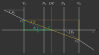

.. _ray_matrix_analysis:

*****************************
Ray Transfer Matrix Analysis
*****************************

ABCD Matrix 
=================================================

In paraxial optics the relationships between angles :math:`\theta` and distances :math:`x` relative to the optical axis can be represented in a linear manner. A so-called ABCD-matrix includes the linear components to calculate the output parameters from input values for a system with the same matrix. This can be written as: :footcite:`IvanOptics`

.. math::
   \left[\begin{array}{l}
   x_2 \\
   \theta_2
   \end{array}\right]=\left[\begin{array}{ll}
   A & B \\
   C & D
   \end{array}\right]\left[\begin{array}{l}
   x_1 \\
   \theta_1
   \end{array}\right]
   :label: TMA_ABCD

.. _TMA_elements:

.. list-table:: Meaning of matrix elements :footcite:`IvanOptics`
   :widths: 80 300
   :header-rows: 1
   :align: center
   
   * - Element
     - Meaning
   * - :math:`A`
     - positional scaling
   * - :math:`B`
     - position change depending on input angle
   * - :math:`C`
     - | angle change depending on input position. 
       | Equivalent to :math:`-\frac{1}{f}`, with :math:`f` being the focal distance
   * - :math:`D`
     - angular scaling

Zero matrix elements, as described in :numref:`TMA_zero_elements`, are of particularly importance, giving us cases of imaging and focussing.

.. _TMA_zero_elements:

.. list-table:: Significance of zero matrix elements :footcite:`GillLaser,pedrotti_pedrotti_pedrotti_2006` 
   :widths: 50 200
   :header-rows: 1
   :align: center
   
   * - Case
     - Meaning
   * - :math:`A=0`
     - | parallel to point focussing,
       | output lies at second focal plane    
   * - :math:`B=0`
     - | point to point focussing (image of an object),
       | input and output lie at conjugate planes,
       | :math:`A` gives the image magnification
   * - :math:`C=0`
     - | parallel to parallel imaging (afocal or telescopic system),
       | :math:`D` gives us the angular magnification 
   * - :math:`D=0`
     - | point to parallel imaging (e.g. headlamp), 
       | input lies at first focal plane

An important relation is that the determinant of such a ABCD-matrix, here called :math:`M`, always equals the ratio between ingoing :math:`n_i` and outgoing medium :math:`n_o`. :footcite:`pedrotti_pedrotti_pedrotti_2006`

.. math::
   \det (M) = AD - BC = \frac{n_i}{n_o}
   :label: eq_TMA_det

Propagation through Free Space 
=================================================

An ABCD-Matrix for free Space with distance :math:`d` has the following form: :footcite:`pedrotti_pedrotti_pedrotti_2006`

.. math::
   \text{M}_\text{s} =
   \left[\begin{array}{ll}
   1 & d \\
   0 & 1
   \end{array}\right]
   :label: TMA_free_space

Refraction on a Curved Interface 
=================================================

Refraction on a curved interface with curvature circle :math:`R`, medium :math:`n_i` before and :math:`n_o` after the interface leads to the following matrix: :footcite:`pedrotti_pedrotti_pedrotti_2006`

.. math::
   \text{M}_\text{c} =
   \left[\begin{array}{cc}
   1 & 0 \\
   -\frac{n_o-n_i}{R \cdot n_o} & \frac{n_i}{n_o}
   \end{array}\right]
   :label: TMA_curved_nterface

Refraction on a Flat Interface 
=================================================

With :math:`R \to \infty`, being equivalent to a flat interface, the matrix becomes: :footcite:`pedrotti_pedrotti_pedrotti_2006`

.. math::
   \text{M}_\text{i} =
   \left[\begin{array}{cc}
   1 & 0 \\
   0 & \frac{n_i}{n_o}
   \end{array}\right]
   :label: TMA_flat_interface

Thick Lens 
=================================================

Thick Lens with refraction index :math:`n`, front surface curvature :math:`R_1`, thickness :math:`d`, back surface curvature :math:`R_2`, medium with :math:`n_1` in front and medium with :math:`n_2` behind the lens.
Using ray transfer matrix analysis this is the product of the matrix of the front surface matrix :math:`\text{M}_\text{c1}`, free space propagation matrix :math:`\text{M}_\text{s}` and back surface matrix :math:`\text{M}_\text{c2}`.
Note that matrices are multiplied from right to left.
The resulting matrix is then: :footcite:`Kaschke2014`

.. math::
   \text{M}_\text{thick} =&~~ \text{M}_\text{c2} \cdot \text{M}_\text{s} \cdot \text{M}_\text{c1}\\
    =&~
   \left[\begin{array}{cc}
   1 & 0 \\
   -\frac{n_2-n}{R_2 \cdot n_2} & \frac{n}{n_2}
   \end{array}\right]
   \left[\begin{array}{ll}
   1 & d \\
   0 & 1
   \end{array}\right]
   \left[\begin{array}{cc}
   1 & 0 \\
   -\frac{n-n_1}{R_1 \cdot n} & \frac{n_1}{n}
   \end{array}\right]\\
    =&~ 
   \left[\begin{array}{cc}
   1 + \frac{n_1-n}{n R_1}d & \frac{n_1}{n}d \\
    \frac{n_1 - n}{n_2 R_1}  + \frac{n-n_2}{n_2 R_2} + \frac{n_1 - n}{n R_1}\frac{n-n_2}{n_2 R_2}d & \frac{n_1}{n_2} + \frac{n_1}{n}\frac{n - n_2}{n_2 R_2}d
   \end{array}\right]
   :label: TMA_thick_lens_complete

With same ambient media, therefore :math:`n_0 := n_1 = n_2`, this simplifies to:

.. math::
   \text{M}_{\text{thick},n_0}   =&~ 
   \left[\begin{array}{cc}
   1 + \frac{n_0-n}{n R_1}d & \frac{n_0}{n}d \\
   \frac{n_0 - n}{n_0} \left( \frac{1}{R_1}  - \frac{1}{R_2} + \frac{n-n_0}{n R_1 R_2}d \right) & 1 + \frac{n - n_0}{n R_2}d
   \end{array}\right]
   :label: TMA_thick_lens_same_media

Thin Lens
====================

Generally element :math:`C` can be interpreted as the negative inverse focal length :math:`-\frac{1}{f}`.
Additionally, for a thin lens :math:`d=0` holds, simplifying equation :math:numref:`TMA_thick_lens_complete` to:

.. math::
    \text{M}_\text{thin} =
   \left[\begin{array}{cc}
   1 & 0 \\
   -\frac{1}{f} & \frac{n_i}{n_o}
   \end{array}\right]
   :label: TMA_thin_lens

With :math:`n_i = n_o`,  leading to element :math:`D=1`, the matrix is consistent with equations found in literature, as :footcite:`pedrotti_pedrotti_pedrotti_2006`

Lensmaker Equation 
=================================================

As for the thin lens, element :math:`C` is equal to :math:`-\frac{1}{f}`.
Negating this element from equation :math:numref:`TMA_thick_lens_complete` and applying :math:`-(n_1 - n) = (n - n_1)` gives us the focal length in forward direction:

.. math::
   \frac{1}{f_2} = \frac{n-n_1}{n_2}\frac{1}{R_1} - \frac{n-n_2}{n_2}\frac{1}{R_2} + \frac{n-n_1}{n R_1}\frac{n-n_2}{n_2 R_2}d
   :label: TMA_lensmaker0

Doing the same calculations with media and curvatures swapped, we get the backward focal length:

.. math::
   f_1 = -\frac{n_1}{n_2} f_2
   :label: TMA_lensmaker_f_conv

Which in written-out form is:

.. math::
   \frac{1}{f_1} = -\frac{n-n_1}{n_1}\frac{1}{R_1} + \frac{n-n_2}{n_1}\frac{1}{R_2} - \frac{n-n_1}{n R_1}\frac{n-n_2}{n_1 R_2}d
   :label: TMA_lensmaker1

Both equations above are consistent with :footcite:`pedrotti_pedrotti_pedrotti_2006`

For :math:`n_0 := n_1 = n_2` we get:

.. math::
   \frac{1}{f_2} = \frac{n-n_0}{n_0}\left(\frac{1}{R_1} - \frac{1}{R_2} + \frac{n-n_0}{n R_1 R_2}d \right)
   :label: TMA_lensmaker_common

Which is the typical form found for the lens maker equation. :footcite:`LinsenschleiferWiki`

Gullstrand Equation 
=================================================

Utilizing definition :math:numref:`TMA_power_alt` and equation :math:numref:`TMA_lensmaker0` and calling :math:`D=D_2` from now on, we can write:

.. math::
   D = \frac{n_2}{f_2} = \frac{n-n_1}{R_1} - \frac{n-n_2}{R_2} + \frac{n-n_1}{n R_1}\frac{n-n_2}{R_2}d
   :label: TMA_Gullstrand_base

This is equivalent to

.. math::
   D = \frac{n_2}{f_2} = \frac{n-n_1}{R_1}  + \left( - \frac{n-n_2}{R_2} \right) - \frac{n-n_1}{R_1} \cdot \left( - \frac{n-n_2}{R_2} \right) \frac{d}{n}
   :label: TMA_Gullstrand_step

With the surface optical powers :math:`D_\text{s1} = \frac{n-n_1}{R_1}` and :math:`D_\text{s2} = -\frac{n-n_2}{R_2}` this simplifies to:

.. math::
   D = D_\text{s1} + D_\text{s2} - D_\text{s1} D_\text{s2} \frac{d}{n}
   :label: TMA_Gullstrand

Which is known as Gullstrand's equation. :footcite:`GullstrandHyper,EdmundFocal`

.. _ray_cardinal_points:

Cardinal Points 
=================================================

The following calculations are derived from :footcite:`DickenABCD` and :footcite:`pedrotti_pedrotti_pedrotti_2006`. Also there you can find a textual and graphical explanation of cardinal points and planes.

**Vertex Points**

The vertex points :math:`V_1` and :math:`V_2` are the position of the lens front and center at the optical axis.

**Principal Points**

.. math::
   P_1 =&~ V_1 - \frac{n_1 - n_2 D}{n_2 C}\\
   P_2 =&~ V_2 + \frac{1-A}{C}
   :label: TMA_principal

**Nodal Points**

.. math::
   N_1 =&~ V_1 - \frac{1-D}{C}\\
   N_2 =&~ V_2 + \frac{n_1 - n_2 A}{n_2 C}
   :label: TMA_nodal

**Focal Lengths**

Focal lengths are given by the negative inverse of :math:`C` as well as equation :math:numref:`TMA_lensmaker_f_conv`.

.. math::
   f_1 =&~ \frac{n_1}{n_2 C}\\
   f_2 =&~ -\frac{1}{C}
   :label: TMA_focal_length

**Focal Points**

Both focal points are there corresponding focal lengths away from their principle plane.

.. math::
   F_1 = &~ P_1 + f_1\\
   F_2 = &~ P_2 + f_2
   :label: TMA_focal_points

**EFL, BFL, FFL**

Effective focal length (EFL), back focal length (BFL) and front focal length (FFL) are defined as follows: 

.. math::
   \text{FFL} =&~ F_1 - V_1 &=~& &\frac{D}{C}\\
   \text{BFL} =&~ F_2 - V_2 &=~& -&\frac{A}{C}\\
   \text{EFL} =&~ f_2 &=~& -&\frac{1}{C}
   :label: TMA_ffk_bfl_efl

.. _ray_power_def:

Optical Power 
=================================================

The default definition in optrace is the optical power being the inverse of the geometric focal length.

.. math::
   D_1 = \frac{1}{f_1}\\
   D_2 = \frac{1}{f_2}
   :label: TMA_power_base
   
The alternative definition below has the advantage, that :math:`D_\text{1n} = -D_\text{2n}` holds, independent of the refractive media. However, focal lengths are not the actual distance between principal plane and focal points.

For :math:`n_1 = n_2 = 1` both definitions are equivalent.

.. math::
   D_\text{1n} =&~ \frac{n_1}{f_1}\\
   D_\text{2n} =&~ \frac{n_2}{f_2}\\
   f_\text{1n} =&~ \frac{f_1}{n_1}\\
   f_\text{2n} =&~ \frac{f_2}{n_2}\\
   \text{EFL}_n =&~ \frac{f_2}{n_2}\\
   :label: TMA_power_alt

Lens Setups 
=================================================

To evaluate setups of :math:`N` lenses the lens matrices :math:`\text{M}_\text{L,i}` and the free space matrices :math:`\text{M}_\text{s,j}` with :math:`i \in	\{0, 1, \dots, N\},~~ j \in \{0, 1, \dots, N-1\}` need to be multiplied.

.. math::
   \text{M} = \text{M}_\text{L,N} \cdot \text{M}_\text{s,N-1} \dots \text{M}_\text{s,0} \cdot \text{M}_\text{L,0}
   :label: TMA_setup

.. _ray_image_object_distances:

Optical Center
=====================

**General Case**

From the red triangle follows that:

.. math::
   \tan \phi = \frac{x_2 - x_1}{V_2 - V_1}
   :label: eq_oc_tan_phi1

While from the green triangle follows that:

.. math::
   \tan \phi = -\frac{x_1}{o}
   :label: eq_oc_tan_phi2

Note that the minus wass added so both equations have the same sign.
Inserting :math:numref:`eq_oc_tan_phi1` into :math:numref:`eq_oc_tan_phi2` gives us:

.. math::
   o = - \frac{x_1}{x_2 - x_1} \left(V_2 - V_1\right)
   :label: eq_oc_o1

The blue triangle leads to:

.. math::
   \tan \theta_1 = -\frac{x_1}{N_1 - V_1}
   :label: eq_oc_theta1

With paraxial rays :math:`\theta_1 \approx \tan \theta_1` holds. :math:`x_2` can therefore be calculated using the ABCD matrix of the setup:

.. math::
   x_2 = A x_1 - \frac{B}{N_1 - V_1} x_1
   :label: eq_oc_x2

Inserting into :math:numref:`eq_oc_o1` gives us:

.. math::
   o = -\frac{x_1}{A x_1 - \frac{B}{N_1 - V_1} x_1 -x_1} \left(V_2 - V_1\right)
  :label: eq_oc_o2

From :math:numref:`TMA_nodal` follows that:

.. math::
   N_1 - V_1 = - \frac{1 - D}{C}
   :label: eq_oc_dNV

Which can also be inserted into the equation :math:numref:`eq_oc_o2`.
After some rearranging one gets:

.. math::
   o = \frac{V_2 - V_1}{1 - A + \frac{BC}{D-1}}
   :label: eq_oc_o3

Which needs to be added to the front vertex to get the absolute position of the optical center:

.. math::
   \text{OC} = V_1 + \frac{V_2 - V_1}{1 - A + \frac{BC}{D-1}}
   :label: eq_oc_final

The requirements that were silently assumed are that the nodal point exist (:math:`C \neq 0`) and input and output positions differ :math:`x_2 \neq x_1`.
The only case where it makes sense to also define an optical center is for an ideal lens, where we set :math:`\text{OC} = V_1`, although a nodal ray does not cross the optical axis at that point.
For all other cases, especially :math:`1 - A  + \frac{BC}{D - 1} = 0` or :math:`D = 1` the optical center is undefined. As mentioned before, an ideal lens (:math:`A = 1, ~B=0, ~C\neq 0, ~D=1`) is an exception.

**Thick Lens/Lens Combination with Same Front and Back Medium**

With :math:`m := \frac{n - n_0}{n}d` matrix :math:numref:`TMA_thick_lens_same_media` becomes:

.. math::
   \text{M}_{\text{thick},n_0}   =&~ 
   \left[\begin{array}{cc}
   1 - \frac{m}{R_1} & \frac{n_0}{n}d \\
   \frac{n_0 - n}{n_0} \left( \frac{1}{R_1}  - \frac{1}{R_2} + \frac{m}{R_1 R_2} \right) & 1 + \frac{m}{R_2}
   \end{array}\right]
   :label: TMA_thick_lens_same_media_m

The denominator of equation :math:numref:`eq_oc_final` is then:

.. math::
   1 - A + \frac{BC}{D - 1} &= 1 - \left(1 - \frac{m}{R_1}\right) + \frac{\frac{n_0-n}{n_0}\frac{n_0}{n}d \left( \frac{1}{R_1}  - \frac{1}{R_2} + \frac{m}{R_1 R_2} \right)}{1 + \frac{m}{R_2} - 1}\\
   &= \frac{m}{R_1} - m \frac{\left( \frac{1}{R_1}  - \frac{1}{R_2} + \frac{m}{R_1 R_2} \right)}{\frac{m}{R_2}}\\
   &= \frac{m}{R_1} - \left( \frac{R_2}{R_1}  - 1 + \frac{m}{R_1} \right)\\
   &= 1 - \frac{R_2}{R_1}
   :label: eq_oc_thick_lens_denom

Leading to the final form of :math:numref:`eq_oc_final`:

.. math::
   \text{OC} = V_1 + \frac{V_2 - V_1}{1 - \frac{R_2}{R_1}}
   :label: eq_oc_radii

.. Simplifying this expression towards this form is quite labor-intensive but goes without any conditions or tricks.
.. A interested reader is free to do it by themselves or trust Wolfram Alpha with the query: `Link <https://www.wolframalpha.com/input?i=1+-+A+%2B+B*C%2F%28D+-+1%29+with+A+%3D+%281+%2B+%28n_0-n%29%2F%28n+R_1%29*d%29%2C+B+%3D+%28%28n_0%29%2F%28n%29*d%29%2C+C+%3D+%28%28n_0+-+n%29%2F%28n_0+R_1%29%2B%28n-n_0%29%2F%28n_0+R_2%29%2B%28n_0+-+n%29%2F%28n+R_1%29*%28n-n_0%29%2F%28n_0+R_2%29*d%29%2C+D+%3D+%281+%2B+%28n+-+n_0%29%2F%28n+R_2%29*d%29>`__.

Equation :math:numref:`eq_oc_radii` is consistent with the results in :footcite:`10.1117/12.805489`.
As mentioned in :footcite:`jenkins2001fundamentals` for this case the optical center is completely independent of the wavelength and the material dispersion.

In fact, doing this with two ideal lenses with focal lengths :math:`f_1` and :math:`f_2` with separation distance :math:`d` and the same ambient media, produces a similar form:

.. math::
   M_\text{2L} &= \left[\begin{array}{cc}
   1 & 0 \\
   \frac{1}{f_2} & 1
   \end{array}\right] \cdot\left[\begin{array}{ll}
   1 & d \\
   0 & 1
   \end{array}\right] \cdot\left[\begin{array}{cc}
   1 & 0 \\
   \frac{1}{f_1} & 1
   \end{array}\right]\\
   &= \left[\begin{array}{cc}
   1+\frac{d}{f_1} & d \\
   \frac{1}{f_1}+\frac{1}{f_2}+\frac{d}{f_1 f_2} & 1+\frac{d}{f_2}
   \end{array}\right]
   :label: eq_oc_two_lens_matrix

.. math::
   1 - A + \frac{BC}{D - 1} &= 1 - \left(1 + \frac{d}{f_1}\right) + \frac{ \frac{1}{f_1}  + \frac{1}{f_2} + \frac{d}{f_1 f_2} }{1 + \frac{d}{f_2} - 1} d\\
   &= -\frac{d}{f_1} + \frac{f_2}{f_1} + 1 + \frac{d}{f_1}\\
   &= 1 + \frac{f_2}{f_1}
   :label: eq_oc_two_lenses_denom

.. math::
   \text{OC} = V_1 + \frac{V_2 - V_1}{1 + \frac{f_2}{f_1}}
   :label: eq_oc_two_lenses

For :math:`R_2 = -R_1` in :math:numref:`eq_oc_radii` or :math:`f_2 = f_1` in :math:numref:`eq_oc_focals` the optical center lies at exactly the center of the lens/lens combination.

Image and Object Distances 
=================================================

**Positions**

The matrix for additional object distance :math:`g` and image distance :math:`b` is:

.. math::
   \text{M}_\text{b,g} = 
   \left[\begin{array}{ll}
   1 & b \\
   0 & 1
   \end{array}\right]
   \cdot \text{M} \cdot
   \left[\begin{array}{ll}
   1 & g \\
   0 & 1
   \end{array}\right]
   :label: TMA_image_distance_mat

Where distance :math:`b` is given relative to the lens vertex point :math:`V_2` and :math:`g` relative to :math:`V_1` and both distances being positive when pointing towards positive z-direction.

For imaging element :math:`B_\text{b,g} = \text{M}_\text{b,g}[0, 1]` needs to be zero.
This means the output ray position :math:`x_2` is independent on the input angle :math:`\theta_1` and only dependent on the input position :math:`x_1`.

This gives us:

.. math::
   B_\text{b,g} = g (A + C b) + B + D b = 0
   :label: TMA_image_distance_eq

For :math:`b, g \in \mathbb{R}`

.. math::
   b(g) = 
    \begin{cases}
   -\frac{B + g A} {D + g C}, &~ \text{for}~~ {D + g C} \neq 0\\
   \mathbb{R} &~ \text{for}~~ {D + g C} = 0 ~~\text{and}~~ B + g A = 0\\
   \emptyset &~ \text{for}~~ {D + g C} = 0 ~~\text{and}~~ B + g A \neq 0
  \end{cases}
  :label: TMA_image_distance_solution

.. math::
   g(b) = 
    \begin{cases}
   -\frac{B + b D} {A + b C}, &~ \text{for}~~ {A + b C} \neq 0\\
   \mathbb{R} &~ \text{for}~~ {A + b C} = 0 ~~\text{and}~~ B + b D = 0\\
   \emptyset &~ \text{for}~~ {A + b C} = 0 ~~\text{and}~~ B + b D \neq 0
  \end{cases}
  :label: TMA_object_distance_solution

For special cases around :math:`\pm\infty` we get:

.. math::
   \lim_{g \to \pm \infty} b(g) = 
     \begin{cases}
   -\frac{A}{C} &~ \text{for}~~ {C} \neq 0\\
   \mathbb{R} &~ \text{for}~~ C = 0 ~~\text{and}~~ A = 0\\
   \emptyset &~ \text{for}~~ C = 0 ~~\text{and}~~ A \neq 0
  \end{cases}
  :label: TMA_image_distance_solution_special

.. math::
   \lim_{b \to \pm \infty} g(b) = 
     \begin{cases}
   -\frac{D}{C} &~ \text{for}~~ {C} \neq 0\\
   \mathbb{R} &~ \text{for}~~ C = 0 ~~\text{and}~~ D = 0\\
   \emptyset &~ \text{for}~~ C = 0 ~~\text{and}~~ D \neq 0
  \end{cases}
  :label: TMA_object_distance_solution_special

Optrace sets all cases with :math:`\emptyset, \mathbb{R}` to NaN (not a number), since both are impractical.

For :math:`\text{M} = \text{M}_\text{thin}` (thin lens approximation) from equation :math:numref:`TMA_thin_lens` the equations simplify to

.. math::
   b(g) = \frac{fg}{g-\frac{n_i}{n_o}f}
   :label: TMA_image_imaging_eq

.. math::
   g(b) = \frac{\frac{n_i}{n_o}fb}{b-f}
   :label: TMA_object_imaging_eq

Which is the form known from the imaging equation:

.. math::
   \frac{n_o}{f} = \frac{n_i}{g} + \frac{n_o}{b}
   :label: TMA_imaging_eq_n

And most commonly found for :math:`n_i = 1, ~~n_o = 1`: :footcite:`LinsenGleichungWiki`

.. math::
   \frac{1}{f} = \frac{1}{g} + \frac{1}{b}
   :label: TMA_imaging_eq_base

Where :math:`f,~b,~g` are positive when measured in positive z-direction.

**Magnifications**

With a given object and image position the combined ABCD matrix in :math:numref:`TMA_image_distance_mat` can be calculated.
Element :math:`A` of the matrix corresponds to the magnification factor :math:`m`, as :math:`B=0` applies for this matrix.

For a thin, ideal lens :math:`m` would be equal to :math:`b/g`.

Referring to the value of this factor, :math:`A < 0` signifies an inverted image, :math:`A > 0` an upright image, :math:`\lvert A \rvert > 1` a size increase, :math:`\lvert A \rvert < 1` a size decrease.

.. _pupil_calculation:

Entrance and Exit Pupils
=================================================

To calculate the entrance and exit pupil for a given system and aperture stop the lens setup is separated into a front and rear group. The pupils are then the image of the aperture for the corresponding group. :footcite:`GreivenStop`

.. figure:: ../images/pupil_calculation.svg
   :align: center
   :width: 750

   Visualization of the matrix separation and different distances.

**Aperture inside setup**

In the case of the aperture stop being inside the lens setup, the setup and its matrix :math:`\text{M}` can be separated into three parts:

.. math::
   \text{M} = \text{M}_\text{rear} \cdot \text{M}_\text{gap} \cdot \text{M}_\text{front}
   :label: eq_pupils_separation

:math:`\text{M}_\text{front}` is the matrix for all surfaces in front of the aperture stop, :math:`\text{M}_\text{back}` for everything behind the stop. :math:`\text{M}_\text{gap}` is the distance matrix for the gap region between surfaces where the stop is positioned in and does not belong to either front or back group.

The entrance pupil is the result of the stop being imaged into the front group, whereas the exit pupil is the image of the aperture stop into the rear group.

The exit pupil position is simply calculated with an object distance :math:`g_\text{ex}` between the stop position :math:`z_\text{s}` and the front vertex of the rear group and the matrix :math:`\text{M}_\text{rear}` with the procedure in <>.
The resulting :math:`z_\text{ex}` is the exit pupil's absolute position.

For the entrance pupil, we need to image the stop in backwards direction through :math:`\text{M}_\text{front}`. This is done by inverting the matrix:

.. math::
   \text{M}^{-1}_\text{front} &= \left[\begin{array}{cc}
       A & B \\
       C & D
       \end{array}\right]^{-1}\\
    &= \frac{1}{AD - BC}  \left[\begin{array}{cc}
       D & -B \\
       -C & A
       \end{array}\right]\\
   :label: eq_pupils_front_inverse

The object distance is negative and calculated with the back vertex of the front group: 

.. math::
   g_\text{en} = V_{2,\text{front}} - z_\text{s}
   :label: eq_pupils_gen

The procedure in <> with :math:`g_\text{en}` and :math:`\text{M}^{-1}_\text{front}` gives us the image distance :math:`b_\text{en}`, that needs to be added to the front vertex of the front group to get the entrance pupil position.:

.. math::
   z_\text{en} = V_{1,\text{front}} + b_\text{en}
   :label: eq_pupils_zen

**Aperture in front of setup**

With the stop being in front of all lenses, it itself is the entrance pupil (:math:`z_\text{en} = z_\text{s}`).

The exit pupil then is the result of imaging through all elements with the matrix:

.. math::
   \text{M}_\text{rear} = \text{M} 
   :label: eq_pupils_rear_only

**Aperture behind of setup**

With the stop being behind all lenses, it itself is equal to the exit pupil (:math:`z_\text{ex} = z_\text{s}`).

The entrance pupil then is the result of imaging backwards through all elements with the procedure above and the matrix:

.. math::
   \text{M}_\text{front} = \text{M} 
   :label: eq_pupils_front_only

------------

**References**

.. footbibliography::
