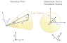

*********************************
Sampling
*********************************

Overview
====================

Optrace approximates optical effects by utilizing an Unbiased Quasi Monte Carlo simulation. 
Inverse Transform Sampling is used as method for non-uniform random variate generation and Stratified Sampling as low discrepancy method for the generation of the initial uniform random variable.

A brief, not entirely accurate description of these terms:

**Monte Carlo Simulation:** An algorithm class, that approximates a physical or mathematical problem with many degrees of freedom by randomly chosing and simulating a subset of all property and variable combinations.

**Quasi Monte Carlo Simulation:** Monte Carlo Simulation, but the sampling is not truly random or pseudo-random. Instead it has some underlying deterministic or semi-deterministic nature to it. See low-discrepancy methods below.

**Unbiased and Biased Methods:** Performing an unbiased monte carlo simulation with an infinitely large set of samples produces an exact description of the physical system. Starting with few samples, with a larger and larger number the simulation converges towards this exact behavior. In contrast, a biased simulation never reaches a fully accurate description of the system.
Biased methods can consist of neural network tasks or algorithms that comprise of some simplification of the system model.
A more mathematical descriptions of biasedness can be found here: :footcite:`ScratchEstimators`

**Non-Uniform Random Variate Generation:** Generating random numbers, while some numbers are more likely to be chosen than others. The probability distribution is non-uniform.

**Low Discrepancy Method:** Methods that generate numbers, where the distribution of these values inside are given interval only deviates weakly from an equidistribution. White noise would be a high discrepancy method, since many samples are needed to approximate an true equidistribution. A regular value grid is a zero discrepancy method, since the values are always regularly distributed. Low discrepancy methods can be seen as a compromise between those two, trying to create values that fill an interval or area more uniformly than random values, but are less "obviously deterministic" than simple grids.

**Stratified Sampling:** One of many low discrepancy methods. Random values are chosen from a set of sub-groups.
It is guaranteed, that values are chosen from every sub-group (e.g. different intervals), but the values inside each sub-group are chosen randomly (e.g. random positions inside each interval).
Details on the implementation in `optrace` are discussed in :numref:`stratified_sampling`.

**Inverse Transform Sampling:** Generating non-uniform random numbers according to a known distribution function by utilizing the inverse transform method.
See below for a mathematical definition.
Details on this method get discussed in :numref:`inverse_transform`.
Important, alternative sampling methods include: Importance Sampling, Rejection Sampling

Ray Properties
====================

When generating rays at the source, there are multiple properties and property distribution. 
The number of degrees of freedom is dependent on the source parameters.

In the most simple case, with no degree of freedom, we have a monochromatic point source with parallel light and equal polarization.
On the other end of the spectrum there is an area source with a broad spectrum, random polarization, an ray orientation dependent on the ray position and a randomly spreading rays relative to this orientation inside some directional cone.

.. list-table:: List of ray properties
   :widths: 50 100 100 100
   :header-rows: 1
   :align: center

   * - Symbol
     - Meaning
     - Comment
     - Degrees of Freedom
   * - :math:`x,y`
     - Position
     - Point Source, Line Source, Area Source
     - 0 - 2
   * - :math:`\lambda`
     - Wavelength
     - Monochromatic or spectrum
     - 0 - 1
   * - :math:`P`
     - Power
     - All rays have equal power
     - 0
   * - :math:`s_0`
     - orientation vector
     - Constant or position dependent
     - 0 - 2
   * - :math:`s`
     - orientation vector distribution around :math:`s_0`
     - Constant or specified as 1-2 angle distributions
     - 0 - 2
   * - :math:`E`
     - Polarization
     - Constant or specified by angle distribution
     - 0 - 1

For properties with one or two degrees of freedom the initial uniform random variable is created using stratified sampling in :numref:`stratified_sampling`.
So for instance for position sampling for an area the two dimensional stratified sampling creates the random variables :math:`\mathcal{U}_x,~\mathcal{U}_y`,
which later gets used as input for position sampling in :numref:`random_positions_surfaces`.

Stochastic Sampling
==========================

In ray tracing, it is a standard procedure to randomize the beam properties. The advantage is that periodic artifacts and sampling errors can thus be exchanged for noise. This approach is known as stochastic sampling :footcite:`RayTracingCook`. 

An example is the sampling of a surface using a rectangular grid. If now a violation of the sampling theorem by too few rays takes place, this leads to aliasing, which is non-linearly distorted by the further geometries in the ray tracer and leads to visible artifacts. The effect can be seen in :footcite:`ScratchMonteCarlo`, figure 4, and :footcite:`TeschnerSampling`, slide 8.

However, if the rays are randomly distributed on the surface, the sampling theorem is still violated in places, but at random locations and randomly strong due to the random spacing between the sampling points. For the viewer, the resulting aliasing in the image appears as noise.

.. _inverse_transform:

Inverse Transform Sampling
================================

To calculate a random variable :math:`\mathcal{T}_{[0,1]}` with probability distribution function :math:`\text{pdf}(x)` from a uniform random variable :math:`\mathcal{U}_{[0,~1]}` we make use of the inverse transform sampling theorem. :footcite:`ITSWiki`

.. math::
   \mathcal{T}_{[0,~1]} = \text{cdf}^{-1}\left(\mathcal{U}_{[0,~1]}\right)
   :label: ITS_T

Where :math:`\text{cdf}^{-1}(x)` is the inverse cumulative distribution function, while the cumulative distribution function :math:`\text{cdf}` is defined as integral of a probability distribution function :math:`\text{pdf}`:

.. math::
   \text{cdf}(x) = \int_{-\infty}^{x} \text{pdf}(\chi) ~\text{d}\chi
   :label: ITS_cdf

This can be generalized for sampling from an interval :math:`[a,~b]` of an arbitrary function :math:`f(x)` with 

.. math::
   F(x) = \int_{a}^{x} f(\chi)~\text{d}\chi
   :label: ITS_F_interval

with :math:`F(x)` being injective :math:`\forall x \in [a, b]` as:

.. math::
   \mathcal{T}_{[a,~b]} = \text{F}^{-1}\left(\mathcal{U}_{[\text{F}(a),~\text{F}(b)]}\right)
   :label: ITS_T_interval

**Proof of** :math:numref:`ITS_F_interval` **and** :math:numref:`ITS_T_interval` **:**

1. :math:`F^{-1}(F(x)) = x ~\forall~ x``, this is why a change of interval :math:`\mathcal{U}_{[0,~1]} \to \mathcal{U}_{[\text{F}(a),~\text{F}(b)]}` leads to :math:`\mathcal{T}_{[0,~1]} \to \mathcal{T}_{[a,~b]}`.

2. Sampling only from interval :math:`x \in [a, ~b]` leads to zero probability for :math:`x < a`, the integration bounds for :math:`f` therefore need to start at :math:`\chi = a` instead of :math:`\chi = -\infty` as in :math:numref:`ITS_cdf`. Alternatively the bounds can be left unchanged and we could instead set :math:`f = 0 ~\forall~ x < a`.

3. The following proof shows that rescaling an injective function :math:`f` by a factor :math:`k \in  \mathbb{R} \setminus \set 0` has no effect on the output values of :math:`F^{-1}`. Therefore no normalization of the area of :math:`f` is required to obtain :math:`\mathcal{T}.` 

.. math::
   \begin{align}
   f ~~&\to~~ k f&\\ 
   F ~~&\to~~ k F &\\
   u = \mathcal{U}_{[F(a), ~F(b)]} ~~&\to~~ u_k = \mathcal{U}_{[kF(a), ~kF(b)]} = k\mathcal{U}_{[F(a), ~F(b)]} = ku&\\
   F^{-1}(u) ~~&\to~~ F^{-1}(u_k/k) = F^{-1}(k u /k) = F^{-1}(u)&\\
   &&\text{q.e.d.}\\
   \end{align}
 
Intuitively said, scaling the function values also scales anti-derivative and inverse anti-derivative, but produces the same function input values (=outputs of :math:`F^{-1}`), since the integration range adapts to the scaled function. The proof works because scaling and integration are linear and scaling a function scales its inverse by the inversed factor. But because the input values for the inverse were scaled by the initial factor, the effect cancels out.

.. _stratified_sampling:

Stratified Sampling
==========================

:footcite:t:`perrier:tel-01801347` goes into great length to examine and compare different low-discrepancy methods in his work.
Regarding simplicity, speed (:footcite:`perrier:tel-01801347`, Figure 3.38), convergence (:footcite:`perrier:tel-01801347`,Table 3.1), 
spectrum and discrepancy (:footcite:`perrier:tel-01801347`, Figure 3.37) 
the stratified sampling method is most suitable in our raytracer.
This method is described in :footcite:`perrier:tel-01801347`, pages 36-37, while another explanation can be found in :footcite:`WolfeDiscrepancy` under the name *Uniform Sampling + Jitter*.

**One dimension**

In one dimension the coordinate set :math:`\mathcal{X}_N` with :math:`N` values is made of an equally spaced interval values with an additional
dither having the maximum size of one interval spacing.

.. math::
   \mathcal{X}_N = \left\{\frac{i}{N} + \mathcal{U}_{[0,~1/N]} ~~:~~ i \in \mathbb{N}, ~0 \leq i < N\right\}

Values inside the set need to be randomly sorted before using the set.

**Two dimensions**

Stratified sampling is only viable on a grid, in two dimension therefore only square numbers can be equally distributed. The remaining part gets distributed randomly inside the grid.

:math:`N` points can be divided into a root number :math:`N_s = \lfloor\sqrt{N}\rfloor` and a remaining term :math:`\Delta N = N - N_s`.
A set of rectangular grid coordinates with :math:`N_s` values in each dimension is added with a dither to produce a stratified sampled grid :math:`\mathcal{P}_G`.

.. math::
   \mathcal{P}_G = \left\{\left(\left\lfloor\frac{i}{N_s}\right\rfloor + \mathcal{U}_{[0,~1/N_s]}, ~i \;\text{mod}\; N_s + \mathcal{U}_{[0,~1/N_s]} \right) ~~:~~ i \in \mathbb{N}, ~0 \leq i < N_s^2\right\}

Remaining point :math:`\mathcal{P}_\Delta` are generated randomly inside the grid, being equivalent to white noise sampling:

.. math::
   \mathcal{P}_\Delta = \left\{\left(\mathcal{U}_{[0,~1]}, ~\mathcal{U}_{[0,~1]} \right) ~~:~~ i \in \mathbb{N}, ~0 \leq i < \Delta N\right\}

The point set :math:`\mathcal{P}` with size :math:`N` is then the union of both:

.. math::
   \mathcal{P} = \mathcal{P}_G \cup \mathcal{P}_\Delta

The set :math:`\mathcal{P}` needs to be randomly sorted. 
Note that only the set indices need to be sorted, the values inside the tuple must stay unchanged.

**Comparison with simple sampling**

A comparison to simple sampling (white noise generation) can be found in the following figures.
A reduction in noise is clearly visible.

.. list-table::

   * - .. figure:: ./images/rect_simple_sampling.svg
          :align: center
          :width: 450

          200k rays on a square area with simple uniform sampling, image rendered with 189 x 189 pixel

     - .. figure:: ./images/rect_strat_sampling.svg
          :align: center
          :width: 450

          200k rays on a square area with two dimensional stratified sampling, image rendered with 189 x 189 pixel

Disc/Annulus Sampling
=======================

**Issue with polar grids**

.. TODO Abschnitt umbenennen

Stratified sampling generates a rectangular grid, but for a circular surface this gets transformed into a polar grid.
While this done uniformly in :numref:`circle_sampling`, there are some circular artefacts visible, especially at the center.
Although for many rays the artefacts become less and less visible, a different approach would be suitable to remove them altogether.

Instead our implementation samples a square grid, where in the next step the grid is mapped onto a disc. 
If needed, the disc can be mapped to a annulus (surface between two concentric circles).
Note that equi-areal mapping methods are needed, since we want to keep the point density and uniformity of the noise.

.. list-table::

   * - .. figure:: ./images/circ_sampling_strat.svg
          :align: center
          :width: 450

          200k rays on a circular area with stratified sampling and a polar grid transformation as done in :numref:`circle_sampling`, image rendered with 189 x 189 pixel

     - .. figure:: ./images/circ_sampling_mapping.svg
          :align: center
          :width: 450

          200k rays on a circular area with positions mapped from stratified grid, image rendered with 189 x 189 pixel

**Square to Disc Mapping**

Shirley Square - Disc Mapping:
https://paperzz.com/doc/8612181/a-low-distortion-map-between-disk-and-square

Simplification of the formulas:
https://psgraphics.blogspot.com/2011/01/improved-code-for-concentric-map.html

:math:`x,~y` inside grid with bounds :math:`(-r_o, r_o, -r_o, r_o)`

.. math::
   (r, \varphi)= 
   \begin{cases}\left(x, \frac{\pi}{4} \frac{y}{x}\right) & \text { if } x^2>y^2 \\ 
   \left(y, \frac{\pi}{2}-\frac{\pi}{4} \frac{x}{y}\right) & \text { if } x^2 \leq y^2 \text { and } y^2>0 \\
   (0,0), & \text { otherwise }
   \end{cases}
   :label: square_disc_mapping

**Disc to Annulus Mapping**

.. math::
   r_\text{A} = 
   \begin{cases}
   \text{sign}(r) \sqrt{r^2_{i} + r^2 \left(1 - \frac{r^2_i}{r^2_{o}}\right)} & \text{ if } r \neq 0\\
   r_i & \text{ if } r = 0\\
   \end{cases}
   :label: disc_annulus_mapping

Power Sampling
==========================

All rays initially get the same power, which is the power sum of all sources divided by the number of rays.

Position Sampling
==========================

If a source image is specified, the positions are chosen randomly according to the effective intensity distribution of the image, see :numref:`random_srgb`.

When no image is specified, positions are chosen randomly inside the source area, whereas the ray position probability density is uniformly random. Details on how this is done can be found in :numref:`random_positions_surfaces`.

Wavelength Sampling
==========================

Wavelengths are chosen randomly according to a specified spectrum. Details can be found in :numref:`random_wavelengths`.

For a ray source with a sRGB image wavelengths are generated according to :numref:`random_srgb`.

.. _direction_cone:

Direction Cone
==========================

Modelling diffuse light emission is implemented by distributing ray directions around a base orientation :math:`s_0`. 
Around this vector rays are distributed inside a cone with half opening angle :math:`\theta_\text{max}` with :math:`0  \leq \theta_\text{max} < \frac{\pi}{2}`.
A direction vector :math:`s` may have some opening angle :math:`\theta` with :math:`0 \leq \theta \leq \theta_\text{max}` and an angle :math:`\alpha` inside the :math:`s_x,~s_y`-plane perpendicular to the base cone orientation :math:`s_0`.
However, :math:`s_x,~s_y` are not parallel to the cartesian :math:`x,y,z` axes, but arise from a vector multiplication of the cartesian axis and the base vector.

   Exemplary direction vector :math:`s` inside a cone volume around :math:`s_0`

With :math:`x = [1, 0, 0]` and :math:`s_0` being the base orientation unity vector for the cone the vectors :math:`s_x,s_y` are calculated using vector products:

.. math::
   \begin{align}
    s_y =&~ \frac{x \times s_0}{||x \times s_0||}\\
    s_x =&~ s_0 \times s_y
   \end{align}
   :label: eq_direction_cone_pars

Ray direction :math:`s` is composed of the base vector :math:`s_0` and a perpendicular component :math:`s_r = s_x \cos \alpha + s_y \sin \alpha`. Keeping in mind trigonometric relations the resulting vector is also an unity vector, like all the input vectors.

.. math::
   s = s_0 \cos \theta + \left( s_x \cos \alpha + s_y \sin \alpha\right) \sin \theta
   :label: eq_direction_cone

The corresponding random variables for :math:`\theta,~\alpha,~s` are :math:`\Theta,~\mathcal{A},~\mathcal{S}`.

2D Direction Sampling
==========================

Ray directions are distributed inside a plane, which is a cross section of the cone in :numref:`direction_cone` including :math:`s_0`.

Let :math:`\mathcal{A}` be the random variable for :math:`\alpha` with sample space :math:`\Omega_\alpha = \{\alpha_0, ~\alpha_0 + \pi\}` with equal probability for each value.

While :math:`\mathcal{A}` is equal for all elements, distribution :math:`\Theta` differs according to the desired behavior:

**Function**

For a function :math:`f(\theta)` with :math:`\theta \in [0, ~\theta_\text{max}]` and :math:`0 < ~\theta_\text{max} \leq ~\frac{\pi}{2}` we can apply the inverse sampling theorem :math:numref:`ITS_T_interval`:

.. math::
   \Theta = \text{F}^{-1}\left(\mathcal{U}_{[\text{F}(0),~\text{F}(\theta_\text{max})]}\right) 
   :label: eq_dir_2d_func

**Isotropic**

Isotropic means nothing different than uniformly in all directions, which here just means:

.. math::
   \Theta = \mathcal{U}_{[0, ~\theta_\text{max}]}
   :label: eq_dir_2d_iso

**Lambertian**

A Lambertian radiator follows the cosine law. With :math:`f(\theta) = \cos \theta`, :math:`F(\theta) = \sin \theta` and :math:`F^{-1}(F) = \arcsin(F)` inverse transform sampling can be performed:

.. math::
   \Theta = \arcsin \left(\mathcal{U}_{[0,~\sin \theta_\text{max}]}\right)
   :label: eq_dir_2d_lambert

3D Direction sampling
==========================

Angle :math:`\alpha` is uniformly distributed inside the :math:`s_x, s_y` plane with :math:`\mathcal{A}`:

.. math::
   \mathcal{A} = ~\mathcal{U}_{[0, ~2\pi]}
   :label: eq_dir_3d_alpha

**Function**

Let :math:`f(\theta)` be a user function with :math:`\theta \in [0, ~\theta_\text{max}]` with :math:`0 < \theta_\text{max} \leq \frac{\pi}{2}`.
In three dimensions :math:`f(\theta)` needs to be scaled with :math:`\sin \theta` for the distribution function, see :footcite:`ScratchTracing` under *Create samples on the hemisphere*.

:math:`g(\theta)` is then defined as :math:`g(\theta) := f(\theta) \sin \theta`. 
We can apply the inverse sampling theorem :math:numref:`ITS_T_interval` on this new function:

.. math::
   \Theta = \text{G}^{-1}\left(\mathcal{U}_{[\text{G}(0),~\text{G}(\theta_\text{max})]}\right) 
   :label: eq_dir_3d_func

**Isotropic**

With :math:`f(\theta) = 1` we get :math:`g(\theta) = \sin \theta` and :math:`G(\theta) = 1-\cos \theta` and :math:`G^{-1}(G) = \arccos (1-G)`. Bounds are :math:`G \in [0, ~1-\cos \theta_\text{max}]` and :math:`1 - G \in [1, ~\cos \theta_\text{max}]`. The latter get swapped to ensure ascending bounds.

.. math::
   \Theta = \arccos\left(\mathcal{U}_{[\cos \theta_\text{max}, ~1]}\right)
   :label: eq_dir_3d_iso

This is consistent with :footcite:`WolframSpherePicking`.

**Lambertian**

For :math:`f(\theta) = \cos \theta`  we get :math:`g(\theta) = \cos \theta \sin \theta` and :math:`G(\theta) = \frac{1}{2} \sin^2 \theta`. 

The anti-derivative inverse is then :math:`G^{-1}(G) = \arcsin \sqrt{2G}` with bounds :math:`\{0, ~\frac{1}{2}\sin^2 \theta_\text{max}\}`. 

A uniform random variable :math:`2G` is then bound to :math:`\{0, \sin^2 \theta_\text{max}\}`.

For the angle distributions we get:

.. math::
   \Theta = \arcsin\left(\sqrt{\mathcal{U}_{[0, ~\sin^2 \theta_\text{max}]}}\right)
   :label: eq_dir_3d_lambert

This is consistent with :footcite:`ParticleCosine`.

Polarization Sampling
==========================

For generating ray polarizations the procedure in :numref:`tracing_pol` is applied.
:math:`s = [0, 0, 1]` is a vector parallel to the optical axis and :math:`s' \in \mathcal{S}` from the directions generated above.
The initial polarization :math:`E` lies in the xy-plane and has some randomly distributed angle :math:`\mathcal{A}` inside this plane.

.. math::
   E = \begin{pmatrix}  \cos \mathcal{A}\\ \sin \mathcal{A}\\ 0 \end{pmatrix}
   :label: eq_pol_sampling_E

Following this procedure, we get :math:`E'`, which is the polarization vector at the source.

The advantage of simulating the polarization vector after a virtual lens can be demonstrated using the following example:

1. Generating ray vectors :math:`e_z = [0, 0, 1]` with an polarization angle :math:`\alpha`. These rays get focused by an ideal lens, that has a well-defined focal point. Rays in this focal point have some vector distribution :math:`\mathcal{S}` and a polarization distribution :math:`\mathcal{E}'`. The focal point can be seen as a point source.

2. Generating a point source with the same orientation vector distribution :math:`\mathcal{S}` and polarization angle :math:`\alpha` creates the same polarization distribution :math:`\mathcal{E}`' as in point 1. We can therefore omit this lens from before.

With this concept in mind, it now should be clear, what providing a fixed polarization angle or distribution means for different source ray directions.

The following angle distributions :math:`\mathcal{A}` with :math:`\alpha \in \mathcal{A}` are available:

.. list-table:: Polarization angle modes
   :widths: 200 200
   :header-rows: 1
   :align: center
   
   * - **x-Polarization**
     - :math:`\alpha = 0^{\circ}`
   * - **y-Polarization**
     - :math:`\alpha = 90^{\circ}`
   * - **Custom Angle**
     - :math:`\alpha = \alpha_0`
   * - **xy-Polarization**
     - :math:`\mathcal{A} ~\text{with}~ \Omega_\alpha = \{0^{\circ},~90^{\circ}\}`
   * - **Uniformly distributed**
     - :math:`\mathcal{A} = \mathcal{U}_{[0, ~2\pi]}`

------------

**Sources**

.. footbibliography::

