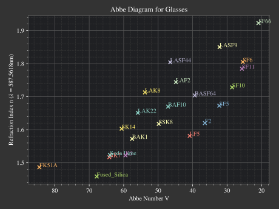
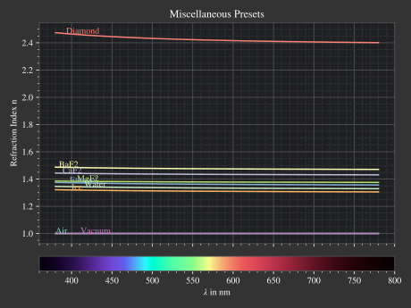
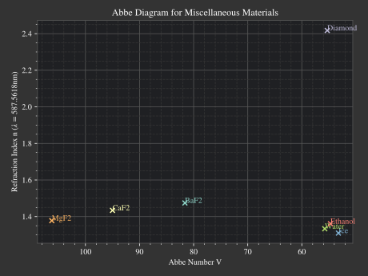

********************************
Spectrum and Refraction Index
********************************

Spectrum
==============

Definition
--------------

Functions
------------

.. TODO implement

Presets
------------

**Tristimulus Curves**

.. figure:: images/cie_cmf.svg
   :width: 600
   :align: center

   CIE 1931 xy color matching functions.

LightSpectrum
=================

Definition
-----------------

Functions
---------------

**Blackbody**

Spectral radiance according to Planck's Law: :footcite:`PlanckWiki`

.. math::
   B_\lambda (\lambda, ~T) = \frac{2 h c^2}{\lambda^5} \frac{1}{\exp\left(\frac{h  c } {\lambda k_\text{B}  T}\right) - 1}
   :label: planck_radiator

The equation contains the speed of light :math:`c`, the Planck constant :math:`h` and the Boltzmann constant :math:`k_\text{B}`:

.. math::
   c =&~ 299792458 ~\text{m/s}\\
   h =&~ 6.62607015\cdot 10^{-34} ~\text{J s}\\
   k_\text{B} =&~ 1.380649 \cdot 10^{-23} ~\text{J/K}\\

Note that :math:`\lambda` must be specified in meters.

.. topic:: Note

   The spectral radiance :math:`B_\lambda` (Power per solid angle, source area and wavelength) is given in units :math:`\text{W}/(\text{m}^3~\text{sr})`, whereas the units in this class should be :math:`\text{W/nm}` (Power per wavelength). Since :math:`B_\lambda` is constant over the source area and angle independent, converting it corresponds to a simple rescaling. 
   This is done while raytracing, where a specfic desired power is matched.

Color
----------

.. _random_wavelengths:
   
Random Wavelengths
--------------------

.. TODO different wavelength generations, mention inverse transform sampling

**Gaussian**

.. math::
   \lambda_0 =&~ \frac{1}{2}\left(1 + \text{erf}\left(\frac{\lambda_\text{min} - \mu}{\sqrt{2} \sigma}\right)\right)\\
   \lambda_1 =&~ \frac{1}{2}\left(1 + \text{erf}\left(\frac{\lambda_\text{max} - \mu}{\sqrt{2} \sigma}\right)\right)
   :label: gaussian_trunc_lambda_bounds
                
.. math::
    \Lambda = \mathcal{U}_{[\lambda_0, ~\lambda_1]} 
   :label: gaussian_trunc_lambda_distr

.. math::
   \lambda = \mu + \sqrt{2} ~ \sigma ~  \text{erf}^{-1}(2\Lambda-1)
   :label: gaussian_trunc_lambda

Presets
--------------

**Standard Illuminants**

**Line Spectra**

**sRGB illuminants**

.. _rgb_curve2_:
.. figure:: images/rgb_curves2.svg
   :width: 600
   :align: center

   sRGB primary presets.

TransmissionSpectrum
======================

Definition
--------------

Color
-----------

RefractionIndex
===================

Definition
-------------

Functions
-------------

Taken from :footcite:`ComsolDispersion` and :footcite:`ZemaxHagen`.

Wavelengths and coefficients are in powers of µm

**Cauchy**

.. math::
   n = c_0 + \frac{c_1}{\lambda^2} + \frac{c_2}{\lambda^4} + \frac{c_3}{\lambda^6}
   :label: n_cauchy

**Conrady**

.. math::
   n = c_0+ \frac{c_1} {\lambda} + \frac{c_2} {\lambda^{3.5}}
   :label: n_conrady

**Extended**

.. math::
   n^2 = c_0+c_1 \lambda^2+ \frac{c_2} {\lambda^{2}}+ \frac{c_3} {\lambda^{4}}+ \frac{c_4} {\lambda^{6}}+ \frac{c_5} {\lambda^{8}}+ \frac{c_6} {\lambda^{10}}+\frac{c_7} {\lambda^{12}}
   :label: n_extended

**Extended2**

.. math::
   n^2 = c_0+c_1 \lambda^2+ \frac{c_2} {\lambda^{2}}+ \frac{c_3} {\lambda^{4}}+\frac{c_4} {\lambda^{6}}+\frac{c_5} {\lambda^{8}}+c_6 \lambda^4+c_7 \lambda^6
   :label: n_extended2

**Handbook of Optics 1**

.. math::
   n^2 = c_0+\frac{c_1}{\lambda^2-c_2}-c_3 \lambda^2
   :label: n_optics1

**Handbook of Optics 2**

.. math::
   n^2 = c_0+\frac{c_1 \lambda^2}{\lambda^2-c_2}-c_3 \lambda^2
   :label: n_optics2

**Herzberger**

.. math::
   \begin{align}
   n =&~ c_0+c_1 L+c_2 L^2+c_3 \lambda^2+c_4 \lambda^4+c_5 \lambda^6 \\
   &\text{ with   } L= \frac{1} {\lambda^2-0.028 {\mu m^2}}
   \end{align}
   :label: n_herzberger

**Sellmeier1**

.. math::
   n^2 = 1+\frac{c_0 \lambda^2}{\lambda^2-c_1}+\frac{c_2 \lambda^2}{\lambda^2-c_3}+\frac{c_4 \lambda^2}{\lambda^2-c_5}
   :label: n_sellmeier1 

**Sellmeier2**

.. math::
   n^2 = 1+c_0+\frac{c_1 \lambda^2}{\lambda^2-c_2^2}+\frac{c_3}{\lambda^2-c_4^2}
   :label: n_sellmeier2 

**Sellmeier3**

.. math::
   n^2 = 1+\frac{c_0 \lambda^2}{\lambda^2-c_1}+\frac{c_2 \lambda^2}{\lambda^2-c_3}+\frac{c_4 \lambda^2}{\lambda^2-c_5}+\frac{c_6 \lambda^2}{\lambda^2-c_7}
   :label: n_sellmeier3 

**Sellmeier4**

.. math::
   n^2 = c_0+\frac{c_1 \lambda^2}{\lambda^2-c_2}+\frac{c_3 \lambda^2}{\lambda^2-c_4}
   :label: n_sellmeier4 

**Sellmeier5**

.. math::
   n^2 = 1+\frac{c_0 \lambda^2}{\lambda^2-c_1}+\frac{c_2 \lambda^2}{\lambda^2-c_3}+\frac{c_4 \lambda^2}{\lambda^2-c_5}+\frac{c_6 \lambda^2}{\lambda^2-c_7}+\frac{c_8 \lambda^2}{\lambda^2-c_9}
   :label: n_sellmeier5 

**Schott**

.. math::
   n^2 = c_0+c_1 \lambda^2+\frac{c_2}{ \lambda^{2}}+\frac{c_3} {\lambda^{4}}+\frac{c_4} {\lambda^{6}}+\frac{c_5} {\lambda^{8}}
   :label: n_schott 

Abbe Number
--------------

.. math::
   V = \frac{n_\text{c} - 1}{n_\text{s} - n_\text{l}}
   :label: abbe_eq

With :math:`n_\text{s},~n_\text{c},~n_\text{l}` are the short, center and long wavelength refraction index.

Curve from Abbe Number
-----------------------

.. math::
   n = A + \frac{B}{\lambda^2 - d}
   :label: n_from_abbe_base

With :math:`d=0.014\, \mu\text{m}^2` which is a compromise between the Cauchy (:math:`d=0`) and the Herzberger (:math:`d=0.028\,\mu\text{m}^2`) model.

With :math:`n_\text{s}=n(\lambda_\text{s}),~n_\text{c}=n(\lambda_\text{c}),~n_\text{l}=n(\lambda_\text{l})` and the Abbe number equation in {} we can solve for :math:`A,~B`:

.. math::
   B =&~ \frac{1}{V}\frac{n_\text{c}-1}{\frac{1}{\lambda^2_\text{s} - d} - \frac{1}{\lambda^2_\text{l}-d}}\\
   A =&~ n_\text{c} - \frac{B}{\lambda^2_\text{c}-d}
   :label: n_from_abbe_solution

:math:`V`, :math:`n_\text{c}` and the spectral lines :math:`\lambda_\text{s},~\lambda_\text{c},~\lambda_\text{l}` are provided by the user.

Presets
--------------

**Glass**

.. figure:: images/glass_presets_n.svg
   :width: 600
   :align: center

   Refraction index curves for different glass presets.

   
   Abbe diagram for different glass presets.

**Plastics**

.. figure:: images/plastics_presets_n.svg
   :width: 600
   :align: center
   
   Refraction index curves for different plastic presets.

.. figure:: images/plastics_presets_V.svg
   :width: 600
   :align: center
   
   Abbe diagram for different plastic presets.

**Misc**

   Refraction index curves for miscellaneous presets.

   
   Abbe diagram for miscellaneous presets.

------------

**Sources**

.. footbibliography::

