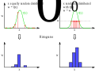
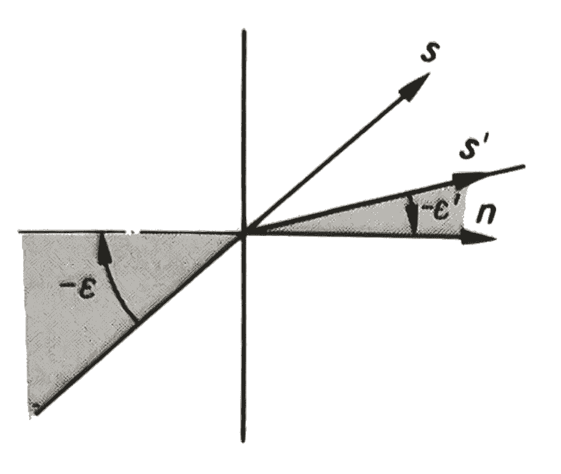
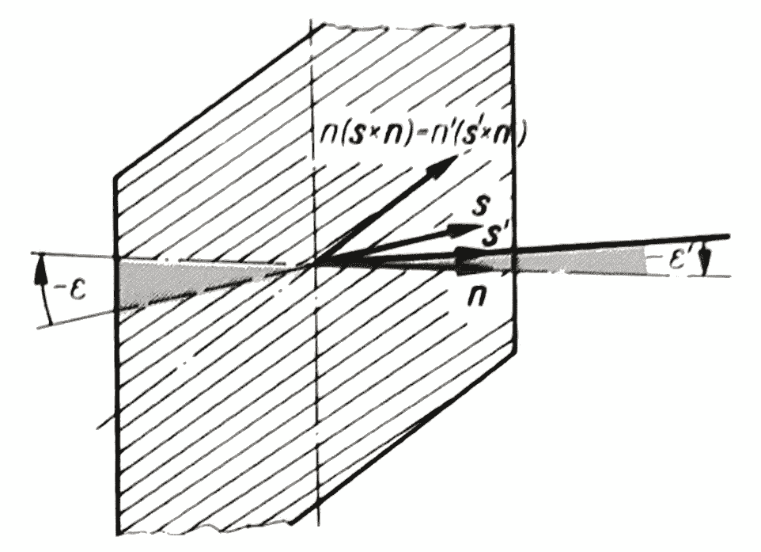
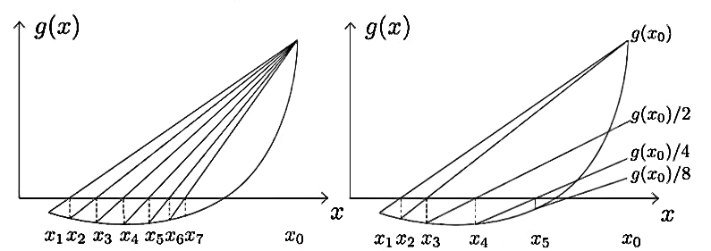

*********************************
Tracing
*********************************

Sampling
====================

Optrace approximates optical effects by utilizing an Unbiased Quasi Monte Carlo simulation. 
Inverse Transform Sampling is used as method for non-uniform random variate generation and Stratified Sampling as low discrepancy method for the generation of the initial uniform random variable.

A brief, not entirely accurate description of these terms:

**Monte Carlo Simulation:** An algorithm class, that approximates a physical or mathematical problem with many degrees of freedom by randomly chosing and simulating a subset of all property and variable combinations.

**Quasi Monte Carlo Simulation:** Monte Carlo Simulation, but the sampling is not truly random or pseudo-random. Instead it has some underlying deterministic or semi-deterministic nature to it. See low-discrepancy methods below.

**Unbiased and Biased Methods:** Performing an unbiased monte carlo simulation with an infinitely large set of samples produces an exact description of the physical system. Starting with few samples, with a larger and larger number the simulation converges towards this exact behavior. In contrast, a biased simulation never reaches a fully accurate description of the system.
Biased methods can consist of neural network tasks or algorithms that comprise of some simplification of the system model.
A more mathematical descriptions of biasedness can be found here:
https://www.scratchapixel.com/lessons/mathematics-physics-for-computer-graphics/monte-carlo-methods-mathematical-foundations/estimators

**Non-Uniform Random Variate Generation:** Generating random numbers, while some numbers are more likely to be chosen than others. The probability distribution is non-uniform.

**Low Discrepancy Method:** Methods that generate numbers, where the distribution of these values inside are given interval only deviates weakly from an equidistribution. White noise would be a high discrepancy method, while a regular value grid is a zero discrepancy method. Low discrepancy methods can be seen as a compromise between those two, trying to create values that fill an interval or area more uniformly than random values, but are less "obviously deterministic" than simple grids.

**Stratified Sampling:** One of many low discrepancy methods. Random values are chosen from a set of sub-groups.
It is guaranteed, that values are chosen from every sub-group (e.g. different intervals), but the values inside each sub-group are chosen randomly (e.g. random positions inside each interval)

**Inverse Transform Sampling:** Generating non-uniform random numbers according to a known distribution function by utilizing the inverse transform method.
See below for a mathematical definition.
Important, alternative sampling methods include: Importance Sampling, Rejection Sampling

Density
----------------

**Relevancy Sampling**

   Sampling Comparison

**Inverse Transform Sampling**

To calculate a random variable :math:`\mathcal{T}` with probability distribution function :math:`\text{pdf}(x)` from a uniform random variable :math:`\mathcal{U}_{[0,~1]}` we make use of the inverse transform sampling theorem.

.. math::
   \mathcal{T}_{[0,~1]} = \text{cdf}^{-1}(\mathcal{U}_{[0,~1]})

Where :math:`\text{cdf}^{-1}(x)` is the inverse function of the cumulative distribution function :math:`\text{cdf}(x) = \int_{-\infty}^{x} \text{pdf}(\chi) ~\text{d}\chi`.

This can be generalized for an interval :math:`[a,~b]` of an arbitrary function :math:`f(x)` with :math:`F(x) = \int_{-\infty}^{x} f(\chi)~\text{d}\chi` with :math:`F(x)` needing to be injective.

.. math::
   \mathcal{T}_{[a,~b]} = \text{F}^{-1}(\mathcal{U}_{[\text{F}(a),~\text{F}(b)]})

.. A change of interval :math:`\mathcal{U}_{[0,~1]} \to \mathcal{U}_{[\text{F}(a),~\text{F}(b)]}` leads to :math:`\mathcal{T}_{[0,~1]} \to \mathcal{T}_{[a,~b]}`.

.. The overall probability :math:`P = \int_{-\infty}^{+\infty} \text{f}(\chi) ~\text{d}\chi` does not need to be :math:`1` like for a :math:`\text{pdf}`, since it can be shown that a normalization :math:`\text{pdf}(x) = f(x)/k` is linear in :math:`\text{cdf}` and also :math:`\text{cdf}^{-1}`, leading to :math:`\mathcal{T}  \to \mathcal{T}/k`, which can be ommitted if :math:`\mathcal{T}` is desired.

Regarding the injectivity condition, this can be simply ensured by :math:`f(x) > 0 ~\forall ~ x \in [a,~b]`.

Direction
---------------

Spectrum
----------------

Polarization
-------------------

Power
----------------------

Tracing Process
========================

Refraction
====================

   Images and Equation: :cite:`OptikHaferkorn`

.. math::
   s^{\prime}=\frac{n_1}{n_2} s-n\left\{\frac{n_1}{n_2}(n s)-\sqrt{1-\left(\frac{n_1}{n_2}\right)^{2}\left[1-(n s)^{2}\right]}\right\}
   :label: refraction

Polarization
====================

Transmission
====================

Source: :cite:`FresnelWiki`

.. math::
   t_{\mathrm{s}}=\frac{2\, n_{1} \cos \varepsilon}{n_{1} \cos \varepsilon+n_{2} \cos \varepsilon'}
   :label: ts_coeff

.. math::
   t_{\mathrm{p}}=\frac{2\, n_{1} \cos \varepsilon}{n_{2} \cos \varepsilon+n_{1} \cos \varepsilon'}
   :label: tp_coeff

.. math::
   T=\frac{n_{2} \cos \varepsilon'}{n_{1} \cos \varepsilon} \left( (A_\text{ts} t_\text{s})^2  + (A_\text{tp} t_\text{p})^2 \right)
   :label: T

For light hitting the surface perpendicular this yields an expression independent of the polarization:

.. math::
   T_{\varepsilon=0} = \frac{4 n_1 n_2 }{(n_1 + n_2)^2}

Filtering
==================

Geometry Checks
==========================

Outline Intersection
========================

Abnormal Lens Rays
==========================

Hit Finding
=============================

For inbuilt analytical types the hit finding is described in {}.

Bound Calculation
-----------------------

Intersections
--------------------

.. math::
   \text{Ray support vector:}~~~~   \vec{p_0} &= (p_x, p_y, p_z)\\
   \text{Ray direction vector:}~~~~ \vec{s} &= (s_x, s_y, s_z)\\
   \text{Point on Ray:}~~~~ \vec{p_t} &= (x_t, y_t, z_t)\\

Ray line equation depending on ray parameter :math:`t`:

.. math::
   \vec{p_t}(t)=\vec{p}_{0}+t \cdot \vec{s}
   :label: pt

Cost function :math:`G` with surface function :math:`f`:

.. math::
   G(t)=z_{t}-f\left(x_{t}, y_{t}\right)
   :label: G

   Comparison of the standard Regula-Falsi-algorithm (left) and the Illinois-algorithm :cite:`DiscontinuitiesSlides`.

Detector Intersection
=========================

Image Rendering
====================

