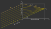

*********************************
Tracing
*********************************

Tracing Process
========================

.. TODO some diagram showing tracing steps

Refraction
====================

The following figure shows the refraction of a ray on a curved surface.

.. figure:: images/refraction_interface.svg
   :width: 300
   :align: center
   
   Refraction on a curved interface.

:math:`n_1, n_2` are the refractive indices of the media, :math:`s,s'` input and output propagation vectors. Both these vectors, as well as the normal vector :math:`n`, need to be normalized for subsequent calculations. Note that :math:`s` and :math:`n` need to point in the same half space direction, meaning :math:`s \cdot n \geq 0`.

Commonly found forms of the law of refraction are composed of an input and output angle. For the tracing process a form having only vectors as parameters, as well as circumventing the calculation of any angles, would be more convenient. 

**Case 1**

For :math:`s \nparallel n` such an equation can be found in :footcite:`OptikHaferkorn`:

.. math::
   s^{\prime}=\frac{n_1}{n_2} s-n\left\{\frac{n_1}{n_2}(n s)-\sqrt{1-\left(\frac{n_1}{n_2}\right)^{2}\left[1-(n s)^{2}\right]}\right\}
   :label: refraction

**Case 2**

For :math:`s \parallel n` the output direction :math:`s'` is simply equal to :math:`s`.

.. _tracing_pol:

Polarization
====================

The polarization vector :math:`E` can be decomposed into a :math:`E_\text{p}` -component, lying in the surface normal - incidence vector plane, and a :math:`E_\text{s}` -component lying perpendicular to this plane. With refraction on an interface the component :math:`E_\text{s}` is equal for both ray vectors :math:`s, s'`, while :math:`E_\text{p}` is rotated around :math:`E_\text{s}` towards :math:`s'` creating the new component :math:`E_\text{p}'`.
Note that for our calculations all vectors are unity vectors, while length information of the polarization components is contained in the scaling factors :math:`A_\text{tp}, A_\text{ts}`.

.. figure:: images/refraction_interface_polarization.svg
   :width: 500
   :align: center

   Ray polarization components before and after refraction.

**Case 1**:

For :math:`s \parallel s'` the new polarization vector is equal to the old one.

**Case 2**

For :math:`s \nparallel s'` the new polarization vector differs from the old one.

According to optics the polarization and polarization components need to be orthogonal to the propagation direction. 
Additionally, both polarization components are perpendicular to each other. Assuming all mentioned vectors are unity vectors, we can calculate:

.. math::
    \begin{align}
    E_\text{s} &= \frac{s' \times s}{|| s' \times s ||}\\
    E_\text{p} &= E_\text{ts} \times s\\
    E_\text{p}' &= E_\text{ts} \times s'\\
    \end{align}
    :label: pol_E

Since :math:`||E_\text{p}|| = ||E_\text{s}|| = ||E|| = 1` the amplitude components are then:

.. math::
   \begin{align}
        A_\text{tp} &= E_\text{p} \cdot E\\
        A_\text{ts} &= E_\text{s} \cdot E\\
   \end{align}
   :label: pol_A

For the new polarization unity vector, which also composed of two components, we finally get

.. math::
   E' = A_\text{ps} E_\text{s} + A_\text{tp} E_\text{p}'
   :label: pol_E2

Transmission
====================

According to the Fresnel equations the transmission of light is dependent on the polarization direction.
The subsequent equations describe this behavior :footcite:`FresnelWiki`.

.. math::
   t_{\mathrm{s}}=\frac{2\, n_{1} \cos \varepsilon}{n_{1} \cos \varepsilon+n_{2} \cos \varepsilon'}
   :label: ts_coeff

.. math::
   t_{\mathrm{p}}=\frac{2\, n_{1} \cos \varepsilon}{n_{2} \cos \varepsilon+n_{1} \cos \varepsilon'}
   :label: tp_coeff

.. math::
   T=\frac{n_{2} \cos \varepsilon'}{n_{1} \cos \varepsilon} \left( (A_\text{ts} t_\text{s})^2  + (A_\text{tp} t_\text{p})^2 \right)
   :label: T

:math:`A_\text{ts}` and :math:`A_\text{tp}` are the polarization components from equations :math:numref:`pol_A`. Occurring cosine terms are calculated as :math:`\cos \varepsilon = n \cdot s` and :math:`\cos \varepsilon' = n \cdot s'`.

For light hitting the surface perpendicular this yields an expression independent of the polarization:

.. math::
   T_{\varepsilon=0} = \frac{4 n_1 n_2 }{(n_1 + n_2)^2}
   :label: T_special

Refraction at an Ideal Lens
===========================

Ray with unnormalized direction vector :math:`s_0` and intersection :math:`P = (x_0, y_0, 0)` on the lens with focal length :math:`f` and the corresponding point on the focal plane :math:`P_f = (x_f, y_f, f)`.
Optics tells us that ideally parallel rays meet in the same position in the focal plane. Therefore a ray with the same direction, but hitting the lens at the optical axis, can used to determine position :math:`P_f`.

.. _image_ideal_refraction:

   Geometry for refraction on an ideal lens.

**Cartesian Representation**

Calculating positions :math:`x_f,~y_f` is simply done calculating the linear ray equations :math:`x(z), y(z)` at :math:`z=f`.
For :math:`x_f` we get:

.. math::   
   x_f = \frac{s_{0x}}{s_{0z}} f
   :label: refraction_ideal_xf

Similarly for :math:`y_f`

.. math::
   y_f = \frac{s_{0y}}{s_{0z}} f
   :label: refraction_ideal_yf

:math:`s_{0z} = 0` is prohibited by forcing all rays to have a positive z-direction component.

Knowing point :math:`P_f` the outgoing propagation vector :math:`s_0'` is calculated.

.. math::
   s_0' = P_f - P = \begin{pmatrix} \frac{s_{0x}}{s_{0z}}f - x_0 \\ \frac{s_{0y}}{s_{0z}}f - y_0 \\ f \end{pmatrix}
   :label: refraction_ideal_s0

Normalizing gets us:

.. math::
   s' = \frac{s_0'}{||s_0'||}
   :label: refraction_ideal_s0_normalized

**Angular Representation**

Taking the x-component of the propagation vector

.. math::
   s_{0x}' = \frac{s_{0x}}{s_{0z}}f - x_0

and dividing it by :math:`f` gives us

.. math::
   \frac{s_{0x}'}{f} = \frac{s_{0x}}{s_{0z}} - \frac{x_0}{f}

From :numref:`image_ideal_refraction` follows :math:`\tan \varepsilon_x' = \frac{s_{0x}}{f}` and :math:`\tan \varepsilon_x = \frac{s_{0x}}{s_{0z}}` and therefore

.. math::
   \tan \varepsilon_x' = \tan \varepsilon_x - \frac{x_0}{f}

Analogously in y-direction we get

.. math::
   \tan \varepsilon_y' = \tan \varepsilon_y - \frac{y_0}{f}

This angular representation is a formulation also found in :footcite:`BRULS2015659`.

Filtering
==================

When passing through a filter a ray with power :math:`P_i` and wavelength :math:`\lambda_i` gets attenuated according to the filter's transmission function :math:`T_\text{F}(\lambda)`:

.. math::
   P_{i+1} = 
   \begin{cases}
        P_{i}~ T_\text{F}(\lambda_i) & \text{for}~~ T_\text{F}(\lambda_i) > T_\text{th}\\
        0  & \text{else}\\
   \end{cases}
   :label: eq_filtering

Additionally, ray powers get set to zero if the transmission falls below a specific threshold :math:`T_\text{th}`. By doing so, *ghost rays* are avoided, these are rays that still need to be propagated while raytracing, but hold only little power. Because their contribution to image forming is negligible, they should be absorbed as soon as possible to speed up tracing.

As a side note, apertures are also implemnted as filters, but with :math:`T_\text{F}(\lambda) = 0` for all wavelengths.

Geometry Checks
==========================

Outline Intersection
========================

Abnormal Lens Rays
==========================

Hit Finding
=============================

Hit finding for analytical surfaces is described in :numref:`analytical_hit_find` and for numerical/user function surfaces in :numref:`numerical_hit_find`.

Detector Intersection
=========================

Image Rendering
====================

TODO

------------

**Sources**

.. footbibliography::

