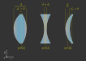

Defining Elements (Lens, RaySource, Detector, Filter, Aperture, Marker)
------------------------------------------------------------------------

.. testsetup:: *

   import optrace as ot
   import numpy as np

RaySource
_______________________

**Overview**

A RaySource defines the properties for rays that it creates, including

 * Emitting area/point/line
 * light distribution on this area (=image)
 * Emitted spectrum and power
 * Ray Polarization
 * Ray orientation
 * Ray divergence
 * Source position

**Surface/Point/Line Parameter**

A RaySource supports the following base shapes ``Point, Line, CircularSurface, RectangularSurface, RingSurface``, which are provided as first parameter to the ``RaySource()`` function.

.. testcode::

   circ = ot.CircularSurface(r=3)
   RS = ot.RaySource(circ)

**Position Parameter**

The position in three-dimensional space is provided by the ``pos``-parameter.

.. testcode::

   RS = ot.RaySource(circ, pos=[0, 1.2, -3.5])

**Power Parameter**

Providing the ``power`` you can define the cumulative power of all rays. This proves especially useful when working with multiple sources and different power ratios.

.. testcode::

   RS = ot.RaySource(circ, power=0.5)

**Orientation Parameter**

The base orientation type of the rays is defined by the ``orientation``-parameter.

For ``orientation="Constant"`` the orientation is independent of the position on the emitting area.
In this case you can provide the orientation vector using the ``s``-parameter in cartesian coordinates.

.. testcode::

   RS = ot.RaySource(circ, orientation="Constant", s=[0.7, 0, 0.7])

Or with ``s_sph`` for spherical coordinates, where the first one is the angle between the orientation and the optical axis and the second the angle inside the lateral plane. Values are provided in degrees, for instance:

.. testcode::

   RS = ot.RaySource(circ, orientation="Constant", s_sph=[20, -30])

It is also possible to define orientations depending on the position of the rays. For this we need to set ``orientation="Function"`` and provide the ``or_func`` parameter.
This parameter takes two numpy arrays containing the x and y-position and returns a two dimensional array with cartesian vector components in rows.

.. testcode::

   def or_func(x, y, g=5):
       s = np.column_stack((-x, -y, np.ones_like(x)*g))
       ab = (s[:, 0]**2 + s[:, 1]**2 + s[:, 2]**2) ** 0.5
       return s / ab[:, np.newaxis]
   
   RS = ot.RaySource(circ, orientation="Function", or_func=or_func)

As with other functions we can also provide a keyword argument dictionary for the function, in our case this is done by the ``or_args`` parameter.

.. testcode::

   ... 
   RS = ot.RaySource(circ, orientation="Function", or_func=or_func, or_args=dict(g=10))

**Spectrum Parameter**

A ``LightSpectrum`` object is provided with the ``spectrum`` parameter.
For instance, this can be a predefined spectrum:

.. testcode::

   RS = ot.RaySource(circ, spectrum=ot.presets.light_spectrum.d75)

Or a user defined one:

.. testcode::

   spec = ot.LightSpectrum("Monochromatic", wl=529)
   RS = ot.RaySource(circ, spectrum=spec)

**Divergence Parameter**

Divergence defines how rays are distributed relative to their base orientation (``orientation`` parameter).

With ``divergence="Non"`` all rays follow their orientation:

.. testcode::

   RS = ot.RaySource(circ, divergence="None", s=[0.7, 0, 0.7])

Paired with ``orientation="Constant"`` all rays are emitted in parallel.

We can also define lambertian divergence, which follows the cosine law.
``div_angle`` defines the half opening angle of the cone volume in which the divergence is generated.

.. testcode::

   RS = ot.RaySource(circ, divergence="Lambertian", div_angle=10)

``divergence="Isotropic"`` defines divergence with equal proability in all directions, but again only inside the cone defined by ``div_angle``.

.. testcode::

   RS = ot.RaySource(circ, divergence="Isotropic", div_angle=10)

User functions can be defined by ``divergence="Function"`` and providing the ``div_func`` parameter.
This function must take angular values in radians up to ``div_angle`` and return a normalized or unnormalized  probability.

.. testcode::

   RS = ot.RaySource(circ, divergence="Function", div_func=lambda e: np.cos(e)**2, div_angle=10)

For all the combinations above we can also generate a direction distribution inside an circular arc instead of a cone. The correct way to do this is by setting ``div_2d=True``. With ``div_axis_angle`` we can additionally define the orientation of this arc distribution.

.. testcode::

   RS = ot.RaySource(circ, divergence="Function", div_func=lambda e: np.cos(e)**2, div_2d=True, div_axis_angle=20, div_angle=10)

**Image Parameter**

Alternatively to a uniformly emitting area there is the possiblity to provide light distributions (=images).

For this the emitting surface needs to be a ``RectangularSurface``. The image itself can be provided as numpy array, path or preset.

.. testcode::

   rect = ot.RectangularSurface(dim=[2, 3])
   RS = ot.RaySource(rect, image=ot.presets.image.landscape)

.. testcode::

   image = np.random.sample((300, 300, 3))
   RS = ot.RaySource(rect, image=image)

.. code-block:: python

   RS = ot.RaySource(rect, image="test_image.png")

Every image color generates a specific physical spectrum matching its color. This spectrum is a linear combination of the sRGB primaries in <>.

With ``image`` specified the ``spectrum`` is unused.

**Polarization Parameter**

The polarization parameter describes the distribution of the direction of linear light polarizations.

In the default case the directions are random, specified by ``polarization="Uniform"``.

.. testcode::

   RS = ot.RaySource(circ, polarization="Uniform")

``polarization="x"`` defines polarizations parallel to the x-axis.

.. testcode::

   RS = ot.RaySource(circ, polarization="x")

``polarization="y"`` defines polarizations parallel to the y-axis.

.. testcode::

   RS = ot.RaySource(circ, polarization="y")

``polarization="xy"`` defines random polarizations of x or y-direction.

.. testcode::

   RS = ot.RaySource(circ, polarization="xy")

The user can also set a user-defined value with ``polarization="Constant"`` and the ``pol_angle`` parameter.
The polarization direction is defined by an angle inside the plane perpendicular to the ray direction.

.. testcode::

   RS = ot.RaySource(circ, polarization="Constant", pol_angle=12)

Or alternatively a list with ``polarization="List"``, the angular values in ``pol_angles`` and their probabilities in ``pol_probs``.

.. testcode::

   RS = ot.RaySource(circ, polarization="List", pol_angles=[0, 45, 90], pol_probs=[0.5, 0.25, 0.25])

Lastly, a user defined function can be set with  ``polarization="Function"`` and the ``pol_func`` parameter.
This parameter takes angles in range :math:`[0, ~2 \pi]` and returns a normalized or unnormalized probability.

Above we talked how for instance for ``polarization="x"`` the rays are parallel to the x-axis. However, depending on their actual ray orientation this isn't always the case. Read about what the angles mean for rays not parallel to the optical axis in <>.

.. testcode::

   RS = ot.RaySource(circ, polarization="Function", pol_func=lambda ang: np.exp(-(ang - 30)**2/10))

Lens
________

A Lens consists of two surfaces and a medium with a RefractionIndex between them.
Additionally we need to provide the position and some thickness parameter, that will be explained later.

**Example**

.. testcode:: 

   sph1 = ot.SphericalSurface(r=3, R=10.2)
   sph2 = ot.SphericalSurface(r=3, R=-20)
   n = ot.RefractionIndex("Sellmeier2", coeff=[1.045, 0.266, 0.206, 0, 0])

   L = ot.Lens(sph1, sph2, n=n, pos=[0, 2, 10], de=0.5)

To define a non-standard medium (not the one defined by the raytracing geometry) we can provide the ``n2`` parameter, that defines the medium after the second lens surface.

.. testcode::

   n2 = ot.RefractionIndex("Constant", n=1.2)
   L = ot.Lens(sph1, sph2, n=n, pos=[0, 2, 10], de=0.5, n2=n2)

**Lens Thickness**

To allow for simple definitions of lens thickness and positions, there are multiple ways to define the thickness:

* ``d``: thickness at the optical axis
* ``de``: thickness extension. Distance between largest z-position on front and lowest z-position on back
* ``d1``: distance between front surface center z-position and z-position of ``pos`` of Lens
* ``d2``: distance between z-position of ``pos`` of Lens and z-position of the back surface center

   :math:`d` and :math:`d_\text{e}` for a convex lens, a concave lens and a meniscus lens

While for a convex lens using the ``de`` is most comfortable, for concave or meniscus lenses the thickness at the optical axis ``d`` proves more useful.
For instance, a concave lens can be defined like this:

.. testcode::

   L = ot.Lens(sph2, sph1, n=n, pos=[0, 2, 10], d=0.5)

When the lens is defined by ``d`` or ``de`` the position ``pos[2]`` is at the center of the ``d`` or ``de`` distance.

With the ``d1`` and ``d2`` parameters we can control the position of both surfaces relative to the lens position manually. For instance with ``d1=0, d2=...`` the lens front starts exactly at the ``pos`` of the Lens.
On the other hand setting ``d1=..., d2=0`` leads to the back surface center ending at ``pos``.

.. figure:: ../images/lens_thickness_position.svg
   :align: center
   :width: 500

   Defining a convex lens by ``de=...``, by ``d1=0, d2=...`` and by ``d1=..., d2=0``.

All cases in-between are also viable, for instance:

.. testcode::

   L = ot.Lens(sph1, sph2, n=n, pos=[0, 2, 10], d1=0.1, d2=0.6)
   
But only as long as the surfaces don't collide.
With a Lens object you can also access the thickness parameters:

.. doctest::

   >>> L.d
   0.7

.. doctest::
   
   >>> L.de
   0.022566018848339198

.. doctest::
   
   >>> L.d1
   0.1

.. doctest::
   
   >>> L.d2
   0.6

Or the parameters of its surfaces, like:

.. doctest::

   >>> L.front.ds
   0.4511539144368477

**Paraxial Properties**

As for a setup of many lenses, we can also do paraxial analysis on a simple lens.

To create a ray transfer matrix analysis object we call the member function ``tma()``.
From there on we can use it as described in <>.

.. doctest::

   >>> tma = L.tma()
   >>> tma.efl
   12.749973064518542

As the behavior can differ with the light wavelength, we can also provide a non-default wavelength in nanometers.
Since the lens has no knowledge of the geometry around it, the medium before it is also undefined. By default, a constant refractive index of 1 is assumed, but can be overwritten with the paramter ``n0``.

.. doctest::

   >>> tma = L.tma(589.2, n0=ot.RefractionIndex("Constant", n=1.1))
   >>> tma.efl
   17.300045148757384

Ideal Lens
_____________

An IdealLens focusses and images light perfectly and without aberrations according to the imaging equation. The geometry is an infinitesimal thin circular area with radius ``r``.
Additionally we need to provide the optical power ``D`` and a position ``pos``.

.. testcode::

   IL = ot.IdealLens(r=5, D=12.5, pos=[0, 0, 9.5])

As for a normal Lens a ``n2`` can be defined. Note that this does not change the optical power or focal length, as they are controlled by the ``D`` parameter.

.. testcode::

   n2 = ot.RefractionIndex("Constant", n=1.25)
   IL = ot.IdealLens(r=4, D=-8.2, pos=[0, 0, 9.5], n2=n2)

Filter
___________

When light hits a Filter part of the ray power is transmitted according to the filter's transmittance function.

A Filter is defined by a Surface, a position and the TransmissionSpectrum

.. testcode::

   spec = ot.TransmissionSpectrum("Rectangle", wl0=400, wl1=500, val=0.5)
   circ = ot.CircularSurface(r=5)
   F = ot.Filter(circ, pos=[0, 0, 23.93], spectrum=spec)

With a filter at hand we can calculate its approximate sRGB color. The fourth return value is the opacity for visualization. Note that the opacity is more like a visual extra than a simulation of the actual opacity.

.. doctest::

   >>> F.color()
   (2.359115924484492e-07, 0.2705811859857049, 0.9999999999999999, 0.9838657805329205)

Calling the filter with wavelengths returns the transmittance at these wavelengths.

.. doctest::

   >>> wl = np.array([380, 400, 550])
   >>> F(wl)
   array([0. , 0.5, 0. ])

When tracing the Raytracer sets all transmission values below a specific threshold ``T_TH`` to zero. This is done to avoid ghost rays, that are rays that merely contribute to the light distribution or image but are nonetheless calculated and reduce performance. An example could be rays far away from the mean value in normal distribution/ gaussian function.

By default the threshold value is

.. doctest::

   >>> ot.Raytracer.T_TH
   1e-05

Aperture
________________

An Aperture is just a Filter that absorbs complete. In the most common use cases a RingSurface is applied as Aperture surface. As for other elements, we also need to specify the position ``pos``.

.. testcode::

   ring = ot.RingSurface(ri=0.05, r=5)
   AP = ot.Aperture(ring, pos=[0, 2, 10.1])

Detector
__________________

A Detector enables us to render images and spectra on its geometry. But by itself, it has no effect on raytracing.

It takes a surface parameter and the position parameter as arguments.

.. testcode::

   rect = ot.RectangularSurface(dim=[1.5, 2.3])
   Det = ot.Detector(rect, pos=[0, 0, 15.2])

PointMarker
_________________

A PointMarker is used to annotate positions or elements inside the tracing geometry. While itself having no influence on the tracing process.

In the simplest case a PointMarker is defined with a text string and a position.

.. testcode::

   M = ot.PointMarker("Text132", pos=[0.5, 9.1, 0.5])

One can scale the text and marker with ``text_factor`` or ``marker_factor``. The actual size change is handled by the plotting GUI.

.. testcode::

   M = ot.PointMarker("Text132", pos=[0.5, 9.1, 0.5], text_factor=2.3, marker_factor=0.5)

We can also hide the marker point and only display the text with the parameter ``label_only=True``.

.. testcode::

   M = ot.PointMarker("Text132", pos=[0.5, 9.1, 0.5], label_only=True)

In contrast, we can hide the text and only plot the marker point by leaving the text empty:

.. testcode::

   M = ot.PointMarker("", pos=[0.5, 9.1, 0.5])

LineMarker
_________________

Similarly, a LineMarker is a Line in the xy-plane with a text annotation.

In the simplest case a LineMarker is defined with a text string, radius, angle and a position.

.. testcode::

   M = ot.LineMarker(r=3, desc="Text132", angle=45, pos=[0.5, 9.1, 0.5])

One can scale the text and marker with ``text_factor`` or ``line_factor``. The actual size change is handled by the plotting GUI.

.. testcode::

   M = ot.LineMarker(r=3, desc="Text132", pos=[0.5, 9.1, 0.5], text_factor=2.3, line_factor=0.5)

We can hide the text and only plot the marker line by leaving the text empty:

.. testcode::

   M = ot.LineMarker(r=3, desc="", pos=[0.5, 9.1, 0.5])

