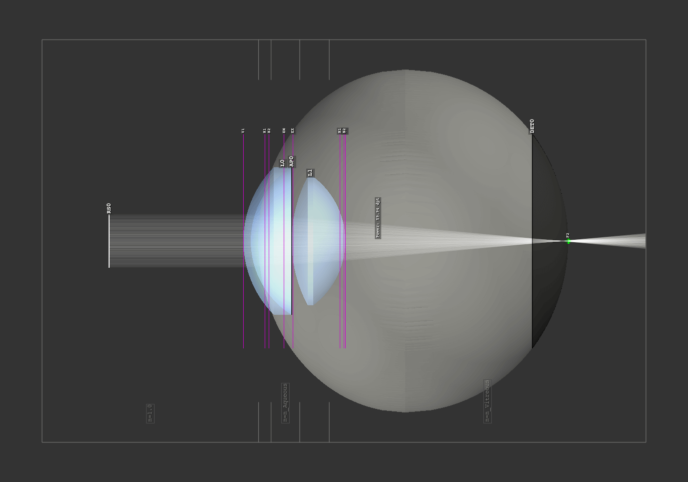
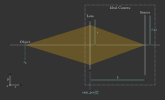

Base Geometries
------------------------------------------------

.. |IdealLens| replace:: :class:`IdealLens <optrace.tracer.geometry.ideal_lens.IdealLens>`
.. |Lens| replace:: :class:`Lens <optrace.tracer.geometry.lens.Lens>`
.. |Group| replace:: :class:`Group <optrace.tracer.geometry.group.Group>`
.. |Element| replace:: :class:`Element <optrace.tracer.geometry.element.Element>`
.. |Raytracer| replace:: :class:`Raytracer <optrace.tracer.raytracer.Raytracer>`

.. testsetup:: *

   import optrace as ot
   ot.global_options.show_progressbar = False

.. role:: python(code)
  :language: python
  :class: highlight

.. TODO part about rotation and flipping. Here or somewhere elese? Includes surfaces, groups, SObjects

Elements
__________________

Types
##############

In `optrace` the class |Element| denotes an object which has no, one or two surfaces and belongs to the tracing geometry.

**Tracing Elements**

Tracing elements are Elements with direct ray interaction:

.. list-table::
   :widths: 100 400
   :header-rows: 0
   :align: left

   * - :class:`RaySource <optrace.tracer.geometry.ray_source.RaySource>`
     - An element with a light emitting surface
   * - |Lens|
     - An element with two surfaces on which light is refracted.
   * - |IdealLens|
     - A Lens, except that it has a planar surface and refracts light without aberrations
   * - :class:`Filter <optrace.tracer.geometry.filter.Filter>`
     - Element with a surface on which wavelength-dependent filtering takes place.
   * - :class:`Aperture <optrace.tracer.geometry.aperture.Aperture>`
     - Similar to a Filter, except that incident light is completely absorbed.

**Rendering Elements**

Elements with no ray interaction for tracing, but the possibility to render images of intersecting rays.

.. list-table::
   :widths: 100 400
   :header-rows: 0
   :align: left

   * - :class:`Detector <optrace.tracer.geometry.detector.Detector>`
     - Element with one surface on which images or spectra can be rendered

**Markers**

Markers are Elements for annotations in 3D space.

.. list-table::
   :widths: 100 400
   :header-rows: 0
   :align: left

   * - :class:`PointMarker <optrace.tracer.geometry.marker.point_marker.PointMarker>`
     - Element consisting of a point and a label
   * - :class:`LineMarker <optrace.tracer.geometry.marker.line_marker.LineMarker>`
     - Element consisting of a line and a label

**Volumes**

Objects for plotting volumes in the TraceGUI, for instance an enclosing cylinder or a medium outline.

.. list-table::
   :widths: 100 400
   :header-rows: 0
   :align: left

   * - :class:`BoxVolume <optrace.tracer.geometry.volume.box_volume.BoxVolume>`
     - Volume of a box or cube
   * - :class:`CylinderVolume <optrace.tracer.geometry.volume.cylinder_volume.CylinderVolume>`
     - Cylinder volume with the symmetry axis in direction of the optical axis
   * - :class:`SphereVolume <optrace.tracer.geometry.volume.sphere_volume.SphereVolume>`
     - A spherical volume

Usage
############

All subclasses of |Element| share the following methods and properties:

.. list-table::
   :header-rows: 1
   :align: left

   * - Functionality
     - Example
   * - move the element: 
     - :python:`El.move_to([-2.1, 0.2, 5.3])`
   * - rotate 
     - :python:`El.rotate(25)`
   * - flip around the x-axis: 
     - :python:`El.flip()`
   * - getting the extent (bounding box): 
     - :python:`ext = El.extent`
   * - determine the position: 
     - :python:`pos = El.pos`
   * - plot the geometry
     - (internal functions)

Group
________________

**Overview**

A |Group| can be seen as a list or container of several elements.

It contains the following functionality:

.. list-table::
   :widths: 300 250
   :header-rows: 1
   :align: left

   * - Functionality
     - Example
   * - Adding and removing one or more elements:
     - | :python:`G.add(obj)`
       | :python:`G.remove(obj)`
   * - Emptying all elements: 
     - :python:`G.clear()`
   * - check if an element is included: 
     - :python:`G.has(obj)`
   * - move all elements at once: 
     - :python:`G.move_to([5.3, 0.0, 12.3])`
   * - rotate or flip all elements: 
     - | :python:`G.rotate(-12)`
       | :python:`G.flip()`
   * - create ray transfer matrix of the whole lens system: 
     - :python:`G.tma()`

A |Group| object stores all elements in their own class lists:
:python:`lenses, ray_sources, detectors, markers, filters, apertures, volumes`.
Where |IdealLens| and |Lens| are included in the same list, all marker types are included in :python:`markers` and all volume types in :python:`volumes`.

When adding objects, the order of objects remains the same.
Thus :python:`lenses[2]` denotes the lens that was added third (since counting starts at 0).
For simplicity it is recommended to add objects in the order in which the light passes through them.

**Example**

The following example creates a Group consisting of an |IdealLens| and an :class:`Aperture <optrace.tracer.geometry.aperture.Aperture>`.

.. testcode::

   IL = ot.IdealLens(r=6, D=-20, pos=[0, 0, 10])
   F = ot.Aperture(ot.RingSurface(ri=0.5, r=10), pos=[0, 0, 30])

   G = ot.Group([IL, F])

Next, we flip the group, reversing the z-order of the elements and flipping each element around its x-axis through the center.
Since all elements are rotationally symmetric, this has only an effect on the order of them.
After flipping we move the group to a new position. This position is the new position for the first element (which after flipping is the filter), whereas all relative distances to all other elements are kept equal.

.. testcode::

   G.flip()
   G.move_to([0, 1, 0])

The filter is the first element and has the same position as we moved the group to.

.. doctest::

   >>> G.apertures[0].pos
   array([0., 1., 0.])

The lens has the same relative distance of :math:`\Delta z = 20` mm relative to the Filter, but in a different absolute position and now behind the filter.

.. doctest::

   >>> G.lenses[0].pos
   array([ 0.,  1., 20.])

.. _usage_raytracer:

Raytracer
________________

**Overview**

The |Raytracer| class provides the functionality for tracing, geometry checking, rendering spectra and images and focusing.

Since the |Raytracer| is a subclass of a |Group|, elements can be changed or added in the same way.

   Example of a raytracer geometry in the TraceGUI in side view

**Outline**

All objects and rays can only exist in a three-dimensional box, the *outline*.
When initializing the |Raytracer| this is passed as :python:`outline` parameter.
This is also the only mandatory parameter of this class

.. testcode::

   RT = ot.Raytracer(outline=[-2, 2, -3, 3, -5, 60])

**Geometry**

Since `optrace` implements sequential raytracing, the surfaces and objects must be in a well-defined and unique sequence. This applies to all elements with interactions of light: :python:`Lens, IdealLens, Filter, Aperture, RaySource`.
The elements :python:`Detector, LineMarker, PointMarker, BoxVolume, SphereVolume, CylinderVolume` are excluded from this.
All ray source elements must lie before all lenses, filters and apertures. And all subsequent lenses, filters, apertures must not collide and be inside the outline.

**Surrounding Media**

In :ref:`usage_lens` we will learn that when creating a lens, you can use the :python:`n2` parameter to define the subsequent medium. In the case of multiple lenses, the :python:`n2` of the previous lens is the medium before the next lens.
In the case of the raytracer, we can define an :python:`n0` which defines the refractive index for all undefined :python:`n2=None` as well as for the region to the first lens.

The following figure shows a setup with lenses :python:`L0, L2` having a :python:`n2` defined and a custom :python:`n0` parameter in the raytracer class. The medium before the first lens as well as the medium behind :python:`L1` are therefore also :python:`n0`.

.. figure:: ../images/rt_setup_different_ambient_media.svg
   :width: 700
   :align: center

   Schematic figure of a setup with a ray source, three different lenses and three different ambient media

**absorb_missing**

The :python:`absorb_missing` parameter, which is set to :python:`True` by default, ensures that light which does not hit a lens is absorbed. In principle, this is the typical and desired case. However, there are geometries where :python:`absorb_missing=False` could be useful. 

A special case is when a ray does not hit a lens where a transition from surrounding media takes place (:python:`n2` differ). Here the rays are absorbed in any case, because the boundary surface is defined only at the lens itself.

**no_pol**

The raytracer provides the functionality to trace polarization directions. Thus, not only the polarization vector for the ray and ray segment can be calculated, but also the exact transmission at each surface transition.
Unfortunately, the calculation is comparatively computationally intensive.

With the parameter :python:`no_pol=True` no polarizations are calculated and we assume unpolarized/uniformly polarized light at each transmission. Typically this speeds up the tracing by 10-30%.
Whether you can neglect the influence of polarization depends of course on the exact setup of the geometry.
However, for setups where the beam angles to the surface normals are small, this is usually the case.

**Example**

Below you can find an example. A eye preset is loaded and flipped around the x-axis.
A point source is added at the retina and the geometry is traced.

.. testcode::

   import optrace as ot

   # init raytracer 
   RT = ot.Raytracer(outline=[-10, 10, -10, 10, -10, 60])

   # load eye preset
   eye = ot.presets.geometry.arizona_eye(pupil=3)

   # flip, move and add it to the tracer
   eye.flip()
   eye.move_to([0, 0, 0])
   RT.add(eye)

   # create and add divergent point source
   point = ot.Point()
   RS = ot.RaySource(point, spectrum=ot.presets.light_spectrum.d50, divergence="Isotropic", div_angle=5,
                     pos=[0, 0, 0])
   RT.add(RS)

   # trace
   RT.trace(100000)

Loading ZEMAX Geometries (.zmx)
__________________________________

It is possible to load ``.zmx`` geometries into `optrace`. For instance, the following example load some geometry from file ``setup.zmx`` into the raytracer.

.. code-block:: python

   RT = ot.Raytracer(outline=[-20, 20, -20, 20, -20, 200])

   RS = ot.RaySource(ot.CircularSurface(r=0.05), spectrum=ot.presets.light_spectrum.d65, pos=[0, 0, -10])
   RT.add(RS)

   n_schott = ot.load_agf("schott.agf")
   G = ot.load_zmx("setup.zmx", n_dict=n_schott)
   RT.add(G)

   RT.trace(10000)

For the materials to be loaded correctly all mentioned names in the ``.zmx`` file need to be included in the :python:`n_dict` dictionary.
You can either load them from a ``.agf`` catalogue like in :numref:`agf_load` or create the dictionary manually.

A list of exemplary ``.zmx`` files can be found in the following `repository <https://github.com/nzhagen/LensLibrary/tree/main/zemax_files>`_.

Unfortunately, the support is only experimental, as there is no actual documentation on the file format. Additionally, only a subset of all ZEMAX functionality is supported, including:

* ``SEQ``-mode only
* ``UNIT`` must be ``MM``
* only ``STANDARD`` or ``EVENASPH`` surfaces, this is equivalent to :python:`RingSurface, CircularSurface, SphericalSurface, ConicSurface, AsphericSurface` in `optrace`
* no support for coatings
* temperature or absorption behavior of the material is neglected
* only loads lens and aperture geometries, no support for additional objects

Information on the file format can be found `here <https://documents.pub/document/zemaxmanual.html?page=461>`__, `here <https://github.com/mjhoptics/ray-optics/blob/master/src/rayoptics/zemax/zmxread.py>`__ and `here <https://github.com/quartiq/rayopt/blob/master/rayopt/zemax.py>`__.

Geometry Presets
_______________________

Ideal Camera
###############################

In cases of a virtual image, an additional lens or lens system is needed to create a real image.
Real lens systems come with aberrations and falsify the virtual image by adding additional errors.

For this application an ideal camera preset is included, that provides aberration-free imaging towards a detector.

The preset is loaded with :func:`ot.presets.geometry.ideal_camera <optrace.tracer.presets.geometry.ideal_camera>` and returns a |Group| object consisting of a lens and a detector.
Required parameters are the object position :python:`z_g` as well as the camera position (the position of the lens) :python:`cam_pos`, as well as the image distance :python:`b`, which in this case is just the difference distance between lens and detector.
A visual presentation of these quantities is shown in the figure below.

An exemplary call could be:

.. testcode::

   G = ot.presets.geometry.ideal_camera(cam_pos=[1, -2.5, 12.3], z_g=-56.06, b=10)

In many cases the additional lens diameter parameter :python:`r` and detector radius :python:`r_det` need to be provided:

.. testcode::

   G = ot.presets.geometry.ideal_camera(cam_pos=[1, -2.5, 12.3], z_g=-56.06, b=10, r=5, r_det=8)

The function also supports an infinite position of :python:`z_g = -np.inf`.

When given a desired object magnification :math:`m`, the image distance parameter :math:`b` can be calculated with:

.. math::

   m = \frac{b}{g} \Rightarrow b = m \cdot g

Which should be known from the fundamentals of optics.
Where :math:`g` is the object distance, in our example :python:`z_g - cam_pos[2]`.
Note that :math:`b, g`  both need to be positive for this preset.

   Visualization of the ``ideal_camera`` parameters.

LeGrand Paraxial Eye Model
###############################

The LeGrand full theoretical eye model is a simple model consisting of only spherical surfaces and wavelength-independent refractive indices. It models the paraxial behavior of a far-adapted eye.

.. list-table:: LeGrand Full Theoretical Eye Model :footcite:`SchwiegerlingOptics`
   :widths: 110 75 75 75 75
   :header-rows: 1
   :align: center

   * - Surface
     - Radius in mm
     - Conic Constant
     - Refraction Index to next surface
     - Thickness (mm) (to next surface)

   * - Cornea Anterior
     - 7.80
     - 0
     - 1.3771
     - 0.5500
		
   * - Cornea Posterior 
     - 6.50
     - 0 
     - 1.3374
     - 3.0500

   * - Lens Anterior 
     - 10.20
     - 0
     - 1.4200
     - 4.0000

   * - Lens Posterior 
     - -6.00
     - 0 
     - 1.3360
     - 16.5966

   * - Retina 
     - -13.40
     - 0 
     - `-` 
     - `-`

The preset :func:`legrand_eye <optrace.tracer.presets.geometry.legrand_eye>` is located in :mod:`ot.presets.geometry <optrace.tracer.presets.geometry>` and is called as a function. It returns a |Group| object that can be added to a |Raytracer|. Provide a :python:`pos` parameter to position it at an other position than :python:`[0, 0, 0]`.

.. testcode::

   RT = ot.Raytracer(outline=[-10, 10, -10, 10, -10, 60])
   eye_model = ot.presets.geometry.legrand_eye(pos=[0.3, 0.7, 1.2])
   RT.add(eye_model)

Optional parameters include a pupil diameter and a lateral detector (retina) radius, both provided in millimeters.

.. testcode::

   eye_model = ot.presets.geometry.legrand_eye(pupil=3, r_det=10, pos=[0.3, 0.7, 1.2])

Arizona Eye Model
#####################

A more advanced model is the :func:`arizona_eye <optrace.tracer.presets.geometry.arizona_eye>` model, which tries to match clinical levels of aberration and for different adaption levels. It consists of conic surfaces, dispersive media and adaptation dependent parameters.

.. list-table:: Arizona Eye Model :footcite:`SchwiegerlingOptics`
   :widths: 75 75 75 75 75 75
   :header-rows: 1
   :align: center

   * - Surface
     - Radius in mm
     - Conic Constant
     - Refraction Index to next surface
     - Abbe Number
     - Thickness (mm) (to next surface)

   * - Cornea Anterior
     - 7.80
     - -0.25
     - 1.377
     - 57.1
     - 0.55
		
   * - Cornea Posterior 
     - 6.50
     - -0.25
     - 1.337
     - 61.3
     - :math:`t_\text{aq}`

   * - Lens Anterior 
     - :math:`R_\text{ant}`
     - :math:`K_\text{ant}`
     - :math:`n_\text{lens}`
     - 51.9
     - :math:`t_\text{lens}`

   * - Lens Posterior 
     - :math:`R_\text{post}`
     - :math:`K_\text{post}`
     - 1.336
     - 61.1
     - 16.713

   * - Retina 
     - -13.40
     - 0 
     - `-` 
     - `-` 

     - `-` 

With an accommodation level :math:`A` in dpt the missing parameters are calculated using: :footcite:`SchwiegerlingOptics`

.. math::
   \begin{array}{ll}
       R_{\text {ant }}=12.0-0.4 A & K_{\text {ant }}=-7.518749+1.285720 A \\
       R_{\text {post }}=-5.224557+0.2 A & K_{\text {post }}=-1.353971-0.431762 A \\
       t_{\text {aq }}=2.97-0.04 A & t_{\text {lens }}=3.767+0.04 A \\
       n_{\text {lens }}=1.42+0.00256 A-0.00022 A^2
   \end{array}

Accessing and adding works as for the :func:`legrand_eye <optrace.tracer.presets.geometry.legrand_eye>` preset.

.. testcode::

   RT = ot.Raytracer(outline=[-10, 10, -10, 10, -10, 60])
   eye_model = ot.presets.geometry.arizona_eye(pos=[0.3, 0.7, 1.2])
   RT.add(eye_model)

As for the :func:`legrand_eye <optrace.tracer.presets.geometry.legrand_eye>`, we have the parameters :python:`pupil` and :python:`r_det`. Additionally there is an :python:`adaptation` parameter specified in diopters, which defaults to 0 dpt.

.. testcode::

   eye_model = ot.presets.geometry.arizona_eye(adaptation=1, pupil=3, r_det=10, pos=[0.3, 0.7, 1.2])

.. figure:: ../images/arizona_eye_scene.png
   :align: center
   :width: 600

   Eye model in the ``arizona_eye_model.py`` example script.

------------

**References**

.. footbibliography::

