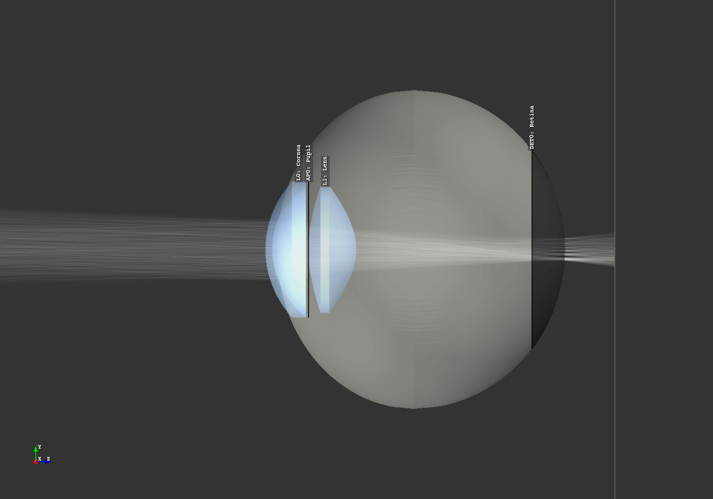

Geometry Groups
------------------------------------------------

.. |IdealLens| replace:: :class:`IdealLens <optrace.tracer.geometry.ideal_lens.IdealLens>`
.. |Lens| replace:: :class:`Lens <optrace.tracer.geometry.lens.Lens>`
.. |Group| replace:: :class:`Group <optrace.tracer.geometry.group.Group>`
.. |Element| replace:: :class:`Element <optrace.tracer.geometry.element.Element>`
.. |Raytracer| replace:: :class:`Raytracer <optrace.tracer.raytracer.Raytracer>`

.. testsetup:: *

   import optrace as ot
   ot.global_options.show_progressbar = False

.. role:: python(code)
  :language: python
  :class: highlight

Group
________________

Overview
##############

A |Group| is a container of several elements.

It contains the following functionality:

.. list-table::
   :widths: 300 250
   :header-rows: 1
   :align: left

   * - Functionality
     - Example
   * - Adding and removing one or more elements:
     - | :python:`G.add(obj)`
       | :python:`G.remove(obj)`
   * - Emptying all elements: 
     - :python:`G.clear()`
   * - check if an element is included: 
     - :python:`G.has(obj)`
   * - move all elements at once: 
     - :python:`G.move_to([5.3, 0.0, 12.3])`
   * - rotate or flip all elements: 
     - | :python:`G.rotate(-12)`
       | :python:`G.flip()`
   * - create a ray transfer matrix of the whole group: 
     - :python:`G.tma()`

A |Group| object stores all elements in their own class lists:
:python:`lenses, ray_sources, detectors, markers, filters, apertures, volumes`.
Where |IdealLens| and |Lens| are included in the same list, all marker types are included in :python:`markers` 
and all volume types in :python:`volumes`.

When adding objects, the order of objects remains the same.
Thus :python:`lenses[2]` denotes the lens that was added third (counting starts at 0).
For clarity, it is recommended to add objects in their correct z-order.

Geometry properties
###########################

A group shares the same functions for geometry properties and manipulations as an element, 
see :ref:`element_geometry_props`. There are three main differences:

**Position**

The position property describes the position of the first element (smallest z-position).

**Flipping**

When flipping, additional parameters :python:`y0`, :python:`z0` can be provided to define a rotation axis.
By default, :python:`y0 = 0` and :python:`z0` are the center of the extent of the group.
See :func:`Group.flip <optrace.tracer.geometry.group.Group.flip>` for details.

**Rotation**

For rotation, parameters :python:`x0`, :python:`y0` can be additionally provided, 
which also describe a position of the rotation axis.
By default, both are zero.
See :func:`Group.rotate <optrace.tracer.geometry.group.Group.rotate>`.

Example
################

The following example creates a Group consisting of an |IdealLens| and 
an :class:`Aperture <optrace.tracer.geometry.aperture.Aperture>`.

.. testcode::

   IL = ot.IdealLens(r=6, D=-20, pos=[0, 0, 10])
   F = ot.Aperture(ot.RingSurface(ri=0.5, r=10), pos=[0, 0, 30])

   G = ot.Group([IL, F])

Next, we flip the group, reversing the z-order of the elements and flipping each element 
around its x-axis through the center. Since all elements are rotationally symmetric, this just reorders them.
After flipping we move the group to a new position. This position is the new position for the first element 
(which after flipping is the filter), whereas all relative distances to all other elements are kept equal.

.. testcode::

   G.flip()
   G.move_to([0, 1, 0])

The filter is the first element and has the same position as we moved the group to.

.. doctest::

   >>> G.apertures[0].pos
   array([0., 1., 0.])

The lens has the same relative distance of :math:`\Delta z = 20` mm relative to the Filter, 
but in a different absolute position and now behind the filter.

.. doctest::

   >>> G.lenses[0].pos
   array([ 0.,  1., 20.])

Loading ZEMAX OpticStudio Geometries (.zmx)
____________________________________________

It is possible to load ``.zmx`` geometries into optrace. 
The following example loads a geometry from file ``setup.zmx`` into the raytracer:

.. code-block:: python

   RT = ot.Raytracer(outline=[-20, 20, -20, 20, -20, 200])

   RS = ot.RaySource(ot.CircularSurface(r=0.05), 
                     spectrum=ot.presets.light_spectrum.d65, 
                     pos=[0, 0, -10])
   RT.add(RS)

   n_schott = ot.load_agf("schott.agf")
   G = ot.load_zmx("setup.zmx", n_dict=n_schott)
   RT.add(G)

   RT.trace(10000)

For the materials to be loaded correctly all mentioned names in the ``.zmx`` 
file need to be included in the :python:`n_dict` dictionary.
You can either load them from a ``.agf`` catalogue like in :numref:`agf_load` or create the dictionary manually.

A list of exemplary ``.zmx`` files can be found in the following 
`repository <https://github.com/nzhagen/LensLibrary/tree/main/zemax_files>`_.

Unfortunately, the support is only experimental, as there is no official documentation on the file format.
Additionally, only a subset of all ZEMAX OpticStudio functionality is supported, including:

* ``SEQ``-mode only
* ``UNIT`` must be ``MM``
* only ``STANDARD`` or ``EVENASPH`` surfaces, this is equivalent to 
  :python:`RingSurface, CircularSurface, SphericalSurface, ConicSurface, AsphericSurface` in optrace
* no support for coatings
* temperature or absorption behavior of the material is neglected
* only loads lens and aperture geometries, no support for additional objects

Information on the file format can be found in :footcite:`Zemax_2000`, 
as well as `here <https://github.com/mjhoptics/ray-optics/blob/master/src/rayoptics/zemax/zmxread.py>`__ 
and `here <https://github.com/quartiq/rayopt/blob/master/rayopt/zemax.py>`__.

Geometry Presets
_______________________

Ideal Camera
###############################

An ideal camera preset is included, that provides aberration-free imaging towards a detector.

The preset is loaded with :func:`ot.presets.geometry.ideal_camera <optrace.tracer.presets.geometry.ideal_camera>`
and returns a |Group| object consisting of a lens and a detector.
Required parameters are the object position :python:`z_g` as well as the camera position (the position of the lens) 
:python:`cam_pos`, as well as the image distance :python:`b`, 
which in this case is just the difference distance between lens and detector.
A visual presentation of these quantities is shown in the figure below.

An exemplary call could be:

.. testcode::

   G = ot.presets.geometry.ideal_camera(cam_pos=[1, -2.5, 12.3], 
                                        z_g=-56.06, b=10)

The lens diameter parameter :python:`r` and detector radius :python:`r_det` are provided by doing the following:

.. testcode::

   G = ot.presets.geometry.ideal_camera(cam_pos=[1, -2.5, 12.3], 
                                        z_g=-56.06, b=10, r=5, r_det=8)

The function also supports an infinite position of :python:`z_g = -np.inf`.

When given a desired object magnification :math:`m`, the image distance parameter :math:`b` can be calculated with:

.. math::

   m = \frac{b}{g} \Rightarrow b = m \cdot g

Which should be known from the fundamentals of optics.
Where :math:`g` is the object distance, in our example :python:`z_g - cam_pos[2]`.
Note that :math:`b, g`  both need to be positive for this preset to work.

.. figure:: ../images/ideal_camera.svg
   :align: center
   :width: 730
   :class: dark-light

   Visualization of the :func:`ideal_camera <optrace.tracer.presets.geometry.ideal_camera>` parameters.

LeGrand Paraxial Eye Model
###############################

The LeGrand full theoretical eye model is a simple model consisting of only spherical surfaces 
and wavelength-independent refractive indices. It models the paraxial behavior of a far-adapted eye.

.. list-table:: LeGrand Full Theoretical Eye Model :footcite:`SchwiegerlingOptics`
   :widths: 110 75 75 75 75
   :header-rows: 1
   :align: center
   :width: 860px

   * - Surface
     - Radius in mm
     - Conic Constant
     - Refraction Index to next surface
     - Thickness (mm) (to next surface)

   * - Cornea Anterior
     - 7.80
     - 0
     - 1.3771
     - 0.5500
		
   * - Cornea Posterior 
     - 6.50
     - 0 
     - 1.3374
     - 3.0500

   * - Lens Anterior 
     - 10.20
     - 0
     - 1.4200
     - 4.0000

   * - Lens Posterior 
     - -6.00
     - 0 
     - 1.3360
     - 16.5966

   * - Retina 
     - -13.40
     - 0 
     - `-` 
     - `-`

The preset :func:`legrand_eye <optrace.tracer.presets.geometry.legrand_eye>` is located in 
:mod:`ot.presets.geometry <optrace.tracer.presets.geometry>` and is called as a function. 
It returns a |Group| object that can be added to a |Raytracer|. Provide a :python:`pos` parameter 
to position it at an other position than :python:`[0, 0, 0]`.

.. testcode::

   RT = ot.Raytracer(outline=[-10, 10, -10, 10, -10, 60])
   eye_model = ot.presets.geometry.legrand_eye(pos=[0.3, 0.7, 1.2])
   RT.add(eye_model)

Optional parameters include a pupil diameter and a lateral detector (retina) radius, both provided in millimeters.

.. testcode::

   eye_model = ot.presets.geometry.legrand_eye(pupil=3, r_det=10, pos=[0.3, 0.7, 1.2])

Arizona Eye Model
#####################

A more advanced model is the :func:`arizona_eye <optrace.tracer.presets.geometry.arizona_eye>` model, 
which tries to match clinical levels of aberration for different adaption levels. 
It consists of conic surfaces, dispersive media and adaptation dependent parameters.

.. list-table:: Arizona Eye Model :footcite:`SchwiegerlingOptics`
   :widths: 75 75 75 75 75 75
   :header-rows: 1
   :align: center
   :width: 860px

   * - Surface
     - Radius in mm
     - Conic Constant
     - Refraction Index to next surface
     - Abbe Number
     - Thickness (mm) (to next surface)

   * - Cornea Anterior
     - 7.80
     - -0.25
     - 1.377
     - 57.1
     - 0.55
		
   * - Cornea Posterior 
     - 6.50
     - -0.25
     - 1.337
     - 61.3
     - :math:`t_\text{aq}`

   * - Lens Anterior 
     - :math:`R_\text{ant}`
     - :math:`K_\text{ant}`
     - :math:`n_\text{lens}`
     - 51.9
     - :math:`t_\text{lens}`

   * - Lens Posterior 
     - :math:`R_\text{post}`
     - :math:`K_\text{post}`
     - 1.336
     - 61.1
     - 16.713

   * - Retina 
     - -13.40
     - 0 
     - `-` 
     - `-` 

     - `-` 

With an accommodation level :math:`A` in dpt the missing parameters 
are calculated using: :footcite:`SchwiegerlingOptics`

.. math::
   \begin{array}{ll}
       R_{\text {ant }}=12.0-0.4 A & K_{\text {ant }}=-7.518749+1.285720 A \\
       R_{\text {post }}=-5.224557+0.2 A & K_{\text {post }}=-1.353971-0.431762 A \\
       t_{\text {aq }}=2.97-0.04 A & t_{\text {lens }}=3.767+0.04 A \\
       n_{\text {lens }}=1.42+0.00256 A-0.00022 A^2
   \end{array}

Accessing and adding the group works the same as for the 
:func:`legrand_eye <optrace.tracer.presets.geometry.legrand_eye>` preset.

.. testcode::

   RT = ot.Raytracer(outline=[-10, 10, -10, 10, -10, 60])
   eye_model = ot.presets.geometry.arizona_eye(pos=[0.3, 0.7, 1.2])
   RT.add(eye_model)

As for the :func:`legrand_eye <optrace.tracer.presets.geometry.legrand_eye>`, we have the parameters 
:python:`pupil` and :python:`r_det`. Additionally there is an :python:`adaptation` 
parameter specified in diopters, which defaults to 0 dpt.

.. testcode::

   eye_model = ot.presets.geometry.arizona_eye(adaptation=1, pupil=3, r_det=10, pos=[0.3, 0.7, 1.2])

   Eye model in the :ref:`example_arizona_eye_model` example script.

------------

**References**

.. footbibliography::

