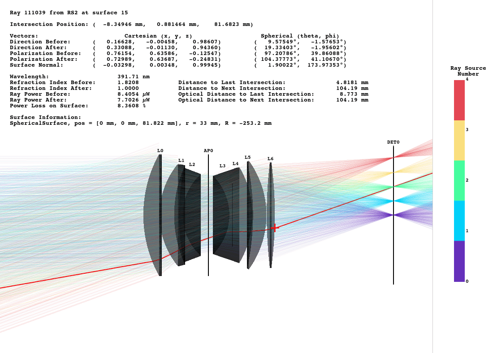

.. _usage_gui:

GUI Interaction
------------------

.. |TraceGUI| replace:: :class:`TraceGUI <optrace.gui.trace_gui.TraceGUI>`
.. |Raytracer| replace:: :class:`Raytracer <optrace.tracer.raytracer.Raytracer>`

.. testcode:: 
   :hide:

   import optrace as ot
   ot.global_options.show_progressbar = False
   
   from optrace.gui import TraceGUI

.. role:: python(code)
  :language: python
  :class: highlight

Loading the GUI
____________________

**Initializing the GUI**

First, we need to import into the |TraceGUI| into the current namespace:

.. testcode::

   from optrace.gui.trace_gui import TraceGUI

Let's create some exemplary geometry:

.. testcode::

   RT = ot.Raytracer(outline=[-10, 10, -10, 10, -10, 60])

   disc = ot.CircularSurface(r=3)
   RS = ot.RaySource(disc, pos=[0, 0, -5])
   RT.add(RS)

   eye = ot.presets.geometry.legrand_eye()
   RT.add(eye)

To create a |TraceGUI|, we need to pass the |Raytracer| as argument:

.. testcode::

   sim = TraceGUI(RT)

**Running the GUI**

The GUI is run with:

.. code-block:: python

   sim.run()

This loads the main window and also raytraces the geometry if it hasn't already been traced.

**Parameters**

When creating the GUI, additional properties can be assigned.
To set the scene to high contrast mode and increase the amount of rays, we can call:

.. testcode::

   sim = TraceGUI(RT, high_contrast=True, ray_count=2000000)

Available properties are discussed in :numref:`gui_tabs`.

**Initial Camera View**

The :python:`initial_camera` parameter sets an initial camera view.

.. testcode::

   sim = TraceGUI(RT, high_contrast=True, ray_count=2000000,\
                  initial_camera=dict(center=[-50, -50, 0], direction=[-1, -1, -1], height=150, roll=-120))

These properties are directly passed to the :meth:`TraceGUI.set_camera <optrace.gui.trace_gui.TraceGUI.set_camera>` function.
You can read more about the camera settings in :numref:`gui_camera`.

UI Overview
_________________

Full UI
######################

.. figure:: ../images/UI_scene_full.svg
   :align: center
   :width: 800
   :class: dark-light

.. _gui_overview_scene:

Scene
######################

**Overview**

Details on the scene navigation are available in the mayavi documentation :ref:`here <mayavi:interaction-with-the-scene>` under "Mouse Interaction".
Inside the scene in the bottom left you can find orientation axes, that display the directions of the cartesian axes in the 3D view. 
When an action/tasks is running, you are informed by a status text in the bottom right.
A list of keyboard shortcuts is provided below.

.. list-table:: Available keyboards shortcuts inside the scene
   :header-rows: 1
   :align: center
   :widths: 100 300

   * - Shortcut
     - Function
   * - ``i``
     - sets the scene view to default view set by GUI parameter `initial_camera` or the y-side view if not provided
   * - ``h``
     - maximize scene (hide toolbar and sidebar)
   * - ``v``
     - toggle minimalistic view option
   * - ``c``
     - toggle high contrast mode
   * - ``b``
     - toggle label visibility
   * - ``d``
     - render detector image with the current settings
   * - ``q``
     - close all open pyplot plots
   * - ``n``
     - randomly re-chose the plotted rays
   * - ``s``
     - save a screenshot of the scene
   * - ``f``
     - | set the camera focal point to the position of the mouse. 
       | Useful for scene rotations, since the geometry is rotated around this point.
   * - ``l``
     - change lighting properties
   * - ``3``
     - anaglyph view (view for red-cyan 3D glasses)

**Picking and Clicking**

A list of properties for the selected ray is shown when clicking on the ray intersection of ray and surface.
The intersection position is also marked with a red crosshair, while the picked ray is highlighted in red.
Even more properties are shown when using ``Shift + Click``.

Right-clicking inside the scene displays the coordinates of the picked point.
``Shift + Right Click`` moves the currently selected detector to the picked z-position.

**High Contrast Mode**

By activating the high contrast mode the background becomes white and all geometry elements grey or black.
This is useful when creating scene views for academic output, as the background color in documents is also white.

  With :python:`plot_dark_mode` enabled.
   

Toolbar
######################

The mayavi scene toolbar is positioned above the scene. 
It includes buttons for the pipeline view window, different perspectives, fullscreen, screenshot saving and scene settings. 
Details are available in the mayavi documentation :ref:`here <mayavi:interaction-with-the-scene>`.

Sidebar
######################

The sidebar is positioned at the right side of the scene and consists of multiple tabs:

.. list-table::
   :align: left
   :stub-columns: 1
   :widths: 150 350

   * - Main Tab
     - Includes settings for raytracing, scene visualization and buttons for opening additional windows
   * - Image Tab
     - Features options for rendering source and detector images
   * - Spectrum Tab
     - Settings for the rendering of source or detector light spectrum histograms
   * - Focus Tab
     - Option View and result output for finding the focus in the optical setup
   * - Custom Tab
     - Custom UI elements that can be created before running the GUI

The UI elements will be discussed in the following sections.

.. list-table::
   :align: center
   :class: table-borderless

   * - .. figure:: ../images/ui_main_tab.png
          :align: center
          :width: 255
          :class: dark-light

     - .. figure:: ../images/ui_image_tab.png
          :align: center
          :width: 250
          :class: dark-light

     - .. figure:: ../images/ui_spectrum_tab.png
          :align: center
          :width: 250
          :class: dark-light

.. list-table::
   :align: center
   :class: table-borderless

   * - .. figure:: ../images/ui_focus_tab.png
          :align: center
          :width: 250
          :class: dark-light
     
     - .. figure:: ../images/ui_custom_tab.png
          :align: center
          :width: 250
          :class: dark-light

Additional Windows
#######################

Besides the main window, there are additional windows in the interface. 
These will be discussed in :numref:`gui_windows`, but a quick overview is provided here:

.. list-table::
   :align: left
   :header-rows: 1
   :stub-columns: 0
   :widths: 100 250 350

   * - Window
     - Access
     - Function
   * - Pipeline View
     - Leftmost button in the toolbar
     - Access to viewing and editing the mayavi graphical elements
   * - Scene Settings
     - Rightmost button in the toolbar
     - mayavi settings, including lighting and scene properties
   * - Command Window
     - button at the bottom of the main tab in the sidebar
     - command execution and history for controlling the GUI and raytracer
   * - Property Browser
     - button at the bottom of the main tab in the sidebar
     - overview of raytracer, scene and ray properties as well as cardinal points

.. _gui_tabs:

Sidebar Tabs
____________________

Main Tab
#######################

.. list-table::
   :header-rows: 1
   :align: left
   :widths: 75 100 150 150
   :width: 900px
   
   * - Property
     - Variable Name / Method
     - Values
     - Description
   * - Rays
     - :attr:`ray_count <optrace.gui.trace_gui.TraceGUI.ray_count>`
     - :python:`int, 0 - 6000000`
     - number of rays for raytracing
   * - Plotting
     - :attr:`plotting_mode <optrace.gui.trace_gui.TraceGUI.plotting_mode>`
     - :python:`'Rays'` or :python:`'Points'`
     - visulation type of the rays
   * - Coloring
     - :attr:`coloring_mode <optrace.gui.trace_gui.TraceGUI.coloring_mode>`
     - :python:`'Plain', 'Power', 'Wavelength', 'Source', 'Polarization xz', 'Polarization yz', 'Refractive Index'`
     - Quantity for color mapping
   * - Count
     - :attr:`rays_visible <optrace.gui.trace_gui.TraceGUI.rays_visible>`
     - :python:`int, 1 - 1000`
     - number of visible rays in the scene
   * - Opacity
     - :attr:`ray_opacity <optrace.gui.trace_gui.TraceGUI.ray_opacity>`
     - :python:`float, 1e-05 - 1.0`
     - opacity of the rays/points
   * - Width
     - :attr:`ray_width <optrace.gui.trace_gui.TraceGUI.ray_width>`
     - :python:`float, 1.0 - 20.0`
     - ray width/ point size
   * - More Minimalistic Scene
     - :attr:`minimalistic_view <optrace.gui.trace_gui.TraceGUI.minimalistic_view>`
     - :python:`True` or :python:`False`
     - should axis labels and long descriptions be hidden
   * - Maximize Scene
     - :attr:`maximize_scene <optrace.gui.trace_gui.TraceGUI.maximize_scene>`     
     - :python:`True` or :python:`False`
     - should tool- and side bar be hidden
   * - High Contrast Mode
     - :attr:`high_contrast <optrace.gui.trace_gui.TraceGUI.high_contrast>`
     - :python:`True` or :python:`False`
     - plot dark elements on white background
   * - Vertical Labels
     - :attr:`vertical_labels <optrace.gui.trace_gui.TraceGUI.vertical_labels>`
     - :python:`True` or :python:`False`
     - if object labels are justified vertically (in lateral direction)
   * - Hide Labels
     - :attr:`hide_labels <optrace.gui.trace_gui.TraceGUI.hide_labels>`
     - :python:`True` or :python:`False`
     - if object labels should be hidden
   * - Open Property Browser
     - :meth:`open_property_browser() <optrace.gui.trace_gui.TraceGUI.open_property_browser>`
     -
     - opens the property browser
   * - Open Command Window
     - :meth:`open_command_window() <optrace.gui.trace_gui.TraceGUI.open_command_window>`
     -
     - opens the command window
   * - Online Documentation
     - :meth:`open_documentation() <optrace.gui.trace_gui.TraceGUI.open_documentation>`
     -
     - opens the online documentation in a web browser

Image Tab
#######################

.. list-table::
   :header-rows: 1
   :align: left
   :widths: 75 100 150 150
   
   * - Property
     - Variable Name / Method
     - Values
     - Description
   * - Source 
     - :attr:`source_selection <optrace.gui.trace_gui.TraceGUI.source_selection>`
     - :python:`str`
     - selection of the ray source
   * - Detector
     - :attr:`detector_selection <optrace.gui.trace_gui.TraceGUI.detector_selection>` 
     - :python:`str`
     - selection of the detector
   * - z_det
     - :attr:`z_det <optrace.gui.trace_gui.TraceGUI.z_det>`
     - :python:`float`
     - position of the currently selected detector
   * - Image Mode
     - :attr:`image_mode <optrace.gui.trace_gui.TraceGUI.image_mode>`
     - :python:`str`, one of :attr:`RenderImage.image_modes <optrace.tracer.image.render_image.RenderImage.image_modes>`
     - image rendering mode
   * - Projection Method
     - :attr:`projection_method <optrace.gui.trace_gui.TraceGUI.projection_method>`
     - :python:`str`, one of :attr:`SphericalSurface.sphere_projection_methods <optrace.tracer.geometry.surface.spherical_surface.SphericalSurface.sphere_projection_methods>`
     - sphere projection method for spherical detectors
   * - Pixels_xy
     - :attr:`image_pixels <optrace.gui.trace_gui.TraceGUI.image_pixels>`
     - :python:`int`, one of :attr:`RImage.SIZES <optrace.tracer.image.render_image.RenderImage.SIZES>`
     - number of pixels in smaller image dimension
   * - Logarithmic Scaling 
     - :attr:`log_image <optrace.gui.trace_gui.TraceGUI.log_image>`
     - :python:`True` or :python:`False`
     - if image values should be scaled logarithmically
   * - Flip Detector Image
     - :attr:`flip_detector_image <optrace.gui.trace_gui.TraceGUI.flip_detector_image>`
     - :python:`True` or :python:`False`
     - if the detector image should be flipped (rotated by 180 degrees)
   * - Rays from Selected Source Only
     - :attr:`detector_image_single_source <optrace.gui.trace_gui.TraceGUI.detector_image_single_source>`
     - :python:`True` or :python:`False`
     - if only the selected ray source should contribute to the image
   * - Source Image
     - :meth:`source_image() <optrace.gui.trace_gui.TraceGUI.source_image>`
     -
     - renders a source image with the given settings
   * - Detector Image 
     - :meth:`detector_image() <optrace.gui.trace_gui.TraceGUI.detector_image>`
     -
     - renders a detector image with the given settings
   * - Cut at
     - :attr:`profile_position_dimension <optrace.gui.trace_gui.TraceGUI.profile_position_dimension>`
     - :python:`'x', 'y'`
     - image profile dimension
   * - Cut Value
     - :attr:`profile_position <optrace.gui.trace_gui.TraceGUI.profile_position>`
     - :python:`float`
     - image profile value for the chosen dimension
   * - Source Image Cut
     - :meth:`source_profile() <optrace.gui.trace_gui.TraceGUI.source_profile>`
     -
     - renders a source image profile
   * - Detector Image Cut
     - :meth:`detector_profile() <optrace.gui.trace_gui.TraceGUI.detector_profile>`
     -
     - renders a detector image profile
   * - Activate Filter 
     - :attr:`activate_filter <optrace.gui.trace_gui.TraceGUI.activate_filter>`
     - :python:`True` or :python:`False`
     - activate the smoothing / resolution limit filter
   * - Resolution Limit 
     - :attr:`filter_constant <optrace.gui.trace_gui.TraceGUI.filter_constant>`
     - :python:`float, 0.3 - 40`
     - resolution filter filter constant

Spectrum Tab
#######################

.. list-table::
   :header-rows: 1
   :align: left
   
   * - Property
     - Variable Name / Method
     - Values
     - Description
   * - Source 
     - :attr:`source_selection <optrace.gui.trace_gui.TraceGUI.source_selection>`
     - :python:`str`
     - the selected ray source
   * - Detector
     - :attr:`detector_selection <optrace.gui.trace_gui.TraceGUI.detector_selection>` 
     - :python:`str`
     - the selected detector
   * - z_det
     - :attr:`z_det <optrace.gui.trace_gui.TraceGUI.z_det>`
     - :python:`float`
     - position of the selected detector
   * -  Source Spectrum
     - :meth:`source_spectrum() <optrace.gui.trace_gui.TraceGUI.source_spectrum>`
     - 
     - render a source spectrum for the chosen source
   * - Rays from Selected Source Only 
     - :attr:`detector_spectrum_single_source <optrace.gui.trace_gui.TraceGUI.detector_spectrum_single_source>` 
     - :python:`True` or :python:`False`
     - if only the selected ray source should contribute to the detector spectrum
   * -  Detector Spectrum
     - :meth:`detector_spectrum() <optrace.gui.trace_gui.TraceGUI.detector_spectrum>`
     - 
     - render a detector image
   * - Spectrum Properties
     - 
     - 
     - output field for spectrum properties

Focus Tab
#######################

.. list-table::
   :header-rows: 1
   :align: left
   
   * - Property
     - Variable Name / Method
     - Values
     - Description
   * - Source 
     - :attr:`source_selection <optrace.gui.trace_gui.TraceGUI.source_selection>`
     - :python:`str`
     - the selected source
   * - Detector
     - :attr:`detector_selection <optrace.gui.trace_gui.TraceGUI.detector_selection>` 
     - :python:`str`
     - the selected detector
   * - z_det
     - :attr:`z_det <optrace.gui.trace_gui.TraceGUI.z_det>`
     - :python:`float`
     - position of the selected detector
   * - Focus Mode     
     - :attr:`focus_search_method <optrace.gui.trace_gui.TraceGUI.focus_search_method>`
     - :python:`str`, one of :attr:`Raytracer.focus_search_methods <optrace.tracer.raytracer.Raytracer.focus_search_methods>`
     - mode for focus search
   * - Rays From Selected Source Only
     - :attr:`focus_search_single_source <optrace.gui.trace_gui.TraceGUI.focus_search_single_source>`
     - :python:`True` or :python:`False`
     - only use the rays from the selected source for focus search
   * -  Plot Cost Function
     - :attr:`plot_cost_function <optrace.gui.trace_gui.TraceGUI.plot_cost_function>`
     - :python:`True` or :python:`False`
     - plots the evaluated cost function
   * -  Find Focus and move the currently selected detector to it
     - :meth:`move_to_focus() <optrace.gui.trace_gui.TraceGUI.move_to_focus>`
     - 
     - execute the focus search
   * -  Optimization  Output
     - 
     - 
     - output for displaying optimization information

Custom Tab
#######################

optrace allows for the creation of custom UI elements in the "Custom" Tab with bindings to a function.
Examples using such additional elements include :ref:`example_image_render` or :ref:`example_arizona_eye_model`.

The elements must be added before running the TraceGUI.
The following functions are available:

.. list-table::
   :header-rows: 1
   :align: left

   * - Method
     - Parameters
     - Description

   * - :meth:`TraceGUI.add_custom_value <optrace.gui.trace_gui.TraceGUI.add_custom_value>`
     - title (:python:`str`), default value (:python:`float`), callable function
     - a textfield for setting a floating point value

   * - :meth:`TraceGUI.add_custom_button <optrace.gui.trace_gui.TraceGUI.add_custom_value>`
     - title (:python:`str`), callable function
     - a custom button that executes an action

   * - :meth:`TraceGUI.add_custom_selection <optrace.gui.trace_gui.TraceGUI.add_custom_value>`
     - title (:python:`str`), options (:python:`list` of :python:`str`), default value (:python:`str`), callable function
     - a text selection field

   * - :meth:`TraceGUI.add_custom_checkbox <optrace.gui.trace_gui.TraceGUI.add_custom_value>`
     - title (:python:`str`), default state (:python:`bool`), callable function
     - a checkbox boolean option

Changing the value, selection or checkbox automatically calls the function after enter has been pressed.
The number of custom UI elements is limited to three of each type.
The callable functions are an optional parameter (except for the button), which can be left empty of set to :python:`None`.
This can be useful when using a field as setting for another action.

The following examples creates a custom button, checkbox, selection and value:

.. testcode::

   RT = ot.Raytracer(outline=[-5, 5, -10, 10, 0, 60])

   # create geometry
   ...

   # define custom actions

   def change_aperture(RT, ap):
       ...

   def change_test_image(RT, image):
       ...

   def toggle_ray_info(RT, active):
       ...

   # create the GUI
   sim = TraceGUI(RT)
   
   # add UI elements to "Custom Tab" in the TraceGUI
   sim.add_custom_value("Aperture radius (1 - 3mm)", 2.0, lambda ap: change_aperture(RT, ap))
   sim.add_custom_selection("Test Image", ["Testcard", "Grid"], "Testcard", lambda img: change_test_image(RT, img))
   sim.add_custom_button("Detector Image", sim.detector_image)
   sim.add_custom_checkbox("Print Ray Info", False, lambda b: toggle_ray_info(RT, b))

After that, the TraceGUI can be run normally with :meth:`TraceGUI.run <optrace.gui.trace_gui.TraceGUI.run>`.
Accessing or assigning these properties at runtime is described in :numref:`gui_automation_custom_UI`.

.. _gui_windows:

Additional Windows
____________________

Pipeline View
#######################

The pipeline of the mayavi scene allows for the viewing and alteration of different geometry objects of the visible scene. 
For instance, you can change the colors or representation of different elements.
Note that editing the visualization objects inside the scene is different from changing the geometry objects inside the |Raytracer|.
The former does not update the underlying geometry and does not update the rays.

A more detailed information about the `pipeline view <https://docs.enthought.com/mayavi/mayavi/pipeline.html>`__ and the `different objects populating the view <https://docs.enthought.com/mayavi/mayavi/mayavi_objects.html>`__ are available in the mayavi documentation.

.. figure:: ../images/ui_pipeline.png
   :align: center
   :width: 600
   :class: dark-light

.. _property_viewer:

Property Viewer
#######################

The property viewer provides an interactive tree view to the following properties:

* properties about the rays/points currently shown
* cardinal points and other paraxial properties of the lenses and the whole lens setup
* properties of the |Raytracer| class
* available presets
* |TraceGUI| properties
* |TraceGUI| scene properties

All displayed property values are a read-only snapshot.
To update the values, click on the ``Update`` button.
Navigate the tabs to switch to different trees.

.. figure:: ../images/ui_property_browser.png
   :align: center
   :width: 600
   :class: dark-light

Command Window
#######################

Inside this window commands can run from inside the |TraceGUI| class.
Scripting on the GUI or change |Raytracer| properties is possible, like adding, changing or removing geometries.

After entering a command in the upper text field the ``Run``-button needs to be pressed.
Note that the command is only run, if the GUI is idle, therefore not doing any other tasks.

After running the command, the scene is automatically updated and the geometry is retraced if the option "Retrace and replot automatically" is set.
This can also be done manually with th ``Replot/Retrace`` Button.

The command is added to the history in the lower part of the window.
Copy each history field with ``Ctrl+C`` or export the whole history by pressing ``Copy History to Clipboard``.
There is also a ``Clear`` button available that empties the history.

.. figure:: ../images/ui_command_window.png
   :align: center
   :width: 600
   :class: dark-light

The commands are run from within the TraceGUI object.
To avoid race conditions and issues with scene rendering, all actions are run sequential.
This leads to the UI being unresponsive while running the command.

There are multiple object aliases available to simplify coding inside the command window

.. list-table:: Some object aliases
   :header-rows: 1
   :align: center
   :widths: 100 300
   :width: 600px

   * - Alias
     - Reference
   * - :python:`GUI`
     - the TraceGUI object (same as :python:`self`)
   * - :python:`RT`
     - the raytracer used
   * - :python:`LL`
     - the lens list of the raytracer
   * - :python:`AL`
     - the aperture list of the raytracer
   * - :python:`FL`
     - the filter list of the raytracer
   * - :python:`RSL`
     - the ray source list of the raytracer
   * - :python:`DL`
     - the detector list of the raytracer
   * - :python:`ML`
     - the marker list of the raytracer
   * - :python:`VL`
     - the volume list of the raytracer

For instance, inside the command window you can write :python:`RT.remove(AL[1])` to remove the second aperture of tracing geometry.
By default, you also have access to most optrace classes, e.g. :python:`Raytracer, RGBImage, Group, RingSurface, ...`.

To include custom objects in the class, you can simply pass them to the constructor:

.. testcode::

   var = 78.2353
   
   def func():
       ...

   sim = TraceGUI(RT, important_function=func, important_variable=var)

This also makes them available for usage in the command window as :python:`GUI.important_function(), GUI.important_variable, ...`.

