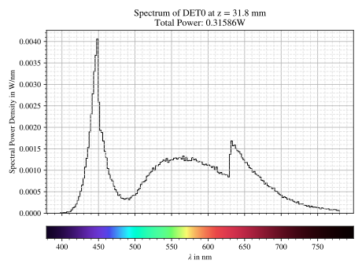

Image and Spectrum Rendering
---------------------------------

.. role:: python(code)
  :language: python
  :class: highlight

.. mock progressbar library, so we have no stdout output for it

.. testsetup:: *

   import sys 
   import mock
   sys.modules['progressbar'] = mock.MagicMock()

   import optrace as ot

Overview
______________

When rendering images inside the raytracer geometry an RImage object is calculated.

Compared to a typical colored image, this object has the following advantages:

* rescaling the image data to other sizes without distorting or interpolating information
* calculating different image modes (sRGB, Hue, Lightness, Irradiance, ...)
* the image data is available at a higher bit depth than a normal image
* smoothing the image without loosing the original data
* stores image geometry information (absolute positions) and metadata
* guaranteed odd pixel side count, so the center and center axes have a well defined pixel position

**Motivation**

*Case 1*: A user rendered a detector image with 100 million rays in 30 minutes. After rendering he notices that choosing a image resolution of 100x100 pixels was too modest. But now his only option is to rerender the image in a higher resolution.

*Case 2*: After rendering the image has the size 950 x 1028. The user wants to rescale the image to lower noise or because it would be easier to work with. But rescaling to something like 200 x 218 could not be done without interpolating and distorting the image data, which would deviate from the physical reality of the image.

*Case 3*: A setup with rotational symmetry creates a line and a point focus. Due to the image being rendered in an even resolution of 100 x 100 neither the line nor the point are at the correct pixel position, since they lie at pixel edges. Depending on the numerical precision or behavior of the system the line or focus would be either located in a neighboring pixel or in multiple pixels at once.

**Solution**

* store two images: Internal image with higher resolution and a second image with the approximate desired properties for the user
* restrict the pixel sizes and ratios so rescaling can be done by joining bins (= pixels)
* enforce odd pixel numbers so center and center axes always get their own pixel/pixel column/pixel row

The pixel sizes for the smaller side are limited to:

.. doctest::

   >>> ot.RImage.SIZES
   [1, 3, 5, 7, 9, 15, 21, 27, 35, 45, 63, 105, 135, 189, 315, 945]

Whereas the larger side is larger by a factor with elements of :attr:`ot.RImage.SIZES <optrace.tracer.r_image.RImage.SIZES>` up to:

.. doctest::

   >>> ot.RImage.MAX_IMAGE_RATIO
   5

And therefore values of :python:`[1, 3, 5]`. For arbitrary side ratios this leads to non-square pixels, but which pose no problem in plotting and processing.

So if the user wants an image with 500 pixels for the smaller side and the exposed area on the detector has a side ratio of 2.63, the internal image is rendered in the resolution 945x2835. This is the case because the nearest side factor to 2.63 is 3 and because 945 is the size for all internally rendered images.
From this resolution the image can be scaled to 315x945 189x567 135x405 105x315 63x189 45x135 35x105 27x81 21x63 15x45 9x27 7x21 5x15 3x9 1x3. The user image is then scaled into size 315x945, as it is the nearest to a size of 500.

Rescaling would then be done by joining a group of nine pixels (three in each dimension) to change the resolution of 945x2835 to 315x945.

Image Types
_____________________________________

Internally the RImage objects saves a power and XYZ color space image, from which the following image modes can be generated:

.. list-table::
   :widths: 150 500 
   :align: left
   :stub-columns: 1

   * - :python:`"Irradiance"`
     - Image of power per area, equivalent to an intensity image
   * - :python:`"Illuminance"`
     - Image of luminous power per area
   * - :python:`"sRGB (Absolute RI)"`
     - A human vision approximation of the image. Colors outside the gamut are saturation-clipped. Preferred sRGB-Mode for "natural"/"everyday" scenes.
   * - :python:`"sRGB (Perceptual RI)"`
     - Similar to sRGB (Absolute RI), but instead saturation scaling for all pixels. Preferred mode for scenes with monochromatic sources or highly dispersive optics.
   * - :python:`"Outside sRGB Gamut"`
     - Boolean image showing pixels outside the sRGB gamut
   * - :python:`"Lightness"`
     - Human vision approximation in greyscale colors. Similar to Illuminance, but with non-linear brightness function.
   * - :python:`"Hue"`
     - Measure of the type of color tint (red, orange, yellow, ...) 
   * - :python:`"Chroma"`
     - How colorful an area seems compared to a similar illuminated area.
   * - :python:`"Saturation"`
     - How colorful an area seems compared to its brightness. Quotient of Chroma and Lightness. 

The difference between chroma and saturation is elaborately explained in :footcite:`BriggsChroma`. Due to subtle differences saturation is often put to use as light property and chroma as property for an illuminated object.

An example for the difference of both sRGB modes is seen in :numref:`color_dispersive1`. 

.. list-table:: Renderes images from the ``image_rgb.py`` example. From left to right, top to bottom: sRGB (Absolute RI), sRGB (Perceptual RI), Outside sRGB Gamut, Lightness, Irradiance, Illuminance, Hue, Chroma, Saturation.

   * - .. figure:: ../images/rgb_render_srgb1.svg
          :align: center
          :width: 300

     - .. figure:: ../images/rgb_render_srgb2.svg
          :align: center
          :width: 300
     
     - .. figure:: ../images/rgb_render_srgb3.svg
          :align: center
          :width: 300
   
   * - .. figure:: ../images/rgb_render_lightness.svg
          :align: center
          :width: 300
    
     - .. figure:: ../images/rgb_render_irradiance.svg
          :align: center
          :width: 300

     - .. figure:: ../images/rgb_render_illuminance.svg
          :align: center
          :width: 300
     
   * - .. figure:: ../images/rgb_render_hue.svg
          :align: center
          :width: 300

     - .. figure:: ../images/rgb_render_chroma.svg
          :align: center
          :width: 300
     
     - .. figure:: ../images/rgb_render_saturation.svg
          :align: center
          :width: 300

Sphere Projections
___________________________

With a spherical detector surface, there are multiple ways to project it down to a rectangular surface. Note that there is no possible way for a projection, that correctly represents angles, distances and areas. One might now this problem from different map projections.

Below you can find the projection methods implemented in `optrace` and Wikipedia links for their detailed explanation.
Details on the math applied internally are found in the math section in :numref:`sphere_projections`.

Available methods are:

.. list-table::
   :widths: 150 300 
   :align: left
   :stub-columns: 1

   * - :python:`"Orthographic"`
     - Perspective projection, sphere surface seen from far away :footcite:`OrthographicProjWiki`

   * - :python:`"Stereographic"`
     - Conformal projection (preserving local angles and shapes) :footcite:`SteographicProjWiki`

   * - :python:`"Equidistant"`
     - Projection keeping the radial direction from a center point equal :footcite:`EquidistantProjWiki`

   * - :python:`"Equal-Area"`
     - Area preserving projection :footcite:`EqualAreaProjWiki`

.. list-table::
    `Tissot's indicatrices <https://en.wikipedia.org/wiki/Tissot%27s_indicatrix>`__ for different projection methods. All circles should have the same size, shape and brightness. Taken from the ``sphere_projections.py`` example.

   * - .. figure:: ../images/indicatrix_equidistant.svg
          :align: center
          :width: 300

     - .. figure:: ../images/indicatrix_equal_area.svg
          :align: center
          :width: 300

   * - .. figure:: ../images/indicatrix_stereographic.svg
          :align: center
          :width: 300

     - .. figure:: ../images/indicatrix_orthographic.svg
          :align: center
          :width: 300

Resolution Limit Filter
___________________________

Unfortunately, `optrace` does not take wave optics into account when simulating the light path or rendering image intensities. To help in estimating the effect of a resolution limit the :class:`RImage <optrace.tracer.r_image.RImage>` class provides a limit parameter. This parameter describes the width of an airy disc and blurs the image with a gaussian filter that is approximately the size of the zeroth order of an airy disc with the same resolution limit.

.. note::

   The limit parameter is only an estimation of how large the impact of a resolution limit on the image is.
   The simulation neither knows the actual limit nor takes into account higher order maxima or interference of light.
   This feature should only be used to estimate how far the image quality is from a resolution-limited image or if chromatic dispersion or the focal point width is in the same magnitude as this limit.

To some degree this parameter is also suitable to estimate the effect of different resolution limits.

.. list-table:: Images of the focus in the ``achromat.py`` example. From left to right: No filter, filter with 2 µm size, filter with 10 µm size. For a setup with a resolution limit of 10 µm we are clearly inside the limit, but even for 2 µm we are diffraction limited.   

   * - .. figure:: ../images/rimage_limit_off.svg
          :align: center
          :width: 300
   
     - .. figure:: ../images/rimage_limit_on.svg
          :align: center
          :width: 300
     
     - .. figure:: ../images/rimage_limit_on2.svg
          :align: center
          :width: 300

Rendering an Image
_____________________________________

**Example Geometry**

The below snippet generates a geometry with multiple sources and detectors. The actual function is not important, as it is only here to demonstrate image and spectrum rendering.

.. testcode::

    # make raytracer
    RT = ot.Raytracer(outline=[-5, 5, -5, 5, -5, 60], silent=True)

    # add Raysources
    RSS = ot.CircularSurface(r=1)
    RS = ot.RaySource(RSS, divergence="None", spectrum=ot.presets.light_spectrum.FDC,
                      pos=[0, 0, 0], s=[0, 0, 1], polarization="y")
    RT.add(RS)

    RSS2 = ot.CircularSurface(r=1)
    RS2 = ot.RaySource(RSS2, divergence="None", s=[0, 0, 1], spectrum=ot.presets.light_spectrum.d65,
                       pos=[0, 1, -3], polarization="Constant", pol_angle=25, power=2)
    RT.add(RS2)

    # add Lens 1
    front = ot.ConicSurface(r=3, R=10, k=-0.444)
    back = ot.ConicSurface(r=3, R=-10, k=-7.25)
    nL1 = ot.RefractionIndex("Cauchy", coeff=[1.49, 0.00354, 0, 0])
    L1 = ot.Lens(front, back, de=0.1, pos=[0, 0, 10], n=nL1)
    RT.add(L1)

    # add Detector 1
    Det = ot.Detector(ot.RectangularSurface(dim=[2, 2]), pos=[0, 0, 0])
    RT.add(Det)

    # add Detector 2
    Det2 = ot.Detector(ot.SphericalSurface(R=-1.1, r=1), pos=[0, 0, 40])
    RT.add(Det2)

    # trace the geometry
    RT.trace(1000000)

**Source Image**

Rendering a source image is done with the :meth:`source_image <optrace.tracer.raytracer.Raytracer.source_image>` method of the :class:`Raytracer <optrace.tracer.raytracer.Raytracer>` class. Note that it expects, that scene has already been traced and rays were calculated.

The function takes a pixel size parameter, that determines the pixel count for the smaller image size.
Note that only image sizes of :attr:`RImage.SIZES <optrace.tracer.r_image.RImage.SIZES>` are valid, when different values are specified the nearest values is chosen.

Example for the function call:

.. testcode::

   img = RT.source_image(389)

This renders an RImage for the first source and returns an RImage.

The following code renders it for the second source (since index counting starts at zero) and additionally provides the resolution limit :python:`limit` parameter of 3 µm.

.. testcode::

   img = RT.source_image(389, source_index=1, limit=3)

**Detector Image**

Calculating a :meth:`detector_image <optrace.tracer.raytracer.Raytracer.detector_image>` is done in a similar fashion:

.. testcode::

   img = RT.detector_image(389)

Compared to :meth:`source_image <optrace.tracer.raytracer.Raytracer.source_image>` you can not only provide a :python:`detector_index`, but also a :python:`source_index`, which limit the rendering to the light from this source. By default all sources are used.

.. testcode::

   img = RT.detector_image(389, detector_index=0, source_index=1)

For spherical surface detectors a :python:`projection_method` can be chosen. Moreover, the extent of the detector can be limited with the :python:`extent` parameter, that is provided as :python:`[x0, x1, y0, y1]` with :math:`x_0 < x_1, ~ y_0 < y_1`. By default the extent gets adjusted automatically to contain all rays hitting the detector.
As for :meth:`source_image <optrace.tracer.raytracer.Raytracer.source_image>` the :python:`limit` parameter can also be provided.

.. testcode::

   img = RT.detector_image(389, detector_index=0, source_index=1, extent=[0, 1, 0, 1], limit=3, projection_method="Orthographic")

Iterative Render
_______________________

When tracing, the amount of rays is limited by the system's available RAM. Many million rays would not fit in the finite working memory. However, some more complicated scenes need a huge amount of rays, especially for low image noise. 
For this the function :meth:`iterative_render <optrace.tracer.raytracer.Raytracer.iterative_render>` exists. It does multiple traces and iteratively adds up the image components to a summed image. In this way there is no upper bound on the ray count. With enough available user time, images can be rendered with many billion rays.

Parameter :python:`N_rays` provides the overall number of rays for raytracing.
The first returned value of :meth:`iterative_render <optrace.tracer.raytracer.Raytracer.iterative_render>` is a list of rendered sources, the second a list of rendered detector images.

If the detector position parameter :python:`pos` is not provided, a single detector image is rendered at the position of the detector specified by :python:`detector_index`.

.. testcode::

   RT.iterative_render(N_rays=1000000, detector_index=1) 

If :python:`pos` is provided as coordinate, the detector is moved beforehand.

.. testcode::

   RT.iterative_render(N_rays=10000, pos=[0, 1, 0], detector_index=1) 

If :python:`pos` is a list, :python:`len(pos)` detector images are rendered. All other parameters are either automatically
repeated :python:`len(pos)` times or can be specified as list with the same length as :python:`pos`.

Exemplary calls:

.. testcode::

   RT.iterative_render(N_rays=10000, pos=[[0, 1, 0], [2, 2, 10]], detector_index=1, N_px_D=[128, 256]) 
   RT.iterative_render(N_rays=10000, pos=[[0, 1, 0], [2, 2, 10]], detector_index=[0, 1], limit=[None, 2], extent=[None, [-2, 2, -2, 2]]) 

:python:`N_px_S` can also be provided as list, note however, that when provided as list, it needs to have the same length as the number of sources.

By default, source images are also rendered. Providing :python:`no_sources=True` skips source rendering and simply returns an empty list.

**Tips for Faster Rendering**

With large rendering times, even small speed-up amounts add up significantly:

* As mentioned above, source rendering can be skipped with :python:`no_sources=True` when not needed. Depending on the complexity of the setup this option can increase performance by 5%.
* Setting the raytracer option :python:`RT.no_pol` skips the calculation of the light polarization, note that depending on the geometry the polarization direction can have an influence of the amount of light transmission at different surfaces. It is advised to experiment beforehand, if the parameter seems to have any effect on the image.
  Depending on the geometry :python:`no_pol=True` can lead to a speed-up of 10-30%.
* Prefer inbuilt surface types to data or function surfaces
* try to limit the light through the geometry to rays hitting all lenses. For instance:
    - Moving the color filters to the front of the system avoids the calculation of ray refractions that get absorbed in a later stage.
    - Orienting the ray direction cone of the source towards the setup, therfore maximizing rays hitting all lenses. See the ``arizona_eye_model.py`` example on how this could be done. 

Getting an Image by Mode
_____________________________________

**Image**

As described above, multiple different image modes can be generated. This is done by utilizing the :python:`get` function of the image and a selected image mode name:

.. testcode::

   img_array = img.get("Illuminance")

For the sRGB modes there is an additional :python:`log` parameter, that scales the color brightness logarithmically. However this is done in a different color space.
While the other modes also can be scaled logarithmically, this can be done by the user or the plotting function.

.. testcode::

   img_array = img.get("sRGB (Perceptual RI)", log=True)

The returned value is a three-dimensional numpy array for sRGB color modes and a two dimensional for all other modes.

**Image Cut**

An image cut is the profile of a generated image in x- or y-direction. It has the same parameter as the :python:`get` function, but includes the additional parameters :python:`x` and :python:`y`. 

If one wants to generate an image cut in y-direction for a fixed :python:`x` of 0, one can write:

.. testcode::

   bins, vals = img.cut("Illuminance", x=0)

For a cut in x-direction the following can be used:

.. testcode::

   bins, vals = img.cut("Illuminance", y=0.25)

As for :python:`get` there is a :python:`log` parameter:

.. testcode::

   bins, vals = img.cut("sRGB (Perceptual RI)", log=True)

The function returns a tuple of the histogram bin edges and the histogram values, both one dimensional numpy arrays. Note that the bin arrays is larger by one element.

Rescaling and Filtering an Image
_____________________________________

As discussed before, internally the RImage data is saved in a higher resolution. After generating such an RImage you can rescale it afterwards.
Note that no interpolation takes place, the histogram bins just get joined together without distorting or guessing any information.

Rescaling is done with the :meth:`rescale <optrace.tracer.r_image.RImage.rescale>` function and a size parameter:

.. testcode::

   img.rescale(400)

The size doesn't need to be one of :attr:`RImage.SIZES <optrace.tracer.r_image.RImage.SIZES>`, but the nearest one of these values gets chosen automatically.

The size should now be:

.. doctest::

   >>> img.N
   315

Which is the nearest value in :attr:`RImage.SIZES <optrace.tracer.r_image.RImage.SIZES>`.

The :python:`limit` parameter can also be changed afterwards, as internally the RImage holds the unfiltered version.
However, after changing the member variable the image needs to be refiltered by the :meth:`refilter <optrace.tracer.r_image.RImage.refilter>` function:

.. testcode::

   img.limit = 5
   img.refilter()

Saving, Loading and Exporting an Image
___________________________________________

**Saving**

An RImage can be saved on the disk for later use in `optrace`. In the simplest case saving is done with the following command, that takes a file path as argument:

.. code-block:: python

   img.save("RImage_12345")

If the path is invalid, the object is saved under a fallback name in the current directory. If the file already exists, this is also the case. Otherwise you can specify :python:`overwrite=True` to force an overwrite.
There is an additional parameter :python:`save_32bit` that lowers the bit depth, loosing some information but saving disk space.

.. code-block:: python

   img.save("RImage_12345", save_32bit=True, overwrite=True)

**Loading**

For loading the object the static method :meth:`load <optrace.tracer.r_image.RImage.load>` of the RImage class is used. It takes a path and returns the RImage object.

.. code-block:: python

   img = ot.RImage.load("RImage_12345")

**Export as PNG**

You can also export an image mode as .png file. The function :meth:`export_png <optrace.tracer.r_image.RImage.export_png>` takes a file path, an image mode and a side length as arguments. The size is specified to the smaller side length.

Note that the export resolution (= export image size) and the RImage pixel count (= histogram resolution) differ.
So saving an RImage with pixel side length 5 (:attr:`RImage.N <optrace.tracer.r_image.RImage.N>`) with a resolution of :python:`size=500` creates a larger image, but not a finer one. 
You can therefore parametrize the histogram resolution of the RImage and the export size independently by rescaling the image beforehand.

An exemplary function call could be:

.. code-block:: python

   img.export_png("Image_12345_sRGB", "sRGB (Absolute RI)", size=400)

As for the image modes, one can specify the parameters :python:`log` and :python:`flip`. And as for the RImage export the parameter :python:`overwrite` to force an overwrite.

.. code-block:: python

   img.export_png("Image_12345_sRGB", "sRGB (Absolute RI)", size=389, log=True, flip=True, overwrite=True)

The image rescaling is done with methods from the `Pillow <https://pillow.readthedocs.io/en/stable/>`__ python library. By default, nearest neighbor interpolation is applied if the export resolution is higher than the RImage resolution and bilinear interpolation otherwise.

You can overwrite this behavior with the :python:`resample` parameter and the method flag from `PIL.Image.Resampling <https://pillow.readthedocs.io/en/stable/reference/Image.html#resampling-filters>`__

.. `PIL.Image.Resampling <https://pillow.readthedocs.io/en/stable/reference/Image.html#PIL.Image.Resampling>`__.

.. code-block:: python

   img.export_png(..., resample=PIL.Image.Resampling.NEAREST)

.. note::

   While the RImage has arbitrary, generally non-square pixels, for the export the image is rescaled to have square pixels. However, in many cases there is no exact ratio that matches the side ratio with integer pixel counts. For instance, an image with sides 12.532 x 3.159 mm and a desired export size of 100 pixels for the smaller side leads to an image of 397 x 100 pixels. This matches the ratio approximately, but is still off by 0.29 pixels (around 9.2 µm). Typically this error gets larger the smaller the resolution is.

Image Properties
________________________

**Power Properties**

Power in W and luminous power in lm are calculated from the following functions:

.. testcode::

   img.power()
   img.luminous_power()

**Size Properties**

Additionally, there are multiple size related properties available.

The extent provides the corner points of the rectangle encompassing the image with values :python:`[x0, x1, y0, y1]`.
:python:`Nx` describes the pixel count in x-direction and :python:`Ny` the count in y-direction. :python:`N` is the smaller of those two.
Properties :python:`sx` and :python:`sy` specify the side lengths of the image in millimeters in its dimensions.
:python:`Apx` is the pixel area in mm².

.. doctest::

   >>> img.extent
   array([-0.002625,  1.002625, -0.002625,  1.002625])

.. doctest::

   >>> img.Nx
   315

.. doctest::

   >>> img.sy
   1.0052500000000002

.. doctest::

   >>> img.Apx
   1.0184203199798441e-05

Rendering a LightSpectrum
_____________________________________

Rendering a light spectrum is also done on the source or detector surface.

Analogously to rendering a source image, we can render a spectrum with :meth:`source_spectrum <optrace.tracer.raytracer.Raytracer.source_spectrum>` and by providing a :python:`source_index` parameter (default to zero).

.. testcode::

   spec = RT.source_spectrum(source_index=1)

For a detector spectrum the :meth:`detector_spectrum <optrace.tracer.raytracer.Raytracer.detector_spectrum>` function is applied. It takes a :python:`detector_index` argument, that also defaults to zero.

.. testcode::

   spec = RT.detector_spectrum(detector_index=0)

Additionally we can limit the rendering to a source by providing a :python:`source_index` or limit the detector area by providing the :python:`extent` parameter, as we did for the :meth:`detector_image <optrace.tracer.raytracer.Raytracer.detector_image>`.

.. testcode::

   spec = RT.detector_spectrum(detector_index=0, source_index=1, extent=[0, 1, 0, 1])

The above methods return an object of type :class:`LightSpectrum <optrace.tracer.spectrum.light_spectrum.LightSpectrum>` with :python:`spectrum_type="Histogram"`.

.. _image_plots:

Plotting Image and Spectra
_____________________________________

**Spectrum**

A rendered spectrum can be plotted with the :func:`spectrum_plot <optrace.plots.spectrum_plots.spectrum_plot>` function from :mod:`optrace.plots`.
More on plotting spectra is found in :numref:`spectrum_plots`.

**Image**

With a RImage object an image plot is created with the function :func:`r_image_plot <optrace.plots.r_image_plots.r_image_plot>`. But first, the plotting namespace needs to be imported:

.. testcode::
   
   import optrace.plots as otp

The plotting function takes the RImage as parameter. Next, we need to specify the image mode string, for example:

.. testcode::

   otp.r_image_plot(img, "Lightness (CIELUV)")

We can use the additional parameter :python:`log` to scale the image values logarithmically or provide :python:`flip=True` to rotate the image by 180 degrees. This is useful when the desired image is flipped due to the system imaging. A user defined title is set with the :python:`title` parameter and we can make the plotting window blocking with :python:`block=True`.

.. testcode::

   otp.r_image_plot(img, "Lightness (CIELUV)", title="Title 123", log=True, flip=True, block=False)

**Image Cut**

For plotting an image cut the analogous function :func:`r_image_cut_plot <optrace.plots.r_image_plots.r_image_cut_plot>` is applied. It takes the same arguments, but needs a cut parameter :python:`x` or :python:`y`. These are the same parameters as for the function :meth:`RImage.cut <optrace.tracer.r_image.RImage.cut>`, so setting a value for :python:`x` creates a profile in y-direction for the given x value and vice versa.

.. testcode::

   otp.r_image_cut_plot(img, "Lightness (CIELUV)", x=0)

Supporting all the same parameters as for :func:`r_image_plot <optrace.plots.r_image_plots.r_image_plot>`, the following call is also valid:

.. testcode::

   otp.r_image_cut_plot(img, "Lightness (CIELUV)", y=0.2, title="Title 123", log=True, flip=True, block=False)

.. list-table::
   Exemplary image plot and image cut plot from the ``double_prism.py`` example.

   * - |
       |
       |

       .. figure:: ../images/color_dispersive3.svg
          :align: center
          :width: 400
   
     - .. figure:: ../images/color_dispersive1_cut.svg
          :align: center
          :width: 400

   Exemplary rendered histogram spectrum from the ``custom_surfaces.py`` example script.

.. _chromaticity_plots:

Chromaticity Plots
________________________

**Usage**

In some use cases it is helpful to display the spectrum color or image values inside a chromaticity diagram to see the color distribution.
When doing so, the choice between the CIE 1931 xy chromaticity diagram and the CIE 1976 UCS chromaticity diagram must be undertaken. Differences are described in <>.

Depending on your choice the :func:`chromaticities_cie_1931 <optrace.plots.chromaticity_plots.chromaticities_cie_1931>` or :func:`chromaticities_cie_1976 <optrace.plots.chromaticity_plots.chromaticities_cie_1976>` function is called. In the simplest case it takes an RImage as parameter:

.. testcode::

   otp.chromaticities_cie_1931(img)

A :class:`LightSpectrum <optrace.tracer.spectrum.light_spectrum.LightSpectrum>` can also be provided:

.. testcode::

   otp.chromaticities_cie_1976(spec)

Or a list of multiple spectra:

.. testcode::

   otp.chromaticities_cie_1976(ot.presets.light_spectrum.standard)

A user defined :python:`title` can also be set. The parameter :python:`rendering_intent` is specified for the conversion of the colors into the sRGB color space, but generally the default value of "Absolute" is suited. :python:`block=True` interrupts the rest of the program and :python:`norm` specifies the brightness normalization, explained a few paragraphs below.

A full function call could look like this:

.. testcode::

   otp.chromaticities_cie_1976(ot.presets.light_spectrum.standard, title="Standard Illuminants",\
                               block=False, rendering_intent="Perceptual", norm="Largest")

.. list-table:: Examples of CIE 1931 and 1976 chromaticity diagrams.

   * - .. figure:: ../images/chroma_1931.svg
          :align: center
          :width: 400
   
     - .. figure:: ../images/chroma_1976.svg
          :align: center
          :width: 400

**Norms**

Chromaticity norms describe the brightness normalization for the colored diagram background. There are multiple norms available:

*  **Largest**: Maximum brightness for this sRGB color. Leads to colors with maximum brightness and saturation.
*  **Sum**: Normalize the sRGB such that the sum of all channels equals one. Leads to a diagram with smooth color changes and approximately equal brightness.

.. list-table:: 
   Example of a chromaticity plots showing the color coordinates of fluorescent lamp presets. Norms are "Sum", "Largest" and "Ignore" (from left to right, top to bottom).

   * - .. figure:: ../images/fl_chroma_sum_norm.svg
          :align: center
          :width: 400
   
     - .. figure:: ../images/fl_chroma_largest_norm.svg
          :align: center
          :width: 400
     

Image Presets
____________________

Below you can find preset images that can be used for a ray source.

.. list-table:: Photos of natural scenes or objects

   * - .. figure:: ../../../optrace/ressources/images/cell.webp
          :align: center
          :width: 350

          Cell image for microscope examples. Usable as :python:`ot.presets.image.cell`.
          Image created with `Stable Diffusion <https://lexica.art/prompt/960d8351-f474-4cc0-b84b-4e9521754064>`__.
   
     - .. figure:: ../../../optrace/ressources/images/group_photo.jpg
          :align: center
          :width: 250

          Group photo of managers. Usable as :python:`ot.presets.image.group_photo`
          Image created with `Stable Diffusion <https://lexica.art/prompt/06ba5ac6-7bfd-4ce6-8002-9d0e487b36b2>`__.
   
   * - .. figure:: ../../../optrace/ressources/images/interior.jpg
          :align: center
          :width: 400

          Photo of an interior living room. Usable as :python:`ot.presets.image.interior`
          Image created with `Stable Diffusion <https://lexica.art/prompt/44d7e1fe-ba3b-4e73-972c-a30b95897434>`__.
   
     - .. figure:: ../../../optrace/ressources/images/landscape.jpg
          :align: center
          :width: 400

          Photo of an european landscape. Usable as :python:`ot.presets.image.landscape`
          Image created with `Stable Diffusion <https://lexica.art/prompt/0da3a592-465e-46d6-8ee6-dfe17ddea386>`__.
   

.. list-table:: Test images for color, resolution or distortion

   * - .. figure:: ../../../optrace/ressources/images/ColorChecker.jpg
          :align: center
          :width: 300

          Color checker chart. Public domain image from `here <https://commons.wikimedia.org/wiki/File:X-rite_color_checker,_SahiFa_Braunschweig,_AP3Q0026_edit.jpg>`__.
          Usage with :python:`ot.presets.image.color_checker`

     - .. figure:: ../../../optrace/ressources/images/ETDRS_Chart.png
          :align: center
          :width: 300

          ETDRS Chart standard. Public Domain Image from `here <https://commons.wikimedia.org/wiki/File:ETDRS_Chart_2.svg>`__.
          Usage with :python:`ot.presets.image.ETDRS_chart`
   
   * - .. figure:: ../../../optrace/ressources/images/ETDRS_Chart_inverted.png
          :align: center
          :width: 300
          
          ETDRS Chart standard. Edited version of the ETDRS image.
          Usage with :python:`ot.presets.image.ETDRS_chart_inverted`

     - .. figure:: ../../../optrace/ressources/images/TestScreen_square.png
          :align: center
          :width: 300

          TV test screen. Public Domain Image from `here <https://commons.wikimedia.org/wiki/File:TestScreen_square_more_colors.svg>`__.
          Usage with :python:`ot.presets.image.test_screen`

   * - .. figure:: ../images/checkerboard.png
          :align: center
          :width: 300
          
          Checkerboard image, 8x8 black and white chess-like board image.
          Usage with :python:`ot.presets.image.checkerboard`

     - 

------------

**References**

.. footbibliography::

