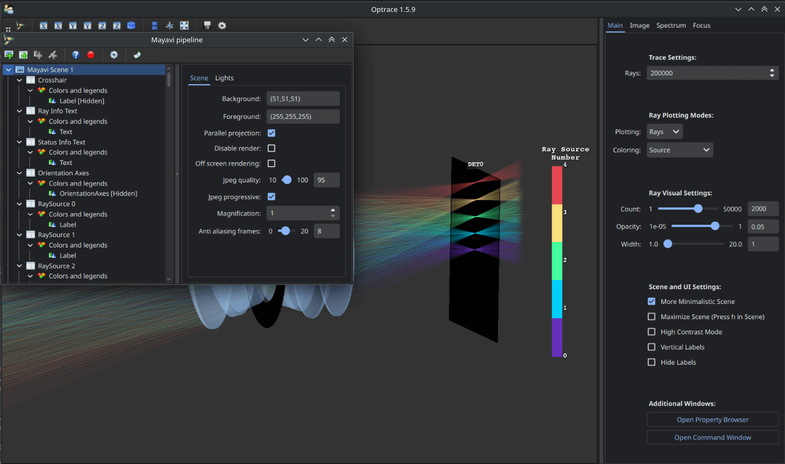
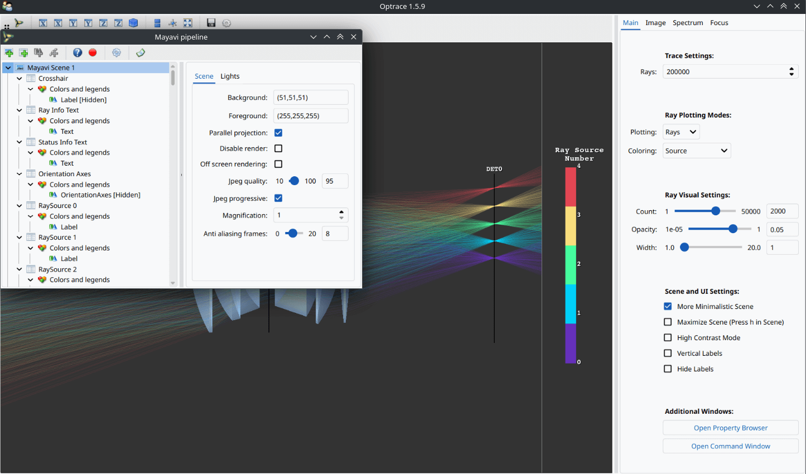

Overview
------------------------------------------------------------------------

.. testcode:: 
   :hide:

   print("Placeholder:    ")
   import optrace as ot
   from optrace.gui import TraceGUI

.. testoutput::
   :hide:
    
   Placeholder: ...

.. role:: python(code)
  :language: python
  :class: highlight

Structure
___________________

.. list-table:: Overview of `optrace` functionality
   :widths: 100 250 100 125
   :header-rows: 1
   :align: left

   * - Topic
     - Descriptions
     - Classes/Functions
     - Links

   * - **Paraxial Analysis**
     - Finding the principial planes, focal points, object and image distance, pupils of a setup
     - :class:`optrace.TMA <optrace.tracer.transfer_matrix_analysis.TMA>`
     - :ref:`usage_tma`

   * - **Paraxial Imaging**
     - Image simulation with the help of a rendered point spread function
     - :func:`optrace.convolve <optrace.tracer.convolve.convolve>`
     - :ref:`usage_convolution`

   * - **General Geometrical Optics and Image/Spectrum Simulation**
     - Sequential Raytracing and of optical setups. Analysis of ray paths, simulation of detector images and spectra, focus finding.
     - :class:`optrace.Raytracer <optrace.tracer.raytracer.Raytracer>`, :class:`optrace.RenderImage <optrace.tracer.image.render_image.RenderImage>`, 
       :class:`optrace.LightSpectrum <optrace.tracer.spectrum.light_spectrum.LightSpectrum>`
     - :ref:`Raytracer <usage_raytracer>`, :ref:`usage_image`, :ref:`usage_spectrum`, :ref:`usage_focus`, :ref:`usage_ray_access`

   * - **Image, Surface, Spectrum and Refractive Index Plotting**
     - Display images, spectra, surfaces and refractive indices graphically
     - :mod:`optrace.plots <optrace.plots>`
     - :ref:`usage_plots` 
   
   * - **Image color conversion**
     - Convert or access image colors
     - :mod:`optrace.color <optrace.tracer.color>` and :class:`optrace.RenderImage <optrace.tracer.image.render_image.RenderImage>`
     - :ref:`usage_color`, :ref:`usage_image` 
   
   * - **Graphical Setup and Visualization**
     - Graphical display of the tracing scene and traced rays as well as some control features for the simulation
     - :class:`optrace.TraceGUI <optrace.gui.trace_gui.TraceGUI>`
     - :ref:`usage_gui`, :ref:`gui_automation`

Namespaces
______________________

The library itself is the primary namespace.
While there is a separete namespace :mod:`optrace.tracer`, all objects are also included in the main one.

.. testcode::

   import optrace as ot

Now objects can be accessed by :python:`ot.Raytracer, ot.CircularSurface, ot.RaySource, ...`.

`optrace` provides plotting functionality for images, spectra, media etc.
These plotting functions are included in the :mod:`optrace.plots` namespace.

.. testcode:: 

   import optrace.plots as otp

The GUI is included in the namespace :mod:`optrace.gui`.
Since the :class:`optrace.gui.TraceGUI <optrace.gui.trace_gui.TraceGUI>` is the only one relevant there, it can be directly imported in the main namespace:

.. testcode::

   from optrace.gui import TraceGUI

Global Options
______________________

Global options can be controlled through the attributes of the class :class:`optrace.global_options <optrace.global_options>`.

Progressbar
###################

For calculation-intensive tasks a progress bar is displayed inside the terminal that displays the progress and estimated remaining time.
It can be turned off globally by:

.. testcode::

   ot.global_options.show_progressbar = False

There is also a context manager available that turns it off temporarily:

.. code-block:: python

   with ot.global_options.no_progressbar():
       do_something()

Warnings
###################

``optrace`` outputs warnings of type :exc:`OptraceWarning <optrace.warnings.OptraceWarning>` (which in turn is a subclass of :exc:`UserWarning`). These can be filtered using the :mod:`warnings` python module.
A simple way to silence them, for example when doing many automated tasks, one can write:

.. testcode::

   ot.global_options.show_warnings = False

There is also a context manager available that turns it off temporarily:

.. code-block:: python

   with ot.global_options.no_warnings():
       do_something()

Multithreading
###################

By default, multithreading is used to parallelize tasks like raytracing, image rendering.
However, this can be undesired, especially when debugging or multiple raytracers are run in parallel.
Multithreading can be turned off using:

.. testcode::

   ot.global_options.multi_threading = False

Wavelength Range
###################

``optrace`` is optimized for operation in the visible range of 380 - 780 nm.
The range can be extended by:

.. testcode::

   ot.global_options.wavelength_range = [300, 800]

Note that most presets like refractive indices are not defined for regions outside the default range, so they can not be used.

Spectral Colormap
######################

Spectrum, refractive index plots as well as the ray display in the TraceGUI use a spectral colormap that maps wavelength values to a color.
For the visible range, a rainbow-like mapping is applied.

When working in the infrared or ultraviolet region, the human sensitivity would map the wavelength to pure black.
Even without a brightness adaption, those regions would produce one constant hue.

To make different values discernible, a custom mapping function can be supplied using:

.. testcode::

   import matplotlib.pyplot as plt
   
   ot.global_options.spectral_colormap = lambda wl: plt.cm.viridis((wl-300)/800)

In this example the colormap is adapted to use the viridis colormap from pyplot, where 300 is mapped to the lowest value of 0 and 800 to the highest value of 1.
The specified function should take a wavelength numpy array (of some length N) as argument and return a two dimensional array with RGBA values between 0-1 and shape (N, 4).

The colormap can be reset by setting it to ``None``.

.. testcode::
   :hide:

   ot.global_options.spectral_colormap = None
   ot.global_options.wavelength_range = [380, 780]

UI Dark Mode
###################

UI dark mode is enabled by default.
The mode can be changed by setting the ``ui_dark_mode`` parameter.
Changes are applied to all current GUI windows as well as new ones.

For instance, to deactive the mode, use:

.. testcode::

   ot.global_options.ui_dark_mode = False
   

   With ``ui_dark_mode`` enabled.

   With ``ui_dark_mode`` disabled.

Plot Dark Mode
###################

For the content of plotting windows, there is a separate option ``plot_dark_mode``.
It is also enabled by default.

To deactivate it, use:

.. testcode::

   ot.global_options.plot_dark_mode = False

Deactivating can be useful for documentation or article output, where the background is also white.
Note that changes are only applied to new pyplot windows, not already opened ones.

.. list-table::
   :class: table-borderless

   * - .. figure:: ../images/srgb_spectrum.svg
          :align: center
          :width: 400
          :class: dark-light

          With ``plot_dark_mode`` enabled.
   
     - .. figure:: ../images/srgb_spectrum_light.svg
          :align: center
          :width: 400
          :class: dark-light

          With ``plot_dark_mode`` disabled.

