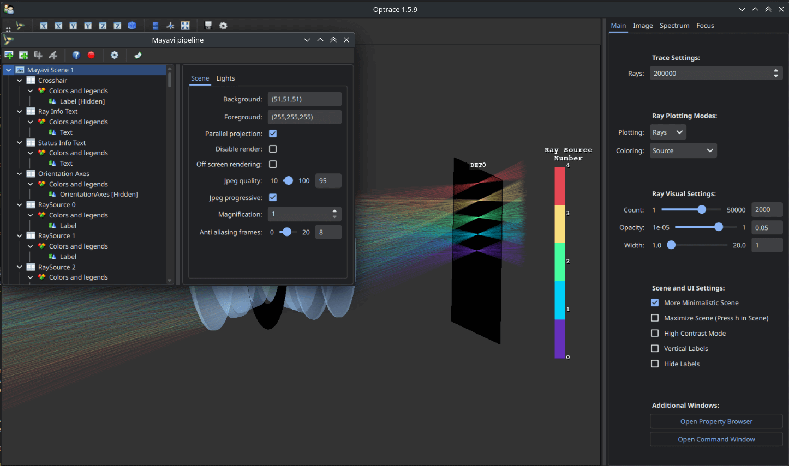
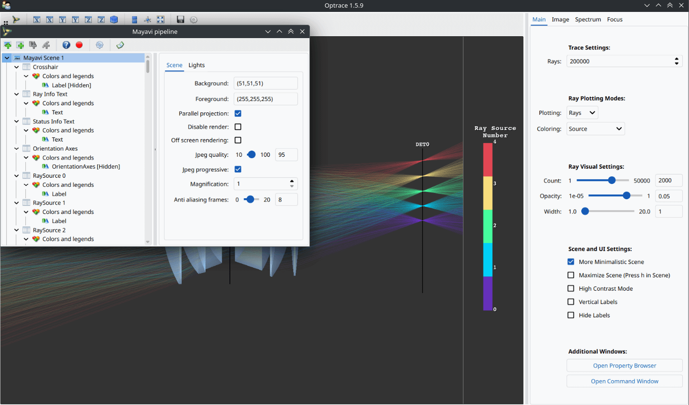

Overview
------------------------------------------------------------------------

.. |TraceGUI| replace:: :class:`TraceGUI <optrace.gui.trace_gui.TraceGUI>`

.. testcode:: 
   :hide:

   print("Placeholder:    ")
   import optrace as ot
   from optrace.gui import TraceGUI

.. testoutput::
   :hide:
    
   Placeholder: ...

.. role:: python(code)
  :language: python
  :class: highlight

Structure
___________________

.. list-table:: Overview of optrace functionality
   :widths: 100 250 100 125
   :header-rows: 1
   :align: left

   * - Topic
     - Descriptions
     - Classes/Functions
     - Links

   * - **Paraxial Analysis**
     - Calculating principal planes, focal points, object and image distances, exit and entrance pupil
     - :class:`optrace.TMA <optrace.tracer.transfer_matrix_analysis.TMA>`
     - :ref:`usage_tma`

   * - **Paraxial Imaging**
     - Image simulation through convolution with a rendered point spread function
     - :func:`optrace.convolve <optrace.tracer.convolve.convolve>`
     - :ref:`usage_convolution`

   * - **General Geometrical Optics and Image/Spectrum Simulation**
     - Sequential Monte-Carlo Raytracing of optical setups. Analysis of ray paths, 
       simulation of detector images and spectra, focus search.
     - :class:`optrace.Raytracer <optrace.tracer.raytracer.Raytracer>`, 
       :class:`optrace.RenderImage <optrace.tracer.image.render_image.RenderImage>`, 
       :class:`optrace.LightSpectrum <optrace.tracer.spectrum.light_spectrum.LightSpectrum>`
     - :ref:`Raytracer <usage_raytracer>`, :ref:`usage_image`, 
       :ref:`usage_spectrum`, :ref:`usage_focus`, :ref:`usage_ray_access`

   * - **Image, Surface, Spectrum and Refractive Index Plotting**
     - Display images, spectra, surfaces and refractive indices graphically in 2D plots.
     - :mod:`optrace.plots <optrace.plots>`
     - :ref:`usage_plots` 
   
   * - **Image color conversion**
     - Convert or access image colors
     - :mod:`optrace.color <optrace.tracer.color>` and 
       :class:`optrace.RenderImage <optrace.tracer.image.render_image.RenderImage>`
     - :ref:`usage_color`, :ref:`usage_image` 
   
   * - **Graphical Setup and Visualization**
     - Graphical display of the 3D tracing scene and traced rays. Additional control features for the simulation.
     - :class:`optrace.TraceGUI <optrace.gui.trace_gui.TraceGUI>`
     - :ref:`usage_gui`, :ref:`gui_automation`

Namespaces
______________________

:python:`optrace` is the primary namespace.
All functionality from :mod:`optrace.tracer` is automatically included in this main namespace.

.. testcode::

   import optrace as ot

Access classes using :python:`ot.Raytracer, ot.CircularSurface, ot.RaySource, ...`.

optrace provides plotting functionality for images, spectra, surfaces and media.
These plotting functions are included in the :mod:`optrace.plots` namespace.

.. testcode:: 

   import optrace.plots as otp

The GUI is included in the namespace :mod:`optrace.gui`.
For the user, only the |TraceGUI| class is relevant there, so it can be directly imported in the main namespace:

.. testcode::

   from optrace.gui import TraceGUI

Global Options
______________________

Global options are set through the attributes of the class :class:`optrace.global_options <optrace.global_options>`.

Progressbar
###################

A progress bar displays the completion status in your terminal during calculation-intensive tasks:

.. code-block:: text

   Rendering:  40% |############4                  | 8/20 [00:17<00:22]

It can be deactivated using:

.. testcode::

   ot.global_options.show_progressbar = False

There is also a context manager available for turning it off temporarily only:

.. code-block:: python

   with ot.global_options.no_progress_bar():
       do_something()

Warnings
###################

optrace outputs warnings of type :exc:`OptraceWarning <optrace.warnings.OptraceWarning>`, 
which are a custom subclass of :exc:`UserWarning`. They can be filtered using the :mod:`warnings` python module.
A simple way to silence them, for instance when doing many automated tasks, is by assigning:

.. testcode::

   ot.global_options.show_warnings = False

There is also a context manager available for turning them off temporarily:

.. code-block:: python

   with ot.global_options.no_warnings():
       do_something()

Multithreading
###################

By default, multithreading parallelizes tasks like raytracing, focus search and image rendering.
However, it can be undesired in some cases, especially when debugging or running multiple raytracers in parallel.
Multithreading can be turned off with:

.. testcode::

   ot.global_options.multi_threading = False

A specific number of cores/threads can be set with the approach in Section :numref:`number_of_thread_specification`.

Wavelength Range
###################

optrace is optimized for operation in the visible wavelength range of 380 - 780 nm.
However, the range can be extended by setting new bounds:

.. testcode::

   ot.global_options.wavelength_range = [300, 800]

Note that most presets like refractive indices are not defined for regions outside the default range.
This can lead to issues when using these presets.

Spectral Colormap
######################

Spectral plots (spectrum, refractive index, ray coloring) use a spectral colormap 
that maps wavelength values to their corresponding colors.
This leads to a rainbow-like mapping for the visible range.

The default spectral mapping is inappropriate for working in the infrared or ultraviolet region.
A custom mapping for better value differentiation is supplied by:

.. testcode::

   import matplotlib.pyplot as plt
   
   ot.global_options.spectral_colormap = lambda wl: plt.cm.viridis((wl-300)/800)

In this example the colormap is set to the
`viridis colormap from pyplot <https://matplotlib.org/stable/users/explain/colors/colormaps.html#sequential>`_,
where 300 is mapped to the lowest value of 0 and 800 to the highest value of 1.
The specified function should take a wavelength numpy array (of some length N) as argument 
and return a two dimensional array with RGBA values between 0-1 and shape (N, 4).

The colormap can be reset to its default by setting it to :python:`None`.

.. testcode::
   :hide:

   ot.global_options.spectral_colormap = None
   ot.global_options.wavelength_range = [380, 780]

UI Dark Mode
###################

The UI dark mode is enabled by default.
To activate the light mode, use:

.. testcode::

   ot.global_options.ui_dark_mode = False
   

   With :python:`ui_dark_mode` enabled.

   With :python:`ui_dark_mode` disabled.

Changes are applied to all current GUI windows as well as new ones.

Plot Dark Mode
###################

A separate option :python:`plot_dark_mode` is available for the content of the plotting windows.
To deactivate it, use:

.. testcode::

   ot.global_options.plot_dark_mode = False

Light mode is especially useful for academic output, where images are shown on a white background.
Note that changes are only applied to new :obj:`pyplot <matplotlib.pyplot>` windows, not already opened ones.

.. list-table::
   :class: table-borderless

   * - .. figure:: ../images/srgb_spectrum.svg
          :align: center
          :width: 400
          :class: dark-light

          With :python:`plot_dark_mode` enabled.
   
     - .. figure:: ../images/srgb_spectrum_light.svg
          :align: center
          :width: 400
          :class: dark-light

          With :python:`plot_dark_mode` disabled.

.. _number_of_thread_specification:

Multithreading with a specific number of cores
___________________________________________________

optrace supports setting the number of available cores, which corresponds to the maximum number of threads that will
be used for the computations.
The setting can be either applied as Python argument:

.. code-block:: bash

   python -Xcpu_count=4 ./script.py

Using an environment variable from the terminal calling python:

.. code-block:: bash

    export PYTHON_CPU_COUNT=4

Or from within your python script, so it is applied locally only:

.. code-block:: python

   import os
   os.environ["PYTHON_CPU_COUNT"] = 4

   # do computations with 4 threads
   ...

It is important to note that only some actions use multithreading, 
and only a few functions work with all available/specified cores. 
Setting the CPU count only provides an upper limit.

Running optrace on Wayland
_____________________________________

Issues persist when running vtk under Wayland on Linux
(`vtk/issues/18701 <https://gitlab.kitware.com/vtk/vtk/-/issues/18701>`__, `pyvistaqt/issues/445 <https://github.com/pyvista/pyvistaqt/issues/445>`__).
The following error message appears:

.. code-block:: text

   X Error of failed request: BadWindow (invalid Window parameter)
   Major opcode of failed request: 12 (X_ConfigureWindow)
   Resource id in failed request: 0x3
   Serial number of failed request: 7
   Current serial number in output stream: 8

Before running Python, set the following environment variable, so the X11 windowing system is used instead:

.. code-block:: bash

   export QT_QPA_PLATFORM=xcb

