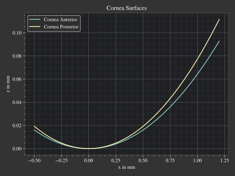

.. _usage_plots:

Plotting Functions
---------------------

.. role:: python(code)
  :language: python
  :class: highlight

Namespace
_____________

The module :mod:`optrace.plots` features some plots and visualizations for different kinds of objects.
You can for example import it as :python:`otp`

.. testcode::

   import optrace.plots as otp

..And call a :python:`plotting_function` (only an example) by writing:

.. code-block::

   otp.plotting_function(...)

Functions
_____________

Detailed descriptions and examples are found in other sections, such as:
Surface plots (:numref:`surface_plotting`), spectrum plots (:numref:`spectrum_plots`), refraction index and abbe plots (:numref:`index_plots`), image plots (:numref:`image_plots`), focus cost plot (:numref:`focus_cost_plot`), chromaticity plots (:numref:`chromaticity_plots`).

Parameters
______________

Most methods include a :python:`title` argument that lets the user define a different plot title.

.. code-block:: python

   some_plotting_function(..., title="Name of plot")

Legends and labels inside the figures are generated from descriptions from the objects. Make sure the create your objects with a :python:`desc=".."` or :python:`long_desc="..."` parameter so they feature some expressive name.

.. code-block:: python

   obj = Object(..., desc="Abc378")
   obj2 = Object(..., long_desc="Some long description")

   some_plotting_function([obj, obj2], ...)

Figure settings like size and dpi can be set globally using the :obj:`matplotlib.rcParams`:

.. testcode::
   
   import matplotlib
   matplotlib.rcParams["figure.figsize"] = (5, 5)
   matplotlib.rcParams["figure.dpi"] = 100

Block/Pause Plots
___________________

By default the plots are displayed and the rest of the program is run.
When halting the execution is required, :func:`optrace.plots.block <optrace.plots.misc_plots.block>` can be called.

.. code-block:: python

   import optrace.plots as otp

   # do some plotting
   ...

   # make blocking
   otp.block()

Doing so, all generated plots are interactive and can be interacted with.

Saving Figures
_______________________

Plots can be saved by specifying the :python:`path` parameter.
Doing so, the image is not displayed but stored in the corresponding location.
The filepath is determined automatically from the filename.
Note that files are overwritten and not saved if the path is invalid.

.. code-block:: python

   some_plotting_function(..., path="./results/image.jpeg")

Additional saving parameters are specified using a dictionary called :python:`sargs` that can include parameters from :obj:`matplotlib.pyplot.savefig`.

.. code-block:: python

   some_plotting_function(..., path="./results/image.jpeg", sargs=dict(dpi=150, pad_inches=0, transparent=True)

.. _surface_plotting:

Surface Plotting
__________________________

Visualizing surfaces is done with the function :func:`surface_profile_plot <optrace.plots.misc_plots.surface_profile_plot>` from :mod:`optrace.plots`.
The surface profiles are plotted with absolute coordinates, if you want to display them relative to each other provide :python:`remove_offset=True`.
:python:`surface_profile_plot` takes a Surface or a list of Surfaces as argument as well as some other display options.

In the following examples both cornea surfaces of the arizona eye model are plotted:

.. testcode::

   import optrace as ot
   import optrace.plots as otp

   G = ot.presets.geometry.arizona_eye()
   L0 = G.lenses[0]

   otp.surface_profile_plot([L0.front, L0.back], remove_offset=True)
   

Optionally a :python:`title` parameter can be provided. You can plot only part of the profiles by providing values for :python:`x0` and :python:`xe`.

.. testcode::

   otp.surface_profile_plot([L0.front, L0.back], remove_offset=True, x0=-0.5, xe=1.2, title="Cornea Surfaces")

This produces the following plot:

   Surface profile plot for the two cornea surfaces of the arizona eye model.

.. _spectrum_plots:

Spectrum Plotting
_____________________

A :class:`Spectrum <optrace.tracer.spectrum.spectrum.Spectrum>`, :class:`LightSpectrum <optrace.tracer.spectrum.light_spectrum.LightSpectrum>` or :class:`TransmissionSpectrum <optrace.tracer.spectrum.transmission_spectrum.TransmissionSpectrum>` is plotted with the function :func:`spectrum_plot <optrace.plots.spectrum_plots.spectrum_plot>` from :mod:`optrace.plots`.
It takes a single object or a list of them.

.. testcode::

   import optrace.plots as otp

   otp.spectrum_plot(ot.presets.light_spectrum.standard_natural)

The user can provide a user-defined :python:`title`, turn off/on labels and the legend with :python:`legend_off, labels_off`. 

.. testcode::

   ot.plots.spectrum_plot(ot.presets.light_spectrum.standard_natural, labels_off=False, title="CIE Standard Illuminants",
                          legend_off=False)

.. list-table::
   :widths: 500 500
   :class: table-borderless

   * - .. figure:: ../images/LED_illuminants.svg
          :width: 500
          :align: center
          :class: dark-light
         
          CIE standard illuminants LED series. 

     - .. figure:: ../images/example_spectrum_histogram.svg
          :align: center
          :width: 500
          :class: dark-light

          A rendered histogram spectrum.

.. _image_plots:

Plotting Images
_____________________________________

**Image**

With a RenderImage object an image plot is created with the function :func:`image_plot <optrace.plots.image_plots.image_plot>`. But first, the plotting namespace needs to be imported:

.. testcode::
   
   import optrace.plots as otp

The plotting function takes an RGBImage or LinearImage as parameter.

.. testcode::

   img = ot.presets.image.hong_kong([2, 2])
   otp.image_plot(img)

We can use the additional parameter :python:`log` to scale the image values logarithmically or provide :python:`flip=True` to rotate the image by 180 degrees. This is useful when the desired image is flipped due to the system imaging. A user defined title is set with the :python:`title` parameter.

.. testcode::

   otp.image_plot(img, title="Title 123", log=True, flip=True)

**Image Cut**

For plotting an image cut the analogous function :func:`image_cut_plot <optrace.plots.image_plots.image_cut_plot>` is applied. It takes the same arguments, but needs a cut parameter :python:`x` or :python:`y`. 

.. testcode::

   otp.image_cut_plot(img, x=0)

Supporting all the same parameters as for :func:`image_plot <optrace.plots.image_plots.image_plot>`, the following call is also valid:

.. testcode::

   otp.image_cut_plot(img, y=0.2, title="Title 123", log=True, flip=True)

.. list-table:: Exemplary image plot and image cut plot from the ``prism.py`` example.
   :class: table-borderless

   * - .. figure:: ../images/color_dispersive2.svg
          :align: center
          :height: 350
          :class: dark-light
   
     - .. figure:: ../images/color_dispersive1_cut.svg
          :align: center
          :height: 350
          :class: dark-light

.. _chromaticity_plots:

Chromaticity Plots
________________________

**Usage**

In some use cases it is helpful to display the spectrum color or image values inside a chromaticity diagram to see the color distribution.
When doing so, the choice between the CIE 1931 xy chromaticity diagram and the CIE 1976 UCS chromaticity diagram must be undertaken. Differences are described in <>.

Depending on your choice the :func:`chromaticities_cie_1931 <optrace.plots.chromaticity_plots.chromaticities_cie_1931>` or :func:`chromaticities_cie_1976 <optrace.plots.chromaticity_plots.chromaticities_cie_1976>` function is called
In the simplest case it takes an RenderImage as parameter and displays the image colors:

.. code-block:: python

   dimg = RT.detector_image()
   otp.chromaticities_cie_1931(dimg)

You can also pass an RGBImage:

.. testcode::

   img = ot.presets.image.color_checker([3, 2])
   otp.chromaticities_cie_1931(img)

A :class:`LightSpectrum <optrace.tracer.spectrum.light_spectrum.LightSpectrum>` can also be provided:

.. testcode::

   spec = ot.presets.light_spectrum.led_b1
   otp.chromaticities_cie_1976(spec)

Or a list of multiple spectra:

.. testcode::

   specs = [ot.presets.light_spectrum.led_b3, ot.presets.light_spectrum.d65]
   otp.chromaticities_cie_1976(specs)

A user defined :python:`title` can also be set. :python:`norm` specifies the brightness normalization, explained a few paragraphs below.

A full function call could look like this:

.. testcode::

   otp.chromaticities_cie_1976(ot.presets.light_spectrum.standard, title="Standard Illuminants", norm="Largest")

.. list-table:: Examples of CIE 1931 and 1976 chromaticity diagrams.
   :widths: 500 500
   :class: table-borderless

   * - .. figure:: ../images/chroma_1931.svg
          :align: center
          :width: 500
          :class: dark-light
   
     - .. figure:: ../images/chroma_1976.svg
          :align: center
          :width: 500
          :class: dark-light

**Norms**

Chromaticity norms describe the brightness normalization for the colored diagram background. There are multiple norms available:

*  **Sum**: Normalize the sRGB such that the sum of all channels equals one. Leads to a diagram with smooth color changes and approximately equal brightness.
*  **Euclidean**: Root-mean-square value of linear sRGB channels. A good compromise between "Largest" and "Sum", having more saturated colors than "Sum", but also smooth color changes compared to "Largest". The default option.
*  **Largest**: Maximum brightness for this sRGB color. Leads to colors with maximum brightness and saturation.

.. list-table:: 
   Example of "Sum", "Euclidean" and "Largest" norm (from left to right)
   Example of a chromaticity plots showing the color coordinates of fluorescent lamp presets. Norms are "Sum" (left) and "Largest" (right).
   :class: table-borderless

   * - .. figure:: ../images/chroma_sum_norm.svg
          :align: center
          :width: 300
          :class: dark-light
    
     - .. figure:: ../images/chroma_rms_norm.svg
          :align: center
          :width: 300
          :class: dark-light
   
   
     - .. figure:: ../images/chroma_largest_norm.svg
          :align: center
          :width: 300
          :class: dark-light
     

.. _index_plots:

Refractive Index Plots
_______________________

**Index Plot**

A RefractionIndex or a list of RefractionIndex objects can be plotted with the function :func:`refraction_index_plot <optrace.plots.spectrum_plots.refraction_index_plot>` from :mod:`optrace.plots`.
The example below plots the glass presets in one figure.

.. testcode::

   import optrace.plots as otp

   otp.refraction_index_plot(ot.presets.refraction_index.glasses)

You can also enable or disable the legend and labels with :python:`legend_off` and :python:`labels_off`

.. testcode::

   otp.refraction_index_plot(ot.presets.refraction_index.glasses, title="Test abc",
                             legend_off=False, labels_off=True)

.. figure:: ../images/glass_presets_n.svg
   :width: 600
   :align: center
   :class: dark-light
   
   Example of a Refractive Index Plot.

**Abbe Plot**

An Abbe plot is generated with :func:`abbe_plot <optrace.plots.misc_plots.abbe_plot>`.

.. testcode::

   otp.abbe_plot(ot.presets.refraction_index.glasses)

It also supports the parameter :python:`title`. Additionally one can provide user defined :python:`lines` to calculate the index and V-number with:

.. testcode::

   otp.abbe_plot(ot.presets.refraction_index.glasses, title="abc", lines=ot.presets.spectral_lines.FeC)

.. figure:: ../images/glass_presets_V.svg
   :width: 600
   :align: center
   :class: dark-light

   Example of an Abbe Plot.

.. _focus_cost_plot:

Autofocus Cost Plots
___________________________

Cost plots are especially useful to debug the focus finding and check how pronounced a focus or focus region is.
Plotting the cost function and result is done by calling the :func:`autofocus_cost_plot <optrace.plots.misc_plots.autofocus_cost_plot>` method from :mod:`optrace.plots`.
It requires the :python:`res, afdict` parameters from before.

.. code-block:: python

   from optrace.plots import autofocus_cost_plot

   autofocus_cost_plot(res, afdict)

Optionally one can overwrite the :python:`title`.

.. code-block:: python

   autofocus_cost_plot(res, afdict, title="abcd")

Below you can find examples for cost plots.

.. list-table::
   :widths: 500 500
   :class: table-borderless

   * - .. figure:: ../images/af_debug_position_variance.svg
          :align: center
          :width: 500
          :class: dark-light

          Focus finding for mode "Position Variance" in the ``spherical_aberration.py`` example.

     - .. figure:: ../images/af_debug_image_sharpness.svg
          :align: center
          :width: 500
          :class: dark-light

          Focus finding for mode "Image Sharpness" in the ``spherical_aberration.py`` example.

.. highlight:: none

When working with the :class:`TraceGUI <optrace.gui.trace_gui.TraceGUI>` it also outputs focus information, like the following:

::

    Found 3D position: [5.684185e-06mm, 2.022295e-06mm, 15.39223mm]
    Search Region: z = [0.9578644mm, 40mm]
    Method: Irradiance Maximum
    Used 200000 Rays for Autofocus
    Ignoring Filters and Apertures

    OptimizeResult:
      message: CONVERGENCE: REL_REDUCTION_OF_F_<=_FACTR*EPSMCH
      success: True
       status: 0
          fun: 0.019262979304881897
            x: 15.3922327445026
          nit: 4
          jac: [ 9.024e-03]
         nfev: 102
         njev: 51
     hess_inv: <1x1 LbfgsInvHessProduct with dtype=float64>

.. highlight:: default
