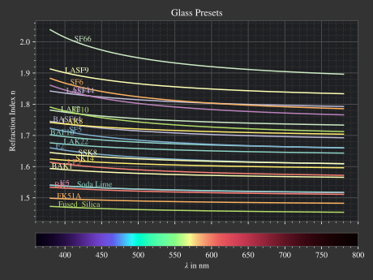

.. _usage_plots:

Plotting Functions
---------------------

.. role:: python(code)
  :language: python
  :class: highlight

Namespace
_____________

The module :mod:`optrace.plots` includes multiple plot and visualization functionality.
You can import it in the following way:

.. testcode::

   import optrace.plots as otp

..And access an exemplary :python:`plotting_function` by writing:

.. code-block::

   otp.plotting_function(...)

Parameters
______________

Most methods include a :python:`title` argument for a user defined plot title.

.. code-block:: python

   some_plotting_function(..., title="Name of plot")

Legends and labels inside the figures are generated from descriptions of the objects. 
Make sure to create your objects with an expressive :python:`desc=".."` or :python:`long_desc="..."` parameter.

.. code-block:: python

   obj = Object(..., desc="Abc378")
   obj2 = Object(..., long_desc="Some long description")

   some_plotting_function([obj, obj2], ...)

Plotting is implemented with :obj:`matplotlib`, so settings like size and dpi can be set globally with the :obj:`matplotlib.rcParams`:

.. testcode::
   
   import matplotlib
   matplotlib.rcParams["figure.figsize"] = (5, 5)
   matplotlib.rcParams["figure.dpi"] = 100

Block/Pause Plots
___________________

By default the plots are displayed and program continues executing.
Call :func:`optrace.plots.block <optrace.plots.misc_plots.block>` to pause and interact with the plot windows.

.. code-block:: python

   import optrace.plots as otp

   # do some plotting
   ...

   # make blocking
   otp.block()

Saving Figures
_______________________

Plots will be saved by specifying the :python:`path` parameter.
This inhibits the display of the plot window and stores it instead in the provided location.
The file path is determined automatically from the filename.
Note that files are **overwritten** and **not saved if the path is invalid**.

.. code-block:: python

   some_plotting_function(..., path="./results/image.jpeg")

Additional saving parameters are specified using a dictionary called :python:`sargs` that can include parameters from :obj:`matplotlib.pyplot.savefig`.

.. code-block:: python

   some_plotting_function(..., path="./results/image.jpeg", sargs=dict(dpi=150, pad_inches=0, transparent=True)

.. _surface_plotting:

Plotting Surfaces
__________________________

:func:`surface_profile_plot <optrace.plots.misc_plots.surface_profile_plot>` allows for the plotting of one or multiple surfaces.
It takes a Surface or a list of Surfaces as argument as well as some other display options.
The profiles are created in x-direction through the center y-coordinate.
Rotate the objects beforehand to slice through a different axis.
The surface profiles are plotted with absolute coordinates, if you want to display them relative to each other provide :python:`remove_offset=True`.

In the following example both cornea surfaces of the Arizona eye model are plotted:

.. testcode::

   import optrace as ot
   import optrace.plots as otp

   G = ot.presets.geometry.arizona_eye()
   L0 = G.lenses[0]

   otp.surface_profile_plot([L0.front, L0.back], remove_offset=True)
   
Provide values for :python:`x0` and :python:`xe` to plot only a part of the profile.

.. testcode::

   otp.surface_profile_plot([L0.front, L0.back], remove_offset=True, x0=-0.5, xe=1.2, title="Cornea Surfaces")

This produces the following plot:

.. figure:: ../images/surface_profile_plot.svg
   :align: center
   :width: 550
   :class: dark-light

   Surface profile plot for the two cornea surfaces of the arizona eye model.

.. _spectrum_plots:

Spectrum Plotting
_____________________

A :class:`Spectrum <optrace.tracer.spectrum.spectrum.Spectrum>`, :class:`LightSpectrum <optrace.tracer.spectrum.light_spectrum.LightSpectrum>` or :class:`TransmissionSpectrum <optrace.tracer.spectrum.transmission_spectrum.TransmissionSpectrum>` is plotted with the function :func:`spectrum_plot <optrace.plots.spectrum_plots.spectrum_plot>`.
It takes a single object or a list as arguments.

.. testcode::

   import optrace.plots as otp

   otp.spectrum_plot(ot.presets.light_spectrum.standard_natural)

The user can provide a user-defined :python:`title`, turn off/on labels and the legend with :python:`legend_off, labels_off`. 

.. testcode::

   ot.plots.spectrum_plot(ot.presets.light_spectrum.standard_natural, labels_off=False, title="CIE Standard Illuminants",
                          legend_off=False)

The following figures demonstrate examples for spectral plots.

.. list-table::
   :widths: 500 500
   :class: table-borderless

   * - .. figure:: ../images/LED_illuminants.svg
          :width: 500
          :align: center
          :class: dark-light
         
          CIE standard illuminants LED series. 

     - .. figure:: ../images/example_spectrum_histogram.svg
          :align: center
          :width: 500
          :class: dark-light

          A rendered histogram spectrum.

.. _image_plots:

Plotting Images
_____________________________________

**Image**

The :func:`image_plot <optrace.plots.image_plots.image_plot>` plotting function takes an :class:`RGBImage <optrace.tracer.image.rgb_image.RGBImage>` or :class:`LinearImage <optrace.tracer.image.linear_image.LinearImage>` as parameter.
A :class:`RenderImage <optrace.tracer.image.render_image.RenderImage>` needs to be converted to a specific image type first.

.. testcode::

   img = ot.presets.image.hong_kong([2, 2])
   otp.image_plot(img)

We can use 
The additional parameter :python:`log` is used to scale the image values logarithmically.
Provide :python:`flip=True` to rotate the image by 180 degrees around the optical axis.
This is useful when the desired image is flipped due to the system's imaging. 

.. testcode::

   otp.image_plot(img, title="Title 123", log=True, flip=True)

**Image Cut**

For plotting an image profile the analogous function :func:`image_profile_plot <optrace.plots.image_plots.image_profile_plot>` is applied.
It additionally requires a profile parameter :python:`x` or :python:`y` that specifies the profile coordinate.

.. testcode::

   otp.image_profile_plot(img, x=0)

Supporting all the same parameters as for :func:`image_plot <optrace.plots.image_plots.image_plot>`, the following call is possible:

.. testcode::

   otp.image_profile_plot(img, y=0.2, title="Title 123", log=True, flip=True)

.. list-table:: Exemplary image plot and image profile plot from the :ref:`example_prism` example.
   :class: table-borderless

   * - .. figure:: ../images/color_dispersive2.svg
          :align: center
          :height: 350
          :class: dark-light
   
     - .. figure:: ../images/color_dispersive1_cut.svg
          :align: center
          :height: 350
          :class: dark-light

.. _chromaticity_plots:

Chromaticity Plots
________________________

**Usage**

Chromaticity plots allow for a representation of image or spectrum colors inside a chromaticity diagram.
Both the :func:`chromaticities_cie_1931 <optrace.plots.chromaticity_plots.chromaticities_cie_1931>` or :func:`chromaticities_cie_1976 <optrace.plots.chromaticity_plots.chromaticities_cie_1976>` function are available, depending on your choice of diagram.

It supports the plotting of :class:`RenderImage <optrace.tracer.image.render_image.RenderImage>`, :class:`RGBImage <optrace.tracer.image.rgb_image.RGBImage>` and :class:`LightSpectrum <optrace.tracer.spectrum.light_spectrum.LightSpectrum>`.
Example code for a :class:`RenderImage <optrace.tracer.image.render_image.RenderImage>`:

.. code-block:: python

   dimg = RT.detector_image()
   otp.chromaticities_cie_1931(dimg)

Passing an :class:`RGBImage <optrace.tracer.image.rgb_image.RGBImage>`:

.. testcode::

   img = ot.presets.image.color_checker([3, 2])
   otp.chromaticities_cie_1931(img)

A :class:`LightSpectrum <optrace.tracer.spectrum.light_spectrum.LightSpectrum>` can also be provided:

.. testcode::

   spec = ot.presets.light_spectrum.led_b1
   otp.chromaticities_cie_1976(spec)

Or a list of multiple spectra:

.. testcode::

   specs = [ot.presets.light_spectrum.led_b3, ot.presets.light_spectrum.d65]
   otp.chromaticities_cie_1976(specs)

:python:`norm` specifies the brightness normalization, explained a few paragraphs below:

.. testcode::

   otp.chromaticities_cie_1976(ot.presets.light_spectrum.standard, title="Standard Illuminants", norm="Largest")

.. list-table:: Examples of CIE 1931 and 1976 chromaticity diagrams.
   :widths: 500 500
   :class: table-borderless

   * - .. figure:: ../images/chroma_1931.svg
          :align: center
          :width: 500
          :class: dark-light
   
     - .. figure:: ../images/chroma_1976.svg
          :align: center
          :width: 500
          :class: dark-light

**Norms**

Chromaticity norms describe the brightness normalization for the colored diagram background.

.. list-table:: 
   :widths: 100 600
   :align: left

   * - **Sum**
     - Normalize the sRGB values so the channel sum equals one. Leads to a diagram with smooth color changes and approximately equal brightness.
   * - **Euclidean** 
     - Root-mean-square value of linear sRGB channels. A good compromise between "Largest" and "Sum", having more saturated colors than "Sum", but also smooth color changes compared to "Largest". The default option.
   * - **Largest**
     - Maximum brightness for each sRGB color. Leads to colors with maximum brightness and saturation.

.. list-table:: 
   Example of "Sum", "Euclidean" and "Largest" norm (from left to right)
   :class: table-borderless

   * - .. figure:: ../images/chroma_sum_norm.svg
          :align: center
          :width: 300
          :class: dark-light
    
     - .. figure:: ../images/chroma_rms_norm.svg
          :align: center
          :width: 300
          :class: dark-light
   
   
     - .. figure:: ../images/chroma_largest_norm.svg
          :align: center
          :width: 300
          :class: dark-light
     

.. _index_plots:

Plotting Refractive Indices
______________________________

**Index Plot**

A :class:`RefractionIndex <optrace.tracer.refraction_index.RefractionIndex>` or a list of those objects can be plotted with the function :func:`refraction_index_plot <optrace.plots.spectrum_plots.refraction_index_plot>` from :mod:`optrace.plots`.
The example below displays all glass presets in one figure.

.. testcode::

   import optrace.plots as otp

   otp.refraction_index_plot(ot.presets.refraction_index.glasses)

Enable or disable the legend and labels with :python:`legend_off` and :python:`labels_off`

.. testcode::

   otp.refraction_index_plot(ot.presets.refraction_index.glasses, title="Test abc",
                             legend_off=False, labels_off=True)

   
   Example of a Refractive Index Plot.

**Abbe Plot**

An Abbe plot is generated with :func:`abbe_plot <optrace.plots.misc_plots.abbe_plot>`.

.. testcode::

   otp.abbe_plot(ot.presets.refraction_index.glasses)

You can provide user defined spectral :python:`lines` to calculate the index and V-number at:

.. testcode::

   otp.abbe_plot(ot.presets.refraction_index.glasses, title="abc", lines=ot.presets.spectral_lines.FeC)

.. figure:: ../images/glass_presets_V.svg
   :width: 600
   :align: center
   :class: dark-light

   Example of an Abbe Plot.

.. _focus_cost_plot:

Focus Search Cost Function Plots
__________________________________

Cost plots are used to debug the focus search and assess how pronounced a focus or focus region is.
Plotting the cost function and result is done by calling the :func:`focus_search_cost_plot <optrace.plots.misc_plots.focus_search_cost_plot>` method from :mod:`optrace.plots`.
It requires the :python:`res, fsdict` parameters from the :meth:`focus_search <optrace.tracer.raytracer.Raytracer.focus_search>` function.

.. code-block:: python

   from optrace.plots import focus_search_cost_plot

   focus_search_cost_plot(res, fsdict)

Below you can find examples for two cost function plots.

.. list-table::
   :widths: 500 500
   :class: table-borderless

   * - .. figure:: ../images/af_debug_position_variance.svg
          :align: center
          :width: 500
          :class: dark-light

          Focus search for mode "Position Variance" in the :ref:`example_spherical_aberration` example.

     - .. figure:: ../images/af_debug_image_sharpness.svg
          :align: center
          :width: 500
          :class: dark-light

          Focus search for mode "Image Sharpness" in the :ref:`example_spherical_aberration` example.

.. highlight:: none

When calling from the :class:`TraceGUI <optrace.gui.trace_gui.TraceGUI>`, it also outputs focus information inside the GUI:

::

    Found 3D position: [5.684185e-06mm, 2.022295e-06mm, 15.39223mm]
    Search Region: z = [0.9578644mm, 40mm]
    Method: Irradiance Maximum
    Used 200000 Rays for Autofocus
    Ignoring Filters and Apertures

    OptimizeResult:
      message: CONVERGENCE: REL_REDUCTION_OF_F_<=_FACTR*EPSMCH
      success: True
       status: 0
          fun: 0.019262979304881897
            x: 15.3922327445026
          nit: 4
          jac: [ 9.024e-03]
         nfev: 102
         njev: 51
     hess_inv: <1x1 LbfgsInvHessProduct with dtype=float64>

.. highlight:: default
