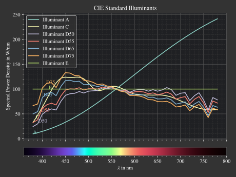

Spectrum Classes
--------------------------------------------------

.. role:: python(code)
  :language: python
  :class: highlight

.. testsetup:: *

   import optrace as ot
   import numpy as np

.. |LightSpectrum| replace:: :class:`LightSpectrum <optrace.tracer.spectrum.light_spectrum.LightSpectrum>`
.. |Spectrum| replace:: :class:`Spectrum <optrace.tracer.spectrum.spectrum.Spectrum>`
.. |TransmissionSpectrum| replace:: :class:`TransmissionSpectrum <optrace.tracer.spectrum.transmission_spectrum.TransmissionSpectrum>`
.. |RaySource| replace:: :class:`RaySource <optrace.tracer.geometry.ray_source.RaySource>`
   
LightSpectrum
______________________

A |LightSpectrum| defines emittance or a similar quantity for light output depending on the wavelength. All spectral values need be greater or equal to zero.

|LightSpectrum| objects are used when creating a |RaySource| or when we want to render the spectral distribution of light hitting a detector.

Creating the Spectrum
#########################

**Units**

For line spectra (modes :python:`"Monochromatic"` and :python:`"Lines"`) the spectral unit is W, while for all other modes the spectral power density with unit W/nm.

The actual values and height parameters (:python:`val, line_vals, ...`) are therefore given in the same unit.

For spectra used in raytracing the absolute height is unimportant, as the function gets rescaled to the correct power by the parent ray source.

**Constant**

A constant (or uniform) |LightSpectrum| is defined using:

.. testcode::
    
   spec = ot.LightSpectrum("Constant", val=12.3)

**Monochromatic**

We can also define a spectrum with only a single wavelength:

.. testcode::
    
   spec = ot.LightSpectrum("Monochromatic", wl=423.56, val=3)

**Lines**

Multiple spectral lines are created with mode :python:`"Lines"`.
Argument :python:`lines` is a list of wavelengths, while :python:`line_vals` is a list with the same number of elements describing the height/power of each wavelength.

.. testcode::

   spec = ot.LightSpectrum("Lines", lines=[458, 523, 729.6], line_vals=[0.5, 0.2, 0.1])

**Rectangle**

A rectangular window is defined with :python:`"Rectangle"` and lower and upper wavelength bounds.

.. testcode::
    
   spec = ot.LightSpectrum("Rectangle", wl0=520, wl1=689, val=0.15)

**Gaussian**

A gaussian function can be created with :python:`"Gaussian"`, a mean value :python:`mu` and standard deviation :python:`sig`, all given in nanometers.
Note that the gaussian function will be truncated to the visible range [380nm, 780nm].

.. testcode::
    
   spec = ot.LightSpectrum("Gaussian", mu=478, sig=23.5, val=0.89)

**Blackbody Radiator**

A blackbody radiator, following Planck's law, with a specific temperature :python:`T` in Kelvin is initialized with:

.. testcode::
    
   spec = ot.LightSpectrum("Blackbody", T=3890, val=2)

The :python:`val` parameter defines the peak value in W/nm.

**User Function**

For the user it is also possible to create an own function with the :python:`func` parameter. This function must take wavelength array in nm as input and also return a numpy array with the same shape.

.. testcode::
    
   spec = ot.LightSpectrum("Function", func=lambda wl: np.arctan(wl - 520)**2)

If a function with multiple parameters is utilized, additional arguments can be put in the :python:`func_args` parameter dictionary.

.. testcode::
    
   spec = ot.LightSpectrum("Function", func=lambda wl, c: np.arctan(wl - c)**2, func_args=dict(c=489))

For discrete datasets the :python:`"Data"` mode proves useful. In this case the |LightSpectrum| constructor takes a wavelength array :python:`wls` and a value array :python:`vals`, both being the same shape and one dimensional numpy arrays.

.. testcode::
    
   wls = np.linspace(450, 600, 100)
   vals = np.cos(wls/500)

   spec = ot.LightSpectrum("Data", wls=wls, vals=vals)

Note that :python:`wls` needs to be monotonically increasing with the same step size and needs to be inside the visible range [380nm, 780nm].

**Histogram**

This spectrum type generally is not user created, but is rendered on a detector or source. It consists of a list of bins and bin values.

Getting Spectral Values
#########################

The |LightSpectrum| object can be called with wavelengths to get the spectral values:

.. doctest::

   >>> wl = np.linspace(400, 500, 5)
   >>> spec(wl)
   array([0.        , 0.        , 0.62160997, 0.58168242, 0.54030231])

Wavelength Characteristics
###############################

.. list-table:: Wavelength characteristics functions
   :widths: 120 50 250
   :header-rows: 1
   :align: center
   
   * - Function
     - Unit
     - Meaning
   * - :meth:`peak_wavelength <optrace.tracer.spectrum.light_spectrum.LightSpectrum.peak_wavelength>`
     - nm
     - Wavelength with the spectrum peak
   * - :meth:`centroid_wavelength <optrace.tracer.spectrum.light_spectrum.LightSpectrum.centroid_wavelength>`
     - nm
     - power-weighted average wavelength
   * - :meth:`fwhm <optrace.tracer.spectrum.light_spectrum.LightSpectrum.fwhm>`
     - nm
     - full width half maximum wavelength range
   * - :meth:`dominant_wavelength <optrace.tracer.spectrum.light_spectrum.LightSpectrum.dominant_wavelength>`
     - nm
     - | wavelength with the same hue as the spectrum
       | NaN if not existent
   * - :meth:`complementary_wavelength <optrace.tracer.spectrum.light_spectrum.LightSpectrum.complementary_wavelength>`
     - nm
     - | wavelength with the opposite hue as the spectrum
       | NaN if not existent

As an example we can load the LED B1 standard illuminant, that can also be seen in :numref:`fig_led_illuminants`.
Then the peak wavelength is calculated with:

.. doctest::

   >>> spec = ot.presets.light_spectrum.led_b1
   >>> spec.peak_wavelength()
   605.00225...

Note that with multiple same height peaks or a broad constant peak region the first peak value is returned. However, due to numerical precision this is not always the case.

In our example the power-weighted average wavelength (centroid) is different from this:

.. doctest::

   >>> spec.centroid_wavelength()
   592.39585...

The dominant wavelength is calculated using:

.. doctest::

   >>> spec.dominant_wavelength()
   584.75088...

When dominant or complementary are not existent, as for instance magenta can't be described by a single wavelength, the values are set to NaN (not a number).
You can find a visual explanation on both dominant and complementary wavelength `on this Wiki page <https://en.wikipedia.org/wiki/Dominant_wavelength>`__.

The FWHM (full width at half maximum) can be calculated with:

.. doctest::

   >>> spec.fwhm()
   129.18529...

The function calculates the smallest FWHM around the highest peak. Note that for some spectral distributions, for instance multiple gaussians, this function is not suitable, as the FWHM is not meaningful here.

Power
#############

The spectral power in W can be calculated with:

.. doctest::

   >>> spec.power()
   3206.9749...

And the luminous power in lumens with:

.. doctest::

   >>> spec.luminous_power()
   999886.86...

TransmissionSpectrum
______________________

A TransmissionSpectrum is applied as filter function for a Filter element. All transmission values need to be inside the [0, 1] range.

The TransmissionSpectrum provides less modes than the LightSpectrum class. Note that now the scaling factor :python:`vall` becomes important.

This class defines a new :python:`inverse` parameter, that subtracts the defined function from a value of one. This has the effect that the function instead does not define the transmittance behavior, but the absorption one. A gaussian bandpass becomes a notch filter, a rectangular bandpass a rectangular blocking one.

**Constant**

A neutral density filter is defined with mode :python:`"Constant"` and the linear transmittance value.

.. testcode::
    
   spec = ot.TransmissionSpectrum("Constant", val=0.5)

**Gaussian**

Colored filters (or bandpass filters) are often similar to a Gaussian function.

.. testcode::
    
   spec = ot.TransmissionSpectrum("Gaussian", mu=550, sig=30, val=1)

A gaussian notch filter can be defined with :python:`inverse=True`.

.. testcode::
    
   spec = ot.TransmissionSpectrum("Gaussian", mu=550, sig=30, val=1, inverse=True)

**Rectangle**

A rectangular pass filter can be modelled by a rectangular function.

.. testcode::
    
   spec = ot.TransmissionSpectrum("Rectangle", wl0=500, wl1=650, val=0.1)

A rectangular blocking filter can be defined with :python:`inverse=True`.

.. testcode::
    
   spec = ot.TransmissionSpectrum("Rectangle", wl0=500, wl1=650, inverse=True)

An edgepass filter can be created by simply setting one of the bounds to the bound of the visible range.

.. testcode::
    
   spec = ot.TransmissionSpectrum("Rectangle", wl0=500, wl1=780)

**User Data/Function**

Creating a |TransmissionSpectrum| with discrete data or a user function works exactly like for the |LightSpectrum|, however all function/data values need to be inside range [0, 1].

**Getting Spectral Values**

As for the |LightSpectrum| object we can get the spectral values with:

.. doctest::

   >>> wl = np.linspace(400, 550, 5)
   >>> spec(wl)
   array([0., 0., 0., 1., 1.])

Spectrum
______________________

|Spectrum| is the parent class of both |LightSpectrum|, |TransmissionSpectrum|. It defines the following modes: :python:`"Monochromatic", "Rectangle", "List", "Function", "Data", "Gaussian", "Constant"`. Compared to |LightSpectrum| only modes :python:`"Histogram"` and :python:`"Blackbody"` are missing.
Generally the |Spectrum| class is not used by the user. But for instance the color matching functions  :python:`ot.presets.spectrum.x, ot.presets.spectrum.y, ot.presets.spectrum.z` are objects of this class.

.. _spectrum_plots:

Plotting
_____________________

A |Spectrum| is plotted with the function :func:`spectrum_plot <optrace.plots.spectrum_plots.spectrum_plot>` from :mod:`optrace.plots`.
It takes a |Spectrum|, subclasses or a list of them.

.. testcode::

   import optrace.plots as otp

   otp.spectrum_plot(ot.presets.light_spectrum.standard_natural)

The user can provide a user-defined :python:`title`, turn off/on labels and the legend with :python:`legend_off, labels_off`. 

.. testcode::

   ot.plots.spectrum_plot(ot.presets.light_spectrum.standard_natural, labels_off=False, title="CIE Standard Illuminants",
                          legend_off=False)

Examples for a spectrum plot are found below.

.. _spectral_lines:

Spectral Lines
______________________

`optrace` has some spectral wavelength lines defined in its presets.
While there are many such lines, only those relevant for the calculation of the Abbe number are built-in.
More about the Abbe number can be found in :numref:`abbe_number`.

.. list-table:: Fraunhofer lines commonly used for Abbe number determination :footcite:`AbbeWiki`
   :widths: 70 70 70 70
   :header-rows: 1
   :align: center
   
   * - Name
     - | Wavelength 
       | in nm
     - Element
     - Color
   * - h
     - 404.6561
     - Hg
     - violet
   * - g
     - 435.8343
     - Hg
     - blue
   * - F'
     - 479.9914
     - Cd
     - blue
   * - F
     - 486.1327
     - H
     - blue
   * - e
     - 546.0740
     - Hg
     - green
   * - d
     - 587.5618
     - He
     - yellow
   * - D
     - 589.2938
     - Na
     - yellow
   * - C'
     - 643.8469
     - Cd
     - red
   * - C
     - 656.272
     - H
     - red
   * - r
     - 706.5188
     - He
     - red
   * - A'
     - 768.2
     - K
     - IR-A

Due to limitations in python variable names, the presets with a trailing apostrophe are instead named with an trailing underscore, for instance F' is named :python:`F_`.

.. doctest::
    
   >>> ot.presets.spectral_lines.F_
   479.9914

The most common wavelength combinations for Abbe numbers are FdC, FDC, FeC and F'eC'.

.. doctest::
    
   >>> ot.presets.spectral_lines.F_eC_
   [479.9914, 546.074, 643.8469]

In the next table the dominant wavelengths of the sRGB primaries can be found. The dominant wavelength is the wavelength that produces a color with the same hue as the reference color.
The scaling factors are dimensioned such that the sum of these three monochromatic light sources produces sRGB-white.

.. list-table:: Dominant wavelengths of sRGB primaries. Own work. 
   :widths: 70 70 70
   :header-rows: 1
   :align: center
   
   * - Name
     - | Wavelength 
       | in nm
     - Scaling Factor
   * - R
     - 611.2826
     - 0.5745000
   * - G
     - 549.1321
     - 0.5985758
   * - B
     - 464.3118
     - 0.3895581

These wavelengths prove useful when trying to simulate color mixing.

.. doctest::
    
   >>> ot.presets.spectral_lines.rgb
   [464.3118, 549.1321, 611.2826]

Spectrum Presets
______________________

Below you can find some predefined presets for |Spectrum| and |LightSpectrum|.

  
   CIE standard illuminants. Available as ``ot.presets.light_spectrum.<name>`` with ``a, d50, ...`` as ``<name>``

.. figure:: ../images/LED_illuminants.svg
   :width: 600
   :align: center
   
   CIE standard illuminants LED series. Available as ``ot.presets.light_spectrum.<name>`` with ``led_b1, led_b2, ...`` as ``<name>``
   
.. _fig_led_illuminants:

.. figure:: ../images/Fluor_illuminants.svg
   :width: 600
   :align: center
  
   CIE standard illuminants Fluorescent series. Available as ``ot.presets.light_spectrum.<name>`` with ``fl2, fl7, ...`` as ``<name>``

.. figure:: ../images/srgb_spectrum.svg
   :width: 600
   :align: center
  
   Possible sRGB primary spectra.
   Available as ``ot.presets.light_spectrum.<name>`` with ``srgb_r, srgb_g, ...`` as ``<name>``

.. figure:: ../images/cie_cmf.svg
   :width: 600
   :align: center
  
   CIE color matching functions.
   Available as ``ot.presets.spectrum.<name>`` with ``x, y, z`` as ``<name>``
  
Other presets include spectra from spectral lines combination in :numref:`spectral_lines`. Namely :python:`ot.presets.light_spectrum.<name>` with :python:`FdC, FDC, FeC, F_eC_` as :python:`<name>`.
