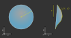

Base Shapes (Surface, Line, Point)
------------------------------------

.. |Element| replace:: :class:`Element <optrace.tracer.geometry.element.Element>`

.. testsetup:: *

   import optrace as ot
   import numpy as np

.. role:: python(code)
  :language: python
  :class: highlight

Overview
_________________

Surfaces, points and lines are the base component for all |Element| classes. They describe a geometrical behavior relative to their center (marked as "x" in the following figures).
They have no absolute position in three-dimensional space, their actual position is assigned and managed by their owner Element.
All lengths are given in millimeters and angles in degrees.

Point and Line
___________________

:class:`Point <optrace.tracer.geometry.point.Point>` and :class:`Line <optrace.tracer.geometry.line.Line>` are the simplest geometry types. 
Both types have no extent in z-direction, therefore lie exclusively on a  xy-plane.

.. list-table::
   :class: table-borderless

   * - .. figure:: ../images/point.svg
          :align: center
          :width: 300
          :class: dark-light

          Point geometry

     - .. figure:: ../images/line.svg
          :align: center
          :width: 300
          :class: dark-light

          Line geometry

To create a point write:

.. testcode::

   P = ot.Point()

   
A line with radius 2 and an angle of 40 degrees to the x-axis is defined using:

.. testcode::

   L = ot.Line(r=2, angle=40)

Planar Surfaces
______________________

Planar surfaces are purely two-dimensional and have no extent in z-direction, therefore being parallel to the xy-plane.
:class:`CircularSurfaces <optrace.tracer.geometry.surface.circular_surface.CircularSurface>` is often used for plan-concave or plan-convex lenses or color filters.
:class:`RingSurfaces <optrace.tracer.geometry.surface.ring_surface.RingSurface>` is typically found for Apertures, and :class:`RectangularSurfaces <optrace.tracer.geometry.surface.rectangular_surface.RectangularSurface>` for detectors or object images.

.. list-table::
   :class: table-borderless

   * - .. figure:: ../images/circle.svg
          :align: center
          :width: 300
          :class: dark-light

          Circle geometry

     - .. figure:: ../images/ring.svg
          :align: center
          :width: 300
          :class: dark-light

          Ring geometry

     - .. figure:: ../images/rectangle.svg
          :align: center
          :width: 300
          :class: dark-light

          Rectangle geometry

A circle/disc of radius 3.5 is created by:

.. testcode::

   Disc = ot.CircularSurface(r=3.5)

When constructing a ring surface an additional inner radius :math:`0 < r_\text{i} < r` is required:

.. testcode::

   Ring = ot.RingSurface(ri=0.2, r=3.5)

The rectangular surface requires a list of two dimensions, that describe the extent in x and y direction.
For a side length in x-direction of 4 mm and 5 mm in y-direction we write:

.. testcode::
   
   Rect = ot.RectangularSurface(dim=[4.0, 5.0])

Height Surfaces
_____________________

**Tilted Surface**

A :class:`TiltedSurface <optrace.tracer.geometry.surface.tilted_surface.TiltedSurface>` has a circular projection in the xy-plane, but has a surface normal that is not parallel to the optical axis (z-direction).
It can be used for creating prisms or tilted glass plates.

.. figure:: ../images/tilted_surface.svg
   :width: 600
   :align: center
   :class: dark-light

   TiltedSurface geometry

As for most other surfaces, it is defined by a radius :math:`r`. Additionally, a normal vector must be provided. This can either be done in the cartesian form, with 3 elements and parameter :python:`normal=[x, y, z]` or using spherical coordinates :python:`normal_sph=[theta, phi]` with two elements. :python:`theta` describes the angle between the normal and the optical axis (z-axis), while :python:`phi` describes the angle in the xy-plane.
The following examples both describe the same surface:

.. testcode::

   TS = ot.TiltedSurface(r=4, normal=[0.0, 1/np.sqrt(2), 1/np.sqrt(2)])

.. testcode::

   TS = ot.TiltedSurface(r=4, normal_sph=[45.0, 90.0])

**Spherical Surface**

A :class:`SphericalSurface <optrace.tracer.geometry.surface.spherical_surface.SphericalSurface>` is the most common surface type for lenses. 
It is defined by a curvature radius :math:`R`, which is positive when the center of the curvature circle lies behind the surface and negative otherwise. 
This is illustrated in figure :numref:`spherical_surface_fig`.

.. _sphericaL_surface_fig:

.. figure:: ../images/spherical_surface.svg
   :width: 750
   :align: center
   :class: dark-light

   Spherical surface geometry with a positive and negative curvature radius :math:`R`

Constructing such a surface is done with:

.. testcode::

   sph = ot.SphericalSurface(r=2.5, R=-12.458)

**Conic Surface**

A conic surface is defined by the conic section equation:

.. math::
   :label: conic

   z(r)= z_0 + \frac{\rho r^{2}}{1+\sqrt{1-(1+k)(\rho r)^{2}}}

With the curvature :math:`\rho = 1/R` and the conical constant :math:`k`.
Depending on this constant the type of conic section differs:

.. list-table::
   :align: center
   :widths: 200 200

   * - :math:`k<-1`
     - hyperbola
   * - :math:`k=-1`
     - parabola
   * - :math:`-1 < k < 0`
     - prolate ellipse
   * - :math:`k=0`
     - circle
   * - :math:`k>0`
     - oblate ellipse

.. figure:: ../images/conic_surface.svg
   :width: 800
   :align: center
   :class: dark-light

   Conic surface geometry with a different conic constant :math:`k` signs. 
   An aspheric surface has a small additional rotationally symmetric polynomial added.

Compared to the spherical surface, a :class:`ConicSurface <optrace.tracer.geometry.surface.conic_surface.ConicSurface>` takes another parameter, the conical constant :python:`k`:

.. testcode::

   conic = ot.ConicSurface(r=2.5, R=23.8, k=-1)

A visualization of different conical constants can be found in :footcite:`ConicWiki`.

**Aspheric Surface**

An aspheric surface is a conic surface with additional :math:`m` even order polynomial components :math:`a_1, ..., a_m`.

.. math::
   :label: asphere

   z(x,~y)= z_0 + \frac{\rho r^{2}}{1+\sqrt{1-(1+k)(\rho r)^{2}}} + \sum_{i=1}^{m} a_i \cdot r^{2i}

An :class:`AsphericSurface <optrace.tracer.geometry.surface.aspheric_surface.AsphericSurface>` has additional polynomial components :math:`a_0 r^2 + a_1 r^4 + \dots`, where :math:`a_0,~a_1,\dots` are the polynomical coefficients given in powers of millimeters. 

For :math:`a_0 = 0, ~ a_1 = 10^{-5}, ~a_2 = 3.2 \cdot 10^{-7}` the surface is created by:

.. testcode::

   asph = ot.AsphericSurface(r=2.5, R=12.37, k=2.03, coeff=[0, 1e-5, 3.2e-7])

User Functions
____________________

**Overview**

The :class:`FunctionSurface2D <optrace.tracer.geometry.surface.function_surface_2d.FunctionSurface2D>` class allows us to define custom surfaces, defined by a mathematical function depending on x and y.
For functions with rotational symmetry we can also use the :class:`FunctionSurface1D <optrace.tracer.geometry.surface.function_surface_1d.FunctionSurface1D>` class, where the values are only dependent on the radial distance r.

   Custom function according to :math:`z_\text{s}(x,~y)`, which can be a symmetric or asymmetric function or a dataset

**Simplest case**

As an example we want to create an axicon surface:

.. testcode::

   func = ot.FunctionSurface1D(r=3, func=lambda r: r)

The user defined function must take r-values (as numpy array), return a numpy array and is provided as the :python:`func` parameter.
Note that the surface offset at :math:`r=0` is irrelevant, as it will be automatically compensated for.

**Providing partial derivatives**

To speed up tracing and enhance numerical precision we can provide the partial derivatives of the surface in x and y-direction.
For our axicon the special case :math:`r=0` needs to be handled separately.
The derivative function is passed with the :python:`deriv_func`-parameter.

.. testcode::

   def axicon_deriv(r):
       dr = np.ones_like(r)
       dr[r == 0] = 0
       return dr

   func = ot.FunctionSurface1D(r=3, func=lambda r: r, deriv_func=axicon_deriv)

**Function parameters**

The user can provide a dictionary of parameters that will get passed down to the corresponding function.
For the :python:`func` argument the matching parameter would be :python:`func_args`.
For :python:`deriv_func` it is :python:`deriv_args`.

.. testcode::

   def axicon(r, a):
       return a*r

   def axicon_deriv(r, a):
       dr = np.full_like(r, a)
       dr[r == 0] = 0
       return dr

   func = ot.FunctionSurface1D(r=3, func=axicon, func_args=dict(a=-0.3), deriv_func=axicon_deriv, deriv_args=dict(a=-0.3))

**z-Range**

When initializing a surface, optrace tries to determine the surface extent in z-direction. 
The resulting :python:`z_min` and :python:`z_max` values are needed to know the surface bounds, which in turn are needed for tracing of the surface.
While this works automatically in many cases, the user has the option to provide these values manually.
If these values should largely differ from the automatically estimated values a warning or, for a large deviation, an exception is raised.

For a :python:`a=-0.3` and :python:`r=3` the z-bounds are :python:`[-0.9, 0]`. 
This can be provided using:

.. code-block:: python

   func = ot.FunctionSurface1D(..., z_min=-0.9, z_max=0)

**Radius of Curvature**

We can also provide a radius of curvature for the paraxial region. 
This will be useful for ray transfer matrix analysis in section :numref:`usage_tma`. 
Note that this only makes sense for surfaces with rotational symmetry near the center.

.. code-block:: python

   func = ot.FunctionSurface1D(..., parax_roc=3.465)

Note that for our axicon example there can be no paraxial radius of curvature defined.

**Mask function**

When defining custom apertures or filters, the :python:`mask_func`-parameter comes in handy.
To define a half circular aperture with radius :math:`r=0.1`, one can write:

.. testcode::

   def mask(x, y, r):
       return (x > 0) | (x**2 + y**2 > r**2)

   func = ot.FunctionSurface2D(r=3, func=lambda x, y: np.zeros_like(x), mask_func=mask, mask_args=dict(r=0.1))

In this case, the :python:`func`-parameter is just a plane. 
Note that we need to use the FunctionSurface2D class, as there is no rotational symmetry.

Data Surfaces
________________________

**DataSurface2D**

A :class:`DataSurface2D <optrace.tracer.geometry.surface.data_surface_2d.DataSurface2D>` is defined by a height dataset in a square matrix.
This square set is cut into a circular disc after initialization.
Together with this set, the radius of the disc is required.

It is recommended to have 200x200 element or even larger matrices. 
Values between data cells are interpolated with a polynomial of forth order for smooth curvature changes.

The following example creates a lens with direction-dependent curvature and noise/manufacturing errors added:

.. testcode::

   r0 = 3
   Y, X = np.mgrid[-r0:r0:200j, -r0:r0:200j]
   H = 0.1*X**2 + 0.2*Y**2 
   H += 0.005*np.random.sample(X.shape)

   data2d = ot.DataSurface2D(r=r0, data=H)

Note that we can also add the parameters :python:`z_min=...`, :python:`z_max=`, :python:`parax_roc`, as for the FunctionSurface class.

**DataSurface1D**

For a surface with rotational symmetry one radial vector is sufficient.
For this we utilize the :class:`DataSurface1D <optrace.tracer.geometry.surface.data_surface_1d.DataSurface1D>` class:

.. testcode::

   r0 = 3
   r = np.linspace(0, r0, 1000)
   h = r**2
   h[r > 1] = 1
   h += 0.005*np.random.sample(1000)

   data1d = ot.DataSurface1D(r=r0, data=h)

Geometry Properties
_____________________________

All surface/point/line share the following methods and properties.

**Position**

The position of the surface/point/line is accessed using:

.. code-block:: python

   pos = surf.pos

This returns a three element list with x, y, z center coordinates.

**Extent**

The extent box is the smallest encompassing bounding box that includes the surface/point/line.
The extent property returns a list of coordinate bounds :python:`[x0, x1, y0, y1, z0, z1]`.
It is accessed by:

.. code-block:: python

   extent = surf.extent

**Moving**

Moving/setting its initial position of the surface/point/line is handled by its parent object 
(typically a subclass of :class:`Element <optrace.tracer.geometry.element.Element>`, see :ref:`usage_elements`).

**Rotation**

Using the :python:`rotate` function the surface/point/line is rotated by 180 degrees around its center around the z-axis.
The function takes a rotation angle in degrees:

.. code-block:: python

   surf.rotate(15)

**Flipping**

Flipping the surface rotates it around an axis parallel to the x-axis passing through its center at :python:`El.pos`.

.. code-block:: python

   surf.flip()

**Other**

Below you can find some additional geometrical quantities that are useful when moving surfaces, assigning them to lenses or determining the correct thicknesses.

.. figure:: ../images/surface_geometry_quantities.svg
   :width: 600
   :align: center
   :class: dark-light

:math:`z_\text{min}` and :math:`z_\text{max}` describe the minimal and maximal z-position on the surface, while :math:`z_0` is the z-position of the center.
:math:`d_\text{s}` is the difference between :math:`z_\text{min}` and :math:`z_\text{max}`, :math:`d_\text{p}` is the difference between :math:`z_\text{max}` and :math:`z_0` and :math:`d_\text{n}` the difference between :math:`z_0` and :math:`z_\text{min}`.

Plotting
_________________

See :ref:`surface_plotting`.

------------

**References**

.. footbibliography::

