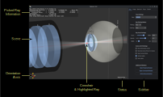
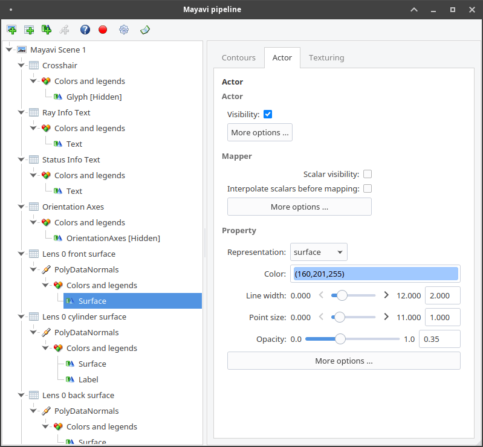
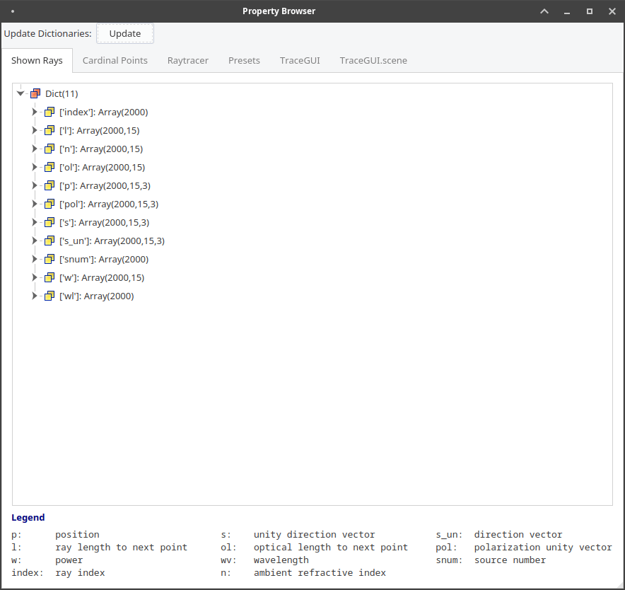
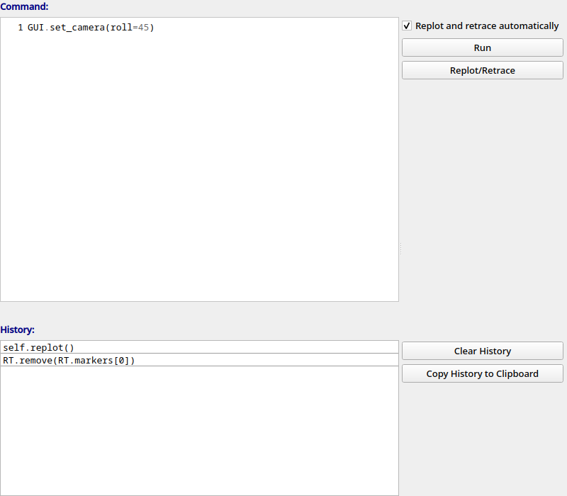
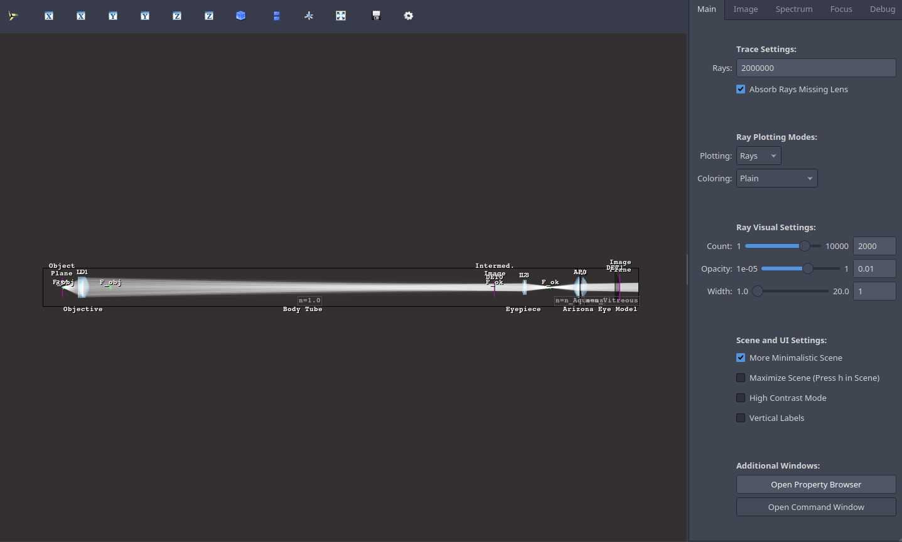

.. _usage_gui:

Using the GUI
---------------

.. testcode:: 
   :hide:

   print("Placeholder:    ")
   import optrace as ot
   from optrace.gui import TraceGUI

.. testoutput::
   :hide:
    
   Placeholder: ...

.. role:: python(code)
  :language: python
  :class: highlight

.. TODO information on set_camera, screenshot and parameter passdown to plotting functions (path, sargs, fargs)

Loading the GUI
____________________

**Example**

As always, import the main optrace namespace:

.. testcode::

   import optrace as ot

To import the TraceGUI into the current namespace write:

.. testcode::

   from optrace.gui.trace_gui import TraceGUI

Let's create some exemplary geometry:

.. testcode::

   RT = ot.Raytracer(outline=[-10, 10, -10, 10, -10, 60])

   disc = ot.CircularSurface(r=3)
   RS = ot.RaySource(disc, pos=[0, 0, -5])
   RT.add(RS)

   eye = ot.presets.geometry.legrand_eye()
   RT.add(eye)

A TraceGUI takes the raytracer as argument:

.. testcode::

   sim = TraceGUI(RT)

The GUI is now assigned to the :python:`sim` variable, but has not started yet.
For running the GUI you need to write:

.. code-block:: python

   sim.run()

This loads the main window and also raytraces the geometry.

**Parameters**

When creating the GUI, additional properties can be assigned.
For instance, setting the scene to high contrast mode and increasing the amount of rays traced, we can write instead:

.. testcode::

   sim = TraceGUI(RT, high_contrast=True, ray_count=2000000)

Available properties are discussed in :numref:`gui_tabs`.

**UI Theme**

The TraceGUI uses Qt5 as UI backend. Qt5 supports different themes that can be controlled with the :python:`ui_theme` parameter on the TraceGUI initialization.

.. testcode::

   sim = TraceGUI(RT, ui_theme="Windows")

Details on styles can be found in the `Qt documentation <https://doc.qt.io/qt-5/qstyle.html#details>`__.
Available themes depend on your system and Qt installation, but can be extended using plugins.
Normally, at least styles :python:`"Windows"` and :python:`"Fusion"` should be available on all systems.
Most notably, dark themes like in :numref:`ui_dark_theme` prove especially useful in low light environments.

UI Overview
_________________

Full UI
######################

.. _gui_overview_scene:

Scene
######################

**Overview**

Details on the scene navigation are found in the mayavi documentation :ref:`here <mayavi:interaction-with-the-scene>` under "Mouse Interaction".
There are also keyboard shortcuts available that are discussed in :numref:`gui_keyboard_shortcuts`.

In the bottom left you can find orientation axes, that display the directions of the cartesian axes in the 3D view. When an action/tasks is running, you are informed by a text in the bottom right.

**Picking and Clicking**

When clicking on the ray intersection of ray and a surface, there is a list of properties shown for the selected ray, that is also marked with a red crosshair.
The picked ray is highlighted in red.

When using ``Shift+Click`` an advanced output is shown, showing even more properties.

Right-clicking inside the scene displays the coordinates of the picked point.

``Shift+ Right Click`` moves the currently selected detector to the picked. z-position.

**Keyboard Shortcuts**

The following keyboard shortcuts are available inside the scene:

.. _gui_keyboard_shortcuts:

.. list-table:: Available keyboards shortcuts
   :header-rows: 1
   :align: center
   :widths: 100 300

   * - Shortcut
     - Function
   * - ``i``
     - sets the scene view to default view set by GUI parameter `initial_camera` or the y-side view if not provided
   * - ``h``
     - maximize scene (hide toolbar and sidebar)
   * - ``v``
     - toggle minimalistic view option
   * - ``c``
     - toggle high contrast mode
   * - ``b``
     - toggle label visibility
   * - ``d``
     - render detector image with the current settings
   * - ``q``
     - close all open pyplot plots
   * - ``n``
     - randomly re-chose the plotted rays
   * - ``s``
     - save a screenshot of the scene
   * - ``f``
     - | set the camera focal point to the position of the mouse. 
       | Useful for scene rotations, since the geometry is rotated around this point.
   * - ``l``
     - change lighting properties
   * - ``3``
     - anaglyph view (view for red-cyan 3D glasses)

Toolbar
######################

The mayavi scene toolbar is positioned above the scene. It includes buttons for the pipeline view window, different perspectives, fullscreen, screenshot saving and scene settings. Details are found in the mayavi documentation :ref:`here <mayavi:interaction-with-the-scene>`.

Sidebar
######################

The sidebar is positioned at the right hand side of the scene and consists of multiple tabs:

.. list-table::
   :align: left
   :stub-columns: 1
   :widths: 150 350

   * - Main Tab
     - Includes settings for raytracing, scene visualization and buttons for opening additional windows
   * - Image Tab
     - Features options for rendering source and detector images
   * - Spectrum Tab
     - Settings for the rendering of source or detector light spectrum histograms
   * - Focus Tab
     - Option View and result output for finding the focus in the optical setup

The following figure shows all tabs except the debug tab. 
The UI elements will be discussed in the following sections.

.. list-table::
   :align: center

   * - .. figure:: ../images/ui_main_tab.png
          :align: center
          :width: 200

     - .. figure:: ../images/ui_image_tab.png
          :align: center
          :width: 200

     - .. figure:: ../images/ui_spectrum_tab.png
          :align: center
          :width: 200

     - .. figure:: ../images/ui_focus_tab.png
          :align: center
          :width: 200

Additional Windows
#######################

Beside the main window there are additional windows in the interface. These will be discussed in :numref:`gui_windows`, but a quick overview is given here:

.. list-table::
   :align: left
   :header-rows: 1
   :stub-columns: 0
   :widths: 100 250 350

   * - Window
     - Access
     - Function
   * - Pipeline View
     - Leftmost button in the toolbar
     - Access to viewing and editing the mayavi graphical elements
   * - Scene Settings
     - Rightmost button in the toolbar
     - mayavi settings, including lighting and scene properties
   * - Command Window
     - button at the bottom of the main tab in the sidebar
     - command execution and history for controlling the GUI and raytracer
   * - Property Browser
     - button at the bottom of the main tab in the sidebar
     - overview of raytracer, scene and ray properties as well as cardinal points

The Scene
____________________

.. _gui_tabs:

Sidebar Tabs
____________________

Main Tab
#######################

.. list-table::
   :header-rows: 1
   :align: left
   :widths: 75 100 150 150
   
   * - Property
     - Variable Name / Method
     - Values
     - Description
   * - Rays
     - :attr:`ray_count <optrace.gui.trace_gui.TraceGUI.ray_count>`
     - integer, 0 - 6000000
     - number of rays for raytracing
   * - Absorb Rays Missing Lens
     - :attr:`absorb_missing <optrace.gui.trace_gui.TraceGUI.absorb_missing>`
     - :python:`True` or :python:`False`
     - if rays are absorbed when missing a lens
   * - Plotting
     - :attr:`plotting_type <optrace.gui.trace_gui.TraceGUI.plotting_type>`
     - :python:`'Rays'` or :python:`'Points'`
     - Visulation type of the rays
   * - Coloring
     - :attr:`coloring_type <optrace.gui.trace_gui.TraceGUI.coloring_type>`
     - :python:`'Plain', 'Power', 'Wavelength', 'Source', 'Polarization xz', 'Polarization yz', 'Refractive Index'`
     - Quantity determining the color of the rays/points
   * - Count
     - :attr:`rays_visible <optrace.gui.trace_gui.TraceGUI.rays_visible>`
     - integer, 1 - 1000
     - number of visible rays in the scene
   * - Opacity
     - :attr:`ray_opacity <optrace.gui.trace_gui.TraceGUI.ray_opacity>`
     - float, 1e-05 - 1
     - opacity of the rays/points
   * - Width
     - :attr:`ray_width <optrace.gui.trace_gui.TraceGUI.ray_width>`
     - float, 1 - 20
     - ray width/ point size
   * - More Minimalistic Scene
     - :attr:`minimalistic_view <optrace.gui.trace_gui.TraceGUI.minimalistic_view>`
     - :python:`True` or :python:`False`
     - if axis labels and long descriptions should be hidden
   * - Maximize Scene
     - :attr:`maximize_scene <optrace.gui.trace_gui.TraceGUI.maximize_scene>`     
     - :python:`True` or :python:`False`
     - if tool- and side bar should be hidden
   * - High Contrast Mode
     - :attr:`high_contrast <optrace.gui.trace_gui.TraceGUI.high_contrast>`
     - :python:`True` or :python:`False`
     - dark elements on white background
   * - Vertical Labels
     - :attr:`vertical_labels <optrace.gui.trace_gui.TraceGUI.vertical_labels>`
     - :python:`True` or :python:`False`
     - if object labels are justified vertically (in lateral direction)
   * - Hide Labels
     - :attr:`hide_labels <optrace.gui.trace_gui.TraceGUI.hide_labels>`
     - :python:`True` or :python:`False`
     - if object labels should be hidden
   * - Open Property Browser
     - :meth:`open_property_browser() <optrace.gui.trace_gui.TraceGUI.open_property_browser>`
     -
     - open the property browser
   * - Open Command Window
     - :meth:`open_command_window() <optrace.gui.trace_gui.TraceGUI.open_command_window>`
     -
     - open the command window

Image Tab
#######################

.. list-table::
   :header-rows: 1
   :align: left
   :widths: 75 100 150 150
   
   * - Property
     - Variable Name / Method
     - Values
     - Description
   * - Source 
     - :attr:`source_selection <optrace.gui.trace_gui.TraceGUI.source_selection>`
     - string
     - selection of the ray source
   * - Detector
     - :attr:`detector_selection <optrace.gui.trace_gui.TraceGUI.detector_selection>` 
     - string
     - selection of the detector
   * - z_det
     - :attr:`z_det <optrace.gui.trace_gui.TraceGUI.z_det>`
     - float
     - position of the currently chosen detector
   * - Image Mode
     - :attr:`image_type <optrace.gui.trace_gui.TraceGUI.image_type>`
     - string, one of :attr:`RenderImage.image_modes <optrace.tracer.image.render_image.RenderImage.image_modes>`
     - image mode for rendering
   * - Projection Method
     - :attr:`projection_method <optrace.gui.trace_gui.TraceGUI.projection_method>`
     - string, one of :attr:`SphericalSurface.sphere_projection_methods <optrace.tracer.geometry.surface.spherical_surface.SphericalSurface.sphere_projection_methods>`
     - sphere projection method for spherical detectors
   * - Pixels_xy
     - :attr:`image_pixels <optrace.gui.trace_gui.TraceGUI.image_pixels>`
     - integer, one of :attr:`RImage.SIZES <optrace.tracer.image.render_image.RenderImage.SIZES>`
     - number of pixels in smaller image dimension
   * - Logarithmic Scaling 
     - :attr:`log_image <optrace.gui.trace_gui.TraceGUI.log_image>`
     - :python:`True` or :python:`False`
     - if image values should be scaled logarithmically
   * - Flip Detector Image
     - :attr:`flip_det_image <optrace.gui.trace_gui.TraceGUI.flip_det_image>`
     - :python:`True` or :python:`False`
     - if the detector image should be flipped (rotated by 180 degrees)
   * - Rays from Selected Source Only
     - :attr:`det_image_one_source <optrace.gui.trace_gui.TraceGUI.det_image_one_source>`
     - :python:`True` or :python:`False`
     - if only the selected ray source should contribute to the image
   * - Source Image
     - :meth:`source_image() <optrace.gui.trace_gui.TraceGUI.source_image>`
     -
     - render a source image with the given settings
   * - Detector Image 
     - :meth:`detector_image() <optrace.gui.trace_gui.TraceGUI.detector_image>`
     -
     - render a detector image with the given settings
   * - Cut at
     - :attr:`cut_dimension <optrace.gui.trace_gui.TraceGUI.cut_dimension>`
     - :python:`'x', 'y'`
     - image cut dimension
   * - Cut Value
     - :attr:`cut_value <optrace.gui.trace_gui.TraceGUI.cut_value>`
     - float
     - image cut value for the chosen dimension
   * - Source Image Cut
     - :meth:`source_cut() <optrace.gui.trace_gui.TraceGUI.source_cut>`
     -
     - render a source image cut
   * - Detector Image Cut
     - :meth:`detector_cut() <optrace.gui.trace_gui.TraceGUI.detector_cut>`
     -
     - render a detector image cut
   * - Activate Filter 
     - :attr:`activate_filter <optrace.gui.trace_gui.TraceGUI.activate_filter>`
     - :python:`True` or :python:`False`
     - activate the smoothing filter
   * - Resolution Limit 
     - :attr:`filter_constant <optrace.gui.trace_gui.TraceGUI.filter_constant>`
     -  float, 0.3 - 40
     - resolution filter filter constant

Spectrum Tab
#######################

.. list-table::
   :header-rows: 1
   :align: left
   
   * - Property
     - Variable Name / Method
     - Values
     - Description
   * - Source 
     - :attr:`source_selection <optrace.gui.trace_gui.TraceGUI.source_selection>`
     - string
     - the selected ray source
   * - Detector
     - :attr:`detector_selection <optrace.gui.trace_gui.TraceGUI.detector_selection>` 
     - string
     - the selected detector
   * - z_det
     - :attr:`z_det <optrace.gui.trace_gui.TraceGUI.z_det>`
     - float
     - position of the selected detector
   * -  Source Spectrum
     - :meth:`source_spectrum() <optrace.gui.trace_gui.TraceGUI.source_spectrum>`
     - 
     - render a source spectrum for the chosen source
   * - Rays from Selected Source Only 
     - :attr:`det_spectrum_one_source <optrace.gui.trace_gui.TraceGUI.det_spectrum_one_source>` 
     - :python:`True` or :python:`False`
     - if only the selected ray source should contribute to the detector image
   * -  Detector Spectrum
     - :meth:`detector_spectrum() <optrace.gui.trace_gui.TraceGUI.detector_spectrum>`
     - 
     - render a detector image
   * - Spectrum Properties
     - 
     - string
     - output for spectrum properties, like wavelengths and power

Focus Tab
#######################

.. list-table::
   :header-rows: 1
   :align: left
   
   * - Property
     - Variable Name / Method
     - Values
     - Description
   * - Source 
     - :attr:`source_selection <optrace.gui.trace_gui.TraceGUI.source_selection>`
     - string
     - the selected source
   * - Detector
     - :attr:`detector_selection <optrace.gui.trace_gui.TraceGUI.detector_selection>` 
     - string
     - the selected detector
   * - z_det
     - :attr:`z_det <optrace.gui.trace_gui.TraceGUI.z_det>`
     - float
     - position of the chosen detector
   * - Focus Mode     
     - :attr:`focus_type <optrace.gui.trace_gui.TraceGUI.focus_type>`
     - string, one of :attr:`Raytracer.autofocus_methods <optrace.tracer.raytracer.Raytracer.autofocus_methods>`
     - mode for focus finding
   * - Rays From Selected Source Only
     - :attr:`af_one_source <optrace.gui.trace_gui.TraceGUI.af_one_source>`
     - :python:`True` or :python:`False`
     - only use the rays from the selected source for focus finding
   * -  Plot Cost Function
     - :attr:`focus_cost_plot <optrace.gui.trace_gui.TraceGUI.focus_cost_plot>`
     - :python:`True` or :python:`False`
     - plots the evaluated cost function value in a window
   * -  Find Focus
     - :meth:`move_to_focus() <optrace.gui.trace_gui.TraceGUI.move_to_focus>`
     - 
     - execute focus finding
   * -  Optimization  Output
     - 
     - string
     - output for displaying optimization information

.. _gui_windows:

Additional Windows
____________________

Pipeline View
#######################

The pipeline of the mayavi scene enables the viewing and alteration of different geometry objects of the visible scene. For instance, one can change the colors or representation of different elements.
Note that editing the visualization objects inside the scene is different from changing the geometry objects inside the raytracer.

Here you can read more about the `pipeline view <https://docs.enthought.com/mayavi/mayavi/pipeline.html>`__
and here about the `different objects populating the view <https://docs.enthought.com/mayavi/mayavi/mayavi_objects.html>`__

Property Viewer
#######################

The property viewer provides an interactive tree view to the following properties:

* properties about the rays/points currently shown
* cardinal points and other paraxial properties of the lenses and the whole lens setup
* properties of and objects inside the Raytracer class
* available presets
* TraceGUI properties
* TraceGUI scene properties

All property values are a read-only snapshot, to update the values click on the ``Update`` button.
Navigate the tabs to switch to different trees.

Command Window
#######################

Inside the command window commands can run from inside the TraceGUI class.
You can therefore do scripting on the GUI or change raytracer properties, like adding, changing or removing geometries.

After entering a command in the above text field the ``Run``-Button must be pressed.
Note that the command is only run, if the GUI is idle, therefore not doing any other tasks.

After running the command, the scene is automatically updated and, if required, the geometry is retraced if the option "Retrace and replot automatically" is set.
But this can also be done using the button "Replot/retrace".

The command gets added to the history. From the history field entries can be copied using ``Ctrl+C``
or you can export the whole history into the clipboard by pressing the according button.
Also available is a ``Clear``-Button that empties the history.

As mentioned, the commands are run from within the TraceGUI object :python:`self` therefore denotes the object itself, so e.g. :python:`self.replot()` would replot the geometry.
There are multiple object aliases available to simplify coding inside the command window

.. list-table:: Some object aliases
   :header-rows: 1
   :align: center
   :widths: 100 300

   * - Alias
     - Referenced
   * - :python:`GUI`
     - the TraceGUI object (same as :python:`self`)
   * - :python:`RT`
     - the raytracer used
   * - :python:`LL`
     - the lens list of the raytracer (:obj:`optrace.tracer.geometry.group.Group.lenses`)
   * - :python:`AL`
     - the aperture list of the raytracer (:obj:`optrace.tracer.geometry.group.Group.apertures`)
   * - :python:`FL`
     - the filter list of the raytracer (:obj:`optrace.tracer.geometry.group.Group.filters`)
   * - :python:`RSL`
     - the ray source list of the raytracer (:obj:`optrace.tracer.geometry.group.Group.ray_sources`)
   * - :python:`DL`
     - the detector list of the raytracer (:obj:`optrace.tracer.geometry.group.Group.detectors`)
   * - :python:`ML`
     - the marker list of the raytracer (:obj:`optrace.tracer.geometry.group.Group.markers`)
   * - :python:`VL`
     - the volume list of the raytracer (:obj:`optrace.tracer.geometry.group.Group.volumes`)

For instance, inside the command window you can write :python:`RT.remove(AL[1])` to remove the second aperture of tracing geometry.
By default, you also have access to most `optrace` classes like :python:`Raytracer, RImage, Group, RingSurface, ...`.

Tips and Tricks
____________________

**Changing the UI Theme Externally**

UI themes can also be set externally, however any theme set inside the script overwrites the global style.

From outside the theme can either be provided by setting an environment variable:

.. code-block:: bash

   env QT_STYLE_OVERRIDE=kvantum-dark python ./examples/microscope.py

...Or by providing a ``style`` parameter when calling the script/interpreter.

.. code-block:: bash

   python ./examples/microscope.py -style kvantum-dark

Note that the mentioned style needs to be supported by your Qt installation. The above syntax is that for an Unix system and can differ for other systems.

.. _ui_dark_theme:

   UI with the dark theme.

**Passing Properties to the GUI object**

Under some circumstances it is useful to provide additional parameters like properties or functions to the GUI so they can be accessed in the control window.
For instance, we implemented a function that changes the geometry in some specific way or steps through different source or lens constellations.

As example, the user can define some function :python:`func` inside his script and pass it to the TraceGUI:

.. testcode::

   def func(a, b, c):
        # do some complicated things inside here
        ...

   sim = TraceGUI(RT, important_function=func)

:python:`func` get assigned to the TraceGUI under the name :python:`important_function`. Therefore it can be used inside the command window as :python:`self.important_function`.

This is not limited to functions but works for arbitrary objects, however note that the assigned name must not collide with any variable or method name already implemented in the TraceGUI class.

