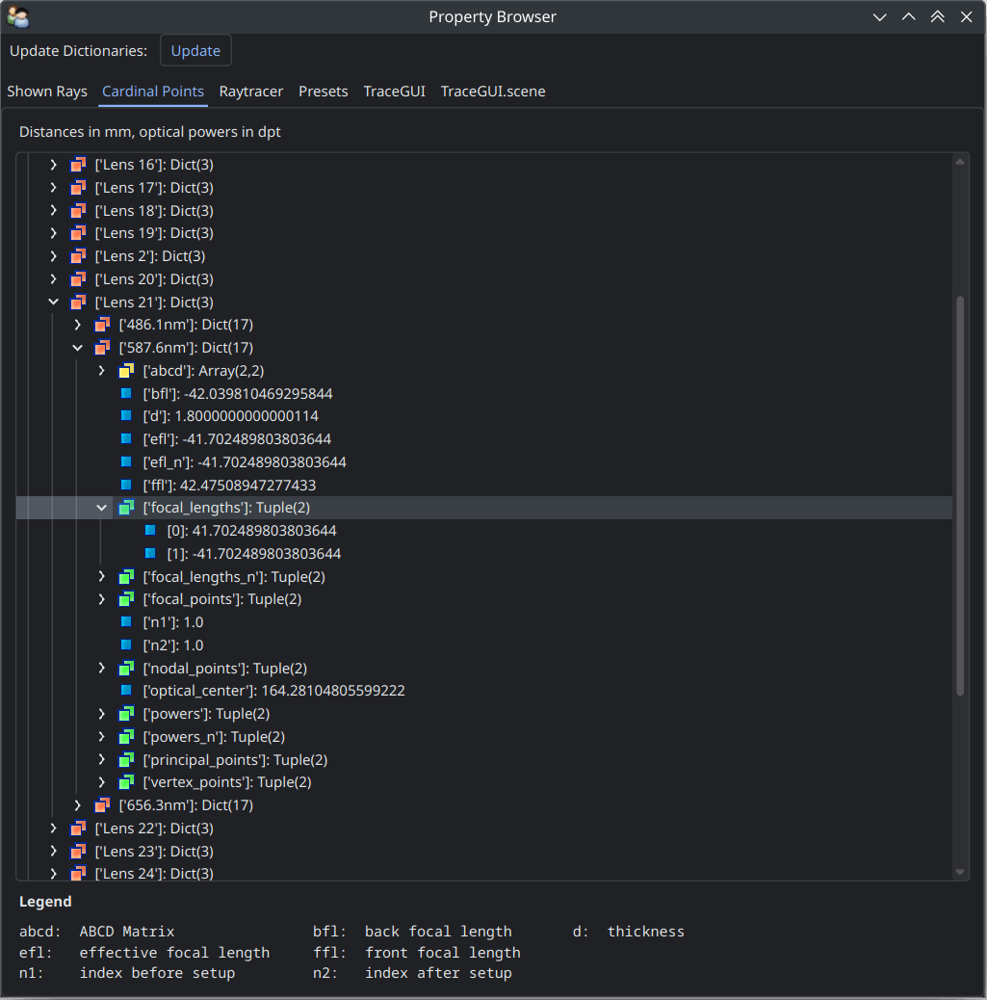
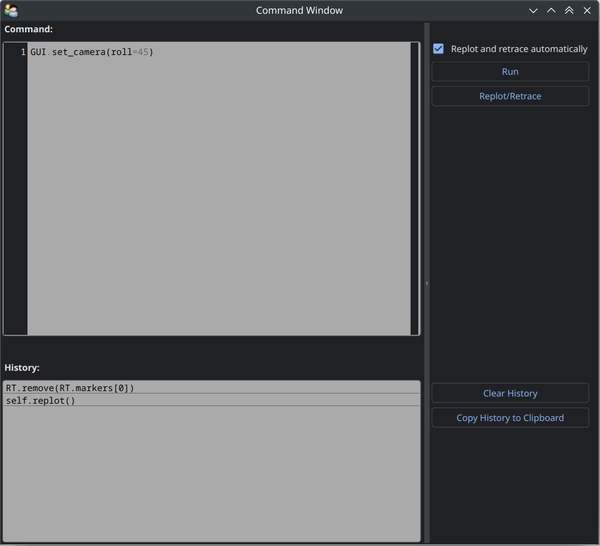

Using the GUI
---------------

.. testsetup:: *

   import optrace as ot

.. role:: python(code)
  :language: python
  :class: highlight

Loading the GUI
____________________

**Example**

.. testcode::

   import optrace as ot

.. testcode::

   from optrace.gui.trace_gui.import TraceGUI

.. testcode::

   RT = ot.Raytracer(outline=[-10, 10, -10, 10, -10, 60])

   disc = ot.CircularSurface(r=3)
   RS = ot.RaySource(disc, pos=[0, 0, 0])
   RT.add(RS)

   eye = ot.presets.geometry.legrand_eye()
   RT.add(eye)

.. testcode::

   sim = TraceGUI(RT)
   sim.run()

**Parameters**

.. testcode::

   sim = TraceGUI(RT, high_contrast=True, ray_count=2000000)

**UI Theme**

The TraceGUI uses Qt5 as UI backend. Qt5 supports different styles that can be controlled with the :python:`ui_theme` parameter on the TraceGUI initialization.

.. testcode::

   sim = TraceGUI(RT, ui_theme="Windows")

Details on styles can be found in the `Qt documentation <https://doc.qt.io/qt-5/qstyle.html#details>`__.
Available themes depend on your system and Qt installation, but can be extended using plugins.
At least styles :python:`"Windows"` and :python:`"Fusion"` should be available on all systems.

UI Elements
_________________

.. figure:: ../images/ui_full.png
   :align: center
   :width: 800

.. list-table::
   :align: center

   * - .. figure:: ../images/ui_main_tab.png
          :align: center
          :width: 200

     - .. figure:: ../images/ui_image_tab.png
          :align: center
          :width: 200

     - .. figure:: ../images/ui_spectrum_tab.png
          :align: center
          :width: 200

     - .. figure:: ../images/ui_focus_tab.png
          :align: center
          :width: 200

The Scene
____________________

Main Tab
____________________

.. list-table::
   :header-rows: 1
   :align: left
   
   * - Property
     - Variable Name / Method
     - Values
     - Description
   * - Rays
     - :attr:`ray_count <optrace.gui.trace_gui.TraceGUI.ray_count>`
     - integer, 0 - 6000000
     -
   * - Absorb Rays Missing Lens
     - :attr:`absorb_missing <optrace.gui.trace_gui.TraceGUI.absorb_missing>`
     - :python:`True` or :python:`False`
     -
   * - Plotting
     - :attr:`plotting_type <optrace.gui.trace_gui.TraceGUI.plotting_type>`
     - :python:`'Rays'` or :python:`'Points'`
     -
   * - Coloring
     - :attr:`coloring_type <optrace.gui.trace_gui.TraceGUI.coloring_type>`
     - :python:`'Plain', 'Power', 'Wavelength', 'Source', 'Polarization xz', 'Polarization yz', 'Refractive Index'`
     -
   * - Count
     - :attr:`ray_amount_shown <optrace.gui.trace_gui.TraceGUI.ray_amount_shown>`
     - integer, 1 - 1000
     -
   * - Opacity
     - :attr:`ray_opacity <optrace.gui.trace_gui.TraceGUI.ray_opacity>`
     - float, 1e-05 - 1
     -
   * - Width
     - :attr:`ray_width <optrace.gui.trace_gui.TraceGUI.ray_width>`
     - float, 1 - 20
     -
   * - More Minimalistic Scene
     - :attr:`minimalistic_view <optrace.gui.trace_gui.TraceGUI.minimalistic_view>`
     - :python:`True` or :python:`False`
     -
   * - Maximize Scene
     - :attr:`maximize_scene <optrace.gui.trace_gui.TraceGUI.maximize_scene>`     
     - :python:`True` or :python:`False`
     -
   * - High Contrast Mode
     - :attr:`high_contrast <optrace.gui.trace_gui.TraceGUI.high_contrast>`
     - :python:`True` or :python:`False`
     -
   * - Vertical Labels
     - :attr:`vertical_labels <optrace.gui.trace_gui.TraceGUI.vertical_labels>`
     - :python:`True` or :python:`False`
     -
   * - Open Property Browser
     - :meth:`open_property_browser() <optrace.gui.trace_gui.TraceGUI.open_property_browser>`
     -
     -
   * - Open Command Window
     - :meth:`open_command_window() <optrace.gui.trace_gui.TraceGUI.open_command_window>`
     -
     -

Image Tab
____________________

.. list-table::
   :header-rows: 1
   :align: left
   
   * - Property
     - Variable Name / Method
     - Values
     - Description
   * - Source 
     - :attr:`source_selection <optrace.gui.trace_gui.TraceGUI.source_selection>`
     - string
     -
   * - Detector
     - :attr:`detector_selection <optrace.gui.trace_gui.TraceGUI.detector_selection>` 
     - string
     - 
   * - z_det
     - :attr:`det_pos <optrace.gui.trace_gui.TraceGUI.det_pos>`
     - float
     - 
   * - Image Mode
     - :attr:`image_type <optrace.gui.trace_gui.TraceGUI.image_type>`
     - string, one of :attr:`RImage.display_modes <optrace.tracer.r_image.RImage.display_modes>`
     -
   * - Projection Method
     - :attr:`projection_method <optrace.gui.trace_gui.TraceGUI.projection_method>`
     - string, one of :attr:`SphericalSurface.sphere_projection_methods <optrace.tracer.geometry.surface.spherical_surface.SphericalSurface.sphere_projection_methods>`
     - 
   * - Pixels_xy
     - :attr:`image_pixels <optrace.gui.trace_gui.TraceGUI.image_pixels>`
     - integer, one of :attr:`RImage.SIZES <optrace.tracer.r_image.RImage.SIZES>`
     - 
   * - Logarithmic Scaling 
     - :attr:`log_image <optrace.gui.trace_gui.TraceGUI.log_image>`
     - :python:`True` or :python:`False`
     -
   * - Flip Detector Image
     - :attr:`flip_det_image <optrace.gui.trace_gui.TraceGUI.flip_det_image>`
     - :python:`True` or :python:`False`
     -
   * - Rays from Selected Source Only
     - :attr:`det_image_one_source <optrace.gui.trace_gui.TraceGUI.det_image_one_source>`
     - :python:`True` or :python:`False`
     -
   * - Source Image
     - :meth:`show_source_image() <optrace.gui.trace_gui.TraceGUI.show_source_image>`
     -
     - 
   * - Detector Image 
     - :meth:`show_detector_image() <optrace.gui.trace_gui.TraceGUI.show_detector_image>`
     -
     - 
   * - Cut at
     - :attr:`cut_dimension <optrace.gui.trace_gui.TraceGUI.cut_dimension>`
     - :python:`'x', 'y'`
     - 
   * - Cut Value
     - :attr:`cut_value <optrace.gui.trace_gui.TraceGUI.cut_value>`
     - float
     - 
   * - Source Image Cut
     - :meth:`show_source_cut() <optrace.gui.trace_gui.TraceGUI.show_source_cut>`
     -
     - 
   * - Detector Image Cut
     - :meth:`show_detector_cut() <optrace.gui.trace_gui.TraceGUI.show_detector_cut>`
     -
     - 
   * - Activate Filter 
     - :attr:`activate_filter <optrace.gui.trace_gui.TraceGUI.activate_filter>`
     - :python:`True` or :python:`False`
     - 
   * - Resolution Limit 
     - :attr:`filter_constant <optrace.gui.trace_gui.TraceGUI.filter_constant>`
     -  float, 0.3 - 40
     -

Spectrum Tab
____________________

.. list-table::
   :header-rows: 1
   :align: left
   
   * - Property
     - Variable Name / Method
     - Values
     - Description
   * - Source 
     - :attr:`source_selection <optrace.gui.trace_gui.TraceGUI.source_selection>`
     - string
     -
   * - Detector
     - :attr:`detector_selection <optrace.gui.trace_gui.TraceGUI.detector_selection>` 
     - string
     - 
   * - z_det
     - :attr:`det_pos <optrace.gui.trace_gui.TraceGUI.det_pos>`
     - float
     - 
   * -  Source Spectrum
     - :meth:`show_source_spectrum() <optrace.gui.trace_gui.TraceGUI.show_source_spectrum>`
     - 
     -
   * - Rays from Selected Source Only 
     - :attr:`det_spectrum_one_source <optrace.gui.trace_gui.TraceGUI.det_spectrum_one_source>` 
     - :python:`True` or :python:`False`
     -
   * -  Detector Spectrum
     - :meth:`show_detector_spectrum() <optrace.gui.trace_gui.TraceGUI.show_detector_spectrum>`
     - 
     -
   * -  Spectrum Properties
     - 
     - string
     -

Focus Tab
____________________

.. list-table::
   :header-rows: 1
   :align: left
   
   * - Property
     - Variable Name / Method
     - Values
     - Description
   * - Source 
     - :attr:`source_selection <optrace.gui.trace_gui.TraceGUI.source_selection>`
     - string
     -
   * - Detector
     - :attr:`detector_selection <optrace.gui.trace_gui.TraceGUI.detector_selection>` 
     - string
     - 
   * - z_det
     - :attr:`det_pos <optrace.gui.trace_gui.TraceGUI.det_pos>`
     - float
     - 
   * -  Focus Mode     
     - :attr:`focus_type <optrace.gui.trace_gui.TraceGUI.focus_type>`
     - string, one of :attr:`Raytracer.autofocus_methods <optrace.tracer.raytracer.Raytracer.autofocus_methods>`
     -
   * -  Rays From Selected Source Only
     - :attr:`af_one_source <optrace.gui.trace_gui.TraceGUI.af_one_source>`
     - :python:`True` or :python:`False`
     -
   * -  Plot Cost Function
     - :attr:`focus_cost_plot <optrace.gui.trace_gui.TraceGUI.focus_cost_plot>`
     - :python:`True` or :python:`False`
     -
   * -  Find Focus
     - :meth:`move_to_focus() <optrace.gui.trace_gui.TraceGUI.move_to_focus>`
     - 
     -
   * -  Optimization  Output
     - 
     - string
     -

Pipeline View
____________________

.. figure:: ../images/ui_pipeline.png
   :align: center
   :width: 600

Property Viewer
____________________

Command Window
____________________

Tips and Tricks
____________________

**Keyboard Shortcuts**

The following keyboard shortcuts are available inside the scene:

.. list-table::
   :header-rows: 1
   :align: center
   :widths: 100 300

   * - Shortcut
     - Function
   * - ``y``
     - set scene view to default y view
   * - ``h``
     - maximize scene (hide toolbar and sidebar)
   * - ``v``
     - toggle minimalistic view option
   * - ``c``
     - toggle high contrast mode
   * - ``r``
     - toggle plotting type of rays (points or beams)
   * - ``d``
     - render detector image with the current settings
   * - ``n``
     - randomly re-chose the plotted rays
   * - ``s``
     - save a screenshot of the scene
   * - ``f``
     - | set the camera focal point to the position of the mouse. 
       | Useful for scene rotations, since the geometry is rotated around this point.
   * - ``l``
     - change lighting properties
   * - ``3``
     - anaglyph view (view for red-cyan 3D glasses)

**Changing the UI Theme Externally**

UI themes can also be set externally, however any theme set inside the script overwrites the global style.

From outside the theme can either be provided by setting an environment variable:

.. code-block:: bash

   env QT_STYLE_OVERRIDE=kvantum-dark python ./examples/microscope.py

...Or by providing a ``style`` parameter when calling the script/intepreter.

.. code-block:: bash

   python ./examples/microscope.py -style kvantum-dark

Note that the mentioned style needs to be supported by your Qt installation. The above syntax is that for an Unix system and can differ for other systems.

.. figure:: ../images/ui_kvantum_theme.png
   :align: center
   :width: 600

   UI with the dark theme.

**Passing Properties to the GUI object**

