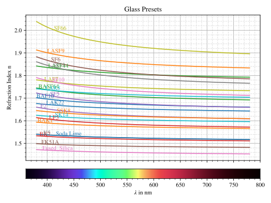
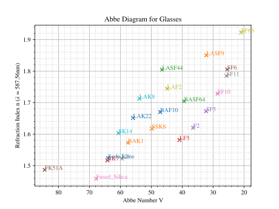
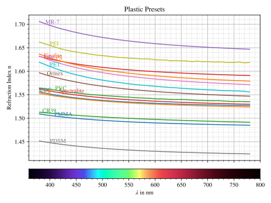
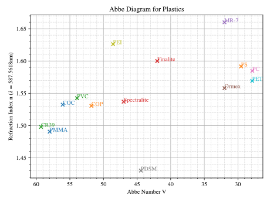
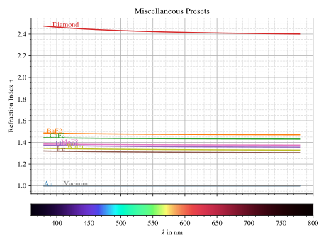
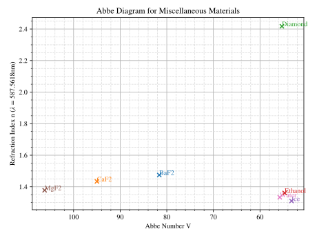

Refraction Index
-----------------------

.. role:: python(code)
  :language: python
  :class: highlight

.. testsetup:: *

   import optrace as ot
   import numpy as np

Defining the Index
________________________

**Constant**

In the simplest case a constant (wavelength-independent) refactive index is defined as:

.. testcode::

   n = ot.RefractionIndex("Constant", n=1.54)

**By Abbe Number**

Many materials are simply characterized by the index at a center wavelength and the Abbe number.
However, materials with these same quantities can still differ slightly.

.. testcode::

   n = ot.RefractionIndex("Abbe", n=1.5, V=32)

Details on how the model is estimated are found in :numref:`index_from_abbe`.

You can also specify the wavelength combination, for which ``n`` and ``V`` are specified:

.. testcode::

   n = ot.RefractionIndex("Abbe", n=1.5, V=32, lines=ot.presets.spectral_lines.FeC)

**Common Index Models**
   
Defining a medium by a specific model is done by providing the model name and the correct number of coefficients in the ``coeff``.
Note that all coefficients have units in µm or powers of µm. You can read more about the different supported models in :numref:`index_functions`.

In the case of the Schott model the initialization could look as follows:

.. testcode::

   n = ot.RefractionIndex("Schott", coeff=[2.13e-06, 1.65e-08, -6.98e-11, 1.02e-06, 6.56e-10, 0.208])

**User Data**

.. testcode::

   wls = np.linspace(380, 780, 10)
   vals = np.array([1.6, 1.58, 1.55, 1.54, 1.535, 1.532, 1.531, 1.53, 1.529, 1.528])
   n = ot.RefractionIndex("Data", wls=wls, vals=vals)

**User Function**

``optrace`` also supports user functions for the refractive index. The function takes one parameter, which is a wavelength numpy array with wavelengths in nanometers.

.. testcode::

   n = ot.RefractionIndex("Function", func=lambda wl: 1.6 - 1e-4*wl)

When providing a function with multiple parameters you can use the ``func_args`` parameter.

.. testcode::

   n = ot.RefractionIndex("Function", func=lambda wl, n0: n0 - 1e-4*wl, func_args=dict(n0=1.6))

Getting the Index Values
___________________________

The refractive index values are calculated when calling the refractive index object with a wavelength vector.
The call returns a vector of the same shape as the input.

.. doctest::

   >>> n = ot.RefractionIndex("Abbe", n=1.543, V=62.1)
   >>> wl = np.linspace(380, 780, 5)
   >>> n(wl)
   array([1.56237798, 1.54967658, 1.54334457, 1.53971213, 1.53742918])

Abbe Number
__________________

Details on the calculation of the Abbe number can be found in :numref:`abbe_number`. 
With a refractive index object at hand the Abbe number can be calculated with

.. doctest::

   >>> n = ot.presets.refraction_index.LAF2
   >>> n.abbe_number()
   44.850483919254984

Alternatively the function can be called with a different spectral line combination from :python:`ot.presets.spectral_lines`:

.. doctest::

   >>> n.abbe_number(ot.presets.spectral_lines.F_eC_)
   44.57150709341499

Or specify a user defined list of three wavelengths:

.. doctest::

   >>> n.abbe_number([450, 580, 680])
   30.59379412865849

You can also check if a medium is dispersive by calling

.. doctest::

   >>> print(n.is_dispersive())
   True

A list of predefined lines can be found in :numref:`spectral_lines`.

.. _index_plots:

Plotting
_______________________

**Index Plot**

A RefractionIndex or a list of RefractionIndex objects can be plotted with the function ``refraction_index_plot`` from ``optrace.plots``.
The example below plots the glass presets in one figure.

.. testcode::

   import optrace.plots as otp

   otp.refraction_index_plot(ot.presets.refraction_index.glasses)

The methods support a user defined ``title`` and a blocking parameter ``block``, that stops the rest of the program for plotting.
You can also enable or disable the legend and labels with ``legend_off`` and ``labels_off``

.. testcode::

   otp.refraction_index_plot(ot.presets.refraction_index.glasses, block=False, title="Test abc",
                             legend_off=False, labels_off=True)

Examples for an index plot are found below.

**Abbe Plot**

An Abbe plot is generated with ``abbe_plot``.

.. testcode::

   otp.abbe_plot(ot.presets.refraction_index.glasses)

It also supports the parameters ``title`` and ``block``. Additionally one can provide user defined ``lines`` to calculate the index and V-number with:

.. testcode::

   otp.abbe_plot(ot.presets.refraction_index.glasses, title="abc", lines=ot.presets.spectral_lines.FeC, block=False)

Exemplary Abbe plots are shown below in the presets section.

.. _agf_load:

Loading material catalogues (.agf)
_________________________________________

``optrace``  can also load .agf catalogue files containing different materials.
The function ``ot.load.agf`` takes a file path and returns a dictionary of media, with the key being the name and the value being the refractive index object.

For instance, loading the Schott catalogue and accessing the material ``N-LAF21`` can be done as follows:

.. code-block:: python

   n_schott = ot.load.agf("schott.agf")
   n_laf21 = n_schott["N-LAF21"]

Different ``.agf`` files are found in `this repository <https://github.com/nzhagen/zemaxglass/tree/master/AGF_files>`__ or `this one <https://github.com/edeforas/Astree/tree/master/glass>`__.

Information on the file format can be found `here <https://neurophysics.ucsd.edu/Manuals/Zemax/ZemaxManual.pdf>`__ and
and `here <https://github.com/nzhagen/zemaxglass/blob/master/ZemaxGlass_user_manual.pdf>`__.

.. _refraction_index_presets:

Presets
_________________

``optrace`` comes with multiple material presets, which can be accessed using ``ot.presets.refractive_index.<name>``, where ``<name>`` is the material name.
The materials are also grouped into multiple lists :python:`ot.presets.refractive_index.glasses, ot.presets.refractive_index.plastics, ot.presets.refractive_index.misc`. 

These groups are plotted below in an index and an Abbe plot.

**Glass**

   Refraction index curves for different glass presets.

   
   Abbe diagram for different glass presets.

**Plastics**

   
   Refraction index curves for different plastic presets.

   
   Abbe diagram for different plastic presets.

**Misc**

   Refraction index curves for miscellaneous presets.

   
   Abbe diagram for miscellaneous presets. *Air* and *Vacuum* are missing here, because they are modelled without dispersion.
