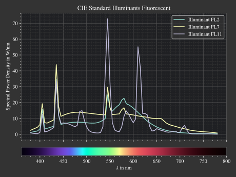

Spectrum (LightSpectrum, TransmissionSpectrum)
--------------------------------------------------

Spectrum
______________________

LightSpectrum
______________________

TransmissionSpectrum
______________________

Presets
______________________

.. figure:: images/Standard_illuminants.svg
   :width: 600
   :align: center
  
   CIE standard illuminants. Available as ``ot.presets.light_spectrum.<name>`` with ``a, d50, ...`` as ``<name>``

.. figure:: images/LED_illuminants.svg
   :width: 600
   :align: center
   
   CIE standard illuminants LED series. Available as ``ot.presets.light_spectrum.<name>`` with ``led_b1, led_b2, ...`` as ``<name>``
   

  
   CIE standard illuminants Fluorescent series. Available as ``ot.presets.light_spectrum.<name>`` with ``fl2, fl7, ...`` as ``<name>``

.. figure:: images/srgb_spectrum.svg
   :width: 600
   :align: center
  
   Possible sRGB primary spectra.
   Available as ``ot.presets.light_spectrum.<name>`` with ``srgb_r, srgb_g, ...`` as ``<name>``

.. figure:: images/cie_cmf.svg
   :width: 600
   :align: center
  
   CIE color matching functions.
   Available as ``ot.presets.spectrum.<name>`` with ``x, y, z`` as ``<name>``
  
Other presets include spectra from spectral lines combination in :numref:`spectral_lines`. Namely ``ot.presets.light_spectrum.<name>`` with ``FdC, FDC, FeC, F_eC_`` as ``<name>``.
