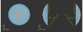

Defining Surfaces
-----------------------

Overview
_________________

Surfaces, points and lines are the base component for all Element classes. They describe a geometrical behavior relative to their center (marked as "x" in the following figures).
Surfaces, points and lines have no absolute position in three-dimensional space, their actual position is assigned and managed by their owner element.
As well as for other geometries, all lengths are given in millimeters and angles in degrees.

Point and Line
___________________

Points and Lines are the simplest kinds of geometries. 
While they are not very useful for lenses, detectors and so on, they are often used for the RaySource geometry.
Both types have no extent in z-direction, are therefore parallel to the xy-plane.

.. list-table::

   * - .. figure:: ./images/point.svg
          :align: center
          :width: 250

          Point geometry

     - .. figure:: ./images/line.svg
          :align: center
          :width: 250

          Line geometry

To create a point simply write:

.. code-block:: python

   P = ot.Point()

   
A line with radius 2 and an angle of 40 degrees to the x-axis can be defined using:

.. code-block:: python

   L = ot.Line(r=2, angle=40)

Planar Surfaces
______________________

These two dimensional surfaces have no extent in z-direction, therefore being parallel to the xy-plane.
Circular surfaces are often used for plan-concave or plan-convex lenses or color filters.
Ring surfaces typically can be found for Apertures, and rectangular surfaces for detectors or image RaySources.

.. list-table::

   * - .. figure:: ./images/circle.svg
          :align: center
          :width: 250

          Circle geometry

     - .. figure:: ./images/ring.svg
          :align: center
          :width: 250

          Ring geometry

     - .. figure:: ./images/rectangle.svg
          :align: center
          :width: 250

          Rectangle geometry

A circle/disc of radius 3.5 can be created with:

.. code-block:: python

   Disc = ot.CircularSurface(r=3.5)

When constructing a ring surface and additional inner radius :math:`r_\text{i}` is required:

.. code-block:: python

   Ring = ot.RingSurface(ri=0.2, r=3.5)

The rectangular surface has a list of two elements as parameter, that describe the extent in x and y direction.
For a side length in x-direction of 4 mm and 5 mm in y-direction we write:

.. code-block:: python
   
   Rect = ot.RectangularSurface(dim=[4.0, 5.0])

Height Surfaces
_____________________

**Tilted Surface**

.. figure:: ./images/tilted_surface.svg
   :width: 500
   :align: center

   TiltedSurface geometry

A TiltedSurface has a circular projection in the xy-plane, but has a surface normal that is generally not parallel to the optical axis.
It can be used for creating prisms or tilted glass plates.

As for most other surfaces it is defined by a radius :math:`r`. Additionally a normal vector must be provided. This can either be done in the cartesian form, with 3 elements and parameter ``normal=[x, y, z]`` or using spherical coordinates ``normal_sph=[theta, phi]`` with two elements. ``theta`` describes the angle between the normal and the optical axis (z-axis), while ``phi`` describes the angle in the xy-plane.
The following examples both describe the same surface. Depending on the case, one of the methods for specifying the normal might be preffered.

.. code-block:: python

   TS = ot.TiltedSurface(r=4, normal=[0.0, 1/np.sqrt(2), 1/np.sqrt(2)])

.. code-block:: python

   TS = ot.TiltedSurface(r=4, normal_sph=[45.0, 90.0])

**Spherical Surface**

A spherical surface is the most common surface type for lenses. It is defined by a curvature radius :math:`R`, which is positive when the center of the circle lies behind the surface and negative otherwise. This is illustrated in figure :numref:`spherical_surface_fig`.

.. _sphericaL_surface_fig:

   Spherical surface geometry with a positive and negative curvature radius :math:`R`

Constructing such a surface is done with:

.. code-block:: python

   sph = ot.SphericalSurface(r=2.5, R=-12.458)

**Conic Surface**

.. figure:: ./images/conic_surface.svg
   :width: 750
   :align: center

   Conic surface geometry with a different conic constant :math:`k` signs. 
   An aspheric surface has a small additional rotationally symmetric polynomial added.

A conical surface takes another parameter, the conical constant ``k``:

.. code-block:: python

   conic = ot.ConicSurface(r=2.5, R=23.8, k=-1)

A visualization of different conical constants can be found in :footcite:`ConicWiki`.
The mathematical formulation of such a surface is later described in the in-depth documentation in :numref:`conic_surface`.

**Aspheric Surface**

An aspheric surface has additional polynomial components :math:`a_0 r^2 + a_1 r^4 + \dots`, where :math:`a_0,~a_1,\dots` are the polynomical coefficients given in powers of millimeters. 
The fully mathematical formulation for an aspheric surface is found in :numref:`aspheric_surface`.

For :math:`a_0 = 0, ~ a_1 = 10^{-5}, ~a_2 = 3.2 \cdot 10^{-7}` the surface is created like this:

.. code-block:: python

   asph = ot.AsphericSurface(r=2.5, R=12.37, k=2.03, coeff=[0, 1e-5, 3.2e-7])

Generally there is no limit on the number of coefficients, however after a dozen one should ask oneself if they are worth the additional computational effort.

User Functions
____________________

**Overview**

The FunctionSurface2D class allows us to define custom surfaces, defined by a mathematical function depending on x and y, generally with no symmetry.
However, for functions with symmetry we can also use the FunctionSurface1D class, where the values are only dependent on the radial distance r.

.. figure:: ./images/function_surface.svg
   :width: 500
   :align: center

   Custom function according to :math:`z_\text{s}(x,~y)`, which can be a symmetric or asymmetric function or a dataset

**Simplest case**

As an example we want to create an axicon surface. In the simplest case the height values are just the radial distance from the center:

.. code-block:: python

   func = ot.FunctionSurface1D(r=3, func=lambda r: r)

We can use a FunctionSurface2D with rotational symmetry, which is called FunctionSurface1D.
The user defined function must take r-values (as numpy array), return a numpy array and is provided as the ``func`` parameter.
While we could add an offset to the axicon function, this is not needed, as a constant offset is removed/adapted when the surface is initialized.

**Providing partial derivatives**

To speed up tracing and enhance numerical precision we can provide the partial derivatives of the surface in x- and y-direction.
For our axicon the special case :math:`r=0` needs to be handled separately.
The derivative function is passed with the ``deriv_func``-parameter.

.. TODO how to test all code blocks?

.. code-block:: python

   def axicon_deriv(r):
       dr = np.ones_like(r)
       dr[r == 0] = 0
       return dr

   func = ot.FunctionSurface1D(r=3, func=lambda r: r, deriv_func=axicon_deriv)

**Function parameters**

In many cases one uses a already defined function with additional parameters, or in a different case we don't want to hard-code the values into any function.
The user can provide a dictionary of parameters that will get passed down to the corresponding function.
For the ``func`` argument the matching paramter would be ``func_args``.

.. code-block:: python

   def axicon(r, a):
       return a*r

   def axicon_deriv(r, a):
       dr = np.full_like(r, a)
       dr[r == 0] = 0
       return dr

   func = ot.FunctionSurface1D(r=3, func=axicon, func_args=dict(a=-0.3), deriv_func=axicon_deriv, deriv_args=dict(a=-0.3))

**z-Range**

When initializing a surface ``optrace`` tries to determine the surface extent in z-direction. The ``z_min`` and ``z_max`` values are needed to know the surface bounds, which in turn are needed for tracing of the surface.
While this works automatically in many cases, the user has the option to provide these values manually.
If these values should largely differ from the automatically estimated values a warning or for large deviation an exception is issued.

For a ``a=-0.3`` and ``r=3`` the z-bounds are ``[-0.9, 0]``. This can be provided using:

.. code-block::

   func = ot.FunctionSurface1D(..., z_min=-0.9, z_max=0)

**Radius of Curvature**

We can also provide a radius of curvature for the paraxial region. This will be used for ray transfer matrix analysis in section <>.
Note that this only makes sense, if the surface has rotational symmetry near the center and is curved in this region.

.. code-block::

   func = ot.FunctionSurface1D(..., parax_roc=3.465)

Note that for our axicon example there can be no paraxial radius of curvature defined.

**Mask function**

When defining custom apertures or filters, the ``mask_func``-parameter comes in handy.
As well as for the other function parameters an optional ``mask_args`` can be provided.

To define a half circular aperture with radius :math:`r=0.1`, one can write:

.. code-block:: python

   def mask(x, y, r):
       return (x > 0) | (x**2 + y**2 > r**2)

   func = ot.FunctionSurface2D(r=3, func=lambda x, y: np.zeros_like(x), mask_func=mask, mask_args=dict(r=0.1))

In this case the ``func``-parameter is just a plane. Note that we need to use the FunctionSurface2D class, as there is not rotational symmetry anymore.

Data Surfaces
________________________

**DataSurface2D**

A DataSurface2D is defined by a height dataset in a square matrix.
This square set gets cut into a disc after initialization.
Together with this set the radius of the disc is needed, which is the ``r`` parameter.

It is recommended to have 200x200 or larger matrices. 
Values between data cells are interpolated with a polynomial of forth order, so that curvature changes at the surface are smooth.

Here is and example of a lens with direction dependent curvature and a little noise/manufacturing errors added:

.. code-block:: python

   r0 = 3
   X, Y = np.mgrid[-r0:r0:200j, -r0:r0:200j]
   H = 0.1*X**2 + 0.2*Y**2 
   H += 0.005*np.random.sample(X.shape)

   data2d = ot.DataSurface2D(r=r0, data=H)

Note that we can also add the parameters ``z_min=...``, ``z_max=``, ``parax_roc`` as for the FunctionSurface class.

**DataSurface1D**

For a surface with rotational symmetry one radial vector is sufficient:

.. code-block:: python

   r0 = 3
   r = np.linspace(0, r0, 1000)
   h = r**2
   h[r > 1] = 1
   h += 0.005*np.random.sample(1000)

   data1d = ot.DataSurface1D(r=r0, data=h)

Additional Geometrical Quantities
_____________________________________

Bewlo you can see some additional geometrical quantities that are useful when moving surfaces, assigning them to lenses or determining the correct thicknesses.

.. figure:: ./images/surface_geometry_quantities.svg
   :width: 500
   :align: center

:math:`z_\text{min}` and :math:`z_\text{max}` describe the minimal and maximal z-position on the surface, while :math:`z_0` is the z-position of the center.
:math:`d_\text{s}` is the difference between :math:`z_\text{min}` and :math:`z_\text{max}`, :math:`d_\text{p}` is the difference between :math:`z_\text{max}` and :math:`z_0` and :math:`d_\text{n}` the difference between :math:`z_0` and :math:`z_\text{min}`.

There is a smallest three-dimensional box encompassing all of the surface. It can be described by four values, the ``extent``. It consists of two values per dimension, where each describes one of the bounds in this dimension.

------------

**Sources**

.. footbibliography::

